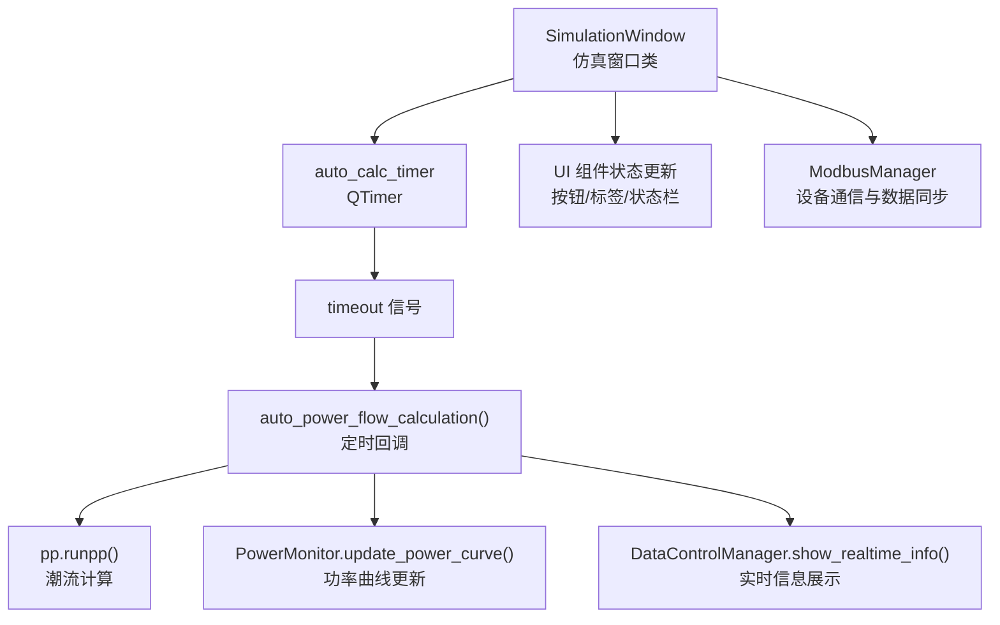
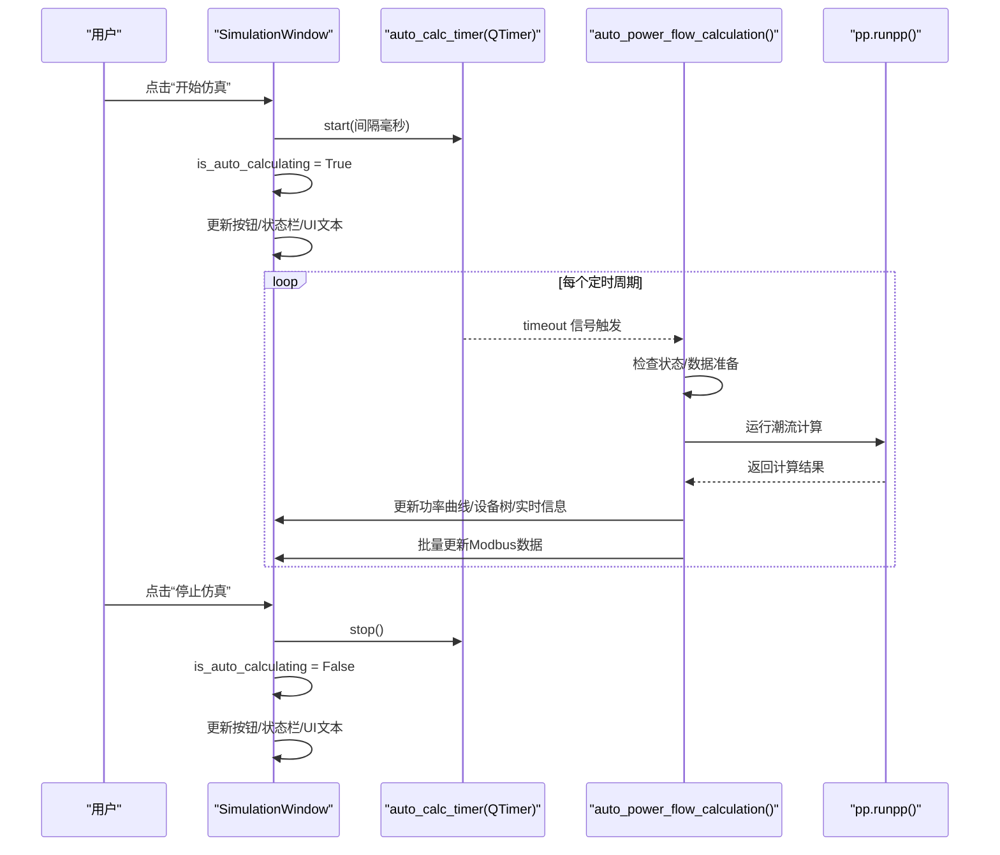
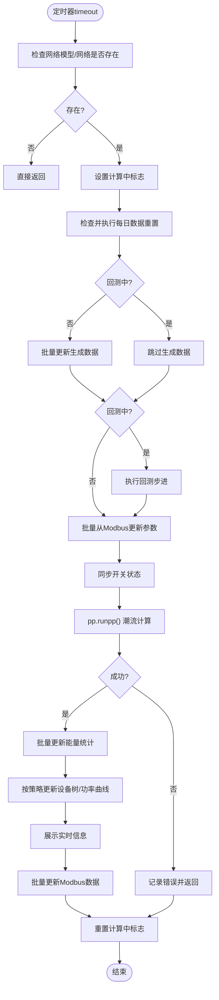
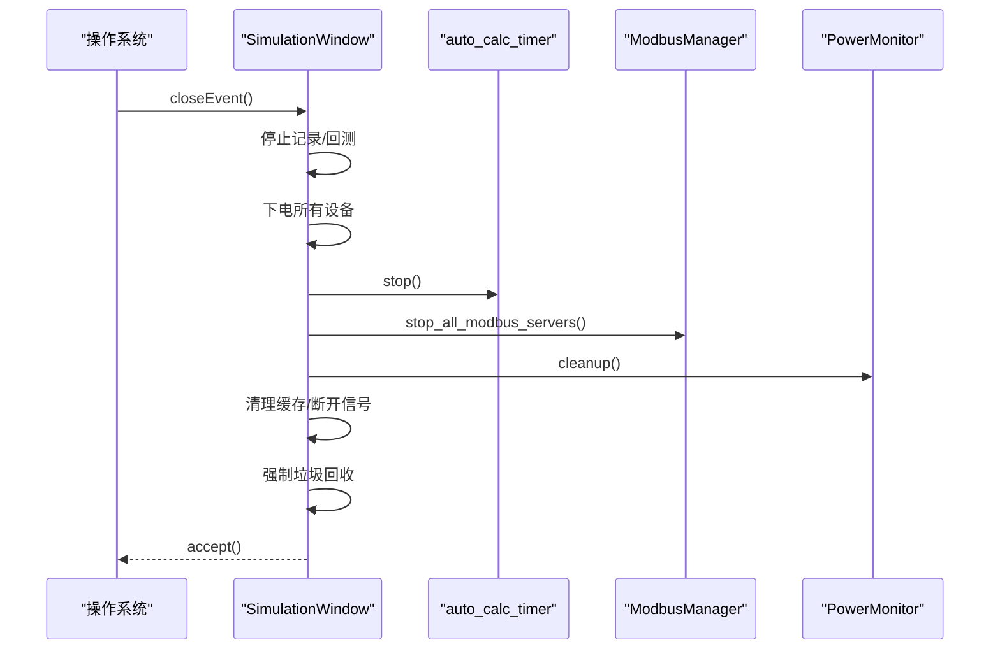
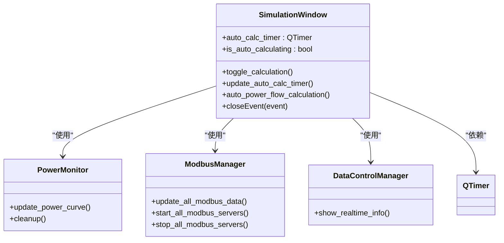

# 自动仿真控制

<cite>
**本文引用的文件**
- [simulation_window.py](file://src/components/simulation_window.py)
</cite>

## 目录
1. [简介](#简介)
2. [项目结构](#项目结构)
3. [核心组件](#核心组件)
4. [架构总览](#架构总览)
5. [详细组件分析](#详细组件分析)
6. [依赖关系分析](#依赖关系分析)
7. [性能考量](#性能考量)
8. [故障排查指南](#故障排查指南)
9. [结论](#结论)

## 简介
本章节聚焦于pp_tool中“自动仿真控制”功能，围绕SimulationWindow类中的auto_calc_timer定时器展开，系统性说明其初始化流程、信号连接机制、自动计算循环的启动/停止逻辑、动态频率调整策略，以及窗口关闭时的资源释放流程。文档旨在帮助读者快速理解定时器驱动的自动潮流计算工作流，并掌握关键状态与接口的使用方式。

## 项目结构
- 自动仿真控制的核心实现位于仿真界面模块中，具体为SimulationWindow类。
- 该类负责：
  - 定时器auto_calc_timer的创建与信号绑定
  - 自动计算循环的启动/停止与状态管理
  - 动态调整计算频率(update_auto_calc_timer)
  - 定时回调auto_power_flow_calculation中执行完整的潮流计算与UI更新
  - 窗口关闭时的资源清理(closeEvent)

图示来源
- [simulation_window.py](file://src/components/simulation_window.py#L68-L74)
- [simulation_window.py](file://src/components/simulation_window.py#L1882-L1921)
- [simulation_window.py](file://src/components/simulation_window.py#L2527-L2599)

章节来源
- [simulation_window.py](file://src/components/simulation_window.py#L68-L74)
- [simulation_window.py](file://src/components/simulation_window.py#L1882-L1921)
- [simulation_window.py](file://src/components/simulation_window.py#L2527-L2599)

## 核心组件
- auto_calc_timer：QTimer对象，用于周期性触发自动潮流计算。
- is_auto_calculating：布尔状态标志，标识自动计算是否处于运行中。
- calc_interval_spinbox：用户可调的计算间隔输入控件（秒），用于动态调整定时器间隔。
- auto_power_flow_calculation：定时回调方法，封装完整的自动计算流程（数据同步、潮流计算、UI更新、Modbus数据刷新等）。
- toggle_calculation：启动/停止自动计算的入口，内部会调用auto_calc_timer.start/stop并更新UI状态。
- update_auto_calc_timer：当用户调整间隔时，停止并重启定时器以应用新间隔。
- closeEvent：窗口关闭事件，确保定时器停止、信号断开、资源清理与Modbus服务关闭。

章节来源
- [simulation_window.py](file://src/components/simulation_window.py#L68-L74)
- [simulation_window.py](file://src/components/simulation_window.py#L1882-L1921)
- [simulation_window.py](file://src/components/simulation_window.py#L1775-L1831)
- [simulation_window.py](file://src/components/simulation_window.py#L2527-L2599)

## 架构总览
自动仿真控制采用“定时器驱动 + 事件回调”的模式：
- 定时器初始化：在构造函数中创建QTimer并将其timeout信号连接到auto_power_flow_calculation。
- 启动/停止：toggle_calculation根据按钮状态调用start/stop，并维护is_auto_calculating与UI状态。
- 动态频率：update_auto_calc_timer在运行中时先stop再按新秒数*1000毫秒start，从而即时生效。
- 回调执行：auto_power_flow_calculation内完成数据同步、潮流计算、UI更新与Modbus数据刷新。
- 资源释放：closeEvent确保停止定时器、断开信号、关闭Modbus、清理缓存与内存。

图示来源
- [simulation_window.py](file://src/components/simulation_window.py#L68-L74)
- [simulation_window.py](file://src/components/simulation_window.py#L1895-L1921)
- [simulation_window.py](file://src/components/simulation_window.py#L2527-L2599)

## 详细组件分析

### 定时器初始化与信号连接
- 定时器创建位置：在构造函数中创建QTimer实例，并立即建立timeout信号与auto_power_flow_calculation方法的连接。
- 默认初始状态：is_auto_calculating为False，按钮与状态栏显示“已停止”，确保用户显式点击后才开始。
- 默认频率：定时器未在构造阶段启动；首次启动由toggle_calculation根据用户输入的秒数转换为毫秒后start。

章节来源
- [simulation_window.py](file://src/components/simulation_window.py#L68-L74)
- [simulation_window.py](file://src/components/simulation_window.py#L104-L114)

### 自动计算循环的启动与停止
- 启动流程：
  - toggle_calculation检测网络模型有效性
  - 从calc_interval_spinbox读取秒数，乘以1000得到毫秒
  - 调用auto_calc_timer.start(interval)
  - 设置is_auto_calculating为True，更新按钮文本为“停止仿真”，状态栏与状态标签提示“运行中”
- 停止流程：
  - 调用auto_calc_timer.stop()
  - 设置is_auto_calculating为False，恢复按钮文本与状态标签
  - 更新状态栏提示“已停止”

章节来源
- [simulation_window.py](file://src/components/simulation_window.py#L1895-L1921)

### 动态频率调整(update_auto_calc_timer)
- 触发条件：用户在UI上调整计算间隔后调用update_auto_calc_timer
- 实现要点：
  - 若当前处于自动计算状态，则先stop定时器
  - 从calc_interval_spinbox读取秒数并乘以1000得到毫秒
  - 再次start定时器，使新间隔立即生效
  - 状态栏提示“自动潮流计算间隔已更新为 X 秒”

章节来源
- [simulation_window.py](file://src/components/simulation_window.py#L1882-L1894)

### 定时回调auto_power_flow_calculation的工作流
- 输入校验：若网络模型不存在或net不可用则直接返回
- 并发保护：使用内部标志避免上一次计算未完成时重复触发
- 数据准备：
  - 每日数据重置检查
  - 在非回测期间批量更新生成数据
  - 回测期间先执行回测步进
  - 批量从Modbus读取参数并更新网络模型
  - 同步开关状态到网络模型
- 潮流计算：调用pp.runpp(net)，成功后更新状态栏，失败则记录错误
- UI更新与数据刷新：
  - 批量更新能量统计
  - 按计数策略更新设备树与功率曲线
  - 展示实时信息
  - 批量更新Modbus数据
- 最终清理：在finally中重置计算标志，保证下次可再次进入

图示来源
- [simulation_window.py](file://src/components/simulation_window.py#L2527-L2599)

章节来源
- [simulation_window.py](file://src/components/simulation_window.py#L2527-L2599)

### 窗口关闭时的资源释放
- 关闭流程：
  - 停止数据记录与回测
  - 下电所有设备，停止Modbus服务
  - 停止auto_calc_timer
  - 清空能量累计数据
  - 将所有开关设置为合闸状态
  - 清理功率监控、缓存与信号连接
  - 强制垃圾回收
  - 接受事件并返回

图示来源
- [simulation_window.py](file://src/components/simulation_window.py#L1775-L1831)
- [simulation_window.py](file://src/components/simulation_window.py#L1873-L1881)

章节来源
- [simulation_window.py](file://src/components/simulation_window.py#L1775-L1831)
- [simulation_window.py](file://src/components/simulation_window.py#L1873-L1881)

## 依赖关系分析
- 类间关系
  - SimulationWindow依赖QTimer(timeout信号)与pp.runpp()进行自动仿真控制
  - 依赖PowerMonitor进行功率曲线更新
  - 依赖ModbusManager进行设备参数读写与数据同步
  - 依赖DataControlManager进行实时信息展示
- 外部依赖
  - Pandapower：执行潮流计算
  - PySide6：GUI框架与QTimer
  - 日志模块：记录关键事件与错误

图示来源
- [simulation_window.py](file://src/components/simulation_window.py#L68-L74)
- [simulation_window.py](file://src/components/simulation_window.py#L1882-L1921)
- [simulation_window.py](file://src/components/simulation_window.py#L2527-L2599)

章节来源
- [simulation_window.py](file://src/components/simulation_window.py#L68-L74)
- [simulation_window.py](file://src/components/simulation_window.py#L1882-L1921)
- [simulation_window.py](file://src/components/simulation_window.py#L2527-L2599)

## 性能考量
- 定时器频率与UI更新策略：
  - auto_power_flow_calculation内部通过计数器控制UI更新频率（设备树与功率曲线按不同周期更新），降低频繁刷新带来的开销。
- 计算节流：
  - 使用内部标志避免上一次计算未完成时重复触发，防止计算堆积。
- 批量更新：
  - Modbus参数与设备数据均采用批量处理，减少多次访问网络与UI的代价。
- 资源释放：
  - closeEvent中停止定时器、断开信号、清理缓存与内存，有助于避免泄漏与悬挂引用。

章节来源
- [simulation_window.py](file://src/components/simulation_window.py#L2527-L2599)
- [simulation_window.py](file://src/components/simulation_window.py#L1775-L1831)

## 故障排查指南
- 现象：定时器未启动或不触发
  - 检查是否调用了toggle_calculation并传入了有效的网络模型
  - 确认calc_interval_spinbox的数值有效
  - 查看状态栏提示与按钮状态是否一致
- 现象：自动计算频繁卡顿或重复触发
  - 检查auto_power_flow_calculation内部的并发保护标志是否生效
  - 确认UI更新策略是否过于频繁
- 现象：更改计算间隔后未生效
  - 确认update_auto_calc_timer在运行中时会先stop再start
  - 检查calc_interval_spinbox的值是否正确
- 现象：窗口关闭后仍占用资源
  - 确认closeEvent是否被调用
  - 检查auto_calc_timer是否已stop
  - 确认信号是否断开，Modbus服务是否已停止

章节来源
- [simulation_window.py](file://src/components/simulation_window.py#L1882-L1921)
- [simulation_window.py](file://src/components/simulation_window.py#L1775-L1831)
- [simulation_window.py](file://src/components/simulation_window.py#L2527-L2599)

## 结论
pp_tool的自动仿真控制通过SimulationWindow中的auto_calc_timer实现了稳定、可控的自动计算闭环。其初始化简单明确，信号连接可靠，启动/停止与动态频率调整逻辑清晰，配合完善的窗口关闭资源清理，确保了系统在长时间运行下的稳定性与安全性。对于使用者而言，只需关注按钮与间隔设置即可获得流畅的自动仿真体验；对于开发者而言，回调方法与UI更新策略提供了良好的扩展点与性能优化空间。