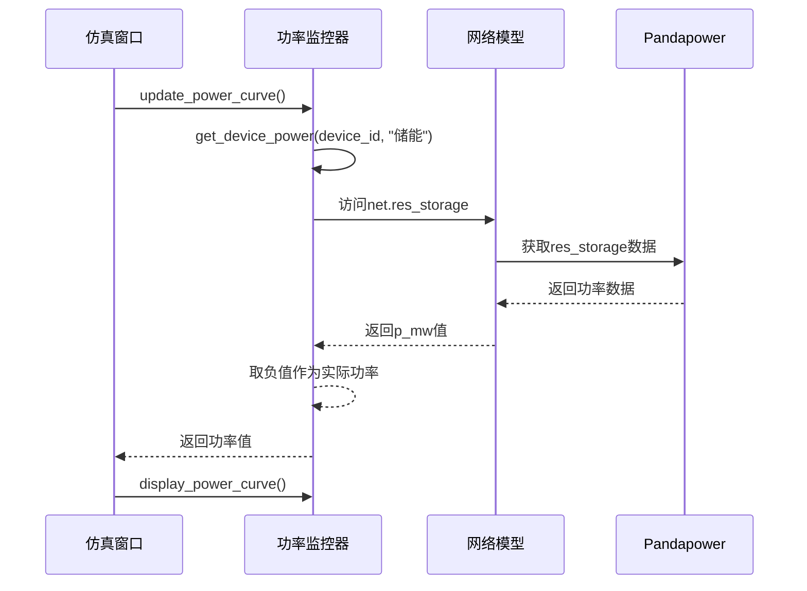
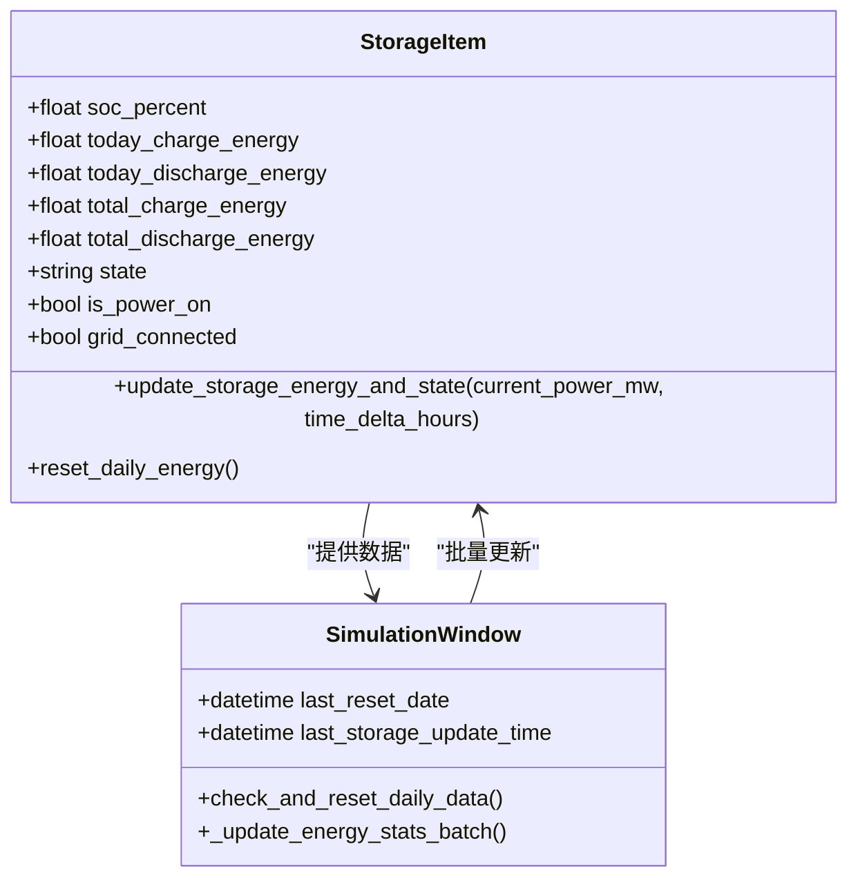
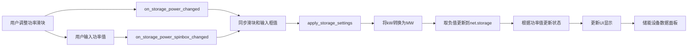
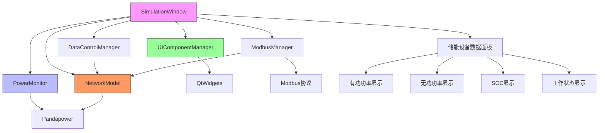

# 储能设备数据可视化

<cite>
**本文档引用的文件**   
- [network_model.py](file://src/models/network_model.py)
- [power_monitor.py](file://src/components/power_monitor.py)
- [simulation_window.py](file://src/components/simulation_window.py)
- [ui_components.py](file://src/components/ui_components.py)
- [data_control.py](file://src/components/data_control.py)
- [network_items.py](file://src/components/network_items.py)
- [modbus_manager.py](file://src/components/modbus_manager.py)
</cite>

## 目录
1. [储能设备数据可视化概述](#储能设备数据可视化概述)
2. [仿真窗口与储能数据获取流程](#仿真窗口与储能数据获取流程)
3. [储能设备数据面板更新机制](#储能设备数据面板更新机制)
4. [储能能量统计计算逻辑](#储能能量统计计算逻辑)
5. [双向功率流动处理与UI显示](#双向功率流动处理与ui显示)
6. [系统架构与组件交互](#系统架构与组件交互)

## 储能设备数据可视化概述

本文档详细说明储能设备在仿真结果可视化中的实现机制。系统通过`network_model`的`get_storage_power`方法获取储能设备的充放电状态和功率数据，并通过`power_monitor`组件在储能设备数据面板中更新显示。文档解释了储能能量统计的计算逻辑，包括每日能量重置机制，并提供代码示例展示如何处理储能设备的双向功率流动并在UI上正确显示。

## 仿真窗口与储能数据获取流程

仿真窗口通过`network_model`类的`get_storage_power`方法获取储能设备的功率数据。该方法从pandapower网络模型的潮流计算结果中提取储能设备的实际功率值。当储能设备处于充电状态时，功率值为负；当处于放电状态时，功率值为正。系统通过`PowerMonitor`类的`get_device_power`方法获取这些数据，并将其用于功率曲线的绘制和实时数据显示。



**Diagram sources**
- [simulation_window.py](file://src/components/simulation_window.py#L92)
- [power_monitor.py](file://src/components/power_monitor.py#L138-L146)
- [network_model.py](file://src/models/network_model.py#L225-L233)

**Section sources**
- [simulation_window.py](file://src/components/simulation_window.py#L92)
- [power_monitor.py](file://src/components/power_monitor.py#L138-L146)

## 储能设备数据面板更新机制

储能设备数据面板通过`ui_components.py`中的`create_storage_data_panel`方法创建，包含有功功率、无功功率、荷电状态(SOC)和工作状态等关键信息的显示标签。当仿真运行时，系统定期更新这些显示值。`data_control.py`中的`update_storage_realtime_info`方法负责从网络模型中获取最新数据并更新UI组件。

```mermaid
flowchart TD
A[开始更新储能设备显示] --> B{是否有有效组件索引?}
B --> |是| C[从网络模型获取有功功率]
B --> |否| D[设置显示为"未计算"]
C --> E{网络模型是否有res_storage数据?}
E --> |是| F[获取p_mw值并取负]
E --> |否| G[设置显示为"未计算"]
F --> H[更新有功功率标签]
H --> I[查找储能设备项]
I --> J{找到设备项?}
J --> |是| K[更新SOC显示]
J --> |否| L[设置SOC显示为"未计算"]
K --> M[更新工作状态显示]
M --> N[更新并网状态显示]
N --> O[结束]
L --> O
G --> O
D --> O
```

**Diagram sources**
- [ui_components.py](file://src/components/ui_components.py#L518-L683)
- [data_control.py](file://src/components/data_control.py#L1003-L1053)

**Section sources**
- [ui_components.py](file://src/components/ui_components.py#L518-L683)
- [data_control.py](file://src/components/data_control.py#L1003-L1053)

## 储能能量统计计算逻辑

储能能量统计的计算逻辑在`simulation_window.py`的`_update_energy_stats_batch`方法中实现。系统根据定时器的时间间隔计算能量变化量，并更新储能设备的今日充电/放电电量和累计充电/放电电量。每日能量重置机制通过`check_and_reset_daily_data`方法实现，该方法在每天午夜重置今日电量统计。



**Diagram sources**
- [network_items.py](file://src/components/network_items.py#L809-L855)
- [simulation_window.py](file://src/components/simulation_window.py#L1990-L2041)

**Section sources**
- [network_items.py](file://src/components/network_items.py#L809-L855)
- [simulation_window.py](file://src/components/simulation_window.py#L1990-L2041)

## 双向功率流动处理与UI显示

系统通过`data_control.py`中的`on_storage_power_changed`和`on_storage_power_spinbox_changed`方法处理储能设备的双向功率流动。当用户通过滑块或输入框调整功率值时，正值表示放电，负值表示充电。系统将kW单位的输入值转换为MW单位并取负值后更新到网络模型中。UI显示通过`apply_storage_settings`方法应用设置，并根据功率值更新工作状态。



**Diagram sources**
- [data_control.py](file://src/components/data_control.py#L207-L238)
- [ui_components.py](file://src/components/ui_components.py#L638-L658)

**Section sources**
- [data_control.py](file://src/components/data_control.py#L207-L238)
- [ui_components.py](file://src/components/ui_components.py#L638-L658)

## 系统架构与组件交互

整个系统架构由多个组件协同工作，实现储能设备数据的可视化。`SimulationWindow`作为主控组件，协调`PowerMonitor`、`NetworkModel`和UI组件之间的交互。`PowerMonitor`负责收集和显示功率曲线，`NetworkModel`管理电网模型数据，而UI组件则提供用户交互界面。



**Diagram sources**
- [simulation_window.py](file://src/components/simulation_window.py#L34)
- [power_monitor.py](file://src/components/power_monitor.py#L17)
- [network_model.py](file://src/models/network_model.py#L11)
- [ui_components.py](file://src/components/ui_components.py#L36)
- [data_control.py](file://src/components/data_control.py#L12)
- [modbus_manager.py](file://src/components/modbus_manager.py#L10)

**Section sources**
- [simulation_window.py](file://src/components/simulation_window.py#L34)
- [power_monitor.py](file://src/components/power_monitor.py#L17)
- [network_model.py](file://src/models/network_model.py#L11)