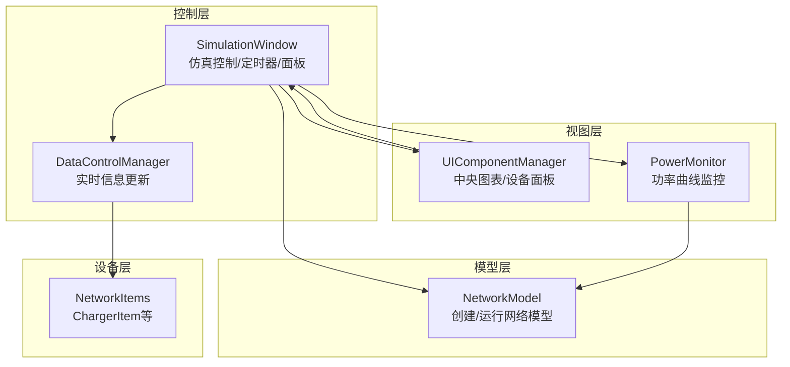
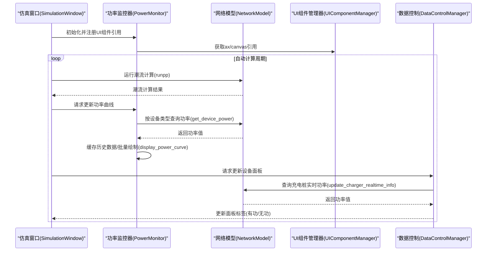
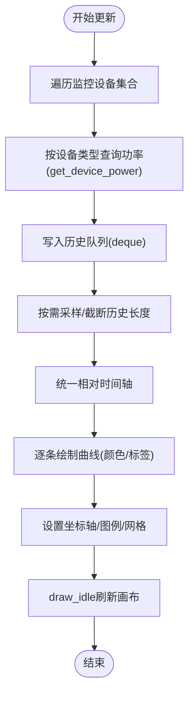
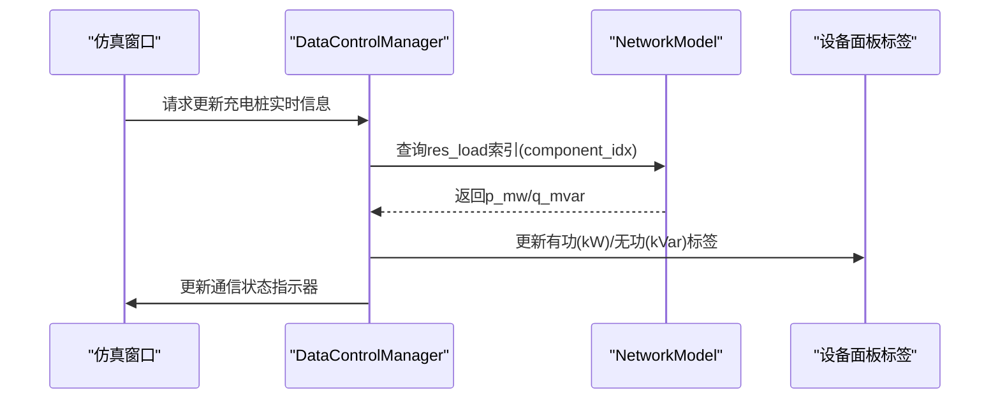
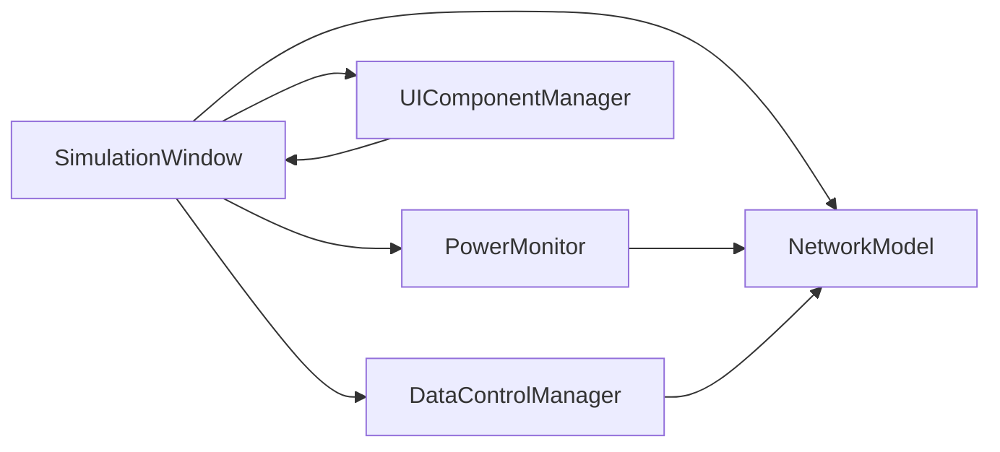

# 充电桩设备数据可视化

<cite>
**本文引用的文件**
- [network_model.py](file://src/models/network_model.py)
- [power_monitor.py](file://src/components/power_monitor.py)
- [simulation_window.py](file://src/components/simulation_window.py)
- [ui_components.py](file://src/components/ui_components.py)
- [data_control.py](file://src/components/data_control.py)
- [network_items.py](file://src/components/network_items.py)
</cite>

## 目录
1. [简介](#简介)
2. [项目结构](#项目结构)
3. [核心组件](#核心组件)
4. [架构总览](#架构总览)
5. [详细组件分析](#详细组件分析)
6. [依赖关系分析](#依赖关系分析)
7. [性能考量](#性能考量)
8. [故障排查指南](#故障排查指南)
9. [结论](#结论)
10. [附录](#附录)

## 简介
本文件围绕“充电桩设备在仿真结果可视化”这一目标，系统梳理了从仿真窗口通过网络模型获取充电桩功率数据，再到功率监控组件在充电桩设备数据面板中动态更新的完整流程。重点解释：
- 仿真窗口如何基于网络模型的潮流计算结果获取充电桩功率；
- 功率监控组件如何组织多充电桩数据并绘制功率曲线；
- 如何将充电桩功率数据更新到对应的UI组件中（设备数据面板）。

## 项目结构
本项目采用分层架构：
- 模型层：网络模型封装pandapower网络的创建与运行，提供功率查询接口；
- 控制层：仿真窗口协调自动计算、UI组件管理、Modbus管理等；
- 视图层：UI组件管理器负责创建中央图表区域与设备面板；
- 监控层：功率监控器负责采集、缓存与绘制功率曲线；
- 设备层：网络项定义各类设备（含充电桩），并维护属性与索引。

图表来源
- [network_model.py](file://src/models/network_model.py#L1-L120)
- [simulation_window.py](file://src/components/simulation_window.py#L1-L120)
- [ui_components.py](file://src/components/ui_components.py#L150-L200)
- [power_monitor.py](file://src/components/power_monitor.py#L1-L60)
- [data_control.py](file://src/components/data_control.py#L960-L1000)
- [network_items.py](file://src/components/network_items.py#L860-L904)

章节来源
- [network_model.py](file://src/models/network_model.py#L1-L120)
- [simulation_window.py](file://src/components/simulation_window.py#L1-L120)
- [ui_components.py](file://src/components/ui_components.py#L150-L200)
- [power_monitor.py](file://src/components/power_monitor.py#L1-L60)
- [data_control.py](file://src/components/data_control.py#L960-L1000)
- [network_items.py](file://src/components/network_items.py#L860-L904)

## 核心组件
- 网络模型（NetworkModel）：负责创建pandapower网络、运行潮流计算，并提供按设备类型查询功率的方法（如获取负载功率、线路功率、变压器功率等）。充电桩在模型中以“负载”形式存在，索引有+1000的偏移。
- 功率监控器（PowerMonitor）：负责从网络模型中按设备类型获取功率值，维护历史数据队列，批量更新并绘制功率曲线；支持多设备曲线叠加显示。
- 仿真窗口（SimulationWindow）：负责初始化UI、启动/停止自动计算、调度功率监控器更新、管理Modbus与数据控制。
- UI组件管理器（UIComponentManager）：创建中央功率曲线图表区域与设备面板，提供Matplotlib画布与坐标轴引用。
- 数据控制管理器（DataControlManager）：负责将网络模型中的实时功率更新到设备数据面板的标签控件中（如充电桩有功/无功功率）。
- 网络项（NetworkItems）：定义充电桩图形项（ChargerItem），包含索引、额定功率、通信参数等属性。

章节来源
- [network_model.py](file://src/models/network_model.py#L262-L313)
- [power_monitor.py](file://src/components/power_monitor.py#L66-L160)
- [simulation_window.py](file://src/components/simulation_window.py#L1-L120)
- [ui_components.py](file://src/components/ui_components.py#L150-L200)
- [data_control.py](file://src/components/data_control.py#L960-L1000)
- [network_items.py](file://src/components/network_items.py#L860-L904)

## 架构总览
下图展示了仿真窗口、网络模型、功率监控器与UI组件之间的交互关系，以及充电桩功率数据从模型到UI的流向。

图表来源
- [simulation_window.py](file://src/components/simulation_window.py#L1-L120)
- [power_monitor.py](file://src/components/power_monitor.py#L160-L273)
- [network_model.py](file://src/models/network_model.py#L583-L710)
- [ui_components.py](file://src/components/ui_components.py#L150-L200)
- [data_control.py](file://src/components/data_control.py#L960-L1000)

## 详细组件分析

### 仿真窗口与自动计算
- 仿真窗口持有网络模型、UI组件管理器、功率监控器与数据控制管理器实例。
- 通过定时器周期性触发自动计算，每次计算后驱动功率监控器更新曲线，并同步更新设备数据面板。
- 中央图表区域由UI组件管理器创建，提供Matplotlib画布与坐标轴引用给功率监控器。

章节来源
- [simulation_window.py](file://src/components/simulation_window.py#L1-L120)
- [ui_components.py](file://src/components/ui_components.py#L150-L200)

### 网络模型与充电桩功率查询
- 充电桩在pandapower中以“负载”形式创建，索引有+1000的偏移，名称与索引在创建时体现。
- 网络模型提供运行潮流计算与按设备类型查询功率的方法。充电桩功率查询依赖于res_load结果表中的p_mw/q_mvar字段。
- 由于充电桩在模型中作为负载处理，因此在查询时使用负载索引即可获取其功率。

章节来源
- [network_model.py](file://src/models/network_model.py#L262-L313)
- [network_model.py](file://src/models/network_model.py#L583-L710)

### 功率监控器：多充电桩曲线绘制
- 功率监控器维护监控设备集合与历史数据队列，按设备类型从网络模型中获取功率值。
- 对于“充电桩”类型，直接从res_load中读取p_mw/q_mvar；若无结果则回退到设定值。
- 绘制逻辑：
  - 收集所有监控设备的历史数据，进行采样与时间对齐；
  - 使用统一的相对时间轴，保证多曲线在同一窗口内对齐显示；
  - 为每个设备分配固定颜色，绘制多条曲线并在图例中标注设备类型与索引；
  - 通过draw_idle高效刷新画布，避免频繁重绘导致卡顿。

图表来源
- [power_monitor.py](file://src/components/power_monitor.py#L160-L273)
- [power_monitor.py](file://src/components/power_monitor.py#L274-L336)

章节来源
- [power_monitor.py](file://src/components/power_monitor.py#L66-L160)
- [power_monitor.py](file://src/components/power_monitor.py#L160-L273)
- [power_monitor.py](file://src/components/power_monitor.py#L274-L336)

### 设备数据面板：充电桩功率更新
- 数据控制管理器根据当前选中的设备类型，调用对应的实时信息更新方法。
- 对于“充电桩”，通过网络模型的res_load查询p_mw/q_mvar，并转换为kW/kVar显示在面板标签中。
- 该方法还负责更新通信状态指示器。

图表来源
- [data_control.py](file://src/components/data_control.py#L960-L1000)

章节来源
- [data_control.py](file://src/components/data_control.py#L960-L1000)

### 充电桩图形项与索引
- 充电桩图形项（ChargerItem）在构造时分配组件索引，并在属性中记录“index + 1000”的偏移，便于与网络模型中的负载索引对应。
- 该索引用于在UI与模型之间建立稳定的映射关系，确保面板更新与曲线绘制均能正确识别目标设备。

章节来源
- [network_items.py](file://src/components/network_items.py#L860-L904)

## 依赖关系分析
- 仿真窗口依赖网络模型进行潮流计算，依赖UI组件管理器提供图表画布，依赖功率监控器进行曲线绘制，依赖数据控制管理器更新面板。
- 功率监控器依赖网络模型的res_*结果表进行功率查询，依赖UI组件管理器提供的ax/canvas引用进行绘制。
- 数据控制管理器依赖网络模型的res_load表获取充电桩实时功率，并更新面板标签。
- 网络项（ChargerItem）与网络模型共同维护索引一致性，确保面板与曲线都能正确识别设备。

图表来源
- [simulation_window.py](file://src/components/simulation_window.py#L1-L120)
- [power_monitor.py](file://src/components/power_monitor.py#L1-L60)
- [ui_components.py](file://src/components/ui_components.py#L150-L200)
- [data_control.py](file://src/components/data_control.py#L960-L1000)
- [network_model.py](file://src/models/network_model.py#L583-L710)

章节来源
- [simulation_window.py](file://src/components/simulation_window.py#L1-L120)
- [power_monitor.py](file://src/components/power_monitor.py#L1-L60)
- [ui_components.py](file://src/components/ui_components.py#L150-L200)
- [data_control.py](file://src/components/data_control.py#L960-L1000)
- [network_model.py](file://src/models/network_model.py#L583-L710)

## 性能考量
- 批量更新与延迟刷新：功率监控器使用定时器延迟批量更新，避免频繁重绘；使用draw_idle刷新画布，降低CPU占用。
- 历史数据采样：对历史数据进行采样与长度限制，减少绘图点数量，提升响应速度。
- 时间轴统一：多曲线使用统一相对时间轴，避免窗口抖动，提升可读性。
- 查询缓存：功率监控器在一次更新周期内缓存网络模型引用，减少重复访问。

章节来源
- [power_monitor.py](file://src/components/power_monitor.py#L40-L58)
- [power_monitor.py](file://src/components/power_monitor.py#L160-L273)
- [power_monitor.py](file://src/components/power_monitor.py#L274-L336)

## 故障排查指南
- 充电桩功率显示为“未计算”：
  - 检查是否已运行潮流计算，确保网络模型中有res_load结果；
  - 确认当前选中设备索引与模型索引一致（注意+1000偏移）。
- 曲线不显示或空白：
  - 检查功率监控器是否已初始化UI组件引用（ax/canvas）；
  - 确认监控设备集合非空，且设备类型与索引正确；
  - 查看日志输出，定位异常分支。
- 绘图卡顿：
  - 减少同时监控的设备数量；
  - 调整采样频率或历史长度上限；
  - 确保未在高频刷新的同时进行大量UI更新。

章节来源
- [power_monitor.py](file://src/components/power_monitor.py#L188-L273)
- [power_monitor.py](file://src/components/power_monitor.py#L298-L336)
- [data_control.py](file://src/components/data_control.py#L960-L1000)

## 结论
本系统通过“仿真窗口—网络模型—功率监控器—UI组件”的清晰分层，实现了充电桩功率数据从仿真计算到可视化展示的闭环。其中：
- 仿真窗口负责调度与协调；
- 网络模型提供准确的潮流结果；
- 功率监控器负责高效的数据采集与曲线绘制；
- 数据控制管理器负责将实时功率更新到设备数据面板。

该设计既保证了实时性与可读性，又具备良好的扩展性，便于后续增加更多设备类型的可视化支持。

## 附录
- 代码示例路径（不展示具体代码内容）：
  - 获取充电桩功率并更新到面板：[update_charger_realtime_info](file://src/components/data_control.py#L960-L1000)
  - 从网络模型查询功率（含充电桩）：[get_device_power](file://src/components/power_monitor.py#L66-L160)
  - 多曲线绘制与时间轴统一：[display_power_curve](file://src/components/power_monitor.py#L188-L273)
  - 充电桩在模型中的创建与索引偏移：[create_charger](file://src/models/network_model.py#L262-L313)
  - 充电桩图形项属性与索引：[ChargerItem](file://src/components/network_items.py#L860-L904)