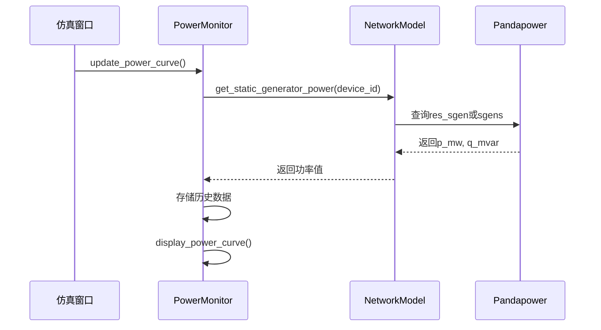
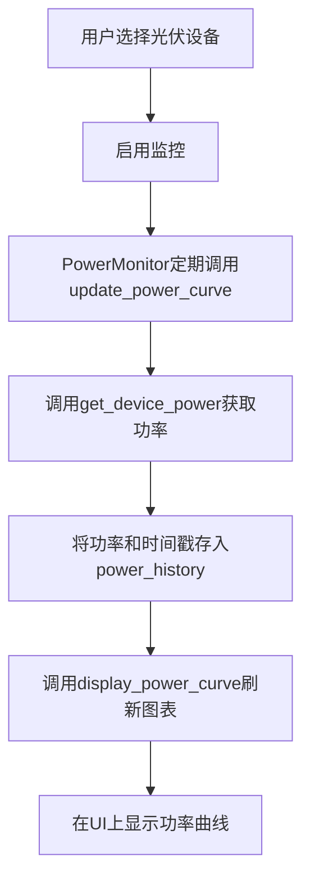
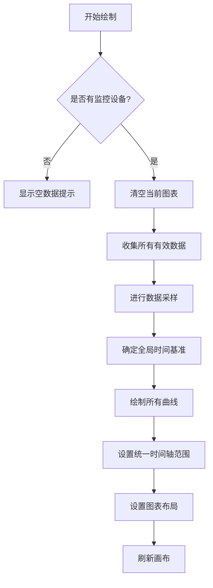
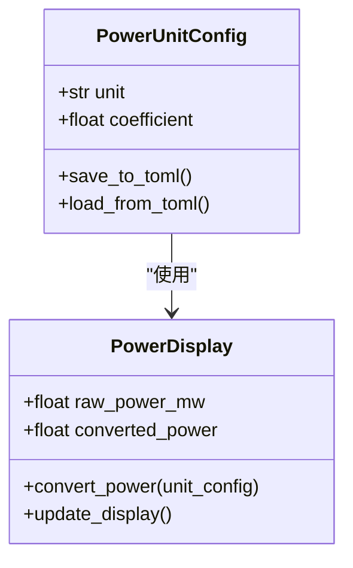

# 光伏设备数据可视化

<cite>
**本文档引用的文件**   
- [network_model.py](file://src/models/network_model.py)
- [simulation_window.py](file://src/components/simulation_window.py)
- [power_monitor.py](file://src/components/power_monitor.py)
- [data_generators.py](file://src/components/data_generators.py)
- [ui_components.py](file://src/components/ui_components.py)
- [data_control.py](file://src/components/data_control.py)
</cite>

## 目录
1. [引言](#引言)
2. [光伏设备功率获取机制](#光伏设备功率获取机制)
3. [功率数据更新与可视化流程](#功率数据更新与可视化流程)
4. [光伏功率曲线绘制逻辑](#光伏功率曲线绘制逻辑)
5. [功率单位转换处理](#功率单位转换处理)
6. [核心组件分析](#核心组件分析)

## 引言
本文档详细记录了光伏设备在仿真结果可视化中的实现机制。系统通过仿真窗口与网络模型的协同工作，实现了光伏设备发电功率的实时获取、处理和可视化展示。重点说明了仿真窗口如何通过`network_model`的`get_generator_power`或`get_static_generator_power`方法获取光伏设备的发电功率，并通过`power_monitor`组件在光伏设备数据面板中更新显示。同时，文档解释了光伏功率曲线的绘制逻辑，包括数据采样策略和时间轴管理，并提供了代码示例，展示如何将光伏设备的功率数据更新到UI组件中，并处理功率单位转换。

## 光伏设备功率获取机制
光伏设备的功率数据获取是整个可视化流程的基础。系统通过`NetworkModel`类中的`get_static_generator_power`方法来获取光伏设备的实时发电功率。

该方法首先检查网络模型中是否存在潮流计算结果（`res_sgen`），如果存在，则直接从结果数据框中获取指定光伏设备索引（`gen_idx`）的有功功率（`p_mw`）和无功功率（`q_mvar`）。如果潮流计算结果不可用，则回退到使用设备的设定值（`sgens.at[device_id, 'p_mw']`）。

**Diagram sources**
- [network_model.py](file://src/models/network_model.py#L677-L678)
- [power_monitor.py](file://src/components/power_monitor.py#L160-L183)

## 功率数据更新与可视化流程
光伏设备的功率数据更新和可视化是一个由多个组件协同完成的流程。当用户在仿真窗口中选择一个光伏设备并启用监控时，`PowerMonitor`组件会定期调用`update_power_curve`方法。

该方法会遍历所有被监控的设备，通过`get_device_power`方法获取其当前功率值。获取到的功率值和时间戳会被添加到`power_history`的双端队列中。当有新的数据点时，`PowerMonitor`会调用`display_power_curve`方法来刷新图表显示。

**Section sources**
- [simulation_window.py](file://src/components/simulation_window.py#L92)
- [power_monitor.py](file://src/components/power_monitor.py#L160-L183)

## 光伏功率曲线绘制逻辑
光伏功率曲线的绘制逻辑由`PowerMonitor`类的`display_power_curve`方法实现。该方法首先检查是否有设备被监控，如果没有，则显示提示信息。

当有设备被监控时，方法会收集所有有效设备的历史数据，并进行数据采样以限制数据点数量。系统使用`deque`作为数据结构，通过设置`maxlen`参数来自动管理历史数据的长度，确保内存使用效率。

时间轴管理方面，系统使用全局统一的时间基准，确保所有曲线的时间轴完全一致。根据数据的时间范围，动态调整显示窗口的大小，以提供最佳的可视化效果。

**Section sources**
- [power_monitor.py](file://src/components/power_monitor.py#L188-L269)

## 功率单位转换处理
系统支持功率单位的配置和转换。用户可以通过菜单中的“功率单位配置”选项来选择不同的功率单位（w, kw, mw, gw）。配置信息被持久化存储在`app_config.toml`文件中。

当需要显示功率数据时，系统会根据配置的单位系数进行转换。例如，从网络模型中获取的MW单位的功率值，会根据用户选择的单位（如kW）乘以相应的系数（1000.0）进行转换，然后在UI组件中显示。

**Diagram sources**
- [simulation_window.py](file://src/components/simulation_window.py#L335-L477)

## 核心组件分析
### NetworkModel 组件
`NetworkModel`组件是整个系统的核心，负责管理电网模型和潮流计算。它封装了`pandapower`库的功能，提供了创建和管理各种电网设备（如母线、线路、变压器、光伏设备等）的方法。

**Section sources**
- [network_model.py](file://src/models/network_model.py#L11-L710)

### PowerMonitor 组件
`PowerMonitor`组件负责功率数据的收集、存储和可视化。它通过`power_history`字典存储每个监控设备的历史功率数据，并通过`display_power_curve`方法将这些数据显示在图表上。

**Section sources**
- [power_monitor.py](file://src/components/power_monitor.py#L17-L461)

### DataGeneratorManager 组件
`DataGeneratorManager`组件负责管理负载和光伏设备的动态数据生成。它支持为不同设备配置不同的生成参数，如天气类型、季节因子、云层覆盖度等，以模拟真实世界的运行情况。

**Section sources**
- [data_generators.py](file://src/components/data_generators.py#L310-L488)