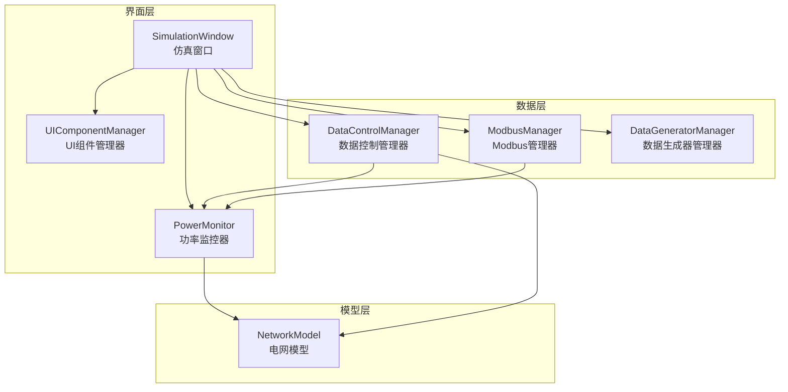
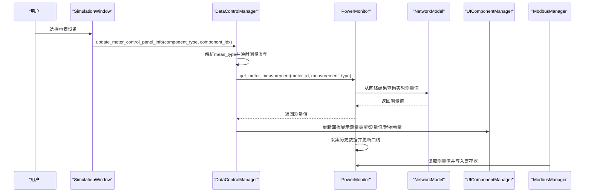
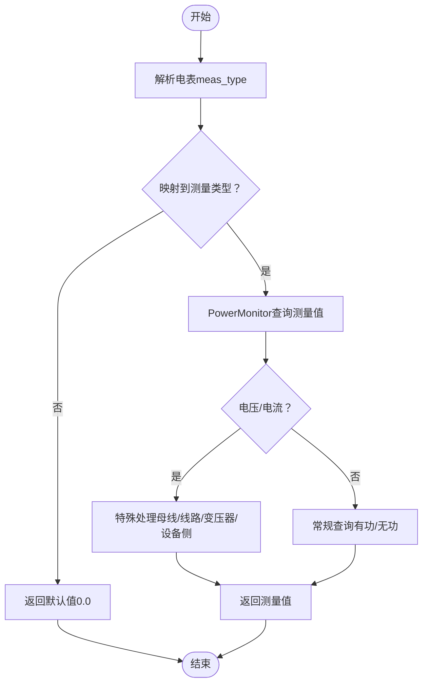
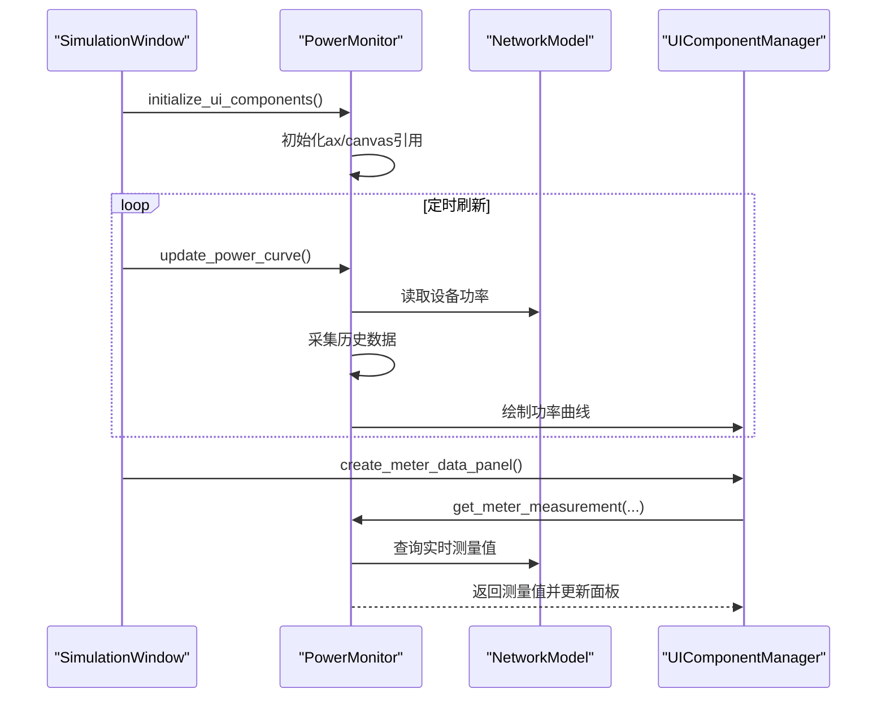
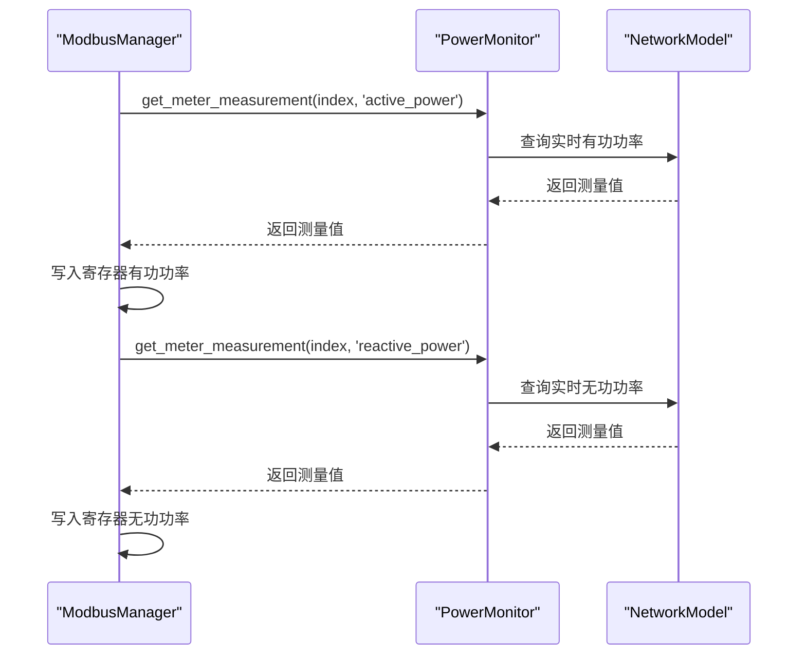
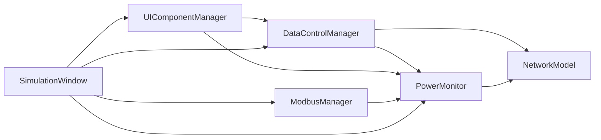

# 电表设备数据可视化

<cite>
**本文引用的文件**
- [network_model.py](file://src/models/network_model.py)
- [power_monitor.py](file://src/components/power_monitor.py)
- [simulation_window.py](file://src/components/simulation_window.py)
- [ui_components.py](file://src/components/ui_components.py)
- [data_control.py](file://src/components/data_control.py)
- [modbus_manager.py](file://src/components/modbus_manager.py)
- [data_generators.py](file://src/components/data_generators.py)
</cite>

## 目录
1. [简介](#简介)
2. [项目结构](#项目结构)
3. [核心组件](#核心组件)
4. [架构总览](#架构总览)
5. [详细组件分析](#详细组件分析)
6. [依赖关系分析](#依赖关系分析)
7. [性能考量](#性能考量)
8. [故障排查指南](#故障排查指南)
9. [结论](#结论)
10. [附录](#附录)

## 简介
本文件面向仿真结果可视化场景，系统性阐述电表设备在仿真窗口中的数据获取、多维度展示与实时刷新机制。重点说明仿真窗口如何通过 network_model 的 get_meter_measurement 方法获取电表的多种测量数据（有功功率、无功功率、电压、电流等），并通过 power_monitor 组件在电表设备数据面板中更新显示；同时解释电表数据的多维度展示逻辑（不同测量类型的切换）以及历史数据记录与实时刷新的实现思路。

## 项目结构
围绕电表数据可视化的关键文件组织如下：
- 模型层：network_model 提供电表测量配置与网络结果查询能力
- 监控层：power_monitor 负责电表测量值的查询、历史数据采集与曲线绘制
- 界面层：simulation_window 负责仿真窗口生命周期与控制；ui_components 负责电表数据面板的构建；data_control 负责面板信息更新与设备通信状态联动
- 通信层：modbus_manager 将电表测量值映射到 Modbus 寄存器，支持外部设备接入
- 数据生成层：data_generators 提供负载/光伏等动态数据生成，辅助仿真场景

图表来源
- [simulation_window.py](file://src/components/simulation_window.py#L1-L120)
- [ui_components.py](file://src/components/ui_components.py#L1-L120)
- [power_monitor.py](file://src/components/power_monitor.py#L1-L120)
- [data_control.py](file://src/components/data_control.py#L170-L210)
- [modbus_manager.py](file://src/components/modbus_manager.py#L657-L687)
- [data_generators.py](file://src/components/data_generators.py#L1-L120)

章节来源
- [simulation_window.py](file://src/components/simulation_window.py#L1-L120)
- [ui_components.py](file://src/components/ui_components.py#L1-L120)
- [power_monitor.py](file://src/components/power_monitor.py#L1-L120)
- [data_control.py](file://src/components/data_control.py#L170-L210)
- [modbus_manager.py](file://src/components/modbus_manager.py#L657-L687)
- [data_generators.py](file://src/components/data_generators.py#L1-L120)

## 核心组件
- NetworkModel：负责创建电表测量设备、运行潮流计算、提供各类设备的功率/电压/电流查询接口
- PowerMonitor：封装电表测量值查询、历史数据采集与曲线绘制，支持多种测量类型切换
- SimulationWindow：仿真窗口主控制器，协调 UI、监控、数据控制与 Modbus
- UIComponentManager：构建电表数据面板，包含测量类型、测量值、起始电量等展示控件
- DataControlManager：根据电表设备的 meas_type 自动映射测量类型，驱动面板更新与通信状态指示
- ModbusManager：将电表测量值映射到 Modbus 寄存器，支持外部设备接入
- DataGeneratorManager：提供负载/光伏等动态数据生成，辅助仿真场景

章节来源
- [network_model.py](file://src/models/network_model.py#L237-L260)
- [power_monitor.py](file://src/components/power_monitor.py#L472-L540)
- [simulation_window.py](file://src/components/simulation_window.py#L1-L120)
- [ui_components.py](file://src/components/ui_components.py#L842-L985)
- [data_control.py](file://src/components/data_control.py#L170-L210)
- [modbus_manager.py](file://src/components/modbus_manager.py#L657-L687)
- [data_generators.py](file://src/components/data_generators.py#L1-L120)

## 架构总览
电表数据可视化流程概览：
- 用户在设备树中选择电表设备，SimulationWindow 触发 DataControlManager 更新电表数据面板
- DataControlManager 依据电表 properties 中的 meas_type 映射到 PowerMonitor 支持的测量类型
- PowerMonitor 从 NetworkModel 的网络结果中查询实时测量值（有功/无功/电压/电流/电量）
- UIComponentManager 的电表面板实时显示测量类型与数值，并支持起始电量设置
- PowerMonitor 同时维护历史数据队列，用于功率曲线监控面板的实时刷新
- ModbusManager 将电表测量值映射到寄存器，支持外部设备接入

图表来源
- [simulation_window.py](file://src/components/simulation_window.py#L1-L120)
- [data_control.py](file://src/components/data_control.py#L412-L480)
- [power_monitor.py](file://src/components/power_monitor.py#L472-L540)
- [network_model.py](file://src/models/network_model.py#L597-L710)
- [ui_components.py](file://src/components/ui_components.py#L842-L985)
- [modbus_manager.py](file://src/components/modbus_manager.py#L657-L687)

## 详细组件分析

### 电表测量值查询与多维度展示
- 测量类型映射：DataControlManager 依据电表 properties 中的 meas_type（'p'/'q'/'vm'/'i'）映射到 PowerMonitor 的测量类型（'active_power'/'reactive_power'/'voltage'/'current'）
- PowerMonitor.get_meter_measurement：根据测量配置（element_type、element、side）从 NetworkModel 的网络结果中查询实时测量值；支持电压与电流的特殊处理逻辑
- UI 展示：UIComponentManager.create_meter_data_panel 提供电表面板，包含测量类型显示、有功/无功功率显示、四象限电量（上网/下网）与起始电量设置控件

图表来源
- [data_control.py](file://src/components/data_control.py#L170-L210)
- [power_monitor.py](file://src/components/power_monitor.py#L472-L540)
- [power_monitor.py](file://src/components/power_monitor.py#L541-L783)
- [ui_components.py](file://src/components/ui_components.py#L842-L985)

章节来源
- [data_control.py](file://src/components/data_control.py#L170-L210)
- [power_monitor.py](file://src/components/power_monitor.py#L472-L540)
- [power_monitor.py](file://src/components/power_monitor.py#L541-L783)
- [ui_components.py](file://src/components/ui_components.py#L842-L985)

### 仿真窗口与监控器协作
- SimulationWindow 初始化时创建 PowerMonitor 并在 UI 初始化完成后调用其 initialize_ui_components，确保 ax/canvas 引用建立
- PowerMonitor.update_power_curve 从 NetworkModel 读取设备功率，维护历史数据队列，并通过 Matplotlib 绘制曲线
- 电表数据面板通过 DataControlManager.update_meter_control_panel_info 实时更新测量类型与测量值显示

图表来源
- [simulation_window.py](file://src/components/simulation_window.py#L1-L120)
- [power_monitor.py](file://src/components/power_monitor.py#L160-L273)
- [power_monitor.py](file://src/components/power_monitor.py#L472-L540)
- [ui_components.py](file://src/components/ui_components.py#L842-L985)

章节来源
- [simulation_window.py](file://src/components/simulation_window.py#L1-L120)
- [power_monitor.py](file://src/components/power_monitor.py#L160-L273)
- [power_monitor.py](file://src/components/power_monitor.py#L472-L540)
- [ui_components.py](file://src/components/ui_components.py#L842-L985)

### Modbus 与电表数据映射
- ModbusManager.update_meter_context 将电表测量值（有功/无功功率、电压、电流、电量）映射到 Modbus 寄存器，支持外部设备接入
- 该映射依赖 PowerMonitor.get_meter_measurement，确保寄存器值与仿真结果一致

图表来源
- [modbus_manager.py](file://src/components/modbus_manager.py#L657-L687)
- [power_monitor.py](file://src/components/power_monitor.py#L472-L540)
- [network_model.py](file://src/models/network_model.py#L597-L710)

章节来源
- [modbus_manager.py](file://src/components/modbus_manager.py#L657-L687)
- [power_monitor.py](file://src/components/power_monitor.py#L472-L540)
- [network_model.py](file://src/models/network_model.py#L597-L710)

### 电表数据的多维度展示逻辑
- 测量类型切换：通过 DataControlManager.update_meter_control_panel_info 读取电表 properties 的 meas_type，映射到 PowerMonitor 的测量类型，从而在面板上显示不同的测量值
- 电压/电流展示：PowerMonitor._query_voltage_value/_query_current_value 根据 element_type 和 side 计算母线电压或线路/变压器/设备电流
- 电量展示：面板提供四象限电量（上网/下网）与起始电量设置，便于计量与历史对比

章节来源
- [data_control.py](file://src/components/data_control.py#L412-L480)
- [power_monitor.py](file://src/components/power_monitor.py#L541-L783)
- [ui_components.py](file://src/components/ui_components.py#L842-L985)

### 实时刷新与历史数据记录
- 实时刷新：PowerMonitor.update_power_curve 从 NetworkModel 读取设备功率，维护历史数据队列，并通过 Matplotlib 绘制曲线；采用延迟更新（schedule_curve_update）降低重绘频率
- 历史数据记录：PowerMonitor.power_history 以设备为键存储 deque，支持采样与时间窗口统一，保证多设备曲线在同一坐标系下显示
- 仿真控制：SimulationWindow 提供自动计算定时器，配合 DataControlManager 与 PowerMonitor 实现周期性刷新

章节来源
- [power_monitor.py](file://src/components/power_monitor.py#L160-L273)
- [power_monitor.py](file://src/components/power_monitor.py#L274-L369)
- [simulation_window.py](file://src/components/simulation_window.py#L1-L120)

## 依赖关系分析
- DataControlManager 依赖 NetworkModel 与 PowerMonitor，用于解析电表配置并获取测量值
- PowerMonitor 依赖 NetworkModel 的网络结果，提供电表测量值查询与历史数据管理
- UIComponentManager 依赖 DataControlManager 与 PowerMonitor，用于构建与更新电表面板
- ModbusManager 依赖 PowerMonitor，将电表测量值映射到寄存器
- SimulationWindow 协调上述组件，提供仿真控制与状态指示

图表来源
- [data_control.py](file://src/components/data_control.py#L170-L210)
- [power_monitor.py](file://src/components/power_monitor.py#L1-L120)
- [ui_components.py](file://src/components/ui_components.py#L1-L120)
- [modbus_manager.py](file://src/components/modbus_manager.py#L657-L687)
- [simulation_window.py](file://src/components/simulation_window.py#L1-L120)

章节来源
- [data_control.py](file://src/components/data_control.py#L170-L210)
- [power_monitor.py](file://src/components/power_monitor.py#L1-L120)
- [ui_components.py](file://src/components/ui_components.py#L1-L120)
- [modbus_manager.py](file://src/components/modbus_manager.py#L657-L687)
- [simulation_window.py](file://src/components/simulation_window.py#L1-L120)

## 性能考量
- 延迟更新：PowerMonitor 使用 QTimer 延迟批量更新，避免频繁重绘导致的性能问题
- 数据采样：历史数据按最大点数采样，确保曲线流畅显示
- 统一时间轴：多设备曲线共享时间基准，减少坐标变换开销
- 网络模型访问优化：PowerMonitor 缓存 network_model.net 引用，减少重复访问

章节来源
- [power_monitor.py](file://src/components/power_monitor.py#L34-L58)
- [power_monitor.py](file://src/components/power_monitor.py#L188-L273)
- [power_monitor.py](file://src/components/power_monitor.py#L274-L369)

## 故障排查指南
- 电表测量值为 0.0：检查 DataControlManager 是否正确解析 meas_type 并映射到 PowerMonitor 支持的测量类型；确认 NetworkModel 的网络结果中是否存在目标元素
- 电压/电流查询异常：检查 element_type 与 side 是否正确；确认 NetworkModel 的网络结果中对应元素存在
- 电表面板不更新：确认 DataControlManager.update_meter_control_panel_info 是否被调用；检查 UI 控件引用是否初始化完成
- Modbus 寄存器值异常：检查 ModbusManager.update_meter_context 是否正确调用 PowerMonitor.get_meter_measurement；确认 POWER_UNIT 转换系数一致

章节来源
- [data_control.py](file://src/components/data_control.py#L170-L210)
- [power_monitor.py](file://src/components/power_monitor.py#L472-L540)
- [power_monitor.py](file://src/components/power_monitor.py#L541-L783)
- [modbus_manager.py](file://src/components/modbus_manager.py#L657-L687)

## 结论
电表设备在仿真结果可视化中实现了“配置驱动”的多维度测量展示：通过 DataControlManager 基于电表配置自动映射测量类型，PowerMonitor 从 NetworkModel 的网络结果中查询实时测量值并在面板中展示；同时，PowerMonitor 维护历史数据并支持功率曲线的实时刷新。ModbusManager 将电表测量值映射到寄存器，满足外部设备接入需求。整体架构清晰、职责分离明确，具备良好的扩展性与性能表现。

## 附录
- 代码示例路径（不直接展示代码内容）：
  - 电表测量值查询入口：[get_meter_measurement](file://src/components/power_monitor.py#L472-L540)
  - 电表配置解析与测量类型映射：[get_meter_measurement_by_type](file://src/components/data_control.py#L170-L210)
  - 电表面板构建与更新：[create_meter_data_panel/update_meter_control_panel_info](file://src/components/ui_components.py#L842-L985), [update_meter_control_panel_info](file://src/components/data_control.py#L412-L480)
  - 电表曲线绘制与历史数据维护：[update_power_curve/display_power_curve](file://src/components/power_monitor.py#L160-L273)
  - Modbus 电表映射：[update_meter_context](file://src/components/modbus_manager.py#L657-L687)