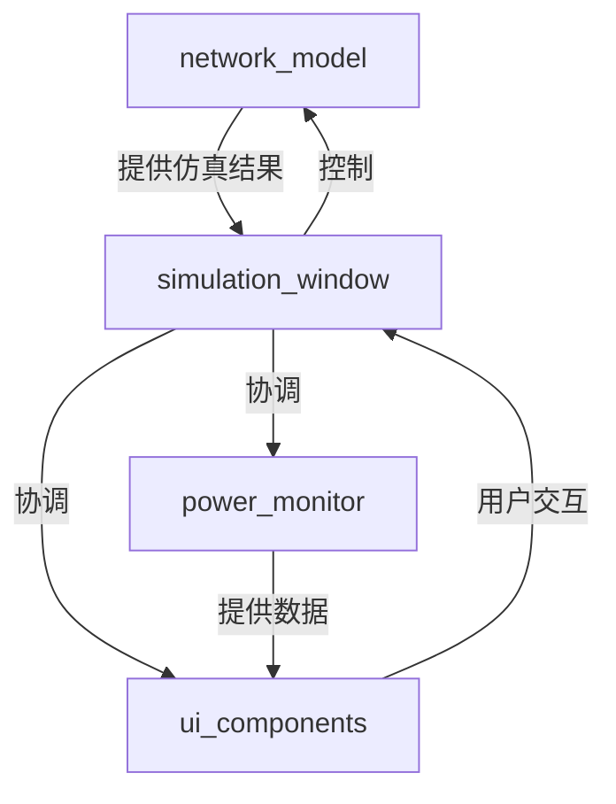
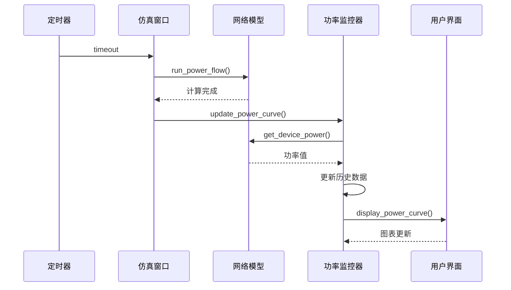
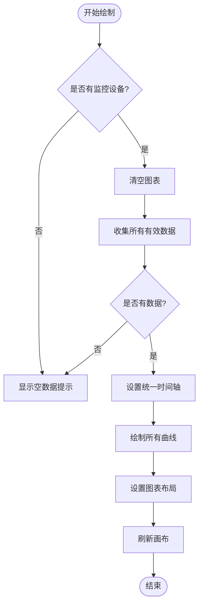

# 结果可视化

<cite>
**本文档引用的文件**   
- [network_model.py](file://src/models/network_model.py)
- [power_monitor.py](file://src/components/power_monitor.py)
- [simulation_window.py](file://src/components/simulation_window.py)
- [ui_components.py](file://src/components/ui_components.py)
- [data_control.py](file://src/components/data_control.py)
- [main_window.py](file://src/components/main_window.py)
</cite>

## 目录
1. [引言](#引言)
2. [仿真结果可视化架构](#仿真结果可视化架构)
3. [核心组件分析](#核心组件分析)
4. [数据流与更新机制](#数据流与更新机制)
5. [设备数据面板实现](#设备数据面板实现)
6. [功率曲线绘制逻辑](#功率曲线绘制逻辑)
7. [代码调用示例](#代码调用示例)
8. [结论](#结论)

## 引言
本项目中的仿真结果可视化功能旨在为用户提供一个直观、动态的界面，以展示电网仿真计算的结果。系统通过`network_model`模块执行潮流计算，获取母线电压、线路功率、负载功率等关键电气参数，并通过`power_monitor`组件在用户界面（UI）上进行实时展示。该功能支持多种设备类型，包括光伏、负载、储能、充电桩和电表，并为每种设备提供专门的数据面板，以显示其特定的运行状态和测量值。本文档将详细阐述这一可视化功能的实现机制。

## 仿真结果可视化架构
整个可视化系统基于一个清晰的分层架构。`network_model`模块负责与pandapower库交互，创建电网模型并执行潮流计算。`simulation_window`作为主控窗口，协调各个组件的工作。`power_monitor`模块是数据可视化的核心，负责收集、存储和绘制功率曲线。`ui_components`模块则负责构建用户界面，包括设备树、功率曲线图和各个设备的数据面板。



**Diagram sources**
- [network_model.py](file://src/models/network_model.py)
- [simulation_window.py](file://src/components/simulation_window.py)
- [power_monitor.py](file://src/components/power_monitor.py)
- [ui_components.py](file://src/components/ui_components.py)

## 核心组件分析
### NetworkModel 组件
`NetworkModel`类是整个仿真系统的基础。它封装了pandapower网络模型，并提供了创建各种电网元件（如母线、线路、变压器、负载、光伏、储能、充电桩等）的方法。该类的核心功能是`run_power_flow`方法，用于执行潮流计算，并通过`get_bus_voltage`、`get_line_power`、`get_load_power`等方法获取计算结果。

**Section sources**
- [network_model.py](file://src/models/network_model.py#L1-L710)

### PowerMonitor 组件
`PowerMonitor`类是数据可视化的核心。它负责管理功率历史数据的收集和存储，并将这些数据显示在图表上。该类通过`get_device_power`方法从`network_model`中获取指定设备的实时功率值，并通过`update_power_curve`和`display_power_curve`方法更新和显示功率曲线。

**Section sources**
- [power_monitor.py](file://src/components/power_monitor.py#L1-L784)

### SimulationWindow 组件
`SimulationWindow`类是用户与仿真系统交互的主要界面。它初始化了`power_monitor`、`modbus_manager`和`ui_manager`等关键组件，并通过`auto_power_flow_calculation`方法定期执行潮流计算，从而实现数据的动态更新。

**Section sources**
- [simulation_window.py](file://src/components/simulation_window.py#L1-L800)

## 数据流与更新机制
系统的数据流始于`simulation_window`中的`auto_calc_timer`定时器。当定时器触发时，会调用`auto_power_flow_calculation`方法，该方法首先调用`network_model.run_power_flow()`执行潮流计算。计算完成后，`power_monitor.update_power_curve()`方法被调用，该方法遍历所有被监控的设备，通过`get_device_power`方法获取每个设备的最新功率值，并将其添加到历史数据队列中。最后，`display_power_curve`方法被调用，将更新后的数据绘制到图表上。



**Diagram sources**
- [simulation_window.py](file://src/components/simulation_window.py#L69-L70)
- [network_model.py](file://src/models/network_model.py#L583-L595)
- [power_monitor.py](file://src/components/power_monitor.py#L160-L183)

## 设备数据面板实现
系统为不同类型的设备提供了专门的数据面板，这些面板由`ui_components.py`中的`UIComponentManager`类创建和管理。每个面板都包含一个“当前设备”标签、一个启用数据生成的复选框以及显示主要结果的控件。

### 光伏设备面板
光伏设备面板显示有功功率和无功功率，并提供参数设置，如功率变化幅度、季节、天气和云层覆盖度。用户还可以通过滑块或输入框手动控制发电功率。

**Section sources**
- [ui_components.py](file://src/components/ui_components.py#L222-L392)

### 负载设备面板
负载设备面板显示有功功率和无功功率，并允许用户设置功率变化幅度和负载类型。用户可以通过滑块或输入框手动调整负载功率。

**Section sources**
- [ui_components.py](file://src/components/ui_components.py#L394-L515)

### 储能设备面板
储能设备面板显示有功功率、无功功率、荷电状态（SOC）和工作状态。用户可以切换控制模式，并通过滑块或输入框手动设置充放电功率。

**Section sources**
- [ui_components.py](file://src/components/ui_components.py#L518-L682)

### 充电桩设备面板
充电桩设备面板显示有功功率和无功功率，并提供通信控制功能。

**Section sources**
- [ui_components.py](file://src/components/ui_components.py#L735-L799)

### 电表设备面板
电表设备面板显示基于设备配置的测量类型，并提供通信控制功能。

**Section sources**
- [ui_components.py](file://src/components/ui_components.py#L800-L850)

## 功率曲线绘制逻辑
`power_monitor`组件使用matplotlib库来绘制功率曲线。`display_power_curve`方法是绘制逻辑的核心。它首先清空当前图表，然后遍历所有被监控的设备，从`power_history`中获取每个设备的历史数据。为了提高性能，当数据点过多时，会进行采样。所有曲线使用统一的时间基准和窗口范围，确保最新数据点的位置一致。最后，图表通过`_refresh_canvas`方法高效地刷新。



**Diagram sources**
- [power_monitor.py](file://src/components/power_monitor.py#L188-L272)

## 代码调用示例
以下代码片段展示了如何调用`network_model`的方法来获取数据，并将其更新到UI组件中。

```python
# 获取母线电压
bus_voltage = network_model.get_bus_voltage(bus_idx)
if bus_voltage is not None:
    # 更新UI上的电压显示
    voltage_label.setText(f"{bus_voltage:.3f} p.u.")

# 获取负载功率
load_power = network_model.get_load_power(load_idx)
if load_power is not None:
    p_mw, q_mvar = load_power
    # 更新UI上的功率显示
    active_power_label.setText(f"{p_mw:.3f} MW")
    reactive_power_label.setText(f"{q_mvar:.3f} MVar")
```

**Section sources**
- [network_model.py](file://src/models/network_model.py#L597-L659)

## 结论
pp_tool的仿真结果可视化功能通过一个模块化和分层的架构，实现了对电网仿真结果的动态展示。`network_model`负责计算，`power_monitor`负责数据监控和图表绘制，而`ui_components`则负责构建用户友好的界面。这种设计使得系统既灵活又易于维护，能够有效地帮助用户理解和分析电网的运行状态。