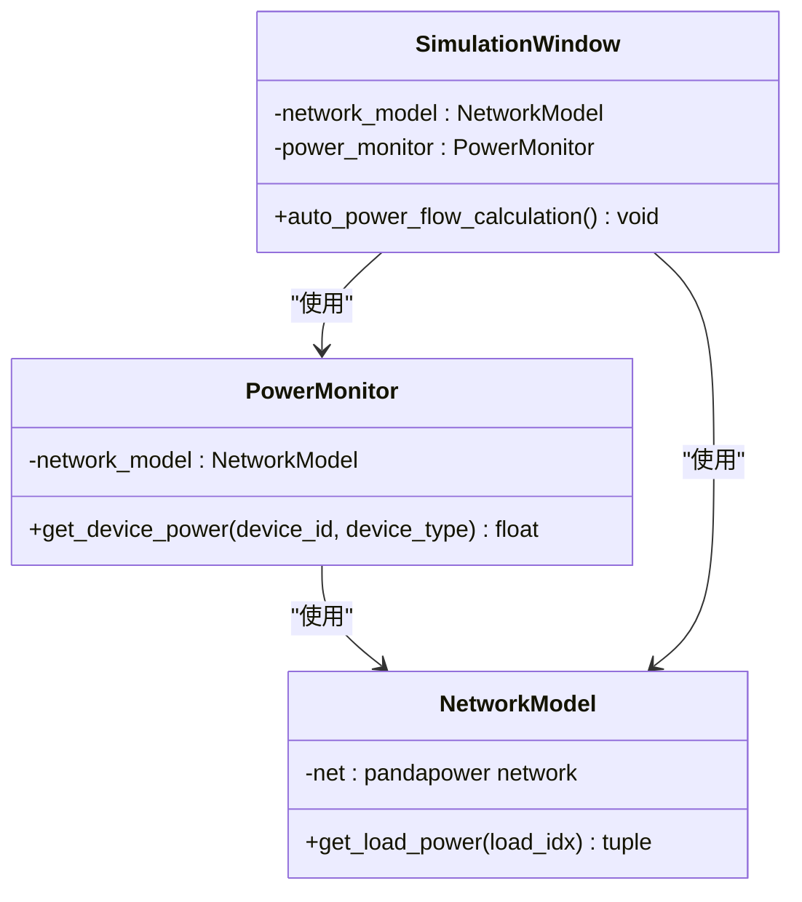
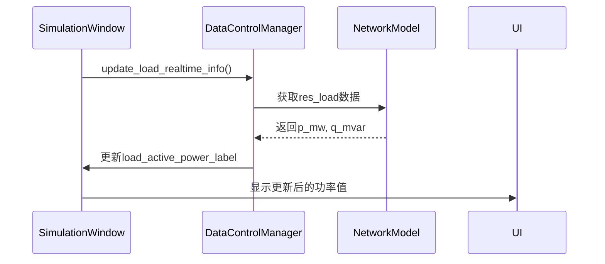
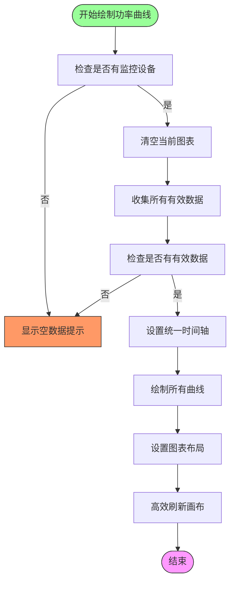

# 负载设备数据可视化

<cite>
**本文档引用的文件**   
- [network_model.py](file://src/models/network_model.py)
- [power_monitor.py](file://src/components/power_monitor.py)
- [simulation_window.py](file://src/components/simulation_window.py)
- [data_control.py](file://src/components/data_control.py)
- [ui_components.py](file://src/components/ui_components.py)
</cite>

## 目录
1. [引言](#引言)
2. [核心组件分析](#核心组件分析)
3. [负载功率数据获取机制](#负载功率数据获取机制)
4. [负载设备数据面板更新](#负载设备数据面板更新)
5. [功率曲线绘制逻辑](#功率曲线绘制逻辑)
6. [UI组件与数据绑定](#ui组件与数据绑定)

## 引言
本文档全面记录了负载设备在仿真结果可视化中的实现。详细说明了仿真窗口如何通过network_model的get_load_power方法获取负载设备的功率消耗数据，并通过power_monitor组件在负载设备数据面板中动态更新。解释了负载功率数据表格的刷新机制和功率曲线的绘制逻辑，包括负功率值的处理。提供了代码示例，展示了如何将负载设备的功率数据与UI组件进行绑定。

## 核心组件分析
负载设备数据可视化的核心组件包括network_model、power_monitor和simulation_window。network_model负责管理电网模型和潮流计算，提供负载功率数据的获取接口。power_monitor负责管理设备功率数据的收集、存储和可视化显示。simulation_window作为主窗口，集成了上述组件，实现了仿真界面的完整功能。

**Section sources**
- [network_model.py](file://src/models/network_model.py#L1-L710)
- [power_monitor.py](file://src/components/power_monitor.py#L1-L784)
- [simulation_window.py](file://src/components/simulation_window.py#L1-L2604)

## 负载功率数据获取机制
负载功率数据的获取主要通过network_model的get_load_power方法实现。该方法从pandapower网络模型的潮流计算结果中提取负载设备的有功和无功功率值。



**Diagram sources **
- [network_model.py](file://src/models/network_model.py#L645-L659)
- [power_monitor.py](file://src/components/power_monitor.py#L67-L129)
- [simulation_window.py](file://src/components/simulation_window.py#L69-L71)

**Section sources**
- [network_model.py](file://src/models/network_model.py#L645-L659)
- [power_monitor.py](file://src/components/power_monitor.py#L67-L129)

## 负载设备数据面板更新
负载设备数据面板的更新由data_control.py中的update_load_realtime_info方法负责。该方法从网络模型中获取负载设备的实时功率数据，并更新UI组件中的显示。



**Diagram sources **
- [data_control.py](file://src/components/data_control.py#L939-L960)
- [ui_components.py](file://src/components/ui_components.py#L394-L516)

**Section sources**
- [data_control.py](file://src/components/data_control.py#L939-L960)
- [ui_components.py](file://src/components/ui_components.py#L394-L516)

## 功率曲线绘制逻辑
功率曲线的绘制由power_monitor.py中的display_power_curve方法实现。该方法收集所有监控设备的功率历史数据，使用统一的时间基准和窗口绘制多条功率曲线。



**Diagram sources **
- [power_monitor.py](file://src/components/power_monitor.py#L188-L354)

**Section sources**
- [power_monitor.py](file://src/components/power_monitor.py#L188-L354)

## UI组件与数据绑定
UI组件与数据的绑定主要通过ui_components.py中的create_load_data_panel方法实现。该方法创建负载设备数据面板，将UI组件与数据控制管理器连接。

```mermaid
erDiagram
UI_COMPONENTS ||--o{ DATA_CONTROL : "管理"
DATA_CONTROL ||--o{ NETWORK_MODEL : "使用"
SIMULATION_WINDOW ||--o{ POWER_MONITOR : "包含"
POWER_MONITOR ||--o{ NETWORK_MODEL : "使用"
class UI_COMPONENTS {
+create_load_data_panel(parent)
-parent_window
}
class DATA_CONTROL {
+update_load_realtime_info()
-parent_window
}
class NETWORK_MODEL {
+get_load_power()
-net
}
class POWER_MONITOR {
+update_power_curve()
-power_history
}
class SIMULATION_WINDOW {
+__init__()
-data_control_manager
-power_monitor
}
```

**Diagram sources **
- [ui_components.py](file://src/components/ui_components.py#L394-L516)
- [data_control.py](file://src/components/data_control.py#L12-L1609)
- [power_monitor.py](file://src/components/power_monitor.py#L17-L784)

**Section sources**
- [ui_components.py](file://src/components/ui_components.py#L394-L516)
- [data_control.py](file://src/components/data_control.py#L12-L1609)