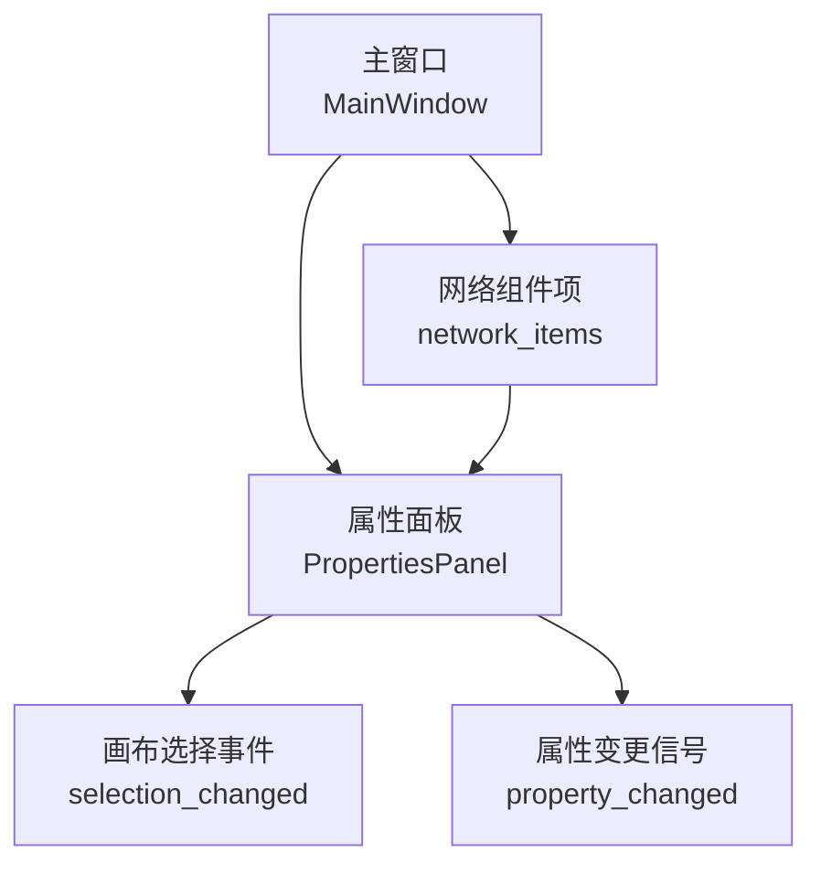
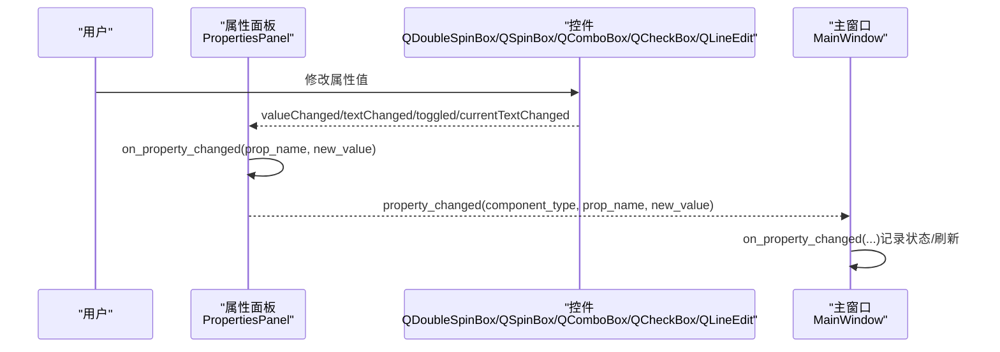
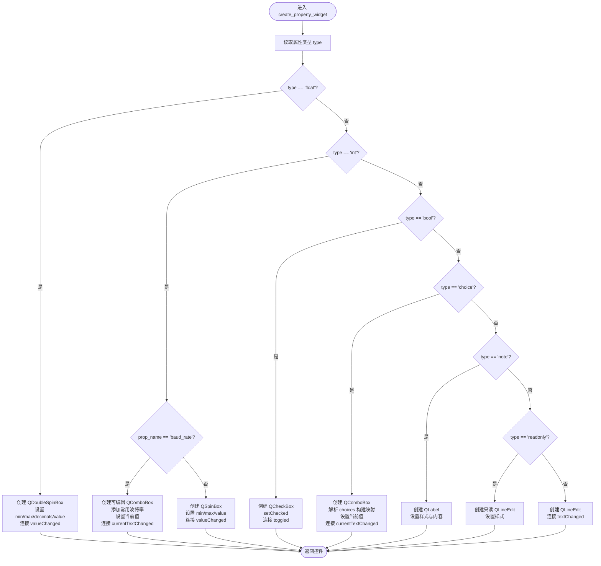
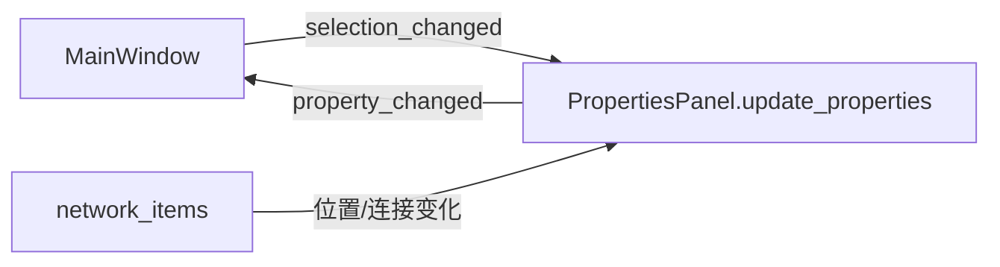

# UI控件生成

<cite>
**本文引用的文件**
- [properties_panel.py](file://src/components/properties_panel.py)
- [main_window.py](file://src/components/main_window.py)
- [network_items.py](file://src/components/network_items.py)
</cite>

## 目录
1. [简介](#简介)
2. [项目结构](#项目结构)
3. [核心组件](#核心组件)
4. [架构总览](#架构总览)
5. [详细组件分析](#详细组件分析)
6. [依赖关系分析](#依赖关系分析)
7. [性能考量](#性能考量)
8. [故障排查指南](#故障排查指南)
9. [结论](#结论)

## 简介
本文件聚焦于“属性面板”如何根据组件属性定义动态生成PySide6 UI控件。重点说明：
- get_component_properties返回的属性定义如何驱动控件类型选择
- 不同类型（float、int、bool、choice、note、readonly）如何映射到具体控件
- 控件信号（valueChanged、textChanged、toggled、currentTextChanged）如何连接到on_property_changed，从而实现值变更监听
- 特殊逻辑（如波特率int的可编辑QComboBox、choice的值与显示文本映射、note样式化标签、readonly只读输入框）

## 项目结构
与UI控件生成直接相关的核心文件：
- src/components/properties_panel.py：属性面板类，包含属性定义、控件生成、值变更处理
- src/components/main_window.py：主窗口，负责连接属性面板与画布、接收属性变更信号
- src/components/network_items.py：网络组件项，部分场景下会触发属性面板刷新

图表来源
- [main_window.py](file://src/components/main_window.py#L158-L179)
- [properties_panel.py](file://src/components/properties_panel.py#L1-L20)
- [network_items.py](file://src/components/network_items.py#L240-L258)

章节来源
- [main_window.py](file://src/components/main_window.py#L158-L179)
- [properties_panel.py](file://src/components/properties_panel.py#L1-L20)
- [network_items.py](file://src/components/network_items.py#L240-L258)

## 核心组件
- 属性面板（PropertiesPanel）
  - 负责：构建属性表单、按属性定义生成控件、监听控件信号、转发属性变更
  - 关键方法：get_component_properties（提供属性定义）、create_property_widget（按类型生成控件）、on_property_changed（统一处理变更）
- 主窗口（MainWindow）
  - 负责：创建属性面板、连接画布选择事件到属性面板、连接属性面板的property_changed信号到on_property_changed
- 网络组件项（network_items）
  - 负责：在某些情况下触发属性面板刷新（例如位置变化）

章节来源
- [properties_panel.py](file://src/components/properties_panel.py#L1-L20)
- [main_window.py](file://src/components/main_window.py#L158-L179)
- [network_items.py](file://src/components/network_items.py#L240-L258)

## 架构总览
属性面板通过get_component_properties提供的属性定义，动态创建不同类型的PySide6控件；控件的值变更信号统一连接到on_property_changed，后者再向主窗口发出property_changed信号，实现跨组件的数据流。

图表来源
- [properties_panel.py](file://src/components/properties_panel.py#L250-L335)
- [properties_panel.py](file://src/components/properties_panel.py#L336-L445)
- [main_window.py](file://src/components/main_window.py#L174-L179)
- [main_window.py](file://src/components/main_window.py#L299-L318)

## 详细组件分析

### 属性定义与控件映射
- float
  - 映射：QDoubleSpinBox
  - 范围与精度：由属性定义中的min/max/decimals决定
  - 初始值：current_value转为浮点数
  - 信号：valueChanged -> on_property_changed
- int
  - 映射：默认QSpinBox；特殊处理“波特率”属性使用可编辑QComboBox
  - 波特率（baud_rate）：可编辑下拉框，预设常见波特率，currentTextChanged -> on_property_changed（非数字回退到默认值）
  - 其他int：QSpinBox，valueChanged -> on_property_changed
- bool
  - 映射：QCheckBox，toggled -> on_property_changed
- choice
  - 映射：QComboBox
  - 值与显示文本映射：支持元组（实际值, 显示文本）与字符串两种形式；内部维护显示文本到实际值的映射；setCurrentText匹配当前值；currentTextChanged -> on_property_changed（传递实际值）
- note
  - 映射：QLabel，带样式（颜色、粗体、斜体），用于说明性文本
- readonly
  - 映射：QLineEdit，setReadOnly(True)，带浅灰背景色
- 其余默认
  - 映射：QLineEdit，textChanged -> on_property_changed

章节来源
- [properties_panel.py](file://src/components/properties_panel.py#L250-L335)

### 控件生成流程（create_property_widget）
- 输入：prop_name、prop_info（来自get_component_properties）、current_value
- 步骤：
  1) 读取prop_info的type字段
  2) 根据type分支创建对应控件
  3) 设置范围/精度/只读/初始值
  4) 连接控件信号到on_property_changed
  5) 返回控件

图表来源
- [properties_panel.py](file://src/components/properties_panel.py#L250-L335)

### 值变更监听与转发（on_property_changed）
- 统一入口：控件信号均连接到on_property_changed(prop_name, new_value)
- 内部处理：
  - IP/端口唯一性校验（若prop_name为ip/port）
  - 更新组件属性字典
  - 特殊字段联动：名称变化时同步更新组件名与标签、部分设备的sn字段
  - 额定功率变化时更新功率限制与Modbus寄存器
  - 条件性刷新：use_standard_type/use_power_factor等属性变化时，重新渲染属性面板
  - 发出property_changed信号（component_type, prop_name, new_value），供主窗口处理

章节来源
- [properties_panel.py](file://src/components/properties_panel.py#L336-L445)

### 信号连接链路
- 主窗口连接：
  - 画布选择变化 -> 属性面板.update_properties
  - 属性面板.property_changed -> 主窗口.on_property_changed
- 属性面板内部：
  - 各控件信号 -> on_property_changed
  - on_property_changed -> property_changed（再次向外发出）

章节来源
- [main_window.py](file://src/components/main_window.py#L174-L179)
- [properties_panel.py](file://src/components/properties_panel.py#L1-L20)
- [properties_panel.py](file://src/components/properties_panel.py#L336-L445)

### 特殊逻辑说明
- 波特率（int）使用可编辑QComboBox
  - 预设常用波特率列表
  - currentTextChanged转换为整数并传递给on_property_changed
  - 非数字输入回退到默认值
- choice值与显示文本映射
  - 支持元组（实际值, 显示文本）与字符串
  - 内部建立显示文本->实际值映射，设置当前值并传递实际值
- note样式化标签
  - 仅显示文本，不附加标签前缀
- readonly只读输入框
  - setReadOnly(True)，带浅色背景与深色文字

章节来源
- [properties_panel.py](file://src/components/properties_panel.py#L262-L281)
- [properties_panel.py](file://src/components/properties_panel.py#L289-L315)
- [properties_panel.py](file://src/components/properties_panel.py#L317-L328)

## 依赖关系分析
- 属性面板依赖：
  - PySide6控件：QDoubleSpinBox、QSpinBox、QComboBox、QCheckBox、QLineEdit、QLabel
  - 自身信号：property_changed
  - 与主窗口的信号连接：selection_changed（画布）-> update_properties；property_changed -> on_property_changed
- 主窗口依赖：
  - 与属性面板的信号连接：property_changed -> on_property_changed
  - 与画布的信号连接：selection_changed -> update_properties
- 网络组件项依赖：
  - 在某些事件（如位置变化）触发属性面板刷新

图表来源
- [main_window.py](file://src/components/main_window.py#L174-L179)
- [properties_panel.py](file://src/components/properties_panel.py#L1-L20)
- [network_items.py](file://src/components/network_items.py#L240-L258)

章节来源
- [main_window.py](file://src/components/main_window.py#L158-L179)
- [properties_panel.py](file://src/components/properties_panel.py#L1-L20)
- [network_items.py](file://src/components/network_items.py#L240-L258)

## 性能考量
- 控件生成成本低，主要开销在信号连接与on_property_changed的分支判断
- choice映射采用一次遍历构建，查询为常数级
- 波特率控件的currentTextChanged转换为整数，非数字回退到默认值，避免无效输入导致的异常
- 若属性面板频繁刷新（如条件性刷新use_standard_type/use_power_factor），建议在业务层减少不必要的重复渲染

## 故障排查指南
- 控件未响应
  - 检查控件信号是否正确连接到on_property_changed
  - 确认属性面板的property_changed信号已连接到主窗口
- 值未生效
  - 检查on_property_changed中是否对相应属性进行了赋值
  - 若涉及IP/端口唯一性校验，确认冲突提示是否阻止了更新
- 波特率输入无效
  - 检查可编辑QComboBox的currentTextChanged是否转换为整数
  - 非数字输入会回退到默认值
- choice显示与实际值不一致
  - 检查choices定义与映射是否正确
  - 确认setCurrentText匹配到实际值

章节来源
- [properties_panel.py](file://src/components/properties_panel.py#L250-L335)
- [properties_panel.py](file://src/components/properties_panel.py#L336-L445)
- [main_window.py](file://src/components/main_window.py#L174-L179)

## 结论
属性面板通过get_component_properties提供的属性定义，实现了对多种控件类型的统一生成与信号绑定。float/int/bool/choice/note/readonly分别映射到QDoubleSpinBox/QSpinBox/QComboBox/QCheckBox/QLabel/QLineEdit，并通过on_property_changed集中处理值变更，最终由主窗口统一响应。该设计具备良好的扩展性与可维护性，便于新增属性类型与控件映射。