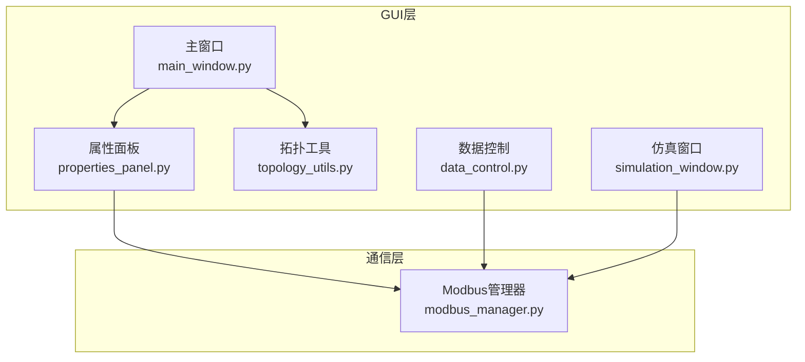
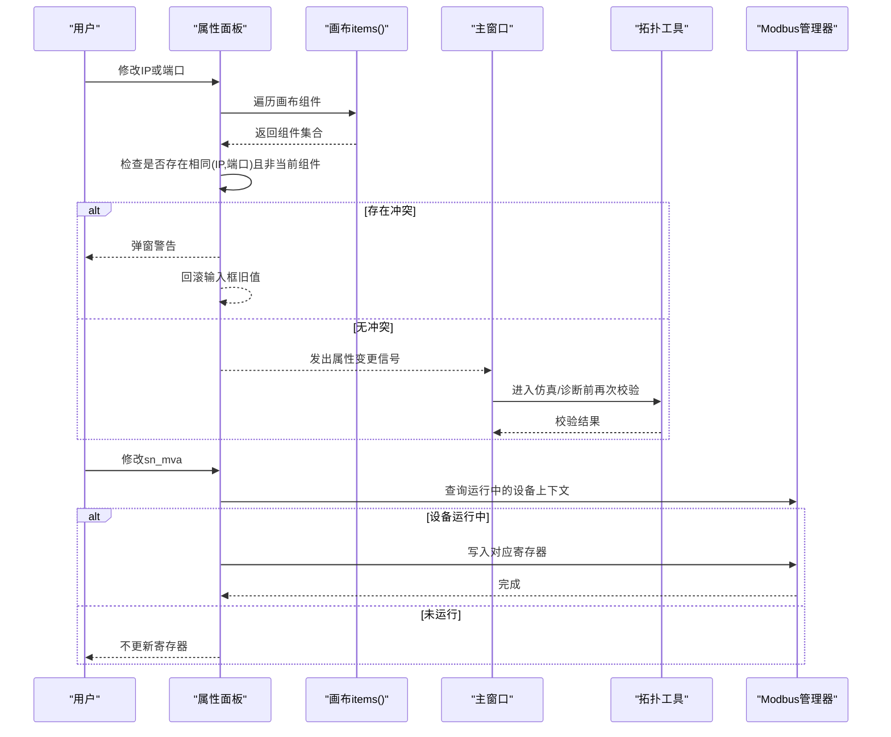
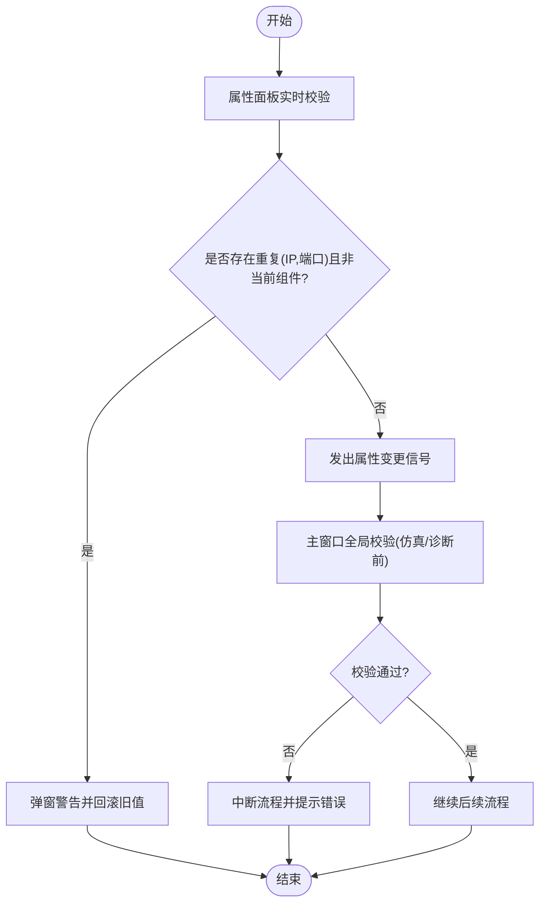
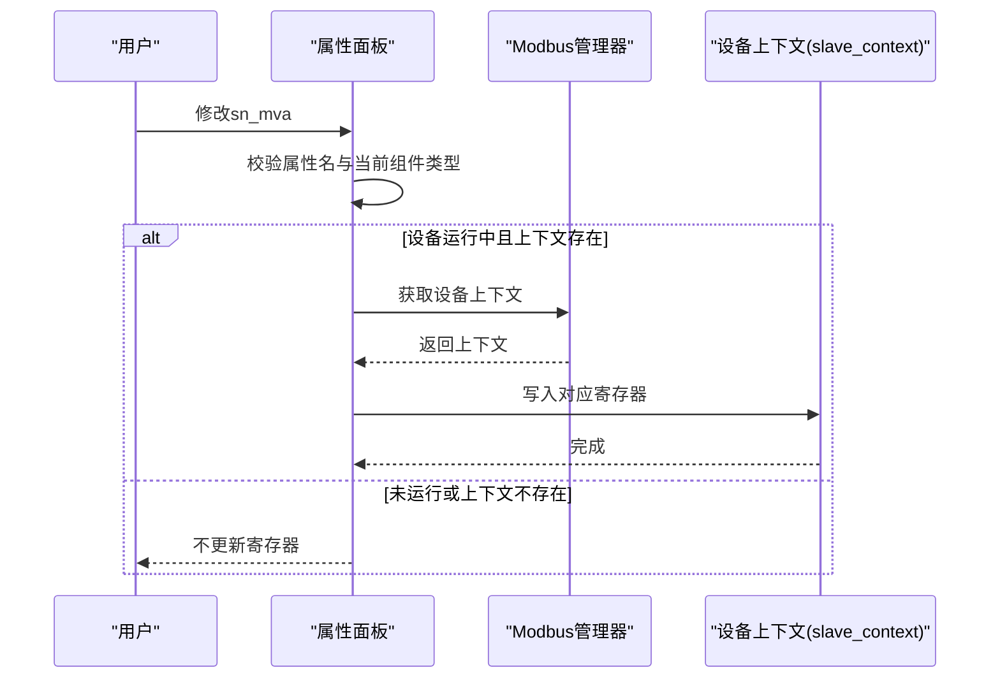
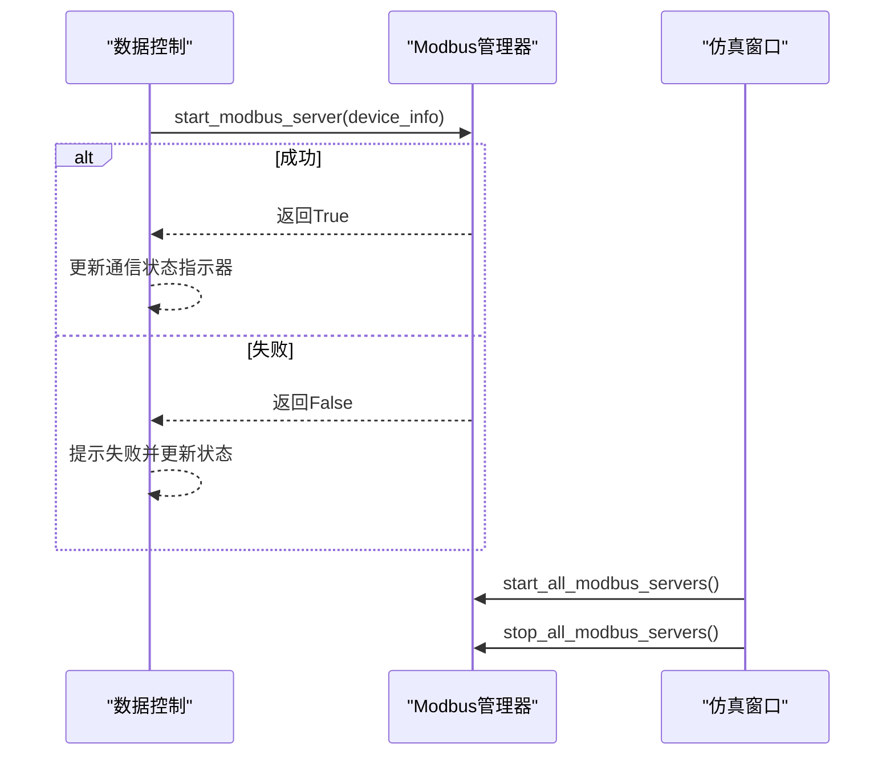
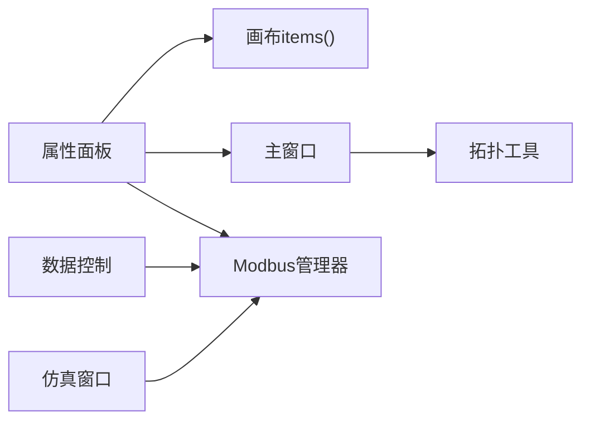

# 唯一性验证与同步

<cite>
**本文引用的文件**
- [main_window.py](file://src/components/main_window.py)
- [properties_panel.py](file://src/components/properties_panel.py)
- [topology_utils.py](file://src/components/topology_utils.py)
- [modbus_manager.py](file://src/components/modbus_manager.py)
- [data_control.py](file://src/components/data_control.py)
- [simulation_window.py](file://src/components/simulation_window.py)
</cite>

## 目录
1. [简介](#简介)
2. [项目结构](#项目结构)
3. [核心组件](#核心组件)
4. [架构总览](#架构总览)
5. [详细组件分析](#详细组件分析)
6. [依赖分析](#依赖分析)
7. [性能考虑](#性能考虑)
8. [故障排查指南](#故障排查指南)
9. [结论](#结论)

## 简介
本文件聚焦两个关键机制：
- 对画布上组件的“IP+端口”唯一性验证流程，确保同一画布内不存在重复的IP与端口组合，冲突时弹窗警告并回滚输入值。
- 当储能、充电桩、光伏的“额定容量（sn_mva）”属性发生变化时，通过属性面板的同步逻辑与ModbusManager协作，实时更新对应设备在Modbus从站上下文中的寄存器，实现GUI配置与底层通信数据的强一致。

## 项目结构
围绕本次目标，涉及的关键文件与职责如下：
- 主窗口：负责属性变更事件的入口、仿真模式前的IP/端口唯一性校验、网络诊断。
- 属性面板：负责IP/端口冲突即时校验与回滚；负责sn_mva变更时的Modbus寄存器同步。
- 拓扑工具：提供统一的IP/端口唯一性校验算法与错误提示。
- Modbus管理器：负责设备上下文创建、寄存器写入、服务器启停与运行状态维护。
- 数据控制：负责设备通信启停的入口，驱动ModbusManager启动/停止服务。
- 仿真窗口：负责批量开启/关闭所有设备通信，联动ModbusManager。

图表来源
- [main_window.py](file://src/components/main_window.py#L110-L179)
- [properties_panel.py](file://src/components/properties_panel.py#L340-L510)
- [topology_utils.py](file://src/components/topology_utils.py#L21-L104)
- [modbus_manager.py](file://src/components/modbus_manager.py#L70-L120)
- [data_control.py](file://src/components/data_control.py#L32-L104)
- [simulation_window.py](file://src/components/simulation_window.py#L1931-L1964)

章节来源
- [main_window.py](file://src/components/main_window.py#L110-L179)
- [properties_panel.py](file://src/components/properties_panel.py#L340-L510)
- [topology_utils.py](file://src/components/topology_utils.py#L21-L104)
- [modbus_manager.py](file://src/components/modbus_manager.py#L70-L120)
- [data_control.py](file://src/components/data_control.py#L32-L104)
- [simulation_window.py](file://src/components/simulation_window.py#L1931-L1964)

## 核心组件
- IP/端口唯一性验证：由属性面板在用户输入时即时检查，同时由主窗口在进入仿真模式或网络诊断时进行整体校验。
- Modbus寄存器同步：属性面板在sn_mva变更时，仅在设备处于运行态且上下文存在时，按设备类型写入对应寄存器。

章节来源
- [properties_panel.py](file://src/components/properties_panel.py#L340-L510)
- [topology_utils.py](file://src/components/topology_utils.py#L21-L104)
- [modbus_manager.py](file://src/components/modbus_manager.py#L486-L507)

## 架构总览
下图展示“IP/端口唯一性验证”和“sn_mva寄存器同步”的关键交互路径。

图表来源
- [properties_panel.py](file://src/components/properties_panel.py#L340-L382)
- [topology_utils.py](file://src/components/topology_utils.py#L21-L104)
- [main_window.py](file://src/components/main_window.py#L320-L344)
- [modbus_manager.py](file://src/components/modbus_manager.py#L486-L507)

## 详细组件分析

### 组件A：IP与端口唯一性验证机制
- 实时校验（属性面板）
  - 当用户修改IP或端口时，属性面板会遍历画布上所有组件，比较目标组件与其它组件的IP与端口组合，若发现重复且非当前组件，则弹出警告并回滚输入框的值。
  - 该机制保证了在用户输入阶段即刻阻止冲突，避免后续仿真/诊断阶段出现不可预期行为。
- 全局校验（主窗口）
  - 在进入仿真模式或执行网络诊断前，主窗口会委托拓扑工具对整个场景进行一次全面的IP/端口唯一性检查，汇总重复与不完整配置，并给出明确的错误提示。
  - 若校验失败，流程中断，提示用户修正配置。

图表来源
- [properties_panel.py](file://src/components/properties_panel.py#L340-L382)
- [topology_utils.py](file://src/components/topology_utils.py#L21-L104)
- [main_window.py](file://src/components/main_window.py#L320-L344)

章节来源
- [properties_panel.py](file://src/components/properties_panel.py#L340-L382)
- [topology_utils.py](file://src/components/topology_utils.py#L21-L104)
- [main_window.py](file://src/components/main_window.py#L320-L344)

### 组件B：sn_mva变更与Modbus寄存器同步
- 触发条件
  - 当属性面板检测到sn_mva属性变更时，若当前组件类型为“储能”“充电桩”“光伏”，则触发寄存器同步逻辑。
- 同步策略
  - 仅在设备处于“运行中”且其上下文存在于Modbus管理器中时才写入寄存器。
  - 不同设备类型的寄存器写入规则不同：
    - 储能：写入从站上下文的寄存器区间（示例：寄存器8与9，用于存放额定功率的高低位）。
    - 充电桩：写入从站上下文的寄存器（示例：寄存器4，存放额定功率）。
    - 光伏：写入从站上下文的寄存器（示例：寄存器5000，存放额定功率）。
- 与ModbusManager协作
  - 属性面板通过主窗口间接获取Modbus管理器实例，查询运行中的设备键集合，定位对应上下文，再按设备类型写入寄存器。
  - Modbus管理器负责上下文创建、寄存器初始化与数据更新（例如电表、光伏、储能、充电桩的寄存器写入逻辑）。

图表来源
- [properties_panel.py](file://src/components/properties_panel.py#L446-L510)
- [modbus_manager.py](file://src/components/modbus_manager.py#L486-L507)

章节来源
- [properties_panel.py](file://src/components/properties_panel.py#L446-L510)
- [modbus_manager.py](file://src/components/modbus_manager.py#L486-L507)

### 组件C：设备通信启停与Modbus服务生命周期
- 启动通信
  - 数据控制模块根据设备类型与索引，构造设备信息（含IP、端口、sn_mva等），调用Modbus管理器启动对应设备的Modbus服务器。
  - 启动成功后，主窗口状态栏与通信状态指示器同步更新。
- 关闭通信
  - 数据控制模块同样通过Modbus管理器停止对应设备的Modbus服务器，并更新状态。
- 批量启停
  - 仿真窗口提供“开启所有设备通信”“关闭所有设备通信”入口，内部调用Modbus管理器批量启停服务。

图表来源
- [data_control.py](file://src/components/data_control.py#L32-L104)
- [simulation_window.py](file://src/components/simulation_window.py#L1931-L1964)
- [modbus_manager.py](file://src/components/modbus_manager.py#L506-L608)

章节来源
- [data_control.py](file://src/components/data_control.py#L32-L104)
- [simulation_window.py](file://src/components/simulation_window.py#L1931-L1964)
- [modbus_manager.py](file://src/components/modbus_manager.py#L506-L608)

## 依赖分析
- 属性面板依赖画布items()进行实时冲突检测；依赖主窗口获取Modbus管理器实例；依赖拓扑工具在仿真/诊断前进行全局校验。
- 主窗口依赖拓扑工具进行IP/端口唯一性校验；在仿真模式与诊断流程中串联属性面板与拓扑工具。
- Modbus管理器依赖设备类型与上下文，按设备类型写入不同寄存器；同时维护运行中的服务集合与上下文映射。
- 数据控制与仿真窗口依赖Modbus管理器进行设备通信启停与批量启停。

图表来源
- [properties_panel.py](file://src/components/properties_panel.py#L340-L510)
- [topology_utils.py](file://src/components/topology_utils.py#L21-L104)
- [main_window.py](file://src/components/main_window.py#L320-L344)
- [modbus_manager.py](file://src/components/modbus_manager.py#L486-L507)
- [data_control.py](file://src/components/data_control.py#L32-L104)
- [simulation_window.py](file://src/components/simulation_window.py#L1931-L1964)

章节来源
- [properties_panel.py](file://src/components/properties_panel.py#L340-L510)
- [topology_utils.py](file://src/components/topology_utils.py#L21-L104)
- [main_window.py](file://src/components/main_window.py#L320-L344)
- [modbus_manager.py](file://src/components/modbus_manager.py#L486-L507)
- [data_control.py](file://src/components/data_control.py#L32-L104)
- [simulation_window.py](file://src/components/simulation_window.py#L1931-L1964)

## 性能考虑
- IP/端口唯一性验证
  - 属性面板在用户输入时遍历画布items()，复杂度为O(N)；在仿真/诊断前由拓扑工具进行二次校验，复杂度同样为O(N)。建议在画布组件较多时，尽量减少不必要的频繁输入触发，避免重复扫描。
- Modbus寄存器同步
  - 寄存器写入为常数级操作，但需注意上下文获取与设备运行状态判断，避免在设备未运行时进行无效写入。
- 通信启停
  - Modbus服务器启动/停止涉及线程与事件循环，应避免频繁启停造成资源抖动；批量启停时建议合并提示与状态更新。

[本节为通用指导，无需具体文件引用]

## 故障排查指南
- IP/端口冲突
  - 现象：修改IP或端口后弹窗警告，输入框自动回滚。
  - 排查：确认当前组件与其他组件的IP与端口组合是否重复；若为导入拓扑后出现冲突，可在进入仿真/诊断前查看拓扑工具的错误汇总。
- sn_mva变更未生效
  - 现象：修改sn_mva后，Modbus客户端读取不到最新值。
  - 排查：确认设备是否处于“运行中”状态；确认Modbus管理器中是否存在该设备的上下文；确认设备类型与寄存器写入逻辑是否匹配。
- 通信启停失败
  - 现象：开启/关闭通信失败或端口被占用。
  - 排查：检查设备IP与端口配置；确认端口未被系统或其他进程占用；查看Modbus管理器的错误日志与返回值。

章节来源
- [properties_panel.py](file://src/components/properties_panel.py#L340-L382)
- [topology_utils.py](file://src/components/topology_utils.py#L21-L104)
- [modbus_manager.py](file://src/components/modbus_manager.py#L596-L608)
- [data_control.py](file://src/components/data_control.py#L80-L104)

## 结论
- IP/端口唯一性验证在“输入阶段”与“仿真/诊断阶段”双轨并行，既保证用户体验又确保系统稳定性。
- sn_mva变更通过属性面板与Modbus管理器的协作，实现了从GUI到底层通信数据的实时同步，保障了配置一致性。
- 建议在大规模拓扑场景中，结合批量启停与日志监控，进一步提升系统的可观测性与可维护性。