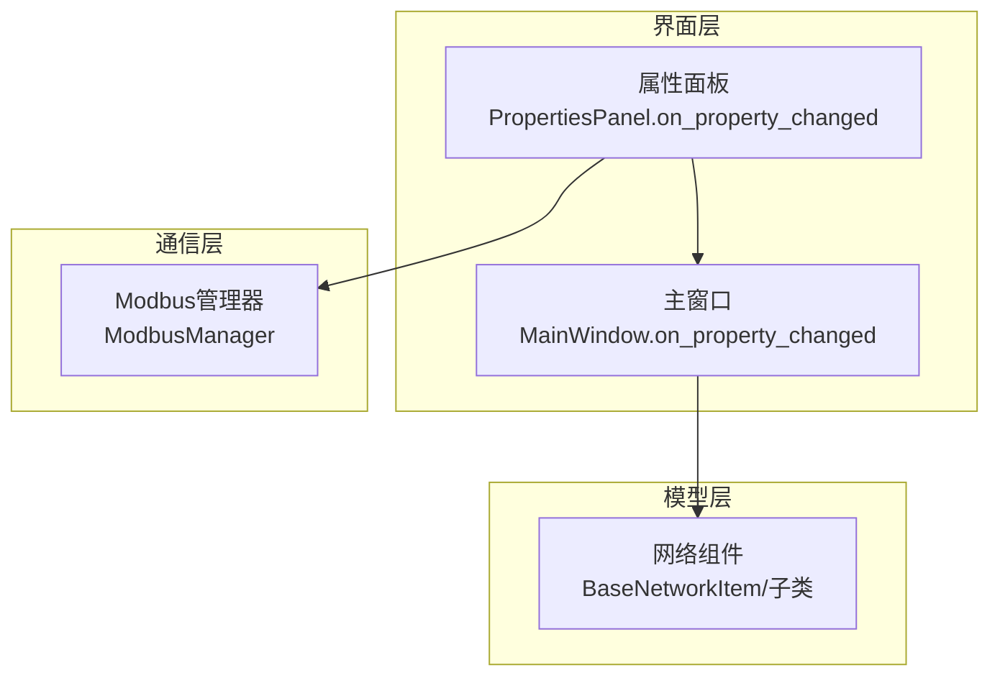
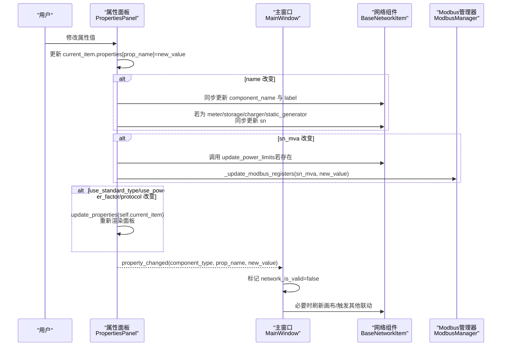
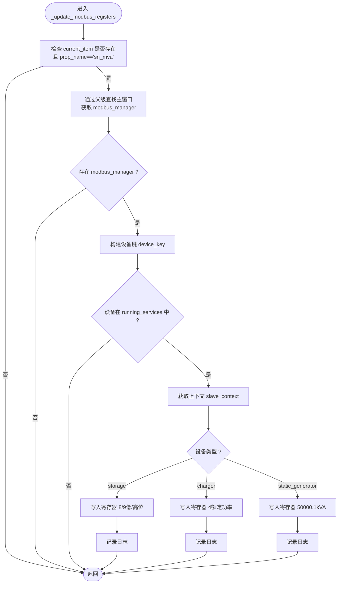
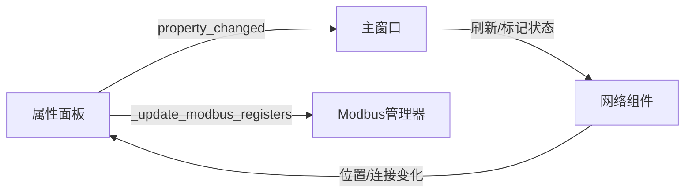

# 属性值变更处理

<cite>
**本文引用的文件**
- [src/components/properties_panel.py](file://src/components/properties_panel.py)
- [src/components/main_window.py](file://src/components/main_window.py)
- [src/components/network_items.py](file://src/components/network_items.py)
- [src/components/modbus_manager.py](file://src/components/modbus_manager.py)
</cite>

## 目录
1. [简介](#简介)
2. [项目结构](#项目结构)
3. [核心组件](#核心组件)
4. [架构总览](#架构总览)
5. [详细组件分析](#详细组件分析)
6. [依赖关系分析](#依赖关系分析)
7. [性能考量](#性能考量)
8. [故障排查指南](#故障排查指南)
9. [结论](#结论)

## 简介
本文件围绕 on_property_changed 方法的复杂处理逻辑展开，重点说明其职责：更新 current_item 的 properties 字典，并发出 property_changed 信号以通知系统其他部分。文档深入解析以下业务规则：
- 当 name 属性改变时，同步更新 component_name、label 文本以及电表、储能、充电桩、光伏等设备的 sn（序列号）。
- use_standard_type、use_power_factor、protocol 等开关属性变更时，通过调用 update_properties 重新渲染整个面板，以实现条件显示逻辑。
- sn_mva（额定容量）变更时，触发 _update_modbus_registers 方法同步更新 Modbus 从站寄存器值，实现 GUI 与通信层联动。

## 项目结构
本项目采用分层与模块化组织，涉及属性面板、主窗口、网络组件与 Modbus 管理器等模块。属性变更流程从属性面板出发，经由主窗口传播至网络组件，再由 Modbus 管理器驱动通信层。

图表来源
- [src/components/properties_panel.py](file://src/components/properties_panel.py#L335-L444)
- [src/components/main_window.py](file://src/components/main_window.py#L299-L317)
- [src/components/network_items.py](file://src/components/network_items.py#L232-L258)
- [src/components/modbus_manager.py](file://src/components/modbus_manager.py#L505-L607)

章节来源
- [src/components/properties_panel.py](file://src/components/properties_panel.py#L335-L444)
- [src/components/main_window.py](file://src/components/main_window.py#L299-L317)
- [src/components/network_items.py](file://src/components/network_items.py#L232-L258)
- [src/components/modbus_manager.py](file://src/components/modbus_manager.py#L505-L607)

## 核心组件
- 属性面板 PropertiesPanel：负责收集用户输入、执行属性变更的业务规则、发出 property_changed 信号，并在必要时调用 _update_modbus_registers。
- 主窗口 MainWindow：接收属性变更信号，更新网络状态标志位，必要时强制刷新画布。
- 网络组件 BaseNetworkItem 及其子类：维护组件属性 properties、标签 label、连接 bus 等，参与属性变更后的联动更新。
- Modbus 管理器 ModbusManager：根据设备类型创建上下文、启动/停止服务器、写入寄存器，支撑 GUI 与通信层联动。

章节来源
- [src/components/properties_panel.py](file://src/components/properties_panel.py#L11-L23)
- [src/components/main_window.py](file://src/components/main_window.py#L94-L117)
- [src/components/network_items.py](file://src/components/network_items.py#L192-L222)
- [src/components/modbus_manager.py](file://src/components/modbus_manager.py#L69-L116)

## 架构总览
属性变更处理的端到端流程如下：

图表来源
- [src/components/properties_panel.py](file://src/components/properties_panel.py#L335-L444)
- [src/components/main_window.py](file://src/components/main_window.py#L299-L317)
- [src/components/network_items.py](file://src/components/network_items.py#L232-L258)
- [src/components/modbus_manager.py](file://src/components/modbus_manager.py#L446-L510)

## 详细组件分析

### on_property_changed 方法的职责与流程
- 更新 current_item 的 properties 字典，确保 GUI 与模型一致。
- 根据属性名执行业务规则：
  - name：同步更新 component_name 与 label 文本；对 meter/storage/charger/static_generator，同步更新 sn 并刷新控件显示。
  - sn_mva：调用 update_power_limits（若存在），随后调用 _update_modbus_registers 同步通信层寄存器。
  - use_standard_type（line/transformer）、use_power_factor（static_generator/load/charger）、protocol（storage/charger/static_generator/meter）：触发 update_properties 重新渲染面板，避免重复发出信号。
- 发出 property_changed 信号，携带组件类型、属性名与新值，供主窗口或其他监听者处理。

章节来源
- [src/components/properties_panel.py](file://src/components/properties_panel.py#L335-L444)

### 业务规则详解

#### name 属性变更
- 同步更新组件的 component_name 与 label 文本，保证画布显示与属性面板一致。
- 对 meter/storage/charger/static_generator 类型，同时更新 properties['sn']，并刷新属性面板中 sn 控件的显示值，确保序列号与名称一致。

章节来源
- [src/components/properties_panel.py](file://src/components/properties_panel.py#L386-L397)

#### sn_mva 属性变更
- 若组件提供 update_power_limits 方法，则先调用以更新功率限制。
- 调用 _update_modbus_registers，根据设备类型与新值写入 Modbus 寄存器，实现 GUI 与通信层联动。

章节来源
- [src/components/properties_panel.py](file://src/components/properties_panel.py#L399-L405)
- [src/components/modbus_manager.py](file://src/components/modbus_manager.py#L446-L510)

#### use_standard_type 与 use_power_factor 条件显示
- 当 use_standard_type 改变时，针对 line/transformer 类型，调用 update_properties 重新渲染面板，以根据标准类型开关控制参数显示。
- 当 use_power_factor 改变时，针对 static_generator/load/charger 类型，调用 update_properties 重新渲染面板，以根据功率因数模式控制参数显示。
- 为避免重复发出信号，这些分支在触发 update_properties 后直接 return。

章节来源
- [src/components/properties_panel.py](file://src/components/properties_panel.py#L407-L441)

#### protocol 属性变更
- 当 protocol 改变时，针对 storage/charger/static_generator/meter 类型，调用 update_properties 重新渲染面板，以根据通信协议控制相关参数显示。

章节来源
- [src/components/properties_panel.py](file://src/components/properties_panel.py#L437-L441)

### GUI 与通信层联动：_update_modbus_registers
- 仅在 prop_name == 'sn_mva' 时执行。
- 通过主窗口获取 ModbusManager 实例，定位设备键 device_key（设备类型_索引），检查设备是否正在运行 Modbus 服务。
- 根据设备类型写入对应寄存器：
  - storage：额定功率占用寄存器 8-9（拆分为低/高位）。
  - charger：额定功率占用寄存器 4（16 位）。
  - static_generator：额定功率占用寄存器 5000（0.1kVA 单位）。
- 记录日志，便于调试与审计。

图表来源
- [src/components/properties_panel.py](file://src/components/properties_panel.py#L446-L510)
- [src/components/modbus_manager.py](file://src/components/modbus_manager.py#L446-L510)

章节来源
- [src/components/properties_panel.py](file://src/components/properties_panel.py#L446-L510)
- [src/components/modbus_manager.py](file://src/components/modbus_manager.py#L446-L510)

### 主窗口 on_property_changed 的作用
- 接收属性变更信号，获取当前选中组件，若为 name 变更则强制刷新画布场景。
- 标记 network_is_valid=false，提示后续需要重新诊断或仿真。

章节来源
- [src/components/main_window.py](file://src/components/main_window.py#L299-L317)

### 网络组件联动
- BaseNetworkItem 在位置变化或双击修改名称时，会触发属性面板刷新与 property_changed 信号，确保属性面板与组件状态一致。
- 对于开关组件，连接变化时会更新 bus/element/et 等参数，并通知相关组件更新母线参数，避免递归调用。

章节来源
- [src/components/network_items.py](file://src/components/network_items.py#L232-L258)
- [src/components/network_items.py](file://src/components/network_items.py#L519-L548)

## 依赖关系分析
- 属性面板依赖主窗口以获取 Modbus 管理器实例，从而实现 GUI 与通信层联动。
- 主窗口依赖属性面板的 property_changed 信号以更新网络状态与画布。
- 网络组件与属性面板之间通过信号/槽与属性字典双向耦合，确保显示与模型一致。
- Modbus 管理器为通信层提供上下文与寄存器写入能力，受属性面板触发。

图表来源
- [src/components/properties_panel.py](file://src/components/properties_panel.py#L15-L16)
- [src/components/main_window.py](file://src/components/main_window.py#L177-L179)
- [src/components/network_items.py](file://src/components/network_items.py#L232-L258)
- [src/components/modbus_manager.py](file://src/components/modbus_manager.py#L505-L607)

章节来源
- [src/components/properties_panel.py](file://src/components/properties_panel.py#L15-L16)
- [src/components/main_window.py](file://src/components/main_window.py#L177-L179)
- [src/components/network_items.py](file://src/components/network_items.py#L232-L258)
- [src/components/modbus_manager.py](file://src/components/modbus_manager.py#L505-L607)

## 性能考量
- 条件渲染：对 use_standard_type/use_power_factor/protocol 的面板重渲染仅在属性变更时触发，避免不必要的 UI 重建。
- 延迟刷新：在网络组件连接变化时使用 QTimer.singleShot 延迟刷新，避免递归调用导致的性能问题。
- Modbus 写入：仅在 sn_mva 变更且设备处于运行状态时写入寄存器，减少无效 IO。

章节来源
- [src/components/properties_panel.py](file://src/components/properties_panel.py#L407-L441)
- [src/components/network_items.py](file://src/components/network_items.py#L536-L548)
- [src/components/modbus_manager.py](file://src/components/modbus_manager.py#L446-L510)

## 故障排查指南
- IP/端口冲突：当修改 ip/port 时，属性面板会检查与现有组件的组合冲突，出现冲突将回滚并提示用户更换。
- Modbus 写入失败：_update_modbus_registers 在异常时记录错误日志，检查设备是否在 running_services 中、上下文是否存在、寄存器地址是否正确。
- 网络状态无效：主窗口在属性变更后标记 network_is_valid=false，进入仿真模式前需先进行网络诊断并通过。

章节来源
- [src/components/properties_panel.py](file://src/components/properties_panel.py#L339-L381)
- [src/components/properties_panel.py](file://src/components/properties_panel.py#L446-L510)
- [src/components/main_window.py](file://src/components/main_window.py#L312-L314)

## 结论
on_property_changed 方法通过“更新模型 + 条件渲染 + 信号传播 + 通信层联动”的设计，实现了属性变更的闭环处理。其核心价值在于：
- 保证 GUI 与模型的一致性（如 name/sn 同步）。
- 通过面板重渲染实现灵活的条件显示逻辑（use_standard_type/use_power_factor/protocol）。
- 通过 Modbus 寄存器同步实现 GUI 与通信层的强耦合联动（sn_mva）。
- 与主窗口、网络组件、Modbus 管理器形成清晰的分层协作，具备良好的可维护性与扩展性。