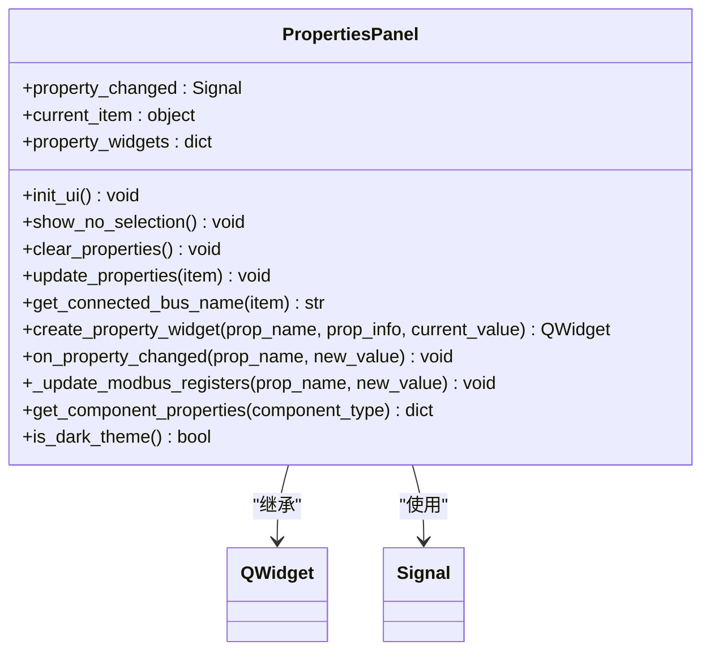
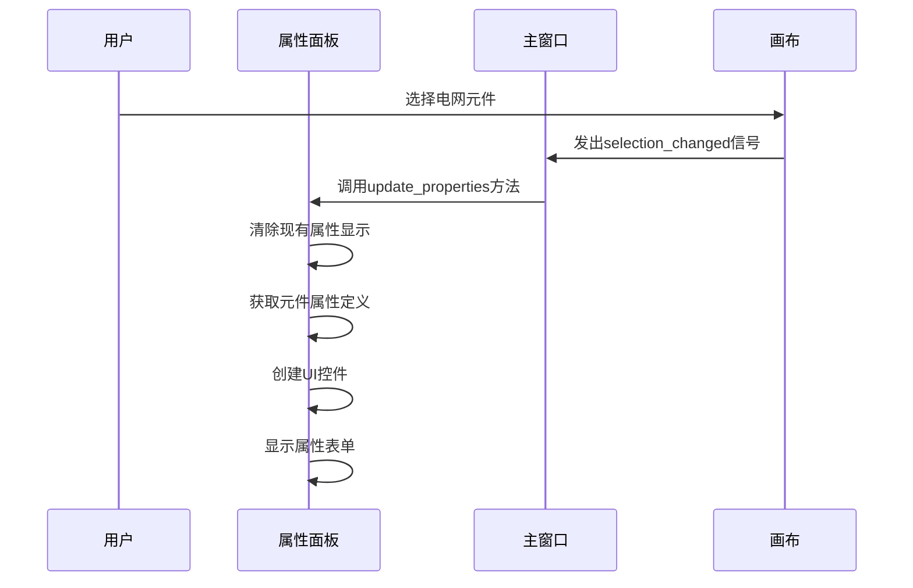
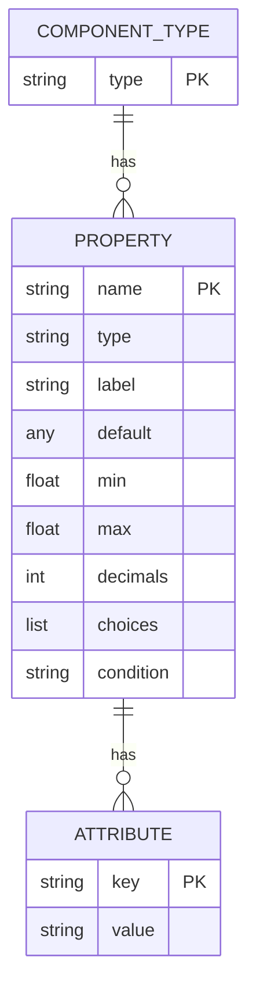
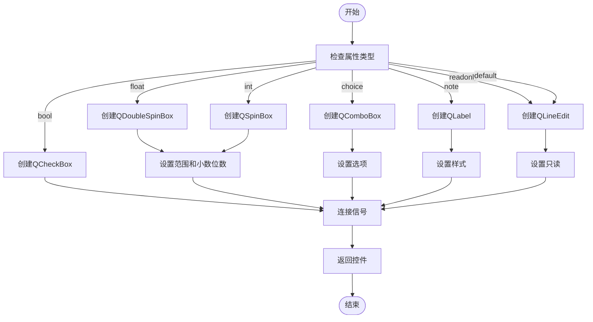
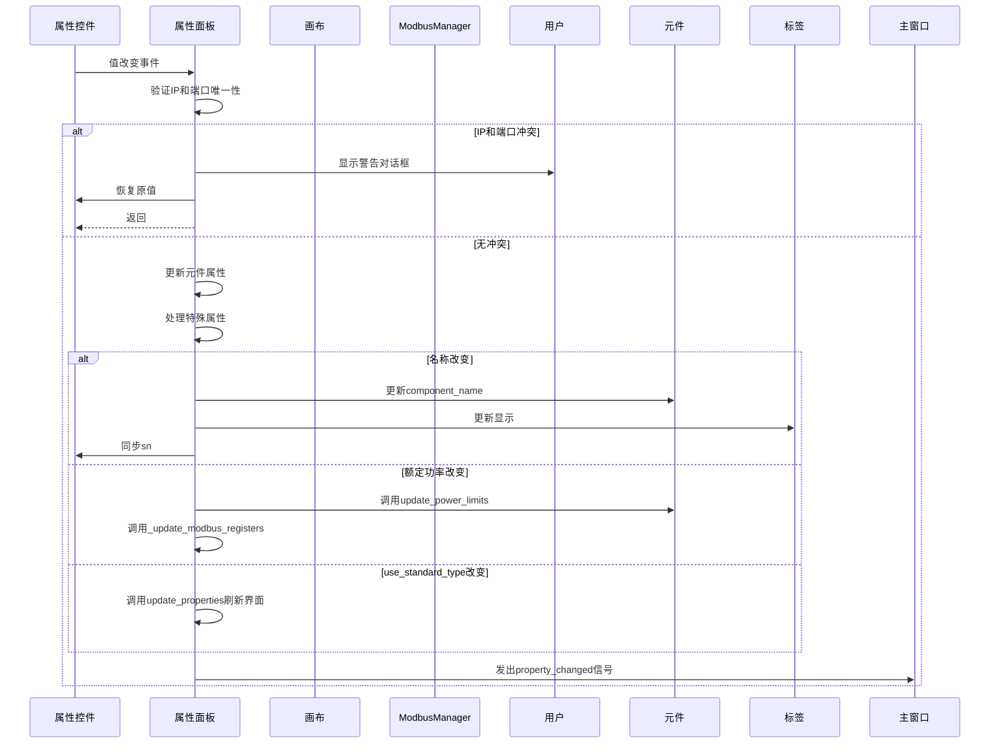
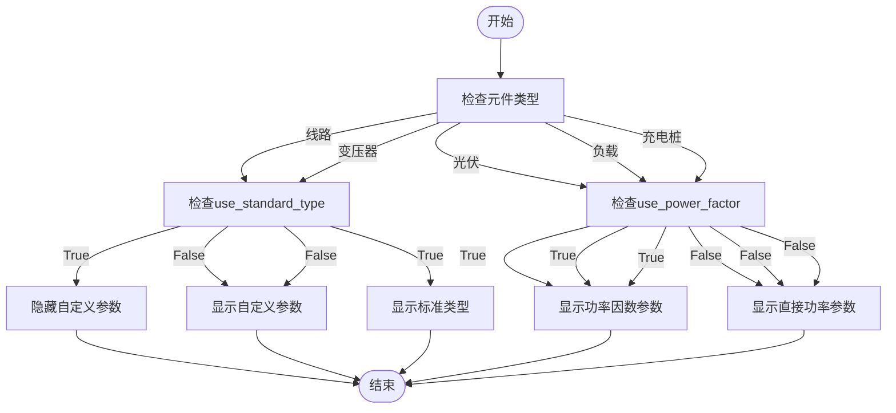

# 属性面板

<cite>
**本文档引用的文件**   
- [properties_panel.py](file://src/components/properties_panel.py)
- [network_items.py](file://src/components/network_items.py)
- [main_window.py](file://src/components/main_window.py)
- [canvas.py](file://src/components/canvas.py)
- [modbus_manager.py](file://src/components/modbus_manager.py)
</cite>

## 目录
1. [引言](#引言)
2. [属性面板架构](#属性面板架构)
3. [核心组件分析](#核心组件分析)
4. [属性定义机制](#属性定义机制)
5. [UI控件创建](#ui控件创建)
6. [属性变更处理](#属性变更处理)
7. [条件显示逻辑](#条件显示逻辑)
8. [新元件类型定义示例](#新元件类型定义示例)
9. [结论](#结论)

## 引言
属性面板是pp_tool应用中的核心功能模块，负责为用户选中的电网元件动态生成和显示其属性表单。该模块通过`PropertiesPanel`类实现，能够根据不同的电网元件类型（如线路、变压器、负载、储能等）展示相应的属性配置界面。本文档将深入分析该模块的实现机制，重点阐述其如何定义元件属性结构、创建UI控件以及处理属性变更事件。

## 属性面板架构
属性面板模块采用面向对象的设计模式，以`PropertiesPanel`类为核心，继承自`QWidget`。该类通过信号-槽机制与主窗口和其他组件进行通信，实现了属性值改变时的实时响应。



**Diagram sources**
- [properties_panel.py](file://src/components/properties_panel.py#L12-L800)

**Section sources**
- [properties_panel.py](file://src/components/properties_panel.py#L12-L800)

## 核心组件分析
属性面板的核心功能由`PropertiesPanel`类实现，该类通过`update_properties`方法根据用户选中的元件动态更新属性显示。当用户选择一个元件时，系统会调用此方法，清除当前显示的属性，并根据元件类型重新生成相应的属性表单。



**Diagram sources**
- [properties_panel.py](file://src/components/properties_panel.py#L88-L231)
- [main_window.py](file://src/components/main_window.py#L175-L178)
- [canvas.py](file://src/components/canvas.py#L60-L61)

**Section sources**
- [properties_panel.py](file://src/components/properties_panel.py#L88-L231)
- [main_window.py](file://src/components/main_window.py#L175-L178)
- [canvas.py](file://src/components/canvas.py#L60-L61)

## 属性定义机制
`get_component_properties`方法是属性面板的核心，它定义了不同电网元件的属性结构。该方法返回一个字典，其中包含各种元件类型（如线路、变压器、负载、储能等）的属性定义。



**Diagram sources**
- [properties_panel.py](file://src/components/properties_panel.py#L511-L790)

**Section sources**
- [properties_panel.py](file://src/components/properties_panel.py#L511-L790)

## UI控件创建
`create_property_widget`方法根据属性定义创建对应的UI控件。该方法根据属性类型（如float、int、bool、choice等）创建相应的控件，如`QDoubleSpinBox`、`QSpinBox`、`QCheckBox`、`QComboBox`等。



**Diagram sources**
- [properties_panel.py](file://src/components/properties_panel.py#L250-L335)

**Section sources**
- [properties_panel.py](file://src/components/properties_panel.py#L250-L335)

## 属性变更处理
`on_property_changed`方法是属性面板的关键，它不仅更新元件属性，还实现了IP和端口的唯一性验证、Modbus寄存器的同步更新以及`use_standard_type`等条件属性改变时的界面刷新机制。



**Diagram sources**
- [properties_panel.py](file://src/components/properties_panel.py#L336-L445)
- [modbus_manager.py](file://src/components/modbus_manager.py#L446-L505)

**Section sources**
- [properties_panel.py](file://src/components/properties_panel.py#L336-L445)
- [modbus_manager.py](file://src/components/modbus_manager.py#L446-L505)

## 条件显示逻辑
属性面板实现了复杂的条件显示逻辑，根据元件的特定属性值动态控制其他属性的显示。例如，当线路或变压器使用标准类型时，会隐藏自定义参数；当光伏或负载使用功率因数模式时，会显示相应的功率因数参数。



**Diagram sources**
- [properties_panel.py](file://src/components/properties_panel.py#L123-L222)

**Section sources**
- [properties_panel.py](file://src/components/properties_panel.py#L123-L222)

## 新元件类型定义示例
为新元件类型定义属性集的代码示例如下：

```python
def get_component_properties(self, component_type):
    """获取组件属性定义"""
    properties = {
        # ... 其他元件类型定义 ...
        
        'new_component': {
            'index': {'type': 'readonly', 'label': '组件索引'},
            'geodata': {'type': 'readonly', 'label': '位置'},
            'param1': {'type': 'float', 'label': '参数1', 'default': 1.0, 'min': 0.0, 'max': 100.0},
            'param2': {'type': 'int', 'label': '参数2', 'default': 10, 'min': 1, 'max': 100},
            'param3': {'type': 'bool', 'label': '参数3', 'default': True},
            'param4': {
                'type': 'choice', 
                'label': '参数4', 
                'choices': ['选项1', '选项2', '选项3'], 
                'default': '选项1'
            },
            'param5': {'type': 'str', 'label': '参数5', 'default': ''},
            'note': {'type': 'note', 'content': '这是说明信息'}
        },
    }
    
    return properties.get(component_type, {})
```

**Section sources**
- [properties_panel.py](file://src/components/properties_panel.py#L511-L790)

## 结论
属性面板模块通过`get_component_properties`方法定义了各种电网元件的属性结构，包括数据类型、默认值、取值范围以及条件显示逻辑。`create_property_widget`方法根据这些定义创建相应的UI控件，而`on_property_changed`方法则处理属性变更，实现了IP和端口的唯一性验证、Modbus寄存器的同步更新以及条件属性改变时的界面刷新机制。这种设计使得属性面板能够灵活地适应不同类型的电网元件，为用户提供直观、易用的属性配置界面。