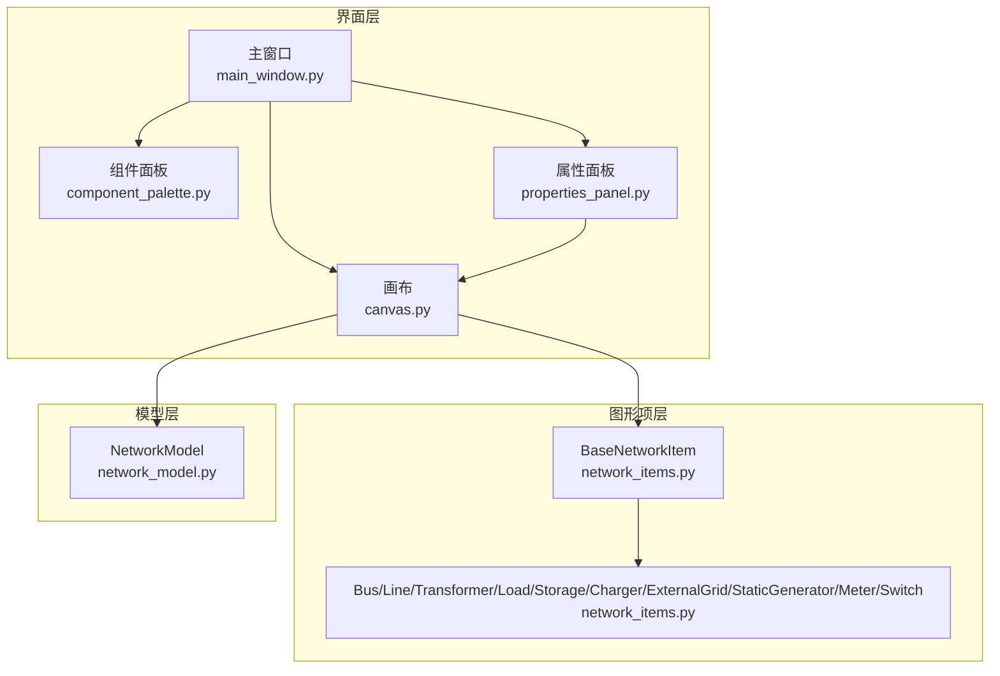
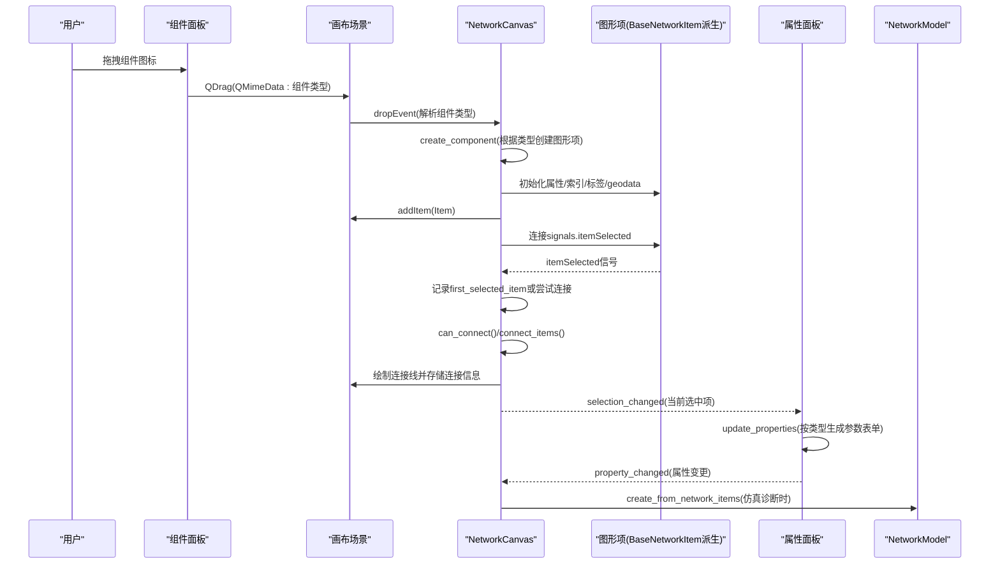
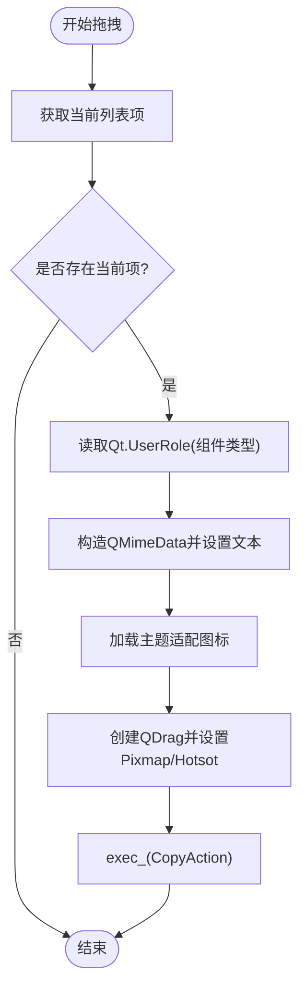
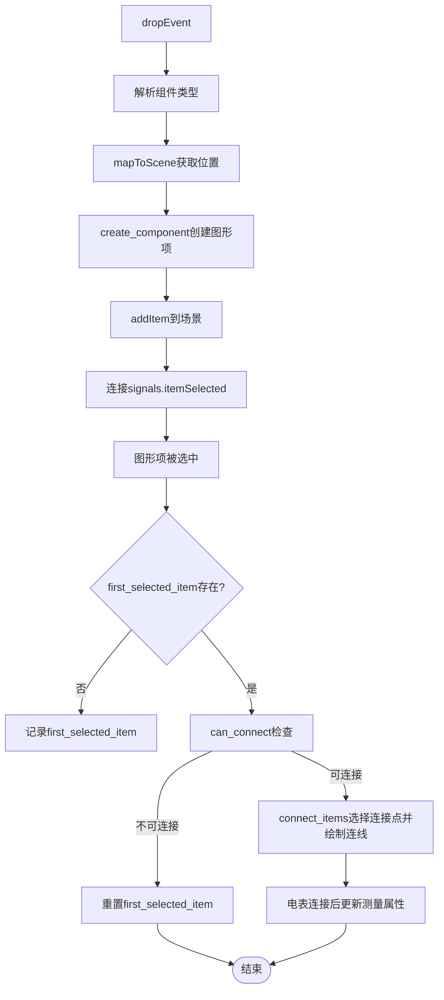
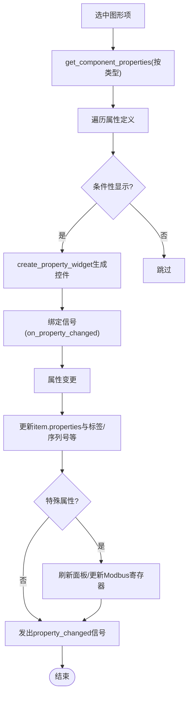
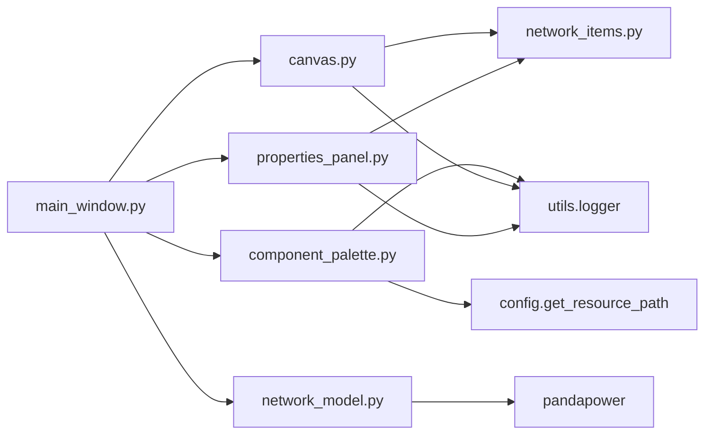

# 拓扑构建

<cite>
**本文引用的文件**
- [component_palette.py](file://src/components/component_palette.py)
- [properties_panel.py](file://src/components/properties_panel.py)
- [canvas.py](file://src/components/canvas.py)
- [network_items.py](file://src/components/network_items.py)
- [main_window.py](file://src/components/main_window.py)
- [network_model.py](file://src/models/network_model.py)
</cite>

## 目录
1. [简介](#简介)
2. [项目结构](#项目结构)
3. [核心组件](#核心组件)
4. [架构总览](#架构总览)
5. [详细组件分析](#详细组件分析)
6. [依赖关系分析](#依赖关系分析)
7. [性能考量](#性能考量)
8. [故障排查指南](#故障排查指南)
9. [结论](#结论)

## 简介
本文件围绕pp_tool的“拓扑构建”能力，系统梳理组件面板、属性面板与画布三者之间的协作机制，重点说明：
- 组件面板如何提供可拖拽的电网元件（母线、线路、变压器、光伏、负载、储能、充电桩、外部电网、电表、开关）。
- 属性面板如何根据选中元件类型动态显示与编辑其参数（如母线的电压等级、线路的长度与标准类型、负载的有功功率、储能的额定容量与最大储能容量等）。
- 画布如何处理拖拽事件，将元件从面板添加到画布，并管理元件间的连接与可视化。

## 项目结构
拓扑构建相关的核心文件组织如下：
- 组件面板：负责展示可拖拽的电网元件图标与名称，支持主题适配与拖拽行为。
- 画布：负责接收拖拽放置、创建图形项、维护连接关系、响应选择与交互。
- 属性面板：负责根据选中图形项的类型动态生成参数表单，监听属性变更并驱动后续流程。
- 网络项基类与具体图形项：定义组件的连接点、连接约束、旋转与更新逻辑。
- 主窗口：整合上述组件，建立信号链路，协调菜单与工具栏。
- 网络模型：将拓扑转换为pandapower网络模型，支撑仿真诊断与导出。

图表来源
- [main_window.py](file://src/components/main_window.py#L118-L180)
- [component_palette.py](file://src/components/component_palette.py#L16-L128)
- [properties_panel.py](file://src/components/properties_panel.py#L12-L118)
- [canvas.py](file://src/components/canvas.py#L16-L68)
- [network_items.py](file://src/components/network_items.py#L19-L120)
- [network_model.py](file://src/models/network_model.py#L1-L40)

章节来源
- [main_window.py](file://src/components/main_window.py#L118-L180)
- [component_palette.py](file://src/components/component_palette.py#L16-L128)
- [properties_panel.py](file://src/components/properties_panel.py#L12-L118)
- [canvas.py](file://src/components/canvas.py#L16-L68)
- [network_items.py](file://src/components/network_items.py#L19-L120)
- [network_model.py](file://src/models/network_model.py#L1-L40)

## 核心组件
- 组件面板（component_palette.py）
  - 提供QListWidget作为组件容器，支持IconMode显示图标与名称。
  - 通过拖拽开启QDrag，携带组件类型字符串（QMimeData），并在拖拽时显示主题适配的图标。
  - 支持深色/浅色主题下的SVG颜色适配，保证在不同主题下图标清晰可见。
- 画布（canvas.py）
  - 接收来自组件面板的拖拽放置事件，解析组件类型并创建对应图形项。
  - 维护全局network_items字典，按类型与索引管理组件实例。
  - 实现组件选择与连接逻辑：记录首次选中项，第二次选中尝试连接；根据组件类型与连接点选择策略创建连线。
  - 绘制网格背景，支持右键平移、滚轮缩放、右键菜单等交互。
- 属性面板（properties_panel.py）
  - 根据当前选中图形项的component_type动态生成参数表单。
  - 支持多种控件类型（文本、数值、布尔、下拉选择、只读等），并根据组件类型条件性显示/隐藏参数。
  - 监听属性变更，更新图形项属性与标签，必要时联动Modbus寄存器更新。
- 网络项基类与具体图形项（network_items.py）
  - BaseNetworkItem定义连接点、连接状态、旋转与更新逻辑，以及索引分配与回收。
  - 各具体图形项（BusItem、LineItem、TransformerItem、LoadItem、StorageItem、ChargerItem、ExternalGridItem、StaticGeneratorItem、MeterItem、SwitchItem）继承基类，定义自身属性、连接点与约束。
- 主窗口（main_window.py）
  - 组装组件面板、属性面板与画布，建立selection_changed与property_changed信号链路。
  - 提供菜单与快捷键，协调清空画布、缩放、诊断与仿真模式入口。
- 网络模型（network_model.py）
  - 将画布中的图形项转换为pandapower网络模型，按类型调用pandapower接口创建母线、线路、变压器、负载、静态电源、外部电网、储能、电表、开关等。
  - 提供运行潮流计算、查询结果、保存/加载网络模型的能力。

章节来源
- [component_palette.py](file://src/components/component_palette.py#L16-L168)
- [canvas.py](file://src/components/canvas.py#L132-L227)
- [properties_panel.py](file://src/components/properties_panel.py#L88-L231)
- [network_items.py](file://src/components/network_items.py#L19-L120)
- [main_window.py](file://src/components/main_window.py#L118-L180)
- [network_model.py](file://src/models/network_model.py#L408-L582)

## 架构总览
拓扑构建的关键流程：
- 组件面板拖拽：用户从组件面板拖拽图标到画布，组件面板构造QMimeData携带组件类型字符串，画布接收dropEvent后创建对应图形项。
- 画布创建：根据组件类型创建图形项，写入network_items字典，设置名称与geodata，加入场景并连接选中信号。
- 选择与连接：图形项被选中时发出signals.itemSelected，画布记录first_selected_item，第二次选中尝试连接；连接前进行类型兼容性与连接点可用性检查，成功后绘制连线并更新连接信息。
- 属性面板：画布selection_changed触发属性面板update_properties，按组件类型生成参数表单；属性变更通过property_changed信号回传主窗口，主窗口标记网络状态为无效并可触发诊断。

图表来源
- [component_palette.py](file://src/components/component_palette.py#L129-L168)
- [canvas.py](file://src/components/canvas.py#L142-L227)
- [network_items.py](file://src/components/network_items.py#L223-L258)
- [properties_panel.py](file://src/components/properties_panel.py#L88-L118)
- [network_model.py](file://src/models/network_model.py#L408-L582)

## 详细组件分析

### 组件面板（component_palette.py）
- UI初始化
  - 设置拖拽启用、图标模式、图标尺寸、间距与拖放指示。
  - 主题检测与SVG颜色适配：根据应用主题深浅切换SVG中的stroke/fill颜色，确保图标在不同主题下可见。
- 组件注册
  - 定义组件清单（名称、类型、图标文件），通过QListWidgetItem添加到面板。
  - 通过config.get_resource_path获取图标路径，若图标存在则创建主题适配的QIcon并设置到列表项。
- 拖拽实现
  - startDrag中获取当前项的Qt.UserRole（组件类型），构造QMimeData.setText(component_type)，创建QDrag并设置拖拽图标（主题适配）。
  - 执行drag.exec_(Qt.CopyAction)完成拖拽。

图表来源
- [component_palette.py](file://src/components/component_palette.py#L129-L168)

章节来源
- [component_palette.py](file://src/components/component_palette.py#L16-L128)
- [component_palette.py](file://src/components/component_palette.py#L129-L168)

### 画布（canvas.py）
- 拖拽放置与创建
  - dragEnterEvent/dragMoveEvent接受拖拽，dropEvent解析QMimeData文本为组件类型，mapToScene获取放置位置，调用create_component创建图形项。
  - create_component根据类型创建对应图形项，写入network_items字典，设置名称、geodata，加入场景并连接选中信号。
- 选择与连接
  - handle_item_selected记录first_selected_item，第二次选中尝试连接；can_connect综合“连接点可用性”“组件类型兼容性”“连接数量限制”判定。
  - _check_component_type_compatibility定义连接规则：母线可连任意非同类型组件；电表可连任意组件；开关一端为母线时另一端可连母线/线路/变压器；线路/变压器/负载/储能/充电站/外部电网/光伏需连母线或电表。
  - connect_items选择连接点（优先按属性匹配，其次最近点），创建QLine并存储连接信息；对电表连接自动更新测量类型、测量元件类型与侧别。
- 交互与视图
  - 支持右键拖动平移、滚轮缩放、右键菜单（旋转、断开连接、删除、清空画布、缩放等）。
  - 绘制网格背景，根据主题调整网格与连接线颜色。

图表来源
- [canvas.py](file://src/components/canvas.py#L132-L227)
- [canvas.py](file://src/components/canvas.py#L229-L496)
- [canvas.py](file://src/components/canvas.py#L497-L595)

章节来源
- [canvas.py](file://src/components/canvas.py#L132-L227)
- [canvas.py](file://src/components/canvas.py#L229-L496)
- [canvas.py](file://src/components/canvas.py#L497-L595)

### 属性面板（properties_panel.py）
- 初始化与布局
  - 初始化垂直布局，设置最小宽度，标题与分隔线，滚动区域承载属性容器。
  - show_no_selection显示“请选择一个组件以查看其属性”的占位提示。
- 动态参数表单
  - update_properties根据item.component_type获取组件属性定义（get_component_properties），遍历属性项生成控件。
  - 条件性显示：如线路/变压器的use_standard_type控制std_type与自定义参数的显隐；负载/光伏/充电桩的use_power_factor控制直接功率与功率因数模式参数的显隐。
  - 控件类型：float/int/bool/choice/read-only/text，分别映射到QDoubleSpinBox/QSpinBox/QCheckBox/QComboBox/QLineEdit/QLabel。
  - 特殊处理：bus连接信息以只读显示；电表连接后自动更新element_type、element、side与meas_type。
- 属性变更与联动
  - on_property_changed监听控件信号，更新item.properties与相关字段（如name同步到标签、sn同步到设备序列号等）。
  - 对特定属性（如sn_mva、use_standard_type、use_power_factor、protocol）触发面板刷新或Modbus寄存器更新。
  - 对IP/端口冲突进行校验，若冲突则回滚并提示。

图表来源
- [properties_panel.py](file://src/components/properties_panel.py#L88-L231)
- [properties_panel.py](file://src/components/properties_panel.py#L250-L445)
- [properties_panel.py](file://src/components/properties_panel.py#L511-L790)

章节来源
- [properties_panel.py](file://src/components/properties_panel.py#L88-L231)
- [properties_panel.py](file://src/components/properties_panel.py#L250-L445)
- [properties_panel.py](file://src/components/properties_panel.py#L511-L790)

### 网络项基类与具体图形项（network_items.py）
- BaseNetworkItem
  - 索引分配与回收：_get_next_index优先使用回收池索引，否则自增计数器；删除组件时将索引加入回收池。
  - 连接点与连接状态：connection_points、connection_point_states记录每个连接点的占用；get_available_connection_points根据连接点可用性过滤。
  - 连接约束：max_connections/min_connections/current_connections控制连接数量；add_connection/remove_connection维护连接列表与连接点占用。
  - bus参数更新：update_bus_parameter根据连接点索引与组件类型（线路/变压器/开关）更新from_bus/to_bus/hv_bus/lv_bus/bus/element/et等。
  - 旋转与更新：rotate_component更新rotation_angle并重算连接点；itemChange中处理位置变化与标签同步。
- 具体图形项
  - 各图形项在__init__中设置component_type、component_name、properties、连接约束与SVG图标加载。
  - 例如：StorageItem设置默认属性（sn_mva、p_mw、max_e_mwh、ip/port、协议等），并限制连接数为2（可连接母线与电表）。

章节来源
- [network_items.py](file://src/components/network_items.py#L87-L120)
- [network_items.py](file://src/components/network_items.py#L192-L258)
- [network_items.py](file://src/components/network_items.py#L327-L468)
- [network_items.py](file://src/components/network_items.py#L624-L673)
- [network_items.py](file://src/components/network_items.py#L764-L800)

### 主窗口（main_window.py）
- 组件装配
  - 创建QDockWidget停靠组件面板与属性面板，设置最小宽度与允许停靠区域。
  - 连接画布selection_changed到属性面板update_properties，连接属性面板property_changed到on_property_changed。
- 菜单与快捷键
  - 文件：新建、打开、保存、退出。
  - 编辑：断开连接、删除所选、全选。
  - 视图：显示/隐藏组件面板与属性面板，缩放（放大/缩小/适应视图）。
  - 仿真：诊断网络、进入仿真模式（需网络诊断通过）。
- 事件处理
  - on_property_changed：记录网络状态为无效，便于后续诊断。
  - diagnostic_network：创建NetworkModel并调用create_from_network_items，启动诊断线程，显示进度与结果。

章节来源
- [main_window.py](file://src/components/main_window.py#L118-L180)
- [main_window.py](file://src/components/main_window.py#L181-L274)
- [main_window.py](file://src/components/main_window.py#L299-L344)
- [main_window.py](file://src/components/main_window.py#L345-L476)

### 网络模型（network_model.py）
- 从图形项创建pandapower模型
  - create_from_network_items：先创建所有母线，再创建连接到母线的组件（负载、静态电源、外部电网、储能、充电站、开关），最后创建电表。
  - create_bus/create_line/create_transformer/create_load/create_storage/create_measurement/create_charger/create_external_grid/create_static_generator/create_switch分别调用pandapower接口。
- 诊断与仿真
  - run_power_flow运行潮流计算；保存/加载网络模型；查询母线电压、线路/变压器/负载/发电机功率。

章节来源
- [network_model.py](file://src/models/network_model.py#L408-L582)
- [network_model.py](file://src/models/network_model.py#L583-L710)

## 依赖关系分析
- 组件面板依赖
  - 通过config.get_resource_path加载SVG图标，依赖资源路径配置。
  - 依赖utils.logger记录日志。
- 画布依赖
  - 依赖components.network_items中的各类图形项类（BusItem、LineItem、TransformerItem、LoadItem、StorageItem、ChargerItem、ExternalGridItem、StaticGeneratorItem、MeterItem、SwitchItem）。
  - 依赖utils.logger记录日志。
- 属性面板依赖
  - 依赖components.network_items的图形项属性结构，动态生成参数表单。
  - 依赖utils.logger记录日志。
- 主窗口依赖
  - 依赖components.canvas、components.component_palette、components.properties_panel、models.network_model。
- 网络模型依赖
  - 依赖pandapower库，按组件类型调用相应创建接口。

图表来源
- [component_palette.py](file://src/components/component_palette.py#L112-L127)
- [canvas.py](file://src/components/canvas.py#L12-L14)
- [properties_panel.py](file://src/components/properties_panel.py#L1-L11)
- [main_window.py](file://src/components/main_window.py#L13-L26)
- [network_model.py](file://src/models/network_model.py#L1-L10)

章节来源
- [component_palette.py](file://src/components/component_palette.py#L112-L127)
- [canvas.py](file://src/components/canvas.py#L12-L14)
- [properties_panel.py](file://src/components/properties_panel.py#L1-L11)
- [main_window.py](file://src/components/main_window.py#L13-L26)
- [network_model.py](file://src/models/network_model.py#L1-L10)

## 性能考量
- 绘制与更新
  - 画布启用抗锯齿与全视口更新，网格背景绘制采用固定步长，避免频繁重绘。
  - 图形项移动时仅更新与之相关的连接线，减少不必要的重绘。
- 拖拽与放置
  - 组件面板拖拽仅传递组件类型字符串，创建图形项发生在画布端，降低跨组件的数据传输成本。
- 属性面板
  - 条件性显示参数减少控件数量，提高渲染效率；对IP/端口冲突进行即时校验，避免后续复杂处理。
- 网络模型
  - create_from_network_items按类型分阶段创建，先母线后其他组件，最后电表，避免依赖未创建的设备。

[本节为通用指导，无需列出具体文件来源]

## 故障排查指南
- 组件面板图标缺失或主题颜色异常
  - 检查config.get_resource_path返回的图标路径是否存在；确认SVG内容中颜色是否被正确替换。
  - 参考路径：[component_palette.py](file://src/components/component_palette.py#L112-L127)
- 画布无法接收拖拽放置
  - 确认setAcceptDrops(True)与dragEnterEvent/dragMoveEvent/dropEvent实现正常。
  - 参考路径：[canvas.py](file://src/components/canvas.py#L53-L67)
- 连接失败或连接点不可用
  - 检查can_connect与_check_component_type_compatibility规则；确认连接点可用性与连接数量限制。
  - 参考路径：[canvas.py](file://src/components/canvas.py#L341-L399)
- 属性面板不显示某些参数
  - 检查get_component_properties中条件性显示逻辑（如use_standard_type/use_power_factor）是否与当前组件属性一致。
  - 参考路径：[properties_panel.py](file://src/components/properties_panel.py#L118-L231)
- IP/端口冲突
  - on_property_changed中对IP/端口唯一性进行校验，冲突时回滚并提示。
  - 参考路径：[properties_panel.py](file://src/components/properties_panel.py#L336-L382)
- 电表连接后测量属性未更新
  - 检查connect_items中_update_meter_properties_on_connection逻辑与_determine_measurement_side。
  - 参考路径：[canvas.py](file://src/components/canvas.py#L497-L595)

章节来源
- [component_palette.py](file://src/components/component_palette.py#L112-L127)
- [canvas.py](file://src/components/canvas.py#L53-L67)
- [canvas.py](file://src/components/canvas.py#L341-L399)
- [properties_panel.py](file://src/components/properties_panel.py#L118-L231)
- [properties_panel.py](file://src/components/properties_panel.py#L336-L382)
- [canvas.py](file://src/components/canvas.py#L497-L595)

## 结论
pp_tool的拓扑构建以“组件面板 + 画布 + 属性面板”为核心，形成完整的拖拽建模与参数编辑闭环。组件面板提供主题适配的可拖拽图标；画布负责放置与连接，严格遵循连接规则与连接点约束；属性面板按类型动态生成参数表单并实时联动。该设计既保证了易用性，又通过严格的连接规则与条件性参数控制提升了拓扑构建的准确性与可维护性。结合NetworkModel，可进一步将拓扑转换为pandapower网络模型，支撑仿真诊断与工程应用。

[本节为总结性内容，无需列出具体文件来源]