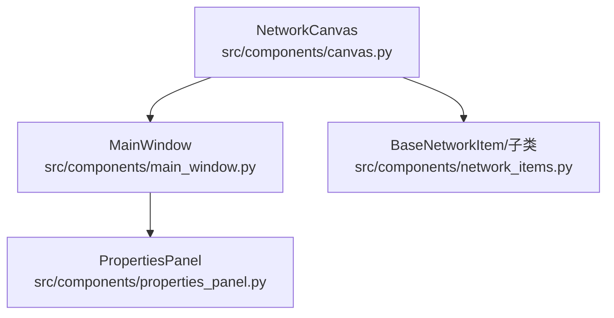
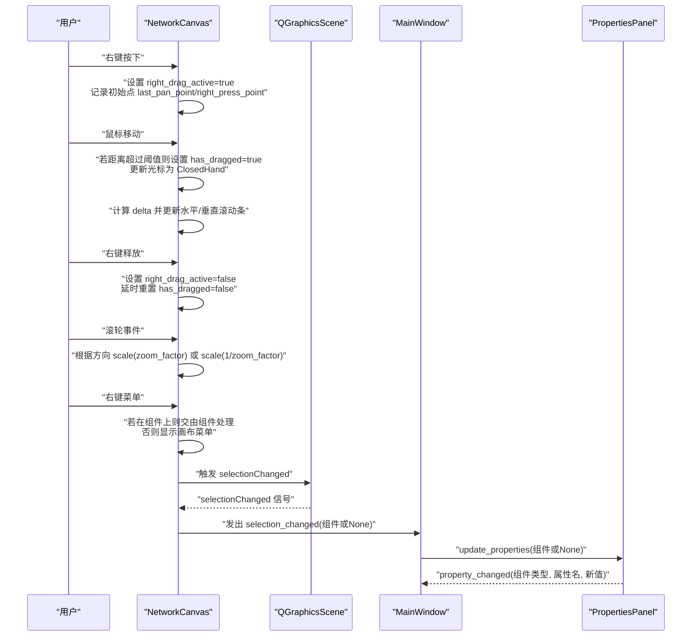
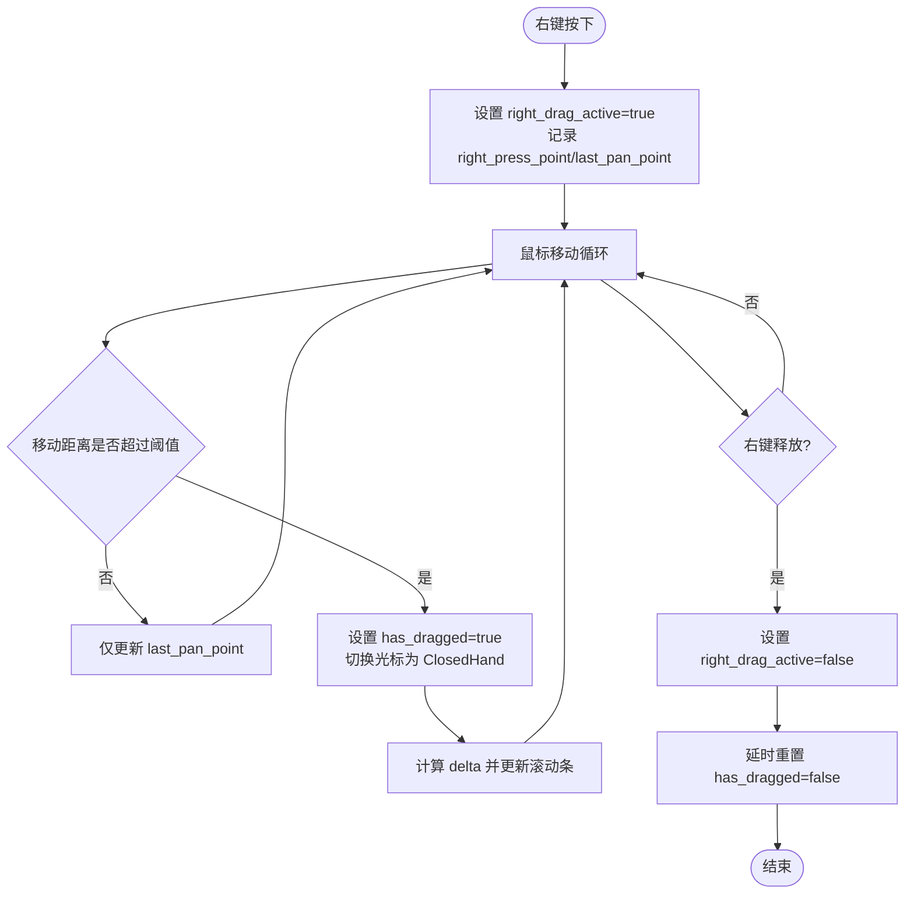
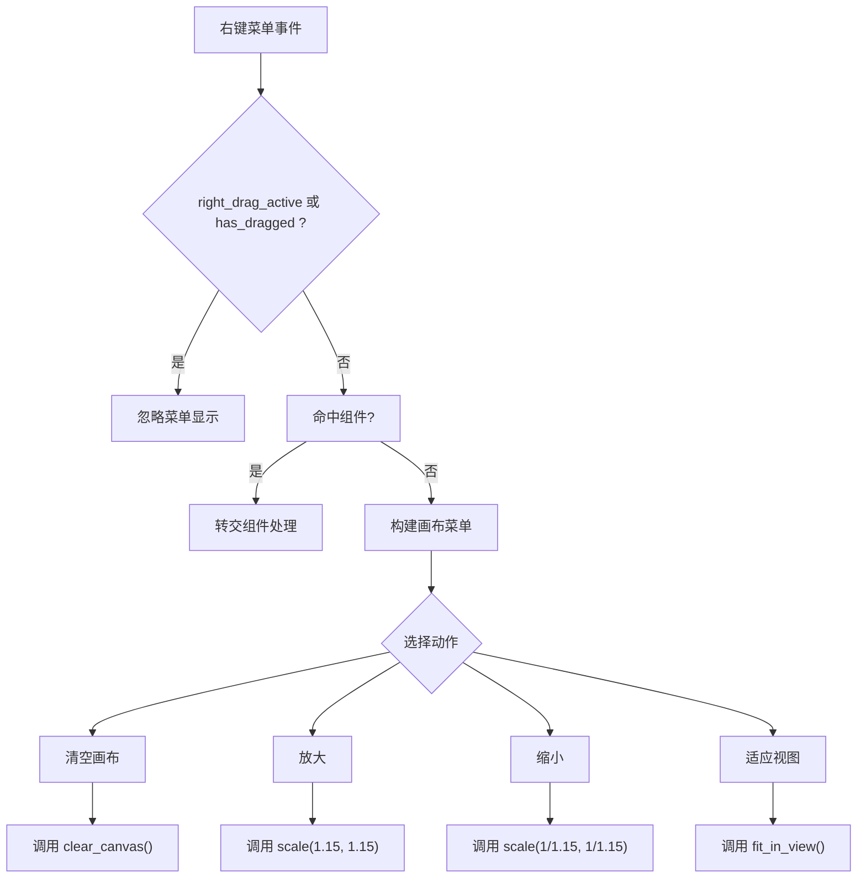
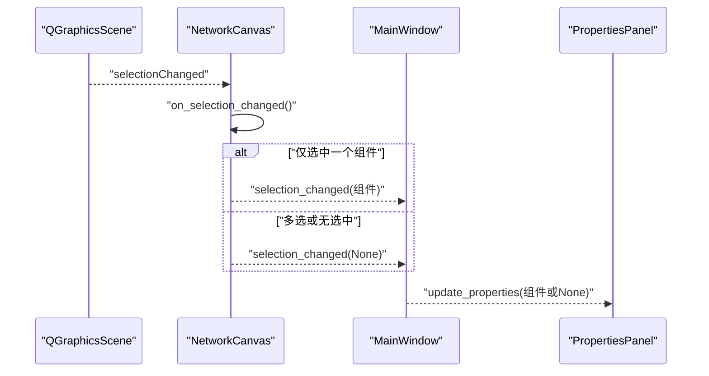
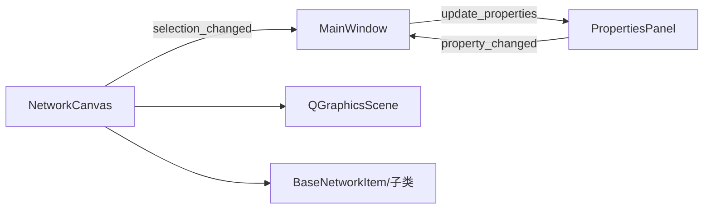

# 交互与视图控制

<cite>
**本文引用的文件**
- [src/components/canvas.py](file://src/components/canvas.py)
- [src/components/main_window.py](file://src/components/main_window.py)
- [src/components/properties_panel.py](file://src/components/properties_panel.py)
- [src/components/network_items.py](file://src/components/network_items.py)
</cite>

## 目录
1. [简介](#简介)
2. [项目结构](#项目结构)
3. [核心组件](#核心组件)
4. [架构总览](#架构总览)
5. [详细组件分析](#详细组件分析)
6. [依赖关系分析](#依赖关系分析)
7. [性能考量](#性能考量)
8. [故障排查指南](#故障排查指南)
9. [结论](#结论)

## 简介
本章节聚焦画布的用户交互功能，系统性说明以下行为：
- 右键拖动画布的平移流程，包括 right_drag_active 与 has_dragged 状态标志的作用
- 鼠标滚轮缩放视图的实现
- 右键菜单在“选中组件”与“空白区域”的差异化处理，以及“清空画布”“放大/缩小”等操作
- selection_changed 信号如何驱动属性面板更新

## 项目结构
画布交互涉及三个关键模块：
- 画布模块：负责鼠标事件、滚轮缩放、右键菜单、选择变化通知
- 主窗口模块：负责连接画布与属性面板的信号链路，提供菜单栏缩放入口
- 属性面板模块：响应 selection_changed 信号，动态刷新组件属性显示

图表来源
- [src/components/canvas.py](file://src/components/canvas.py#L1-L1200)
- [src/components/main_window.py](file://src/components/main_window.py#L1-L550)
- [src/components/properties_panel.py](file://src/components/properties_panel.py#L1-L800)
- [src/components/network_items.py](file://src/components/network_items.py#L1-L200)

章节来源
- [src/components/canvas.py](file://src/components/canvas.py#L1-L1200)
- [src/components/main_window.py](file://src/components/main_window.py#L1-L550)
- [src/components/properties_panel.py](file://src/components/properties_panel.py#L1-L800)
- [src/components/network_items.py](file://src/components/network_items.py#L1-L200)

## 核心组件
- NetworkCanvas：继承自 QGraphicsView，承载鼠标事件、滚轮缩放、右键菜单、选择变化通知等交互逻辑
- MainWindow：持有画布实例，建立 selection_changed 与属性面板 update_properties 的连接
- PropertiesPanel：接收组件对象，动态构建属性控件，支持属性变更信号回传
- BaseNetworkItem 及其子类：组件基类，提供连接点、旋转、标签、SVG 图标等通用能力

章节来源
- [src/components/canvas.py](file://src/components/canvas.py#L1-L1200)
- [src/components/main_window.py](file://src/components/main_window.py#L1-L550)
- [src/components/properties_panel.py](file://src/components/properties_panel.py#L1-L800)
- [src/components/network_items.py](file://src/components/network_items.py#L1-L200)

## 架构总览
画布交互的关键信号与事件流如下：

图表来源
- [src/components/canvas.py](file://src/components/canvas.py#L646-L1181)
- [src/components/main_window.py](file://src/components/main_window.py#L160-L180)
- [src/components/properties_panel.py](file://src/components/properties_panel.py#L1-L800)

## 详细组件分析

### 右键拖动画布平移：mousePressEvent/mouseMoveEvent/mouseReleaseEvent
- 右键按下
  - 记录初始鼠标位置与视图滚动条当前位置
  - 设置 right_drag_active 标志，准备进入拖动画布阶段
  - 重置 has_dragged 标志，等待首次显著移动
- 鼠标移动
  - 计算与初始按下的曼哈顿距离，超过阈值（像素级）才认为开始拖动
  - 首次满足阈值时，设置 has_dragged=true，并切换光标为 ClosedHand
  - 计算本次移动的 delta，反向更新水平/垂直滚动条，从而实现“拖动画布”
  - 若尚未达到阈值，仅更新 last_pan_point
- 右键释放
  - 结束拖动，设置 right_drag_active=false
  - 使用定时器延时将 has_dragged 重置为 false，确保 contextMenuEvent 能正确识别“拖动后释放”的状态，避免误触发菜单

图表来源
- [src/components/canvas.py](file://src/components/canvas.py#L646-L714)

章节来源
- [src/components/canvas.py](file://src/components/canvas.py#L646-L714)

### 鼠标滚轮缩放：wheelEvent
- 根据滚轮方向判断放大或缩小
- 使用 scale 按比例缩放视图，保持缩放锚点为鼠标位置（由 init_ui 设置）

章节来源
- [src/components/canvas.py](file://src/components/canvas.py#L715-L726)

### 右键菜单：contextMenuEvent
- 若正在拖动或刚完成拖动（has_dragged 为真），则忽略菜单显示
- 若点击位置命中某个组件，则将事件转交给该组件自行处理
- 否则显示画布级菜单，包含：
  - 选中项目相关：旋转（左右各90度）、断开所选连接、删除所选
  - 画布操作：清空画布
  - 视图操作：放大、缩小、适应视图
- 菜单动作与画布方法的对应关系：
  - “清空画布” -> 调用 clear_canvas
  - “放大/缩小” -> 调用 scale
  - “适应视图” -> 调用 fit_in_view

图表来源
- [src/components/canvas.py](file://src/components/canvas.py#L727-L803)

章节来源
- [src/components/canvas.py](file://src/components/canvas.py#L727-L803)

### 选择变化通知：selection_changed 信号
- 画布内部场景 selectionChanged 信号触发 on_selection_changed
- on_selection_changed 根据当前选中数量：
  - 仅选中一个组件时，发出 selection_changed(组件对象)
  - 否则发出 selection_changed(None)
- MainWindow 将 selection_changed 连接到 PropertiesPanel.update_properties
- PropertiesPanel 接收组件对象后，动态构建属性控件并显示；若无选中则显示提示

图表来源
- [src/components/canvas.py](file://src/components/canvas.py#L1172-L1181)
- [src/components/main_window.py](file://src/components/main_window.py#L160-L180)
- [src/components/properties_panel.py](file://src/components/properties_panel.py#L88-L120)

章节来源
- [src/components/canvas.py](file://src/components/canvas.py#L1172-L1181)
- [src/components/main_window.py](file://src/components/main_window.py#L160-L180)
- [src/components/properties_panel.py](file://src/components/properties_panel.py#L88-L120)

### 组件基类与连接点（与交互的关系）
- BaseNetworkItem 提供：
  - 连接点集合 connection_points 与占用状态 connection_point_states
  - 旋转能力 rotate_component（画布键盘事件与菜单均调用）
  - 标签 label 与 SVG 图标渲染
- 画布在连接两个组件时，会依据连接点索引与组件类型选择最优连接点，从而保证连线美观与语义正确

章节来源
- [src/components/network_items.py](file://src/components/network_items.py#L1-L200)
- [src/components/canvas.py](file://src/components/canvas.py#L361-L405)

## 依赖关系分析
- 画布依赖场景（QGraphicsScene）进行选择与事件分发
- 画布与主窗口通过信号连接，主窗口再连接属性面板
- 属性面板通过 property_changed 信号回传到主窗口，用于网络状态标记与后续流程

图表来源
- [src/components/canvas.py](file://src/components/canvas.py#L1-L1200)
- [src/components/main_window.py](file://src/components/main_window.py#L160-L180)
- [src/components/properties_panel.py](file://src/components/properties_panel.py#L1-L800)
- [src/components/network_items.py](file://src/components/network_items.py#L1-L200)

章节来源
- [src/components/canvas.py](file://src/components/canvas.py#L1-L1200)
- [src/components/main_window.py](file://src/components/main_window.py#L160-L180)
- [src/components/properties_panel.py](file://src/components/properties_panel.py#L1-L800)
- [src/components/network_items.py](file://src/components/network_items.py#L1-L200)

## 性能考量
- 右键拖动采用滚动条增量更新，避免频繁重绘整个场景，降低 CPU 占用
- 画布缩放使用 scale，保持锚点为鼠标位置，减少额外变换矩阵计算
- 属性面板按需重建控件，避免不必要的 UI 更新
- 画布在清空时重置组件计数器，避免索引膨胀导致后续查找成本上升

## 故障排查指南
- 右键拖动无效
  - 检查是否处于拖动或刚释放的状态（has_dragged 为真时不会显示菜单）
  - 确认鼠标移动距离是否超过阈值，否则不会进入平移模式
- 滚轮缩放无反应
  - 确认 wheelEvent 是否被调用（可通过日志或断点确认）
  - 检查缩放锚点设置是否正确（init_ui 中已设置 AnchorUnderMouse）
- 右键菜单不出现
  - 若点击在组件上，确认组件是否实现了 contextMenuEvent
  - 若点击在空白区域，确认画布菜单构建逻辑未被提前返回
- 属性面板不更新
  - 确认 MainWindow 是否已将 selection_changed 连接到 PropertiesPanel.update_properties
  - 确认画布 on_selection_changed 的分支逻辑（仅单选时发出组件对象）

章节来源
- [src/components/canvas.py](file://src/components/canvas.py#L646-L803)
- [src/components/canvas.py](file://src/components/canvas.py#L1172-L1181)
- [src/components/main_window.py](file://src/components/main_window.py#L160-L180)
- [src/components/properties_panel.py](file://src/components/properties_panel.py#L88-L120)

## 结论
本节系统梳理了画布的交互与视图控制机制，重点在于：
- 右键拖动通过状态标志 right_drag_active 与 has_dragged 精准控制拖动生命周期
- 滚轮缩放采用 scale 实现，配合锚点保持用户体验一致
- 右键菜单在“选中组件”与“空白区域”分别走不同路径，保障操作一致性
- selection_changed 信号贯穿画布、主窗口与属性面板，形成闭环的属性更新链路