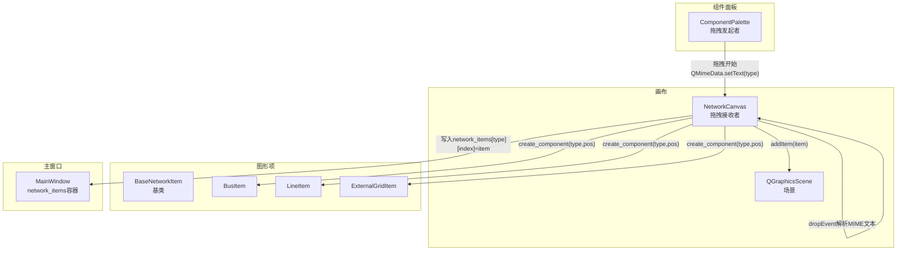
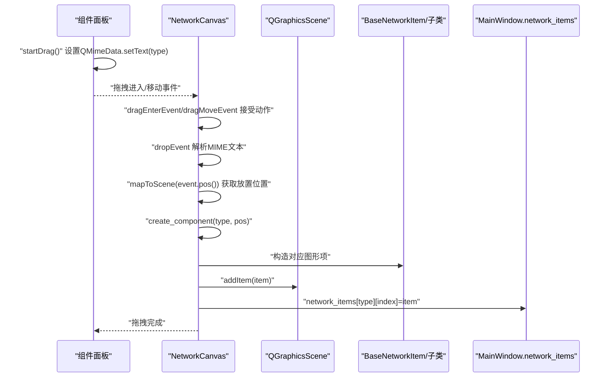
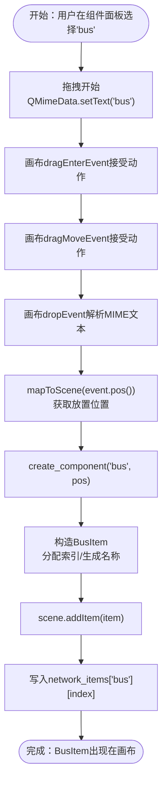

# 拖拽与放置

<cite>
**本文引用的文件**
- [canvas.py](file://src/components/canvas.py)
- [network_items.py](file://src/components/network_items.py)
- [component_palette.py](file://src/components/component_palette.py)
- [main_window.py](file://src/components/main_window.py)
</cite>

## 目录
1. [简介](#简介)
2. [项目结构](#项目结构)
3. [核心组件](#核心组件)
4. [架构总览](#架构总览)
5. [详细组件分析](#详细组件分析)
6. [依赖分析](#依赖分析)
7. [性能考虑](#性能考虑)
8. [故障排查指南](#故障排查指南)
9. [结论](#结论)

## 简介
本章节聚焦“画布的拖拽与放置”功能，系统阐述从组件面板到画布的组件拖放流程，重点解析 NetworkCanvas 的 dragEnterEvent、dragMoveEvent、dropEvent 三类事件处理方法如何协同工作，以及 dropEvent 如何通过 event.mimeData().text() 获取被拖拽的组件类型，并调用 create_component 方法在指定位置实例化对应的 QGraphicsItem 子类（如 BusItem、LineItem）。同时，深入说明 create_component 中对 'external_grid' 组件的单例创建限制逻辑，以及组件索引（component_index）与自动命名机制的工作原理。最后，提供一个用户从面板拖拽 'bus' 组件到画布时的完整后台事件处理流程示例。

## 项目结构
本功能涉及四个关键文件：
- 组件面板：负责发起拖拽，携带组件类型信息
- 画布：负责接收拖拽，解析 MIME 数据，创建图形项
- 图形项基类与子类：负责具体的绘制、连接点、属性与索引管理
- 主窗口：持有全局网络项容器，供画布写入



图表来源
- [component_palette.py](file://src/components/component_palette.py#L129-L168)
- [canvas.py](file://src/components/canvas.py#L132-L155)
- [network_items.py](file://src/components/network_items.py#L909-L939)
- [network_items.py](file://src/components/network_items.py#L944-L993)
- [network_items.py](file://src/components/network_items.py#L1124-L1160)
- [main_window.py](file://src/components/main_window.py#L96-L116)

章节来源
- [component_palette.py](file://src/components/component_palette.py#L129-L168)
- [canvas.py](file://src/components/canvas.py#L132-L227)
- [network_items.py](file://src/components/network_items.py#L909-L939)
- [network_items.py](file://src/components/network_items.py#L944-L993)
- [network_items.py](file://src/components/network_items.py#L1124-L1160)
- [main_window.py](file://src/components/main_window.py#L96-L116)

## 核心组件
- 组件面板（ComponentPalette）
  - 启用拖拽，将组件类型作为 MIME 文本传递
  - 通过 QMimeData.setText(component_type) 提供拖拽数据
- 画布（NetworkCanvas）
  - setAcceptDrops(true)，启用拖拽接收
  - 实现 dragEnterEvent/dragMoveEvent/dropEvent
  - 在 dropEvent 中解析 MIME 文本，获取组件类型
  - 调用 create_component(type, pos) 实例化图形项
- 图形项基类与子类（BaseNetworkItem、BusItem、LineItem、ExternalGridItem）
  - BaseNetworkItem 负责索引分配、连接点、属性与标签
  - 各子类定义具体属性、连接点与图标
- 主窗口（MainWindow）
  - 维护全局 network_items 字典，按类型分组存储
  - 画布在创建成功后写入该容器

章节来源
- [component_palette.py](file://src/components/component_palette.py#L129-L168)
- [canvas.py](file://src/components/canvas.py#L132-L227)
- [network_items.py](file://src/components/network_items.py#L24-L110)
- [network_items.py](file://src/components/network_items.py#L909-L939)
- [network_items.py](file://src/components/network_items.py#L944-L993)
- [network_items.py](file://src/components/network_items.py#L1124-L1160)
- [main_window.py](file://src/components/main_window.py#L96-L116)

## 架构总览
下图展示了从组件面板到画布再到图形项的完整调用链与数据流。



图表来源
- [component_palette.py](file://src/components/component_palette.py#L129-L168)
- [canvas.py](file://src/components/canvas.py#L132-L227)
- [main_window.py](file://src/components/main_window.py#L96-L116)

## 详细组件分析

### 事件处理方法：dragEnterEvent、dragMoveEvent、dropEvent
- dragEnterEvent
  - 作用：当拖拽进入画布时，若 MIME 数据包含文本，则接受提议动作
  - 关键点：仅当 event.mimeData().hasText() 为真时才接受
- dragMoveEvent
  - 作用：拖拽在画布内移动时，同样接受提议动作
  - 关键点：保证拖拽过程中的视觉反馈与交互一致性
- dropEvent
  - 作用：放置时解析 MIME 文本，获取组件类型；转换鼠标位置到场景坐标；调用 create_component 创建图形项；接受动作
  - 关键点：mapToScene(event.pos()) 将屏幕坐标转换为场景坐标，确保放置位置准确

章节来源
- [canvas.py](file://src/components/canvas.py#L132-L155)

### create_component：组件创建与索引/命名机制
- 单例限制（'external_grid'）
  - 若目标类型为 'external_grid'，会在场景中扫描已存在的相同类型组件
  - 若已存在，则弹出警告并阻止创建第二个外部电网
- 实例化与写入
  - 根据组件类型构造对应图形项（BusItem、LineItem、ExternalGridItem 等）
  - 将 item 写入 MainWindow.network_items[type][item.component_index]，建立全局索引
- 自动命名与标签更新
  - 生成与系统索引同步的名称（例如 "Bus X"、"Line X"、"External Grid X"）
  - 更新 item.component_name、item.properties['name'] 以及标签 QGraphicsTextItem
- 地理位置与属性
  - 将 item.properties['geodata'] 设为放置位置 (x, y)
  - 将 item 添加到场景，连接 itemSelected 信号，便于后续选择与连接

章节来源
- [canvas.py](file://src/components/canvas.py#L156-L227)
- [main_window.py](file://src/components/main_window.py#L96-L116)

### BaseNetworkItem：索引分配与连接点管理
- 索引分配
  - 类级计数器与回收池：_component_counters、_component_recycled_indices
  - _get_next_index() 优先使用回收池中的最小索引，否则自增计数器
  - 删除组件时将索引加入回收池，保持索引连续性
- 连接点与约束
  - connection_points：相对组件中心的连接点集合
  - max_connections/min_connections：连接数量约束
  - add_connection/remove_connection/update_bus_parameter：维护连接状态与属性同步
- 标签与主题
  - label：显示组件名称
  - update_label_color()/reload_svg_for_theme()：根据主题切换颜色与图标

章节来源
- [network_items.py](file://src/components/network_items.py#L24-L110)
- [network_items.py](file://src/components/network_items.py#L327-L467)
- [network_items.py](file://src/components/network_items.py#L550-L631)

### BusItem、LineItem、ExternalGridItem：类型化图形项
- BusItem
  - 组件类型："bus"
  - 连接点：中心点（可连接多个）
  - 属性：包含电压等级、地理坐标、名称等
- LineItem
  - 组件类型："line"
  - 连接点：上下两端点
  - 属性：线路长度、标准类型、电阻/电抗/电容参数、起止母线索引等
- ExternalGridItem
  - 组件类型："external_grid"
  - 连接点：下方连接点
  - 属性：电压幅值/角度、短路容量、R/X比、连接母线等
  - 与 create_component 的单例限制配合，确保系统中仅存在一个外部电网

章节来源
- [network_items.py](file://src/components/network_items.py#L909-L939)
- [network_items.py](file://src/components/network_items.py#L944-L993)
- [network_items.py](file://src/components/network_items.py#L1124-L1160)

### 用户从面板拖拽 'bus' 组件到画布的完整流程
- 步骤1：组件面板 ComponentPalette.startDrag()
  - 读取当前项的 Qt.UserRole（即组件类型字符串，如 "bus"）
  - 创建 QMimeData 并 setText("bus")
  - 设置拖拽图标，执行 drag.exec_()
- 步骤2：画布 NetworkCanvas 接收拖拽
  - dragEnterEvent：acceptProposedAction()
  - dragMoveEvent：acceptProposedAction()
  - dropEvent：
    - 解析 MIME 文本：component_type = event.mimeData().text() → "bus"
    - 转换位置：pos = mapToScene(event.pos())
    - 调用 create_component("bus", pos)
- 步骤3：create_component 创建 BusItem
  - 分配索引：BusItem.__init__ 中调用 _get_next_index()
  - 自动生成名称：component_name = f"Bus {index}"
  - 更新属性：properties['name']、properties['geodata']
  - 添加到场景：scene.addItem(item)
  - 写入全局容器：network_items["bus"][index] = item
- 步骤4：后续交互
  - itemSelected 信号触发，画布 handle_item_selected 可进行连接逻辑
  - 标签显示与属性面板联动更新



图表来源
- [component_palette.py](file://src/components/component_palette.py#L129-L168)
- [canvas.py](file://src/components/canvas.py#L132-L227)
- [network_items.py](file://src/components/network_items.py#L909-L939)
- [main_window.py](file://src/components/main_window.py#L96-L116)

## 依赖分析
- 组件耦合
  - ComponentPalette 与 NetworkCanvas 通过 QMimeData 文本耦合，解耦了类型枚举与 UI
  - NetworkCanvas 与 BaseNetworkItem/子类通过工厂式 create_component 耦合，新增类型只需扩展子类与分支
  - MainWindow.network_items 作为全局容器，被 NetworkCanvas 写入，形成弱耦合的数据共享
- 外部依赖
  - PySide6 的拖拽框架（QDrag/QMimeData/QGraphicsView）
  - 主题与资源路径（config.get_resource_path）

```mermaid
graph LR
CP["ComponentPalette"] --> |QMimeData.setText(type)| NC["NetworkCanvas"]
NC --> |create_component(type,pos)| BNI["BaseNetworkItem/子类"]
NC --> |addItem(item)| SC["QGraphicsScene"]
NC --> |写入| NW["MainWindow.network_items"]
```

图表来源
- [component_palette.py](file://src/components/component_palette.py#L129-L168)
- [canvas.py](file://src/components/canvas.py#L156-L227)
- [main_window.py](file://src/components/main_window.py#L96-L116)

章节来源
- [component_palette.py](file://src/components/component_palette.py#L129-L168)
- [canvas.py](file://src/components/canvas.py#L156-L227)
- [main_window.py](file://src/components/main_window.py#L96-L116)

## 性能考虑
- 拖拽事件处理
  - 仅在 hasText() 时接受动作，避免不必要的处理
  - dropEvent 中仅解析 MIME 文本与位置，创建图形项成本较低
- 场景与标签
  - 标签 QGraphicsTextItem 与图形项分离，减少重绘范围
  - 画布网格绘制在初始化时完成，避免频繁重绘
- 连接点与约束
  - BaseNetworkItem 的连接点与状态管理采用字典，查询与更新效率高
  - 连接数量与类型约束在 can_connect/_check_component_type_compatibility 中集中处理，降低重复计算

## 故障排查指南
- 无法放置组件
  - 检查画布是否 setAcceptDrops(true)（已在初始化中设置）
  - 确认 dropEvent 中 event.mimeData().hasText() 为真
- 'external_grid' 无法创建第二个
  - create_component 对 'external_grid' 有单例限制，若场景中已有则阻止创建
- 名称与索引不一致
  - create_component 会将 item.component_name 与 properties['name'] 同步为 "Type index"
  - 若标签未更新，检查标签设置与 scene.update() 是否触发
- 连接异常
  - can_connect/_check_component_type_compatibility 会拒绝不兼容或超限连接
  - 检查连接点可用性与连接数量上限

章节来源
- [canvas.py](file://src/components/canvas.py#L156-L227)
- [canvas.py](file://src/components/canvas.py#L276-L340)
- [network_items.py](file://src/components/network_items.py#L327-L467)

## 结论
本功能通过组件面板与画布之间的 MIME 文本传递，实现了从组件面板到画布的无缝拖放体验。NetworkCanvas 的 dragEnterEvent/dragMoveEvent/dropEvent 三者协同，确保拖拽过程的流畅与可靠；dropEvent 通过 event.mimeData().text() 获取组件类型，并委托 create_component 在指定位置创建对应图形项。create_component 在实例化后完成索引分配、自动命名、属性填充与全局容器写入，同时对 'external_grid' 实施单例限制。整体设计遵循低耦合、易扩展的原则，新增组件类型仅需扩展图形项子类并在 create_component 分支中添加映射即可。