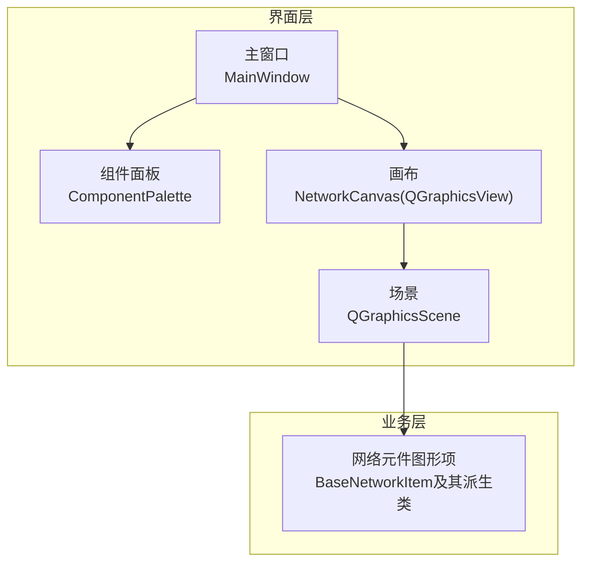
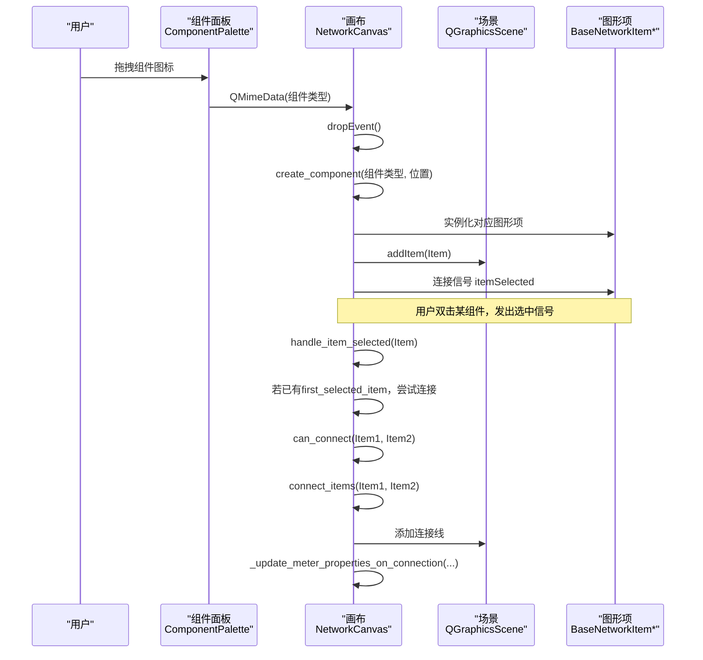

# 画布

<cite>
**本文引用的文件**
- [canvas.py](file://src/components/canvas.py)
- [network_items.py](file://src/components/network_items.py)
- [component_palette.py](file://src/components/component_palette.py)
- [main_window.py](file://src/components/main_window.py)
</cite>

## 目录
1. [简介](#简介)
2. [项目结构](#项目结构)
3. [核心组件](#核心组件)
4. [架构总览](#架构总览)
5. [详细组件分析](#详细组件分析)
6. [依赖分析](#依赖分析)
7. [性能考虑](#性能考虑)
8. [故障排查指南](#故障排查指南)
9. [结论](#结论)
10. [附录：如何在画布上创建两个元件并建立连接](#附录如何在画布上创建两个元件并建立连接)

## 简介
本文件全面记录pp_tool中“画布”模块（NetworkCanvas，位于canvas.py）的功能与实现。画布作为QGraphicsView的子类，承担着承载与管理所有电网元件图形项（QGraphicsItem）的职责。它通过拖拽放置、双击连接、右键菜单、主题适配、连接点智能选择、连接规则校验、电表连接后自动填充测量属性等机制，构建了一个直观、可扩展、可维护的电网拓扑编辑界面。

## 项目结构
- 画布模块：src/components/canvas.py
- 网络元件图形项：src/components/network_items.py
- 组件面板（拖拽来源）：src/components/component_palette.py
- 主窗口（画布宿主）：src/components/main_window.py



图表来源
- [main_window.py](file://src/components/main_window.py#L118-L130)
- [component_palette.py](file://src/components/component_palette.py#L16-L35)
- [canvas.py](file://src/components/canvas.py#L22-L68)

章节来源
- [main_window.py](file://src/components/main_window.py#L118-L130)
- [component_palette.py](file://src/components/component_palette.py#L16-L35)
- [canvas.py](file://src/components/canvas.py#L22-L68)

## 核心组件
- NetworkCanvas：继承自QGraphicsView，负责：
  - 初始化场景、网格背景、主题颜色、滚动条样式
  - 接受拖拽事件，创建并添加图形项到场景
  - 处理组件选中事件，实现双击连接逻辑
  - 连接两个组件，绘制连接线，管理连接集合
  - 断开连接、删除组件、清空画布、自适应视图、键盘/鼠标交互
  - 电表连接后自动填充测量目标（类型、索引、侧别、测量类型）

- BaseNetworkItem及其派生类：继承自QGraphicsItem，负责：
  - 组件索引分配与回收
  - 连接点定义、可用连接点查询、连接点占用状态管理
  - 连接数量约束、连接增删、bus参数更新
  - 旋转与连接点更新、移动时连接线更新
  - 右键菜单、删除、双击改名等

章节来源
- [canvas.py](file://src/components/canvas.py#L16-L225)
- [network_items.py](file://src/components/network_items.py#L24-L120)
- [network_items.py](file://src/components/network_items.py#L327-L368)
- [network_items.py](file://src/components/network_items.py#L550-L631)

## 架构总览
画布与组件面板、主窗口的协作关系如下：



图表来源
- [component_palette.py](file://src/components/component_palette.py#L129-L168)
- [canvas.py](file://src/components/canvas.py#L142-L227)
- [canvas.py](file://src/components/canvas.py#L229-L254)
- [canvas.py](file://src/components/canvas.py#L341-L359)
- [canvas.py](file://src/components/canvas.py#L406-L495)

章节来源
- [component_palette.py](file://src/components/component_palette.py#L129-L168)
- [canvas.py](file://src/components/canvas.py#L142-L227)
- [canvas.py](file://src/components/canvas.py#L229-L254)
- [canvas.py](file://src/components/canvas.py#L341-L359)
- [canvas.py](file://src/components/canvas.py#L406-L495)

## 详细组件分析

### NetworkCanvas：画布核心
- 初始化与主题适配
  - 初始化场景、抗锯齿、框选模式、变换锚点、背景颜色、滚动条样式、网格背景
  - 主题感知：根据应用调色板自动切换连接线颜色、网格颜色、背景色、滚动条样式
- 拖拽放置与创建
  - 接受拖拽：dragEnterEvent/dragMoveEvent/dropEvent
  - dropEvent解析MIME数据中的组件类型，mapToScene获取放置位置，调用create_component
  - create_component按类型创建图形项，写入全局network_items字典，设置名称、geodata、连接信号
- 选中与双击连接
  - handle_item_selected：记录first_selected_item，若第二次选中不同组件且can_connect为真，则connect_items
- 连接规则与连接点选择
  - can_connect：去重、连接数量约束、类型兼容性检查
  - _check_component_type_compatibility：母线可连任意；电表可连任意；开关一端为母线另一端为允许类型；线路/变压器必须一端为母线或电表；负载/储能/充电/外部电网/静态发电机可连母线或电表
  - _select_connection_points：针对母线连接，优先匹配属性（如hv_bus/lv_bus/from_bus/to_bus）与连接点索引，否则回退最近连接点
  - connect_items：选择连接点、更新连接点占用状态、绘制连接线、记录连接信息、电表属性自动填充、重置网络诊断标志
- 连接点智能选择与最近点查找
  - find_nearest_connection_point：计算场景坐标距离，返回最近可用连接点及索引；母线可连接所有点
- 电表连接后自动填充测量属性
  - _update_meter_properties_on_connection：根据连接类型映射到pandapower元件类型，设置element_type、element、side、meas_type，并刷新属性面板
- 右键菜单与键盘/鼠标交互
  - 右键拖动平移、缩放滚轮、右键菜单（旋转、断开连接、删除、清空、缩放）
  - 键盘：左右方向键/快捷键旋转、Delete删除
- 连接管理与场景操作
  - 断开：disconnect_selected_items/disconnect_all_from_selected/disconnect_all_from_item/disconnect_items
  - 删除：delete_selected_items，同时从network_items中移除
  - 清空：clear_canvas，重置计数器，重新绘制网格
  - 自适应视图：fit_in_view
- 选择变化与状态栏
  - selection_changed信号，on_selection_changed根据单选或多选/无选发出不同对象
  - update_status_bar：根据选中状态显示操作提示

章节来源
- [canvas.py](file://src/components/canvas.py#L22-L68)
- [canvas.py](file://src/components/canvas.py#L69-L114)
- [canvas.py](file://src/components/canvas.py#L115-L131)
- [canvas.py](file://src/components/canvas.py#L132-L155)
- [canvas.py](file://src/components/canvas.py#L142-L155)
- [canvas.py](file://src/components/canvas.py#L156-L227)
- [canvas.py](file://src/components/canvas.py#L229-L254)
- [canvas.py](file://src/components/canvas.py#L255-L272)
- [canvas.py](file://src/components/canvas.py#L276-L340)
- [canvas.py](file://src/components/canvas.py#L341-L359)
- [canvas.py](file://src/components/canvas.py#L361-L405)
- [canvas.py](file://src/components/canvas.py#L406-L495)
- [canvas.py](file://src/components/canvas.py#L497-L595)
- [canvas.py](file://src/components/canvas.py#L596-L645)
- [canvas.py](file://src/components/canvas.py#L646-L714)
- [canvas.py](file://src/components/canvas.py#L715-L747)
- [canvas.py](file://src/components/canvas.py#L748-L804)
- [canvas.py](file://src/components/canvas.py#L804-L834)
- [canvas.py](file://src/components/canvas.py#L835-L892)
- [canvas.py](file://src/components/canvas.py#L893-L931)
- [canvas.py](file://src/components/canvas.py#L932-L971)
- [canvas.py](file://src/components/canvas.py#L972-L1001)
- [canvas.py](file://src/components/canvas.py#L1005-L1104)
- [canvas.py](file://src/components/canvas.py#L1105-L1141)
- [canvas.py](file://src/components/canvas.py#L1142-L1171)
- [canvas.py](file://src/components/canvas.py#L1172-L1200)

### BaseNetworkItem：图形项基类
- 索引系统：_get_next_index、计数器与回收池，保证索引唯一且可回收
- 连接点与连接约束：connection_points、connection_point_states、max_connections/min_connections、current_connections
- 连接管理：add_connection/remove_connection、is_connection_point_available、get_available_connection_points
- 旋转与连接点更新：rotate_component/update_rotated_connection_points/update_connections
- 位置变化与属性面板联动：itemChange中更新geodata、触发属性面板刷新
- 右键菜单与删除：contextMenuEvent/delete_component
- 双击改名：handle_double_click/QInputDialog

章节来源
- [network_items.py](file://src/components/network_items.py#L24-L120)
- [network_items.py](file://src/components/network_items.py#L327-L368)
- [network_items.py](file://src/components/network_items.py#L550-L631)
- [network_items.py](file://src/components/network_items.py#L632-L640)
- [network_items.py](file://src/components/network_items.py#L640-L686)
- [network_items.py](file://src/components/network_items.py#L708-L763)

### 典型图形项：BusItem、LineItem、TransformerItem
- BusItem：母线，无最大连接数限制，连接点为中心点
- LineItem：线路，连接点为上下两端，连接约束为2端母线
- TransformerItem：变压器，连接点为高压/低压两端，连接约束为2端母线

章节来源
- [network_items.py](file://src/components/network_items.py#L909-L939)
- [network_items.py](file://src/components/network_items.py#L944-L993)
- [network_items.py](file://src/components/network_items.py#L996-L1051)

## 依赖分析
- 画布依赖场景（QGraphicsScene）承载图形项
- 画布依赖网络元件图形项（BaseNetworkItem及其派生类）实现连接点、连接约束、bus参数更新
- 画布依赖组件面板（ComponentPalette）提供拖拽数据（组件类型）
- 画布依赖主窗口（MainWindow）提供全局network_items字典、属性面板联动、状态栏更新
- 画布与图形项之间通过信号（itemSelected）建立松耦合联系

```mermaid
graph LR
CP["ComponentPalette"] --> |QMimeData(组件类型)| CANVAS["NetworkCanvas"]
CANVAS --> |addItem| SCENE["QGraphicsScene"]
SCENE --> ITEMS["BaseNetworkItem*"]
CANVAS --|"selection_changed"| MW["MainWindow"]
CANVAS --|"itemSelected"| ITEMS
ITEMS --|"add_connection/remove_connection"| CANVAS
```

图表来源
- [component_palette.py](file://src/components/component_palette.py#L129-L168)
- [canvas.py](file://src/components/canvas.py#L142-L227)
- [main_window.py](file://src/components/main_window.py#L118-L130)

章节来源
- [component_palette.py](file://src/components/component_palette.py#L129-L168)
- [canvas.py](file://src/components/canvas.py#L142-L227)
- [main_window.py](file://src/components/main_window.py#L118-L130)

## 性能考虑
- 场景规模：场景尺寸较大（5000×5000），网格线z值设为背景层，避免影响渲染
- 抗锯齿与视口更新：启用抗锯齿与FullViewportUpdate，保证绘制质量
- 连接线管理：连接线存储在connections列表，批量断开时统一移除并更新连接计数
- 连接点查找：find_nearest_connection_point按场景坐标计算距离，母线可连接所有点，减少不必要的约束检查
- 主题切换：统一更新背景、连接线颜色、滚动条样式、网格线与SVG图标，避免重复绘制

[本节为一般性指导，无需列出具体文件来源]

## 故障排查指南
- 无法放置组件
  - 检查组件面板拖拽是否启用、QMimeData是否包含组件类型
  - 确认画布已setAcceptDrops(True)，dropEvent是否被触发
- 无法连接两个组件
  - 检查can_connect返回值：是否已连接、连接数量限制、类型兼容性
  - 检查连接点可用性：is_connection_point_available与get_available_connection_points
- 连接线未更新
  - 组件移动或旋转后需调用update_connections，确认BaseNetworkItem.update_connections被触发
- 电表未自动填充测量属性
  - 检查_connect_items中是否调用_update_meter_properties_on_connection
  - 检查属性面板current_item是否与电表一致，确保selection_changed信号发出

章节来源
- [canvas.py](file://src/components/canvas.py#L341-L359)
- [canvas.py](file://src/components/canvas.py#L406-L495)
- [canvas.py](file://src/components/canvas.py#L497-L595)
- [network_items.py](file://src/components/network_items.py#L260-L295)
- [network_items.py](file://src/components/network_items.py#L550-L631)

## 结论
NetworkCanvas通过清晰的职责划分与严格的连接规则，实现了电网拓扑的可视化编辑。其与BaseNetworkItem的配合，使得连接点、连接数量、bus参数等关键行为得以统一管理；与ComponentPalette、MainWindow的集成，提供了完整的拖拽放置、双击连接、右键菜单、主题适配与属性联动体验。电表连接后自动填充测量属性的设计，进一步提升了用户体验与建模效率。

[本节为总结性内容，无需列出具体文件来源]

## 附录：如何在画布上创建两个元件并建立连接
- 步骤
  1) 在组件面板中选择一个元件（例如“母线”），拖拽到画布上，释放鼠标完成放置
  2) 再次在组件面板中选择另一个元件（例如“线路”），拖拽到画布上，释放鼠标完成放置
  3) 双击第一个放置的元件，记录为first_selected_item
  4) 双击第二个放置的元件，触发can_connect与connect_items流程
  5) 若连接成功，画布将绘制连接线，并在必要时自动填充电表的测量属性（如连接到母线或线路）
- 关键方法参考
  - 拖拽放置：dropEvent、create_component
  - 双击连接：handle_item_selected、can_connect、connect_items
  - 连接点选择：_select_connection_points、find_nearest_connection_point
  - 电表属性填充：_update_meter_properties_on_connection

章节来源
- [component_palette.py](file://src/components/component_palette.py#L129-L168)
- [canvas.py](file://src/components/canvas.py#L142-L227)
- [canvas.py](file://src/components/canvas.py#L229-L254)
- [canvas.py](file://src/components/canvas.py#L341-L359)
- [canvas.py](file://src/components/canvas.py#L361-L405)
- [canvas.py](file://src/components/canvas.py#L406-L495)
- [canvas.py](file://src/components/canvas.py#L497-L595)