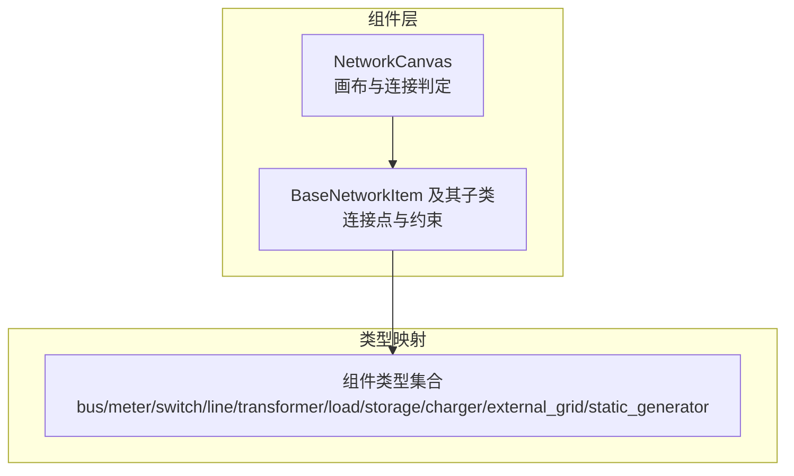
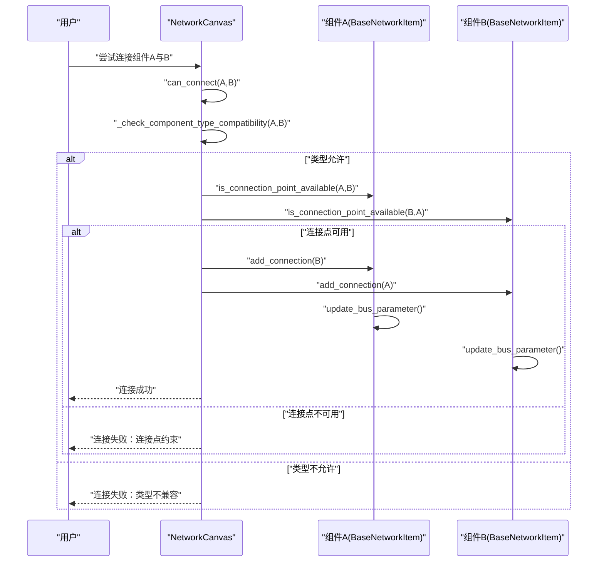
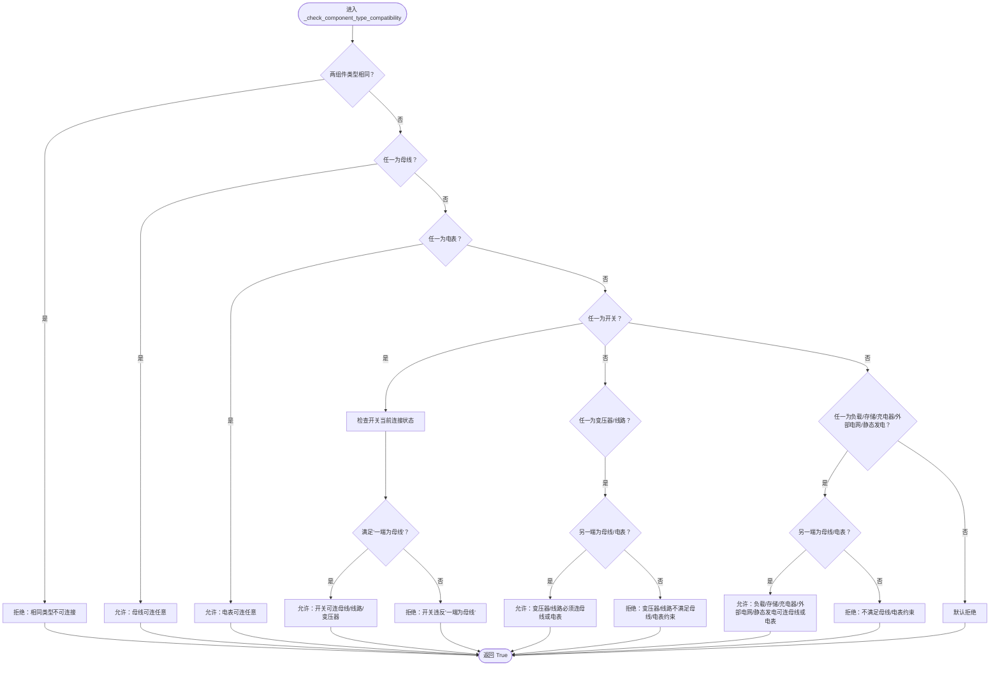
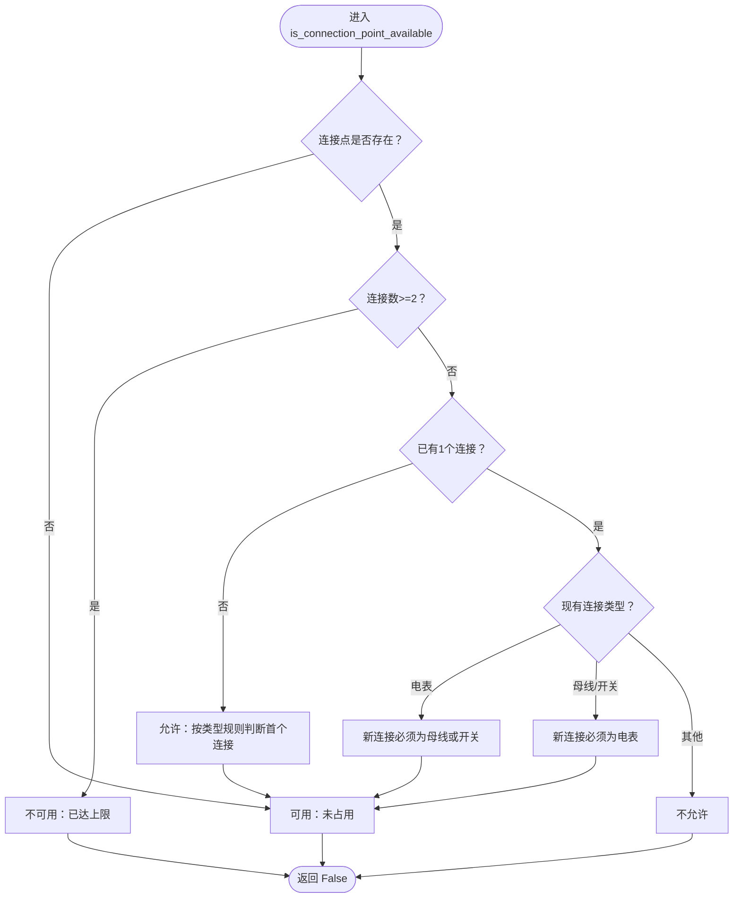
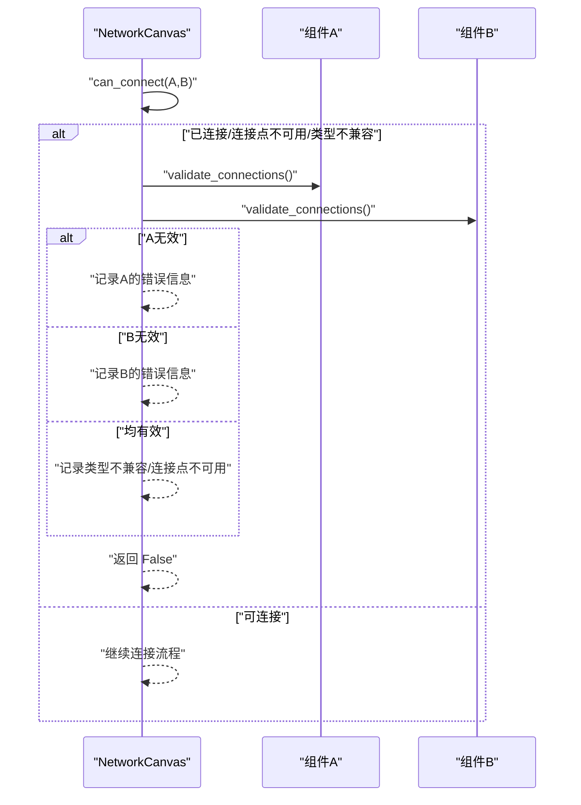
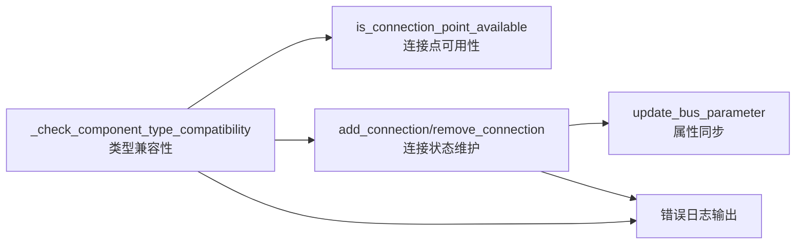

# 兼容性校验

<cite>
**本文引用的文件**
- [src/components/canvas.py](file://src/components/canvas.py)
- [src/components/network_items.py](file://src/components/network_items.py)
</cite>

## 目录
1. [简介](#简介)
2. [项目结构](#项目结构)
3. [核心组件](#核心组件)
4. [架构总览](#架构总览)
5. [详细组件分析](#详细组件分析)
6. [依赖分析](#依赖分析)
7. [性能考量](#性能考量)
8. [故障排查指南](#故障排查指南)
9. [结论](#结论)

## 简介
本文件围绕 `_check_component_type_compatibility` 方法，系统梳理并解释电网拓扑图中“组件类型兼容性校验”的规则与实现。重点覆盖以下核心规则：
- 母线可连接任意组件
- 电表可连接任意组件
- 开关遵循“一端为母线”的动态连接状态检查
- 变压器和线路必须连接母线或电表
- 负载、存储、充电器、外部电网、静态发电（光伏）可连接母线或电表

同时，文档将说明该方法如何与连接点可用性检查、连接数量约束、错误日志输出协同工作，帮助读者快速定位非法连接场景并理解错误处理机制。

## 项目结构
本功能位于“组件”层，涉及画布与网络项两大模块：
- 画布模块负责交互式连接判定与错误提示
- 网络项模块负责连接点可用性、连接数量约束与属性更新

图表来源
- [src/components/canvas.py](file://src/components/canvas.py#L276-L340)
- [src/components/network_items.py](file://src/components/network_items.py#L327-L367)

章节来源
- [src/components/canvas.py](file://src/components/canvas.py#L276-L340)
- [src/components/network_items.py](file://src/components/network_items.py#L327-L367)

## 核心组件
- NetworkCanvas._check_component_type_compatibility：类型兼容性主判定逻辑
- BaseNetworkItem.is_connection_point_available：连接点可用性与连接数约束
- BaseNetworkItem.add_connection/remove_connection/update_bus_parameter：连接状态维护与属性同步
- NetworkCanvas.can_connect/connect_items：连接流程入口与错误日志输出

章节来源
- [src/components/canvas.py](file://src/components/canvas.py#L276-L340)
- [src/components/network_items.py](file://src/components/network_items.py#L327-L367)
- [src/components/network_items.py](file://src/components/network_items.py#L550-L623)
- [src/components/network_items.py](file://src/components/network_items.py#L333-L367)

## 架构总览
整体流程：用户在画布上选择两个组件，触发 can_connect → _check_component_type_compatibility → is_connection_point_available → add_connection → update_bus_parameter；若失败则输出错误日志。

图表来源
- [src/components/canvas.py](file://src/components/canvas.py#L341-L360)
- [src/components/canvas.py](file://src/components/canvas.py#L406-L495)
- [src/components/network_items.py](file://src/components/network_items.py#L550-L623)
- [src/components/network_items.py](file://src/components/network_items.py#L333-L367)

## 详细组件分析

### 方法：_check_component_type_compatibility 的规则与实现
该方法按优先级与分支顺序进行类型兼容性判定，核心要点如下：

- 相同类型组件禁止直接连接（避免环路与无意义连接）
- 母线可连接任意组件
- 电表可连接任意组件
- 开关的连接规则最复杂，遵循“一端为母线”的动态检查：
  - 若开关已有连接，且第一个连接是母线，则允许连接到母线、线路或变压器
  - 若开关已有连接，且第一个连接是非母线组件（线路/变压器），则后续连接必须回到母线
  - 若开关尚未连接任何组件，则允许连接到任意允许类型（但会在第二次连接时再次检查）
- 变压器与线路必须连接母线或电表
- 负载、存储、充电器、外部电网、静态发电（光伏）可连接母线或电表

图表来源
- [src/components/canvas.py](file://src/components/canvas.py#L276-L340)

章节来源
- [src/components/canvas.py](file://src/components/canvas.py#L276-L340)

### 连接点可用性与连接数量约束
- BaseNetworkItem.is_connection_point_available：基于连接点索引与当前连接状态，检查是否允许新增连接
  - 每个连接点最多2个连接
  - 变压器/线路的连接点规则：
    - 若已有1个连接且为电表，则新连接必须为母线或开关
    - 若已有1个连接且为母线/开关，则新连接必须为电表
    - 否则不允许
  - 开关的连接点规则：
    - 每个连接点最多1个设备（开关自身只控制连接点数量，不参与“母线”规则）
    - “母线”规则在 can_connect/_check_component_type_compatibility 中处理
  - 其他设备的连接点规则：
    - 若已有1个连接且为电表，则新连接必须为母线
    - 若已有1个连接且为母线，则新连接必须为电表
    - 否则不允许
- BaseNetworkItem.add_connection/remove_connection：维护 current_connections 与连接点占用状态
- BaseNetworkItem.update_bus_parameter：在连接变更后更新属性（如母线、高低压侧、起止母线等）

图表来源
- [src/components/network_items.py](file://src/components/network_items.py#L550-L623)

章节来源
- [src/components/network_items.py](file://src/components/network_items.py#L550-L623)
- [src/components/network_items.py](file://src/components/network_items.py#L333-L367)

### 错误处理与日志输出
- NetworkCanvas.can_connect：在连接前综合检查“是否已连接”“连接点可用性”“类型兼容性”，若失败则调用 item.validate_connections 并输出错误日志
- NetworkCanvas.connect_items：连接失败时输出明确的错误信息，包括组件名、连接点不可用、类型不兼容等

图表来源
- [src/components/canvas.py](file://src/components/canvas.py#L406-L495)
- [src/components/network_items.py](file://src/components/network_items.py#L632-L639)

章节来源
- [src/components/canvas.py](file://src/components/canvas.py#L406-L495)
- [src/components/network_items.py](file://src/components/network_items.py#L632-L639)

### 开关的动态连接状态检查详解
- 开关的“一端为母线”规则在 _check_component_type_compatibility 中体现：
  - 若开关已有连接，且第一个连接为母线，则允许连接到母线、线路或变压器
  - 若第一个连接为线路或变压器，则后续连接必须回到母线
  - 若开关尚未连接任何组件，则允许连接到任意允许类型（但会在第二次连接时再次检查）
- 连接点层面，开关每个连接点最多1个设备，具体“母线”规则由类型兼容性判定负责

章节来源
- [src/components/canvas.py](file://src/components/canvas.py#L276-L340)
- [src/components/network_items.py](file://src/components/network_items.py#L550-L623)

### 合法与非法连接场景示意
以下为典型场景的判定依据（不展示具体代码，仅说明规则）：
- 合法场景
  - 母线与任意组件连接
  - 电表与任意组件连接
  - 开关一端为母线，另一端为母线/线路/变压器
  - 变压器/线路连接母线或电表
  - 负载/存储/充电器/外部电网/静态发电连接母线或电表
- 非法场景
  - 两个相同类型组件直接连接
  - 开关两端都不是母线（且第一次连接非母线）
  - 变压器/线路未连接母线或电表
  - 连接点超限（每点最多2个，开关每点最多1个）

章节来源
- [src/components/canvas.py](file://src/components/canvas.py#L276-L340)
- [src/components/network_items.py](file://src/components/network_items.py#L550-L623)

## 依赖分析
- 画布模块依赖网络项模块提供的连接点可用性与连接数量约束
- 网络项模块在连接变更后更新属性，保证拓扑一致性
- 日志模块贯穿连接失败路径，便于问题定位

图表来源
- [src/components/canvas.py](file://src/components/canvas.py#L276-L340)
- [src/components/network_items.py](file://src/components/network_items.py#L550-L623)
- [src/components/network_items.py](file://src/components/network_items.py#L333-L367)

章节来源
- [src/components/canvas.py](file://src/components/canvas.py#L276-L340)
- [src/components/network_items.py](file://src/components/network_items.py#L550-L623)
- [src/components/network_items.py](file://src/components/network_items.py#L333-L367)

## 性能考量
- 类型兼容性判定为 O(1) 分支判断，开销极低
- 连接点可用性检查遍历连接点列表，通常连接点数量有限（如开关2点、线路/变压器2点、母线多点），整体仍为常数级
- 属性更新在连接变更后触发，仅对受影响组件执行，避免全量扫描

## 故障排查指南
- 现象：无法连接两个组件
  - 检查是否已连接：已在连接判定中排除重复连接
  - 检查连接点可用性：确认每点连接数未超限
  - 检查类型兼容性：确认是否违反“母线/电表/开关/变压器/线路/其他设备”的约束
  - 查看日志：连接失败时会输出具体原因（组件名、连接点不可用、类型不兼容等）
- 现象：开关连接异常
  - 确认开关是否已连接母线；若已连接非母线组件，后续必须回连母线
  - 确认开关每个连接点仅连接1个设备
- 现象：电表连接异常
  - 电表可连接任意组件，但需满足连接点可用性与连接数量约束

章节来源
- [src/components/canvas.py](file://src/components/canvas.py#L406-L495)
- [src/components/network_items.py](file://src/components/network_items.py#L550-L623)

## 结论
_check_component_type_compatibility 将“母线可连任意、电表可连任意、开关一端为母线、变压器/线路必须连母线或电表、其他设备可连母线或电表”等规则以清晰的分支逻辑实现，并与连接点可用性检查、连接数量约束、属性更新与日志输出形成完整的连接流程闭环。遵循这些规则可有效避免非法拓扑，提升仿真与可视化的可靠性。