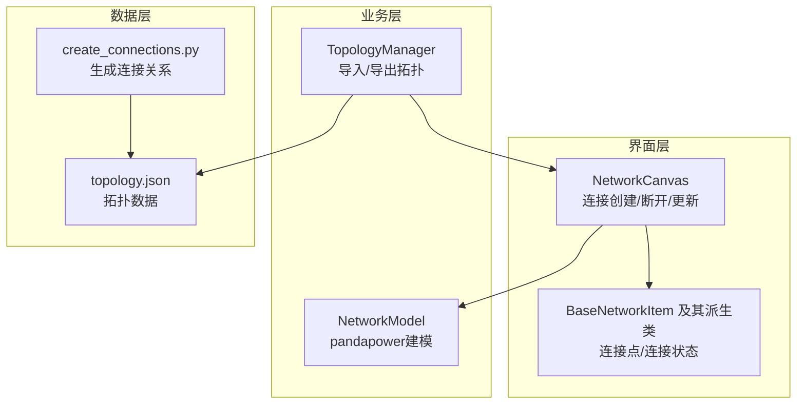
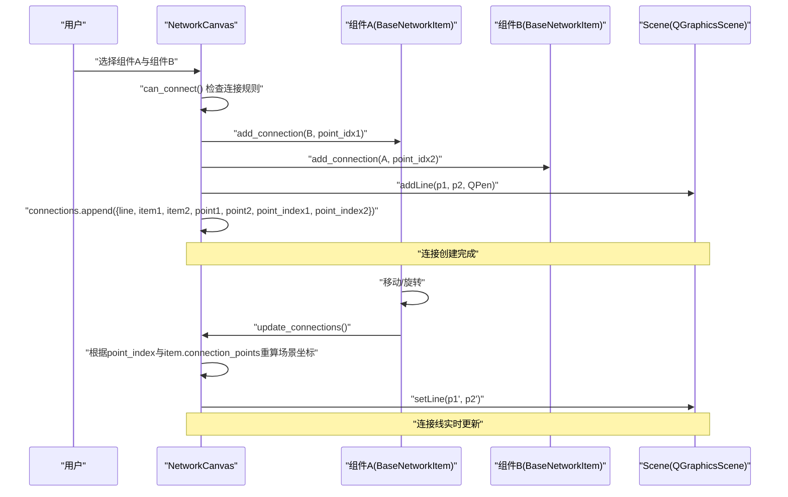
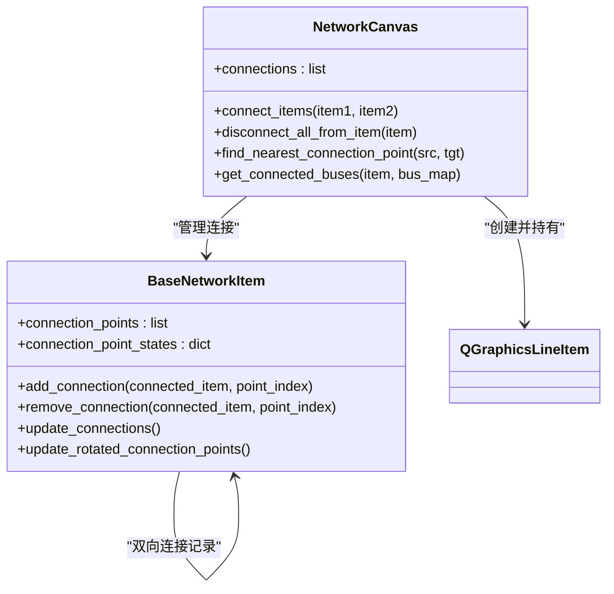
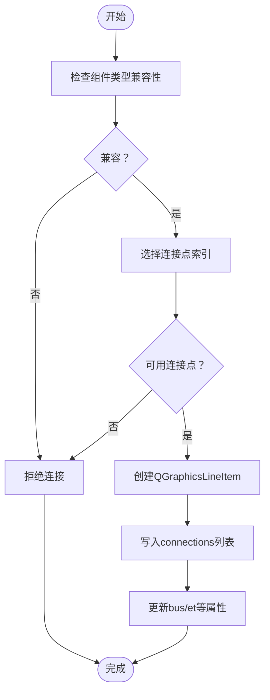
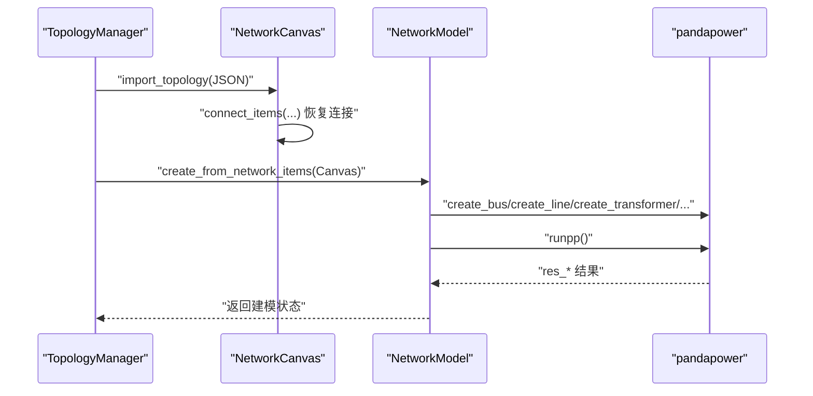
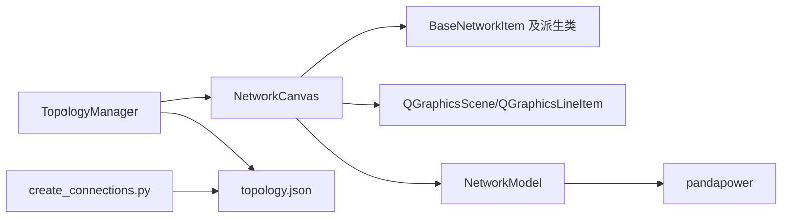

# 连接数据管理

<cite>
**本文引用的文件**
- [src/components/canvas.py](file://src/components/canvas.py)
- [src/components/network_items.py](file://src/components/network_items.py)
- [src/models/network_model.py](file://src/models/network_model.py)
- [src/components/topology_utils.py](file://src/components/topology_utils.py)
- [create_connections.py](file://create_connections.py)
- [topology.json](file://topology.json)
</cite>

## 目录
1. [简介](#简介)
2. [项目结构](#项目结构)
3. [核心组件](#核心组件)
4. [架构总览](#架构总览)
5. [详细组件分析](#详细组件分析)
6. [依赖分析](#依赖分析)
7. [性能考虑](#性能考虑)
8. [故障排查指南](#故障排查指南)
9. [结论](#结论)
10. [附录](#附录)

## 简介
本文件围绕“连接信息的存储与管理机制”展开，系统阐述如下要点：
- connections 列表如何存储每个连接的完整信息，包括 QGraphicsLineItem 对象、连接的两个组件引用、连接点位置和索引。
- 这些数据如何用于绘制连接线、维护连接状态、执行网络拓扑分析。
- 连接信息与 pandapower 网络模型的映射关系，以及在仿真计算时如何利用这些数据构建电网拓扑结构。

## 项目结构
本项目采用分层设计：界面层（画布与组件）、业务层（拓扑工具与网络模型）、数据层（拓扑 JSON）。连接数据贯穿界面层与业务层，既服务于图形交互，也服务于仿真建模。

图表来源
- [src/components/canvas.py](file://src/components/canvas.py#L341-L496)
- [src/components/network_items.py](file://src/components/network_items.py#L75-L120)
- [src/models/network_model.py](file://src/models/network_model.py#L407-L582)
- [src/components/topology_utils.py](file://src/components/topology_utils.py#L246-L460)
- [create_connections.py](file://create_connections.py#L1-L198)
- [topology.json](file://topology.json#L1-L524)

章节来源
- [src/components/canvas.py](file://src/components/canvas.py#L341-L496)
- [src/components/network_items.py](file://src/components/network_items.py#L75-L120)
- [src/models/network_model.py](file://src/models/network_model.py#L407-L582)
- [src/components/topology_utils.py](file://src/components/topology_utils.py#L246-L460)
- [create_connections.py](file://create_connections.py#L1-L198)
- [topology.json](file://topology.json#L1-L524)

## 核心组件
- NetworkCanvas：负责连接的创建、断开、更新与可视化，维护 connections 列表。
- BaseNetworkItem 及其派生类：提供连接点位置、连接状态、连接约束与 bus 参数更新能力。
- NetworkModel：将图形拓扑映射到 pandapower 网络模型，构建母线、支路与设备。
- TopologyManager：导入/导出拓扑，恢复连接关系，处理电表测量属性。
- create_connections.py：从拓扑 JSON 生成 connections 字段，便于后续导入。

章节来源
- [src/components/canvas.py](file://src/components/canvas.py#L341-L496)
- [src/components/network_items.py](file://src/components/network_items.py#L75-L120)
- [src/models/network_model.py](file://src/models/network_model.py#L407-L582)
- [src/components/topology_utils.py](file://src/components/topology_utils.py#L246-L460)
- [create_connections.py](file://create_connections.py#L1-L198)

## 架构总览
连接数据在系统中的流转路径如下：
- 用户在画布上选择两个组件，NetworkCanvas 根据连接规则与最近连接点算法选择连接点，创建 QGraphicsLineItem 并将连接信息写入 connections。
- 组件移动或旋转时，BaseNetworkItem.update_connections 通过 connections 中存储的 point_index 与 item 的 connection_points 重新计算场景坐标并更新线段。
- 导入拓扑时，TopologyManager 依据拓扑 JSON 的连接关系，调用 Canvas.connect_items 恢复连接，并在恢复过程中设置“导入标志”避免递归更新 bus 参数。
- 导出拓扑时，TopologyManager 将当前场景的组件与连接状态写入 JSON。
- 仿真阶段，NetworkModel 从 Canvas.connections 与 network_items 中提取母线与支路连接，构建 pandapower 网络模型。

图表来源
- [src/components/canvas.py](file://src/components/canvas.py#L341-L496)
- [src/components/network_items.py](file://src/components/network_items.py#L260-L306)

章节来源
- [src/components/canvas.py](file://src/components/canvas.py#L341-L496)
- [src/components/network_items.py](file://src/components/network_items.py#L260-L306)

## 详细组件分析

### 连接数据结构与存储
- connections 列表中的每个元素是一个字典，包含：
  - line：QGraphicsLineItem 对象，用于在场景中绘制连接线。
  - item1、item2：两个连接的组件对象引用。
  - point1、point2：连接点在组件局部坐标系中的位置。
  - point_index1、point_index2：连接点在组件 connection_points 中的索引。
- 连接创建流程：
  - NetworkCanvas.connect_items() 选择连接点索引与局部坐标，计算场景坐标，创建线段并写入 connections。
  - 组件移动/旋转时，BaseNetworkItem.update_connections() 通过 point_index 与当前 connection_points 重新计算 point1/point2 并更新 line。

图表来源
- [src/components/canvas.py](file://src/components/canvas.py#L341-L496)
- [src/components/network_items.py](file://src/components/network_items.py#L75-L120)
- [src/components/network_items.py](file://src/components/network_items.py#L260-L306)

章节来源
- [src/components/canvas.py](file://src/components/canvas.py#L341-L496)
- [src/components/network_items.py](file://src/components/network_items.py#L75-L120)
- [src/components/network_items.py](file://src/components/network_items.py#L260-L306)

### 连接点选择与约束
- 近邻连接点选择：NetworkCanvas.find_nearest_connection_point() 计算可用连接点到目标组件的几何距离，返回最近点与索引。
- 特殊规则：
  - 母线可连接任意组件；电表可连接任意组件；开关一端为母线时，另一端可连接母线/线路/变压器。
  - 变压器与线路与母线连接时，优先按 hv_bus/lv_bus 或 from_bus/to_bus 的属性匹配对应连接点索引。
- 连接点占用状态：
  - BaseNetworkItem.connection_point_states 记录每个连接点的占用情况，避免超限。
  - BaseNetworkItem.get_available_connection_points() 返回可用连接点索引集合。

图表来源
- [src/components/canvas.py](file://src/components/canvas.py#L341-L496)
- [src/components/network_items.py](file://src/components/network_items.py#L550-L631)

章节来源
- [src/components/canvas.py](file://src/components/canvas.py#L341-L496)
- [src/components/network_items.py](file://src/components/network_items.py#L550-L631)

### 连接状态维护与更新
- 组件移动/旋转：
  - BaseNetworkItem.update_connections() 遍历 Canvas.connections，若某连接涉及自身，则根据存储的 point_index 与当前 connection_points 重新计算 point1/point2 并更新 line。
  - BaseNetworkItem.update_rotated_connection_points() 在旋转后更新 connection_points。
- 断开连接：
  - NetworkCanvas.disconnect_all_from_item()/disconnect_items() 从 connections 中移除对应连接，同时调用组件的 remove_connection() 更新连接点状态与计数。
- 电表测量属性：
  - NetworkCanvas._update_meter_properties_on_connection() 在电表连接后自动设置 element_type、element、side、meas_type 等属性，并触发属性面板刷新。

章节来源
- [src/components/network_items.py](file://src/components/network_items.py#L260-L306)
- [src/components/canvas.py](file://src/components/canvas.py#L835-L923)
- [src/components/canvas.py](file://src/components/canvas.py#L497-L562)

### 连接信息与 pandapower 网络模型映射
- 拓扑导入/导出：
  - TopologyManager.export_topology() 将场景中组件属性写入 JSON；import_topology() 从 JSON 创建组件并恢复连接。
  - create_connections.py 从拓扑 JSON 生成 connections 字段，便于后续导入。
- 建模映射：
  - NetworkModel.create_from_network_items() 从 Canvas.connections 与 network_items 提取母线、线路、变压器、负载、储能、充电站、外部电网、开关、电表等，分别调用 pandapower 接口创建对象。
  - 母线与支路的连接关系通过 Canvas.get_connected_buses() 与组件 properties 中的 bus/hv_bus/lv_bus/from_bus/to_bus 等属性建立映射。
- 仿真计算：
  - NetworkModel.run_power_flow() 调用 pandapower 进行潮流计算；随后可通过 get_bus_voltage、get_line_power、get_transformer_power、get_load_power、get_generator_power 等接口读取结果。

图表来源
- [src/components/topology_utils.py](file://src/components/topology_utils.py#L246-L460)
- [src/models/network_model.py](file://src/models/network_model.py#L407-L582)
- [src/components/canvas.py](file://src/components/canvas.py#L255-L272)

章节来源
- [src/components/topology_utils.py](file://src/components/topology_utils.py#L246-L460)
- [src/models/network_model.py](file://src/models/network_model.py#L407-L582)
- [src/components/canvas.py](file://src/components/canvas.py#L255-L272)

### 拓扑分析与连接查询
- 查询连接：
  - NetworkCanvas.get_connections_for_item(item) 返回指定组件的所有连接。
  - NetworkCanvas.is_connected(item1, item2) 判断两组件是否已连接。
  - NetworkCanvas.get_connected_buses(item, bus_map) 返回与某组件连接的母线索引列表。
- 断开连接：
  - 支持断开选中设备的所有连接、断开指定组件的所有连接、断开两个特定设备之间的连接。

章节来源
- [src/components/canvas.py](file://src/components/canvas.py#L908-L931)
- [src/components/canvas.py](file://src/components/canvas.py#L853-L907)

## 依赖分析
- 组件耦合：
  - NetworkCanvas 依赖 BaseNetworkItem 的连接点与连接状态；依赖 QGraphicsScene/QGraphicsLineItem 进行可视化。
  - NetworkModel 依赖 Canvas.connections 与 network_items，间接依赖各组件的 properties。
  - TopologyManager 依赖 Canvas.connect_items 与组件 properties，负责导入/导出与连接恢复。
- 数据一致性：
  - 连接点索引与组件旋转/移动同步更新，保证 line 始终反映最新几何关系。
  - 导入拓扑时设置“恢复连接标志”，避免递归更新 bus 参数导致的死循环。

图表来源
- [src/components/canvas.py](file://src/components/canvas.py#L341-L496)
- [src/components/network_items.py](file://src/components/network_items.py#L75-L120)
- [src/models/network_model.py](file://src/models/network_model.py#L407-L582)
- [src/components/topology_utils.py](file://src/components/topology_utils.py#L246-L460)
- [create_connections.py](file://create_connections.py#L1-L198)

章节来源
- [src/components/canvas.py](file://src/components/canvas.py#L341-L496)
- [src/components/network_items.py](file://src/components/network_items.py#L75-L120)
- [src/models/network_model.py](file://src/models/network_model.py#L407-L582)
- [src/components/topology_utils.py](file://src/components/topology_utils.py#L246-L460)
- [create_connections.py](file://create_connections.py#L1-L198)

## 性能考虑
- 连接线更新复杂度：组件移动/旋转时，需遍历 Canvas.connections 中与之相关的连接，逐条更新 line。建议在大规模拓扑中减少不必要的组件移动，或批量更新。
- 连接点选择：find_nearest_connection_point() 对每个可用连接点计算距离，复杂度 O(N)。可在组件连接点较多时优化为四叉树或空间分割结构。
- 导入/导出：拓扑导入时先创建母线，再创建其他设备，最后创建电表，避免依赖缺失；导出时一次性遍历场景组件，复杂度 O(M)。

## 故障排查指南
- 连接失败：
  - 检查 can_connect() 返回值与组件 validate_connections() 的约束信息。
  - 确认连接点可用性：get_available_connection_points() 与 connection_point_states。
- 连接线不更新：
  - 确认组件移动/旋转后调用了 update_connections()。
  - 检查 point_index 是否与当前 connection_points 对应。
- 导入拓扑后连接异常：
  - 确认导入时设置了“恢复连接标志”，避免递归更新 bus 参数。
  - 检查拓扑 JSON 中的 bus/hv_bus/lv_bus/from_bus/to_bus 与 et/element 是否正确。
- 仿真报错：
  - 确认母线与支路连接关系完整，NetworkModel.create_from_network_items() 返回成功。
  - 使用 get_connected_buses() 校验连接映射是否正确。

章节来源
- [src/components/canvas.py](file://src/components/canvas.py#L341-L496)
- [src/components/network_items.py](file://src/components/network_items.py#L333-L368)
- [src/components/topology_utils.py](file://src/components/topology_utils.py#L461-L619)
- [src/models/network_model.py](file://src/models/network_model.py#L407-L582)

## 结论
本系统通过 connections 列表将图形连接与组件状态紧密绑定，实现了连接线的动态更新、连接状态的精确维护与拓扑关系的稳定映射。结合拓扑工具与 pandapower 建模，连接数据既是交互界面的核心，也是仿真计算的基础。遵循连接点选择规则、及时更新连接线、正确导入导出拓扑，是保障系统稳定性的关键。

## 附录
- 拓扑 JSON 示例字段：
  - Measurement：包含 element_type、element、side 等测量关联字段。
  - Switch：包含 bus、element、et 等开关连接字段。
  - Transformer/Line：包含 hv_bus/lv_bus 或 from_bus/to_bus 等母线索引字段。
- 连接关系生成脚本：
  - create_connections.py 从拓扑 JSON 生成 connections 字段，便于导入。

章节来源
- [topology.json](file://topology.json#L1-L524)
- [create_connections.py](file://create_connections.py#L1-L198)