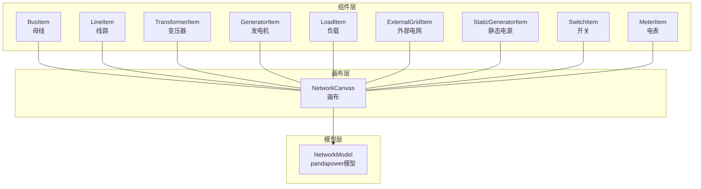
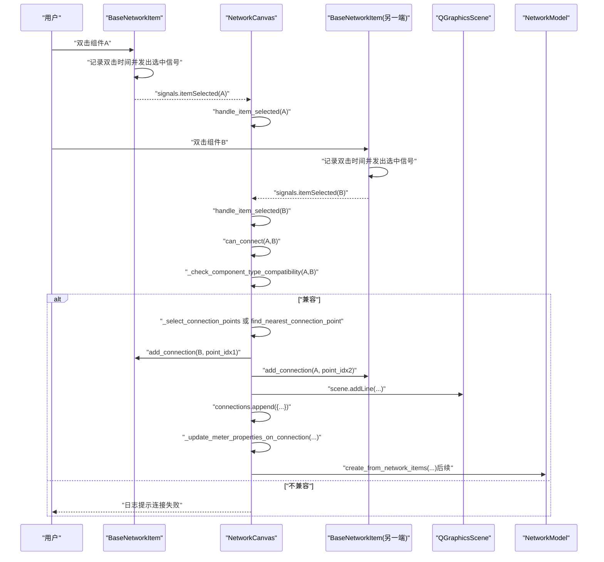
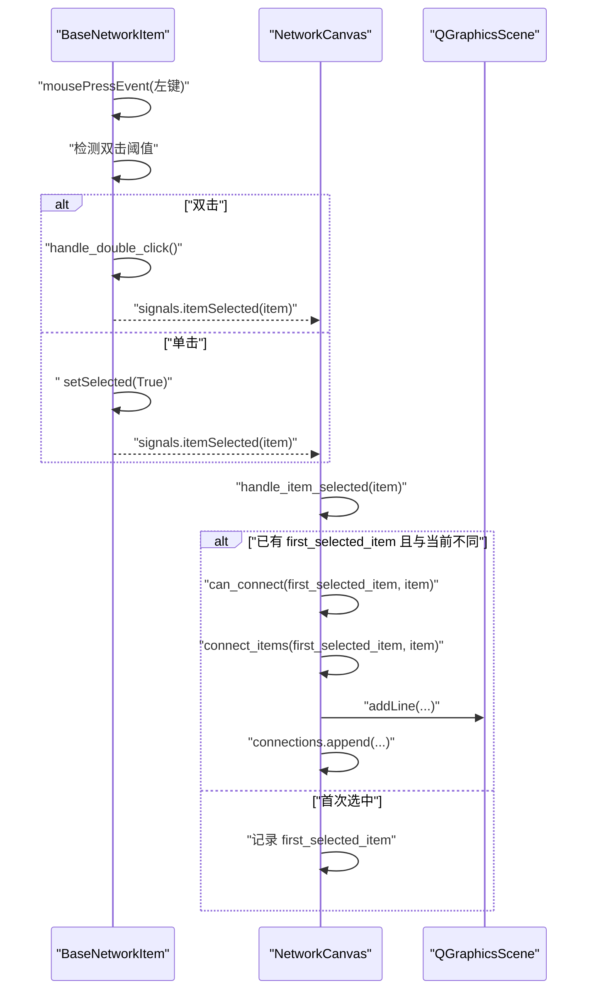
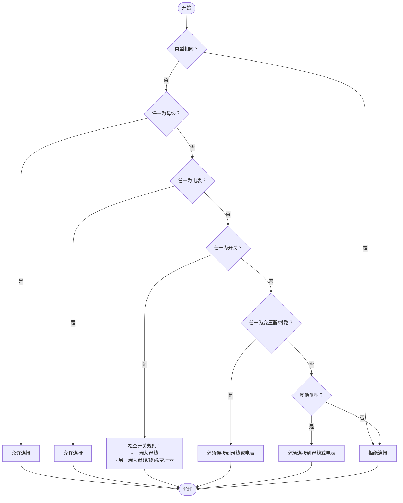
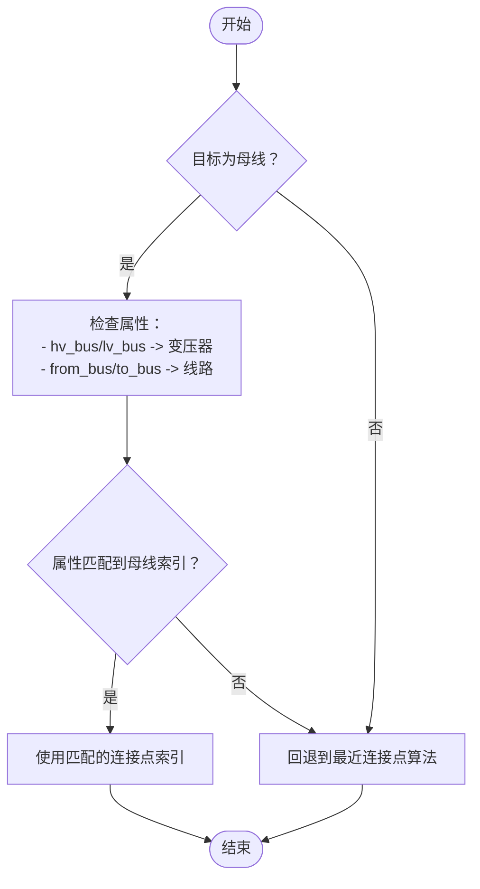
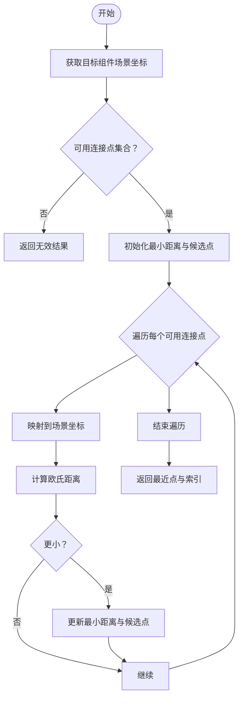
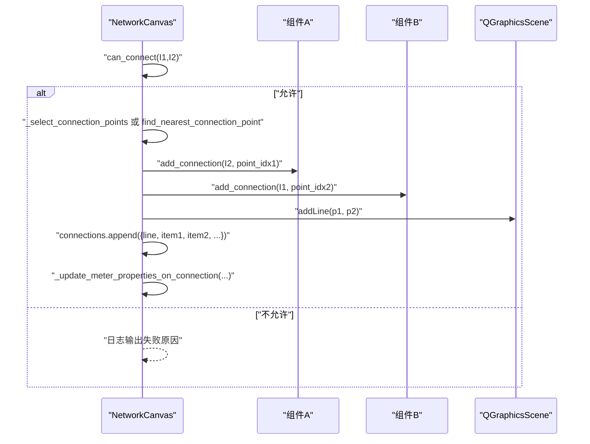
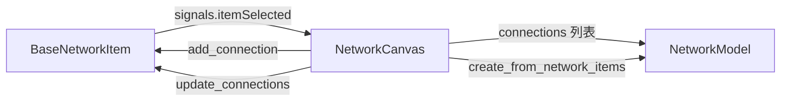

# 连接管理

<cite>
**本文引用的文件**
- [canvas.py](file://src/components/canvas.py)
- [network_items.py](file://src/components/network_items.py)
- [network_model.py](file://src/models/network_model.py)
</cite>

## 目录
1. [简介](#简介)
2. [项目结构](#项目结构)
3. [核心组件](#核心组件)
4. [架构总览](#架构总览)
5. [详细组件分析](#详细组件分析)
6. [依赖分析](#依赖分析)
7. [性能考虑](#性能考虑)
8. [故障排查指南](#故障排查指南)
9. [结论](#结论)

## 简介
本文件系统化梳理画布的连接管理机制，围绕以下关键问题展开：
- 如何通过双击交互模式触发连接（handle_item_selected 的工作流）
- 类型兼容性校验（can_connect 与_check_component_type_compatibility 的规则）
- 智能连接点选择（_select_connection_points 对多端口组件的策略）
- 最近距离算法（find_nearest_connection_point 的实现细节）
- 连接信息存储与绘制（connections 列表、QGraphicsLineItem 与连接点索引）

## 项目结构
本项目采用“组件-画布-模型”分层设计：
- 组件层：各类电网图形项（母线、线路、变压器、负载、储能、充电站、外部电网、静态电源、电表、开关等），负责图形绘制、连接点定义、连接状态管理。
- 画布层：NetworkCanvas 负责场景管理、双击选中事件、连接判定与绘制、连接信息持久化。
- 模型层：NetworkModel 负责将拓扑转换为 pandapower 网络模型，支撑后续仿真。

图表来源
- [canvas.py](file://src/components/canvas.py#L1-L120)
- [network_items.py](file://src/components/network_items.py#L910-L1319)
- [network_model.py](file://src/models/network_model.py#L1-L120)

章节来源
- [canvas.py](file://src/components/canvas.py#L1-L120)
- [network_items.py](file://src/components/network_items.py#L910-L1319)
- [network_model.py](file://src/models/network_model.py#L1-L120)

## 核心组件
- NetworkCanvas：提供双击选中触发连接、类型兼容性校验、连接点选择、最近距离算法、连接绘制与信息存储、电表连接后的属性更新等能力。
- BaseNetworkItem 及其子类：定义连接点、连接状态、连接约束、旋转与连接点更新、连接增删与 bus 参数更新等。
- NetworkModel：将连接关系与组件属性映射为 pandapower 网络模型。

章节来源
- [canvas.py](file://src/components/canvas.py#L229-L495)
- [network_items.py](file://src/components/network_items.py#L327-L640)
- [network_model.py](file://src/models/network_model.py#L407-L566)

## 架构总览
下图展示连接管理的关键流程：双击选中、类型兼容性检查、连接点选择、最近距离计算、连接建立与绘制、连接信息持久化。

图表来源
- [canvas.py](file://src/components/canvas.py#L229-L495)
- [network_items.py](file://src/components/network_items.py#L327-L640)
- [network_model.py](file://src/models/network_model.py#L407-L566)

## 详细组件分析

### 双击交互与连接触发（handle_item_selected）
- 双击行为：组件基类在鼠标按下事件中检测双击阈值，触发名称编辑对话框；同时仍会发出选中信号。
- 画布选中处理：NetworkCanvas 监听 itemSelected 信号，维护 first_selected_item；第二次选中不同组件时，触发 can_connect 与 connect_items。
- 连接建立：若 can_connect 返回真，调用 connect_items，随后在场景中绘制连接线，并将连接信息写入 connections 列表。

图表来源
- [network_items.py](file://src/components/network_items.py#L708-L763)
- [canvas.py](file://src/components/canvas.py#L229-L254)

章节来源
- [network_items.py](file://src/components/network_items.py#L708-L763)
- [canvas.py](file://src/components/canvas.py#L229-L254)

### 类型兼容性校验（can_connect 与 _check_component_type_compatibility）
- 相同类型组件禁止互连。
- 母线可连接任意其他类型组件；电表可连接任意组件。
- 开关规则：
  - 一端必须为母线，另一端可为母线、线路或变压器。
  - 若开关已有连接，需遵循“一端为母线”的规则：若已连接到非母线组件，则新连接必须回到母线。
- 线路与变压器必须连接到母线或电表。
- 负载、储能、充电站、外部电网、静态电源可连接到母线或电表。

图表来源
- [canvas.py](file://src/components/canvas.py#L276-L339)

章节来源
- [canvas.py](file://src/components/canvas.py#L276-L339)

### 连接点选择策略（_select_connection_points）
- 对于“变压器/线路 与 母线”的连接：
  - 优先根据组件属性（如 hv_bus/lv_bus、from_bus/to_bus）与目标母线索引匹配，选择对应连接点。
  - 若未匹配到属性，回退到最近连接点选择。
- 对于“母线与其他组件”的连接：
  - 母线连接点不受限，直接使用最近连接点。
- 对于“其他组件之间”的连接：
  - 使用最近连接点选择算法。

图表来源
- [canvas.py](file://src/components/canvas.py#L361-L405)

章节来源
- [canvas.py](file://src/components/canvas.py#L361-L405)

### 最近距离算法（find_nearest_connection_point）
- 输入：源组件、目标组件。
- 步骤：
  - 获取目标组件场景坐标。
  - 获取可用连接点集合（母线可使用全部连接点；其他组件按 is_connection_point_available 过滤）。
  - 遍历可用连接点，将其映射到场景坐标，计算欧氏距离，记录最小距离及对应连接点与索引。
  - 返回最近连接点与索引；若无可用连接点或对象失效，返回无效结果。

图表来源
- [canvas.py](file://src/components/canvas.py#L596-L645)

章节来源
- [canvas.py](file://src/components/canvas.py#L596-L645)

### 连接建立与绘制（connect_items）
- 连接建立流程：
  - can_connect 再次校验（含连接数量与类型兼容性）。
  - 根据连接类型选择连接点索引（优先 _select_connection_points，其次最近点）。
  - 调用双方 add_connection，传入连接点索引（母线不占用连接点）。
  - 将连接点映射到场景坐标，创建 QGraphicsLineItem 并加入场景。
  - 将连接信息（line、item1/2、point1/2、point_index1/2）写入 connections 列表。
  - 若涉及电表连接，调用 _update_meter_properties_on_connection 自动填充测量类型、元件类型、侧别等属性。
  - 标记网络拓扑变更，触发后续诊断标志位重置。

图表来源
- [canvas.py](file://src/components/canvas.py#L406-L495)

章节来源
- [canvas.py](file://src/components/canvas.py#L406-L495)

### 连接信息存储与场景绘制
- 存储结构：connections 列表中每个元素包含：
  - line：QGraphicsLineItem
  - item1/2：两端组件对象
  - point1/2：组件本地连接点（未映射到场景）
  - point_index1/2：连接点索引
- 绘制与更新：
  - 组件移动或旋转时，调用 update_connections，根据存储的 point_index 重新计算场景坐标并更新 line。
  - 电表连接后，自动设置 element_type、element、side、meas_type 等属性，并刷新属性面板。

章节来源
- [canvas.py](file://src/components/canvas.py#L475-L495)
- [network_items.py](file://src/components/network_items.py#L260-L295)

## 依赖分析
- 组件与画布：
  - BaseNetworkItem 通过 signals.itemSelected 与 NetworkCanvas 关联。
  - NetworkCanvas 在 connect_items 中调用 add_connection，并在组件移动/旋转时调用 update_connections。
- 画布与模型：
  - NetworkModel 通过 create_from_network_items 读取 canvas.connections 与各组件 properties，构建 pandapower 网络。
- 连接约束与规则：
  - BaseNetworkItem 的 is_connection_point_available 与 get_available_connection_points 提供连接点可用性判断。
  - NetworkCanvas 的 _check_component_type_compatibility 提供类型级规则。

图表来源
- [network_items.py](file://src/components/network_items.py#L232-L302)
- [canvas.py](file://src/components/canvas.py#L406-L495)
- [network_model.py](file://src/models/network_model.py#L407-L566)

章节来源
- [network_items.py](file://src/components/network_items.py#L232-L302)
- [canvas.py](file://src/components/canvas.py#L406-L495)
- [network_model.py](file://src/models/network_model.py#L407-L566)

## 性能考虑
- 连接点搜索复杂度：
  - find_nearest_connection_point 对可用连接点集合进行线性扫描，时间复杂度 O(k)，k 为可用连接点数量；在母线场景下 k=1，整体常数开销低。
- 连接建立与更新：
  - add_connection 与 update_connections 均为 O(1) 状态更新；update_connections 遍历当前画布 connections，整体 O(n)。
- 电表属性更新：
  - _update_meter_properties_on_connection 仅在电表连接时触发，且仅更新属性面板显示，开销极小。

[本节为一般性指导，无需列出具体文件来源]

## 故障排查指南
- 无法连接：
  - 检查类型兼容性：相同类型、开关规则、线路/变压器必须连接母线或电表等。
  - 检查连接数量限制：组件最大连接数与连接点占用状态。
  - 检查对象有效性：组件被删除或场景异常导致的 RuntimeError。
- 连接点不匹配：
  - 变压器/线路与母线连接时，确认属性 hv_bus/lv_bus、from_bus/to_bus 与目标母线索引一致。
  - 若属性不一致，将回退到最近连接点，可能导致非预期连接。
- 连接线未更新：
  - 组件旋转或移动后，确认 update_connections 是否被调用；检查 connections 列表中 point_index 是否正确。
- 电表测量属性未更新：
  - 确认 _update_meter_properties_on_connection 被触发；检查 element_type、element、side、meas_type 是否正确设置。

章节来源
- [canvas.py](file://src/components/canvas.py#L406-L495)
- [network_items.py](file://src/components/network_items.py#L260-L295)

## 结论
本连接管理机制通过“双击选中 + 类型兼容性 + 智能连接点选择 + 最近距离算法 + 场景绘制 + 信息持久化”的闭环，实现了直观、稳健、可扩展的电网拓扑连接体验。其中：
- 双击交互简洁自然，handle_item_selected 串联起连接触发链路。
- 类型兼容性规则覆盖母线、开关、线路、变压器、电表等核心组件，确保拓扑合法性。
- _select_connection_points 与 find_nearest_connection_point 分治处理多端口与普通组件，兼顾准确性与性能。
- connections 列表与 QGraphicsLineItem 的结合，既保证了连接可视化，又便于后续模型转换与仿真。