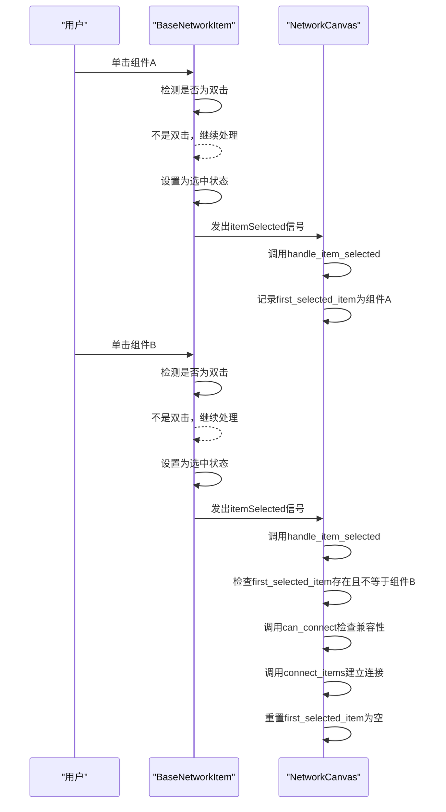
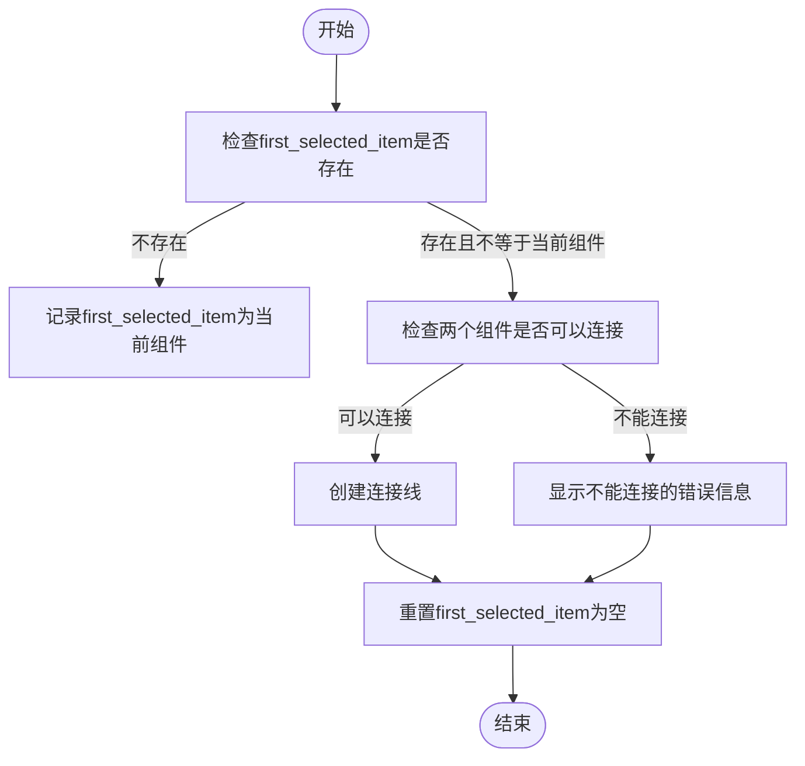
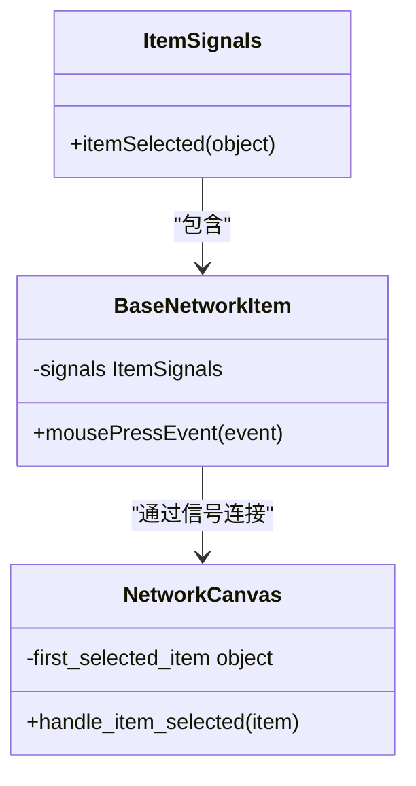
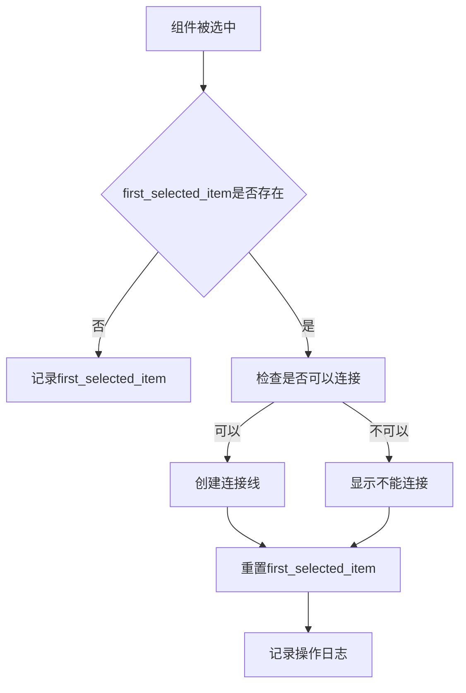

# 连接逻辑

<cite>
**本文档引用的文件**   
- [canvas.py](file://src/components/canvas.py)
- [network_items.py](file://src/components/network_items.py)
- [logger.py](file://src/utils/logger.py)
</cite>

## 目录
1. [连接逻辑概述](#连接逻辑概述)
2. [双击交互模式与组件连接机制](#双击交互模式与组件连接机制)
3. [first_selected_item状态管理](#first_selected_item状态管理)
4. [PySide6信号系统集成](#pyside6信号系统集成)
5. [连接成功后的状态重置](#连接成功后的状态重置)
6. [日志记录与调试](#日志记录与调试)

## 连接逻辑概述

电网仿真工具中的连接逻辑是整个系统的核心功能之一，它允许用户通过简单的双击交互模式在画布上连接各种电网组件。该逻辑主要由`NetworkCanvas`类中的`handle_item_selected`方法实现，通过管理`first_selected_item`状态变量来实现两步选择机制。当用户首次选中一个组件时，该组件被记录为`first_selected_item`；当用户再次选中另一个组件时，系统会尝试在这两个组件之间建立连接。这种设计模式简化了用户的操作流程，使得创建复杂的电网拓扑变得更加直观和高效。

**Section sources**
- [canvas.py](file://src/components/canvas.py#L228-L253)

## 双击交互模式与组件连接机制

双击交互模式是实现组件连接的关键。当用户在画布上双击一个组件时，`BaseNetworkItem`类的`mousePressEvent`方法会检测到双击事件，并调用`handle_double_click`方法。然而，对于组件连接而言，更重要的是单击事件的处理。`mousePressEvent`方法在检测到左键单击时，会首先检查是否为双击事件，如果不是双击，则将当前组件设置为选中状态，并通过`itemSelected`信号通知`NetworkCanvas`。`NetworkCanvas`接收到信号后，调用`handle_item_selected`方法处理连接逻辑。

**Diagram sources **
- [network_items.py](file://src/components/network_items.py#L708-L727)
- [canvas.py](file://src/components/canvas.py#L228-L253)

**Section sources**
- [network_items.py](file://src/components/network_items.py#L708-L727)
- [canvas.py](file://src/components/canvas.py#L228-L253)

## first_selected_item状态管理

`first_selected_item`是`NetworkCanvas`类中的一个实例变量，用于实现两步选择机制。该变量的管理逻辑在`handle_item_selected`方法中实现。当用户首次选中一个组件时，`first_selected_item`被设置为该组件的引用。当用户再次选中另一个组件时，系统会检查`first_selected_item`是否存在且不等于当前选中的组件。如果条件满足，系统会尝试在这两个组件之间建立连接。连接成功或失败后，`first_selected_item`都会被重置为`None`，以便开始下一次连接操作。

这种状态管理机制确保了连接操作的原子性，即每次连接操作都是独立的，不会受到之前操作的影响。同时，它也提供了一种简单的方式来实现复杂的连接逻辑，而无需用户进行复杂的操作。

**Diagram sources **
- [canvas.py](file://src/components/canvas.py#L232-L249)

**Section sources**
- [canvas.py](file://src/components/canvas.py#L232-L249)

## PySide6信号系统集成

PySide6的信号系统在连接逻辑中扮演着至关重要的角色。`BaseNetworkItem`类定义了一个`ItemSignals`对象，其中包含一个`itemSelected`信号。当用户单击一个组件时，`mousePressEvent`方法会调用`self.signals.itemSelected.emit(self)`来发出信号。`NetworkCanvas`在创建组件时，通过`item.signals.itemSelected.connect(self.handle_item_selected)`将这个信号连接到`handle_item_selected`方法。

这种信号-槽机制实现了组件和画布之间的松耦合，使得组件不需要知道画布的具体实现，而画布也不需要主动轮询组件的状态。当组件被选中时，它会自动通知画布，画布再根据当前状态决定如何处理。这种设计模式提高了代码的可维护性和可扩展性。

**Diagram sources **
- [network_items.py](file://src/components/network_items.py#L19-L22)
- [canvas.py](file://src/components/canvas.py#L221)

**Section sources**
- [network_items.py](file://src/components/network_items.py#L19-L22)
- [canvas.py](file://src/components/canvas.py#L221)

## 连接成功后的状态重置

当两个组件成功连接后，系统会执行一系列状态重置操作。首先，`first_selected_item`会被重置为`None`，以便用户可以开始下一次连接操作。其次，如果连接涉及到电表，系统会自动更新电表的测量属性，包括测量的元件类型、元件索引和测量侧。最后，系统会重置网络诊断标志位`network_is_valid`为`False`，提示用户网络拓扑已发生变化，需要重新进行网络诊断。

这些状态重置操作确保了系统的状态一致性，避免了因状态不一致导致的错误。例如，如果不重置`first_selected_item`，用户可能会意外地将同一个组件连接到多个其他组件，这可能会导致网络拓扑的混乱。

**Section sources**
- [canvas.py](file://src/components/canvas.py#L248-L249)
- [canvas.py](file://src/components/canvas.py#L491-L493)

## 日志记录与调试

日志记录是调试连接逻辑的重要工具。系统使用`LoggerManager`类来管理日志，该类实现了单例模式，确保在整个应用程序中只有一个日志实例。在连接逻辑的关键步骤中，系统会使用`logger.debug`、`logger.info`和`logger.error`等方法记录详细的调试信息。

例如，当用户选中一个组件时，系统会记录"组件被选中: {item.component_type}"；当尝试连接两个组件时，系统会记录"尝试连接: {self.first_selected_item.component_type} 和 {item.component_type}"；当连接成功时，系统会记录"可以连接，创建连接线"；当连接失败时，系统会记录"不能连接这两个组件"。这些日志信息可以帮助开发者快速定位问题，理解用户的操作流程。

**Diagram sources **
- [logger.py](file://src/utils/logger.py#L15-L108)
- [canvas.py](file://src/components/canvas.py#L230-L246)

**Section sources**
- [logger.py](file://src/utils/logger.py#L15-L108)
- [canvas.py](file://src/components/canvas.py#L230-L246)