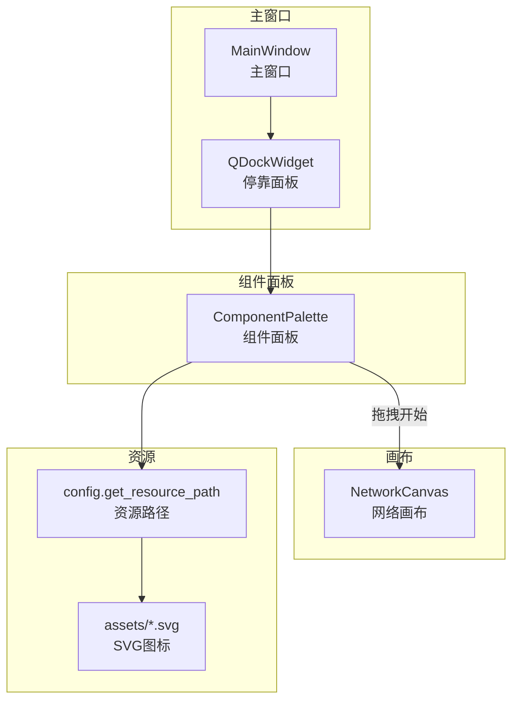
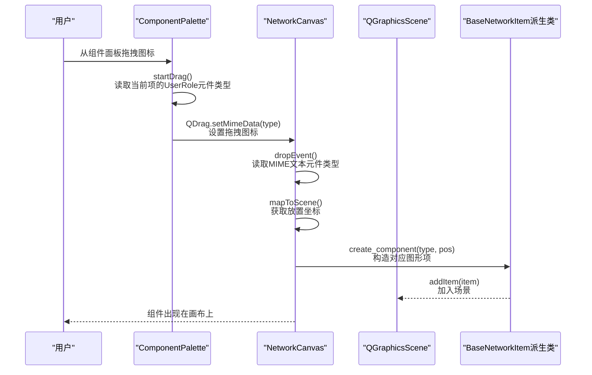
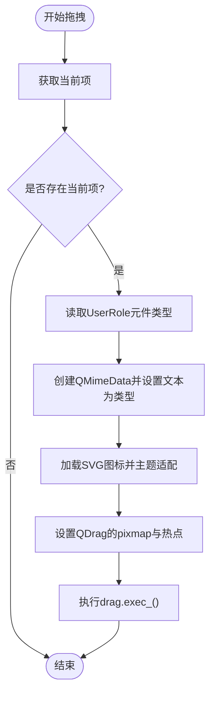
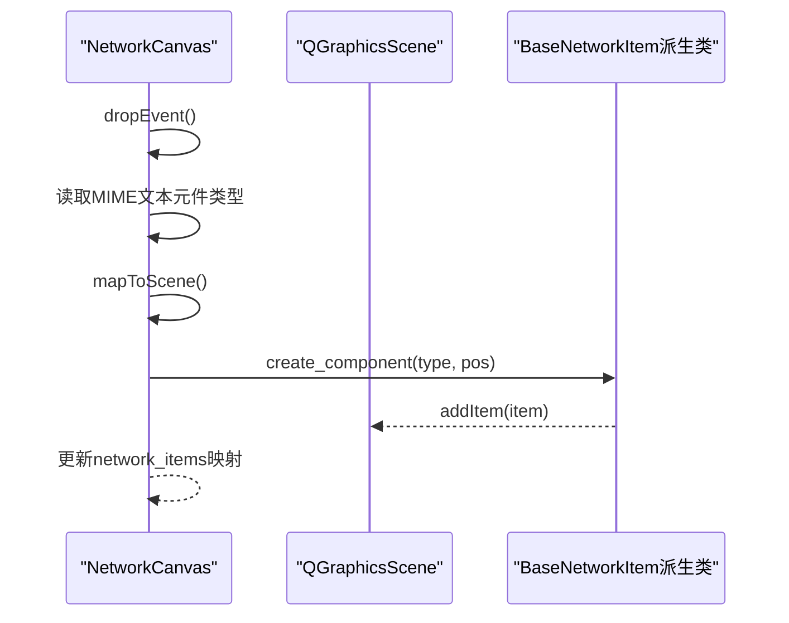
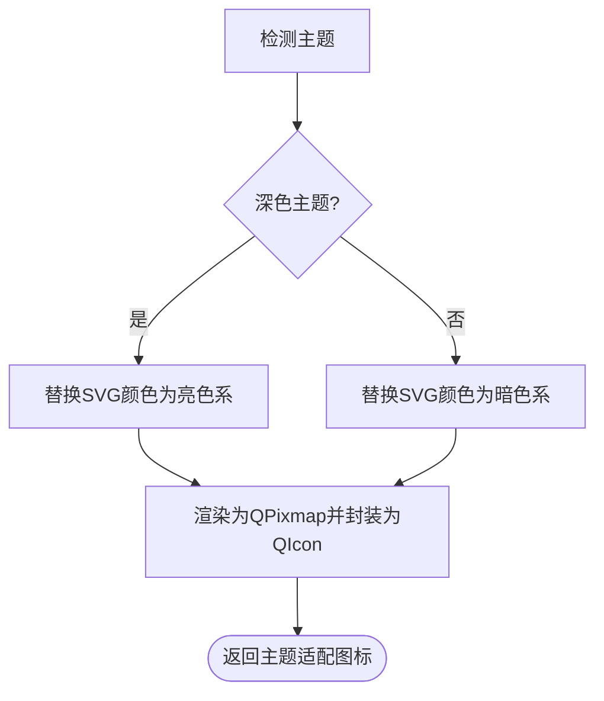
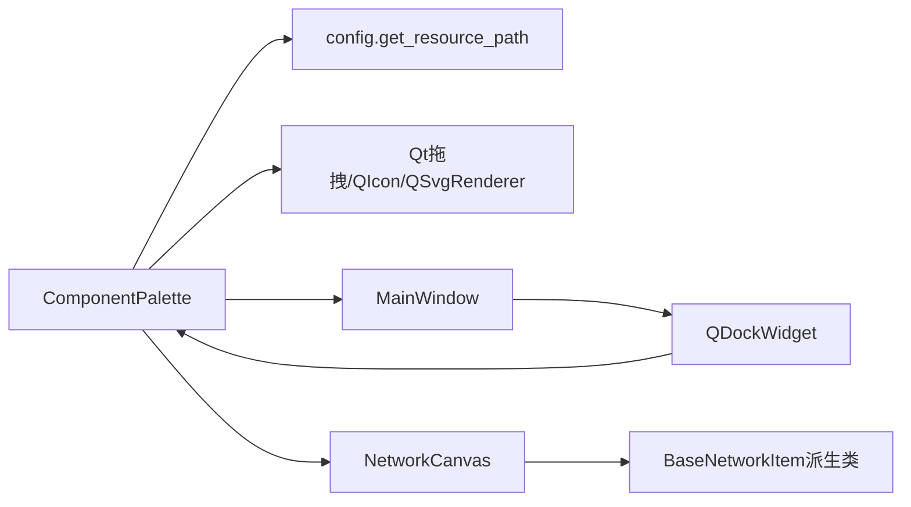

# 组件面板

<cite>
**本文引用的文件**
- [component_palette.py](file://src/components/component_palette.py)
- [canvas.py](file://src/components/canvas.py)
- [main_window.py](file://src/components/main_window.py)
- [network_items.py](file://src/components/network_items.py)
- [config.py](file://src/config.py)
- [bus.svg](file://src/assets/bus.svg)
- [line.svg](file://src/assets/line.svg)
- [transformer.svg](file://src/assets/transformer.svg)
- [static_generator.svg](file://src/assets/static_generator.svg)
- [load.svg](file://src/assets/load.svg)
- [storage.svg](file://src/assets/storage.svg)
- [charger.svg](file://src/assets/charger.svg)
- [external_grid.svg](file://src/assets/external_grid.svg)
- [meter.svg](file://src/assets/meter.svg)
- [switch.svg](file://src/assets/switch.svg)
</cite>

## 目录
1. [简介](#简介)
2. [项目结构](#项目结构)
3. [核心组件](#核心组件)
4. [架构总览](#架构总览)
5. [详细组件分析](#详细组件分析)
6. [依赖关系分析](#依赖关系分析)
7. [性能考量](#性能考量)
8. [故障排查指南](#故障排查指南)
9. [结论](#结论)
10. [附录](#附录)

## 简介
本文件全面记录组件面板（component_palette.py）的功能与实现，重点说明其如何构建一个可拖拽的电网元件库，包含母线、线路、变压器、静态电源（光伏）、负载、储能、充电站、外部电网、电表和开关等元件。文档详细解释：
- 如何通过 add_components 方法加载并显示这些元件；
- 如何通过 startDrag 方法处理拖拽事件并将元件类型传递给画布；
- 如何通过 create_themed_icon 与 adapt_svg_for_theme 方法根据系统主题（深色/浅色）动态调整 SVG 图标颜色，保证 UI 视觉一致性；
- 提供新增自定义电网元件的实践步骤与参考路径。

## 项目结构
组件面板位于 src/components/component_palette.py，作为主窗口的一个停靠面板出现；它与画布（NetworkCanvas）配合，实现从组件面板拖拽到画布创建相应图形项的功能。资源图标位于 src/assets 下，统一通过 config.py 的资源路径函数进行访问。



**图表来源**
- [component_palette.py](file://src/components/component_palette.py#L1-L168)
- [main_window.py](file://src/components/main_window.py#L145-L179)
- [canvas.py](file://src/components/canvas.py#L132-L200)
- [config.py](file://src/config.py#L238-L279)

**章节来源**
- [component_palette.py](file://src/components/component_palette.py#L1-L168)
- [main_window.py](file://src/components/main_window.py#L145-L179)
- [config.py](file://src/config.py#L238-L279)

## 核心组件
- ComponentPalette：继承自 QListWidget，提供可拖拽的电网元件图标库，支持主题适配与拖拽事件处理。
- MainWindow：创建并管理组件面板停靠窗口，负责将 ComponentPalette 注入到主界面。
- NetworkCanvas：接收来自组件面板的拖拽数据，根据元件类型创建对应的图形项。
- BaseNetworkItem 及各具体元件类：负责在画布上绘制与交互（与主题颜色、连接点、旋转等），并与组件面板的图标体系协同工作。

关键职责与行为：
- 组件面板负责加载图标、设置主题颜色、发起拖拽并传递元件类型；
- 画布负责接收拖拽数据、创建图形项并维护网络拓扑结构；
- 主窗口负责装配组件面板停靠窗口。

**章节来源**
- [component_palette.py](file://src/components/component_palette.py#L16-L168)
- [main_window.py](file://src/components/main_window.py#L145-L179)
- [canvas.py](file://src/components/canvas.py#L132-L200)
- [network_items.py](file://src/components/network_items.py#L192-L222)

## 架构总览
组件面板与画布之间的交互流程如下：



**图表来源**
- [component_palette.py](file://src/components/component_palette.py#L129-L168)
- [canvas.py](file://src/components/canvas.py#L132-L200)
- [network_items.py](file://src/components/network_items.py#L192-L222)

## 详细组件分析

### 组件面板类 ComponentPalette
- 初始化 UI：设置拖拽模式、图标尺寸、间距、视图模式等；随后调用 add_components 添加元件。
- 主题检测：通过 QApplication.instance().palette() 判断当前主题（深色/浅色）。
- SVG 主题适配：adapt_svg_for_theme 会根据主题替换 SVG 中的颜色（黑/白、深灰/浅灰），确保图标在不同主题下可见。
- 图标创建：create_themed_icon 读取适配后的 SVG 内容，使用 QSvgRenderer 渲染到 QPixmap 并封装为 QIcon。
- 添加组件：add_components 定义了组件清单（名称、类型、图标文件），通过统一的资源路径函数加载图标并设置到 QListWidgetItem。
- 拖拽处理：startDrag 读取当前项的 UserRole（即元件类型），创建 QMimeData 并设置拖拽图标，然后执行拖拽。

```mermaid
classDiagram
class ComponentPalette {
+init_ui()
+is_dark_theme() bool
+adapt_svg_for_theme(svg_path) string?
+create_themed_icon(svg_path, size) QIcon
+add_components() void
+startDrag(supportedActions) void
}
class Config {
+get_resource_path(name) string
}
class Assets {
<<files>>
"bus.svg"
"line.svg"
"transformer.svg"
"static_generator.svg"
"load.svg"
"storage.svg"
"charger.svg"
"external_grid.svg"
"meter.svg"
"switch.svg"
}
ComponentPalette --> Config : "获取资源路径"
ComponentPalette --> Assets : "读取SVG图标"
```

**图表来源**
- [component_palette.py](file://src/components/component_palette.py#L16-L168)
- [config.py](file://src/config.py#L238-L279)

**章节来源**
- [component_palette.py](file://src/components/component_palette.py#L16-L168)
- [config.py](file://src/config.py#L238-L279)

### 拖拽事件处理流程（startDrag）
- 读取当前项的 UserRole，作为元件类型；
- 创建 QMimeData 并设置文本为元件类型；
- 通过资源路径函数定位 SVG，生成主题适配后的图标；
- 设置 QDrag 的 pixmap 与热点，执行拖拽。



**图表来源**
- [component_palette.py](file://src/components/component_palette.py#L129-L168)

**章节来源**
- [component_palette.py](file://src/components/component_palette.py#L129-L168)

### 画布接收拖拽并创建图形项
- NetworkCanvas 接收拖拽事件，读取 MIME 文本（元件类型）；
- 将屏幕坐标转换为场景坐标；
- 根据类型创建对应图形项（BusItem、LineItem、TransformerItem、LoadItem、StorageItem、ChargerItem、ExternalGridItem、StaticGeneratorItem、MeterItem、SwitchItem）；
- 将图形项加入场景并维护 network_items 字典结构。



**图表来源**
- [canvas.py](file://src/components/canvas.py#L132-L200)
- [network_items.py](file://src/components/network_items.py#L192-L222)

**章节来源**
- [canvas.py](file://src/components/canvas.py#L132-L200)
- [network_items.py](file://src/components/network_items.py#L192-L222)

### 主题适配与图标渲染
- 主题检测：is_dark_theme 通过应用调色板的窗口色亮度判断深色/浅色主题。
- SVG 替换：adapt_svg_for_theme 在深色主题下将黑色替换为白色，在浅色主题下将白色替换为黑色；同时处理十六进制颜色值与常见变体。
- 图标生成：create_themed_icon 将适配后的 SVG 内容加载到 QSvgRenderer，渲染到 QPixmap 并封装为 QIcon，用于组件面板与拖拽图标。



**图表来源**
- [component_palette.py](file://src/components/component_palette.py#L36-L94)

**章节来源**
- [component_palette.py](file://src/components/component_palette.py#L36-L94)

### 添加新的自定义电网元件（实践指南）
要向组件面板添加一个新的自定义电网元件，请按以下步骤操作：
1. 准备 SVG 图标
   - 在 src/assets 目录下添加你的图标文件（例如 mydevice.svg）。
   - 确保图标使用纯色线条与填充，便于主题适配。
2. 在组件面板中注册新元件
   - 打开 src/components/component_palette.py；
   - 在 add_components 的组件清单中添加一项，包含名称、类型字符串与图标文件名。
   - 保存文件。
3. 在画布中创建图形项
   - 打开 src/components/network_items.py；
   - 在合适位置添加你的图形项类（继承 BaseNetworkItem），并在 NetworkCanvas.create_component 中增加类型分支，使其能够根据类型创建你的图形项。
4. 资源路径与图标加载
   - 确保 config.get_resource_path 能解析到你的图标文件（若图标不在 RESOURCES 映射中，将按相对路径拼接）。
   - 若需要主题适配，确认你的 SVG 中的颜色符合预期替换规则。
5. 测试拖拽
   - 启动应用，从组件面板拖拽新图标到画布，确认能正确创建图形项并显示。

参考路径：
- 组件清单与图标加载：[component_palette.py](file://src/components/component_palette.py#L95-L128)
- 资源路径函数：[config.py](file://src/config.py#L238-L279)
- 画布创建图形项：[canvas.py](file://src/components/canvas.py#L156-L191)
- 图标文件示例（已有元件）：[bus.svg](file://src/assets/bus.svg)、[line.svg](file://src/assets/line.svg)、[transformer.svg](file://src/assets/transformer.svg)、[static_generator.svg](file://src/assets/static_generator.svg)、[load.svg](file://src/assets/load.svg)、[storage.svg](file://src/assets/storage.svg)、[charger.svg](file://src/assets/charger.svg)、[external_grid.svg](file://src/assets/external_grid.svg)、[meter.svg](file://src/assets/meter.svg)、[switch.svg](file://src/assets/switch.svg)

**章节来源**
- [component_palette.py](file://src/components/component_palette.py#L95-L128)
- [config.py](file://src/config.py#L238-L279)
- [canvas.py](file://src/components/canvas.py#L156-L191)

## 依赖关系分析
- 组件面板依赖：
  - config.get_resource_path：统一资源路径，兼容打包环境；
  - Qt 的拖拽框架：QDrag、QMimeData、QListWidget；
  - Qt 的 SVG 渲染：QSvgRenderer、QIcon、QPixmap。
- 画布依赖：
  - 各图形项类（BusItem、LineItem、TransformerItem、LoadItem、StorageItem、ChargerItem、ExternalGridItem、StaticGeneratorItem、MeterItem、SwitchItem）；
  - 画布场景与事件处理（dropEvent、mapToScene）。
- 主窗口依赖：
  - 创建并装配组件面板停靠窗口。



**图表来源**
- [component_palette.py](file://src/components/component_palette.py#L16-L168)
- [main_window.py](file://src/components/main_window.py#L145-L179)
- [canvas.py](file://src/components/canvas.py#L132-L200)
- [network_items.py](file://src/components/network_items.py#L192-L222)
- [config.py](file://src/config.py#L238-L279)

**章节来源**
- [component_palette.py](file://src/components/component_palette.py#L16-L168)
- [main_window.py](file://src/components/main_window.py#L145-L179)
- [canvas.py](file://src/components/canvas.py#L132-L200)
- [network_items.py](file://src/components/network_items.py#L192-L222)
- [config.py](file://src/config.py#L238-L279)

## 性能考量
- 图标渲染：SVG 渲染到 QPixmap 是一次性操作，建议在组件面板初始化时预加载常用图标，避免频繁 IO 与渲染。
- 主题切换：主题检测与 SVG 替换在拖拽开始时执行，通常不会造成明显延迟；若图标数量较多，可在应用启动时缓存主题适配后的图标。
- 拖拽图标：startDrag 中的图标加载与渲染仅在拖拽开始时触发，对整体性能影响有限。

[本节为通用建议，无需特定文件引用]

## 故障排查指南
- 图标未显示或显示为默认空白
  - 检查资源路径是否正确：确认 config.get_resource_path 返回的路径存在；
  - 检查 SVG 文件是否存在且可读；
  - 查看日志输出，定位加载失败原因。
- 拖拽后画布不创建图形项
  - 确认 MIME 文本是否为有效的元件类型；
  - 检查 NetworkCanvas.create_component 是否包含该类型分支；
  - 确认外部电网等特殊限制逻辑（例如外部电网只允许一个）。
- 主题颜色不匹配
  - 确认 SVG 中的颜色是否为标准黑/白或十六进制形式；
  - 检查 is_dark_theme 的判断逻辑是否符合预期。

**章节来源**
- [component_palette.py](file://src/components/component_palette.py#L112-L128)
- [canvas.py](file://src/components/canvas.py#L156-L191)

## 结论
组件面板通过统一的资源路径与主题适配机制，实现了美观且一致的图标库；结合画布的拖拽接收与图形项工厂，形成了完整的“从面板拖拽到画布创建”的工作流。新增自定义元件只需遵循既定流程即可快速集成，保证 UI 与功能的一致性。

[本节为总结，无需特定文件引用]

## 附录
- 关键实现路径参考
  - 组件面板初始化与图标加载：[component_palette.py](file://src/components/component_palette.py#L23-L128)
  - 拖拽事件与图标设置：[component_palette.py](file://src/components/component_palette.py#L129-L168)
  - 画布接收拖拽并创建图形项：[canvas.py](file://src/components/canvas.py#L132-L200)
  - 资源路径与资产目录：[config.py](file://src/config.py#L238-L279)