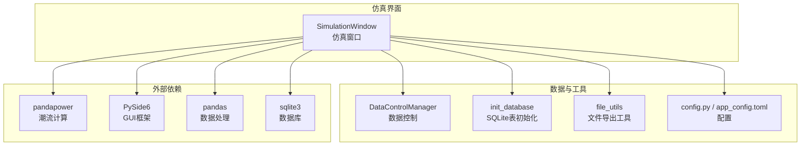
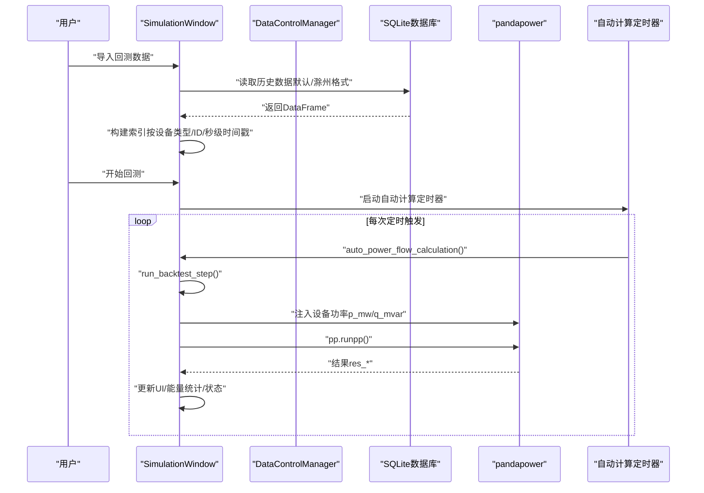
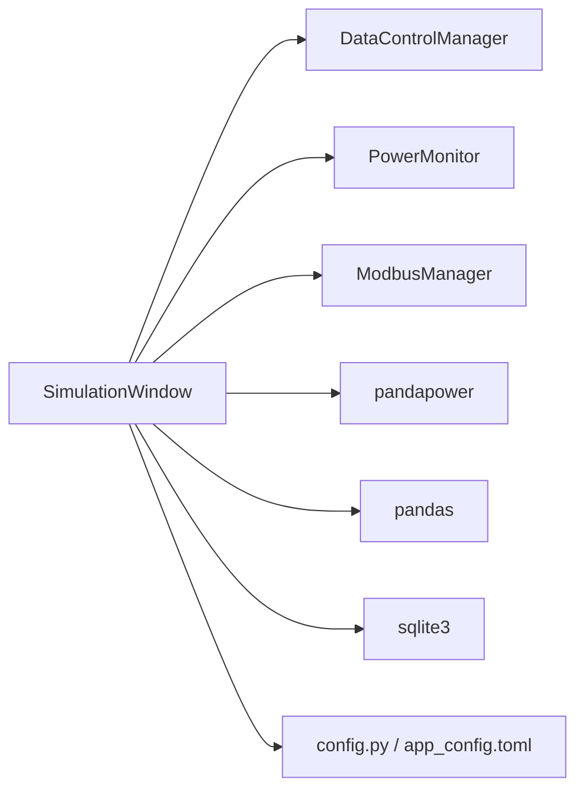

# 回测功能

<cite>
**本文引用的文件**
- [simulation_window.py](file://src/components/simulation_window.py)
- [data_control.py](file://src/components/data_control.py)
- [sqlite.py](file://src/components/sqlite.py)
- [file_utils.py](file://src/utils/file_utils.py)
- [config.py](file://src/config.py)
- [app_config.toml](file://src/app_config.toml)
- [README.md](file://README.md)
</cite>

## 目录
1. [简介](#简介)
2. [项目结构](#项目结构)
3. [核心组件](#核心组件)
4. [架构总览](#架构总览)
5. [详细组件分析](#详细组件分析)
6. [依赖关系分析](#依赖关系分析)
7. [性能考量](#性能考量)
8. [故障排查指南](#故障排查指南)
9. [结论](#结论)
10. [附录](#附录)

## 简介
本文件面向pp_tool的回测功能，围绕仿真窗口（simulation_window.py）如何从外部数据库导入历史数据，并按时间步长驱动仿真以复现历史场景展开。文档重点解释：
- 回测数据导入流程与数据格式支持（默认SQLite格式与“滁州工厂数据格式”）
- 回测过程中的时间同步机制与步进策略
- 回测与自动潮流计算的协同关系
- 实际操作的代码级示例路径（以文件路径和行号标注）

## 项目结构
pp_tool采用模块化的组件化设计，回测功能主要集中在仿真窗口组件中，配合数据控制、SQLite工具与配置模块共同完成。

图表来源
- [simulation_window.py](file://src/components/simulation_window.py#L1-L120)
- [data_control.py](file://src/components/data_control.py#L1-L60)
- [sqlite.py](file://src/components/sqlite.py#L1-L118)
- [file_utils.py](file://src/utils/file_utils.py#L1-L146)
- [config.py](file://src/config.py#L1-L120)
- [app_config.toml](file://src/app_config.toml#L1-L13)

章节来源
- [README.md](file://README.md#L1-L48)
- [simulation_window.py](file://src/components/simulation_window.py#L1-L120)

## 核心组件
- 仿真窗口（SimulationWindow）
  - 负责回测数据导入、索引构建、时间步进与设备功率注入、状态显示、记录数据等。
  - 关键职责：导入回测数据、准备索引、按秒步进、调用自动潮流计算、更新UI状态。
- 数据控制（DataControlManager）
  - 在回测期间禁止数据自动生成，避免与回测注入冲突。
- SQLite工具（init_database）
  - 初始化数据库表结构，确保回测/记录数据的表存在。
- 文件工具（file_utils）
  - 提供导出结果等文件操作能力，便于回测结果的输出与复盘。
- 配置（config.py、app_config.toml）
  - 提供功率单位等配置项，影响数据显示与导出。

章节来源
- [simulation_window.py](file://src/components/simulation_window.py#L1-L120)
- [data_control.py](file://src/components/data_control.py#L770-L800)
- [sqlite.py](file://src/components/sqlite.py#L1-L118)
- [file_utils.py](file://src/utils/file_utils.py#L96-L146)
- [config.py](file://src/config.py#L39-L120)
- [app_config.toml](file://src/app_config.toml#L1-L13)

## 架构总览
回测流程的关键交互如下：

图表来源
- [simulation_window.py](file://src/components/simulation_window.py#L1036-L1113)
- [simulation_window.py](file://src/components/simulation_window.py#L2527-L2603)
- [data_control.py](file://src/components/data_control.py#L770-L800)

## 详细组件分析

### 回测数据导入与格式支持
- 导入入口
  - 菜单“数据 -> 回测功能 -> 导入回测数据”，弹出文件选择与格式选择对话框。
  - 支持两种格式：
    - 默认格式（SQLite数据库）
    - 滁州工厂数据格式（CSV/SQLite，按设备SN与时间戳组织）
- 导入流程
  - 选择文件后，后台线程启动导入工作器，进度通过信号反馈，完成后发出完成/失败信号。
  - 导入完成后，会询问是否立即开始回测。
- 数据格式说明
  - 默认格式：数据库包含若干数据表（如meter_data、storage_data、pv_data、charger_data、load_data等），每张表包含设备标识、时间戳、有功/无功功率等字段；导入时会按设备类型/ID/时间戳进行解析与重采样。
  - 滁州工厂数据格式：按设备SN与时间戳组织，导入时会针对指定设备（关口电表、光伏、储能）进行筛选与插值，计算负载功率并生成统一的回测数据帧。
- 重采样与索引
  - 导入完成后，会对数据按秒重采样，缺失值前向填充并线性插值，随后构建索引结构（嵌套字典：设备类型 -> 设备ID -> 秒级时间戳 -> 数据点），并记录最大时间戳，用于回测步进判断。

章节来源
- [simulation_window.py](file://src/components/simulation_window.py#L483-L521)
- [simulation_window.py](file://src/components/simulation_window.py#L522-L710)
- [simulation_window.py](file://src/components/simulation_window.py#L711-L859)
- [simulation_window.py](file://src/components/simulation_window.py#L865-L934)
- [simulation_window.py](file://src/components/simulation_window.py#L935-L961)
- [simulation_window.py](file://src/components/simulation_window.py#L962-L991)
- [sqlite.py](file://src/components/sqlite.py#L1-L118)

### 时间同步机制与步进策略
- 时间基线
  - 回测以“从开始到现在的秒数”为步进单位，同时维护一个基准时间戳（来自数据中的最小时间戳），将当前秒数映射到数据时间戳。
- 步进执行
  - 自动计算定时器每次触发时，调用自动潮流计算主方法；在回测期间，先执行回测步进，再进行Modbus参数更新、开关状态同步、潮流计算与能量统计更新。
- 结束条件
  - 当当前数据时间戳超过数据最大时间戳时，回测停止，所有设备功率重置为零。

章节来源
- [simulation_window.py](file://src/components/simulation_window.py#L1036-L1113)
- [simulation_window.py](file://src/components/simulation_window.py#L1114-L1176)
- [simulation_window.py](file://src/components/simulation_window.py#L1177-L1217)
- [simulation_window.py](file://src/components/simulation_window.py#L2527-L2603)

### 回测与自动潮流计算的协同
- 回测注入
  - 在每次自动计算周期内，先根据当前秒数从索引中取出对应设备的功率值，注入到网络模型的相应表（如load、sgen、storage等）。
- 数据生成禁用
  - 回测期间禁止数据自动生成，避免与回测注入冲突。
- UI与状态
  - 回测开始/停止时更新状态指示器与状态栏消息；回测结束后重置设备功率。

章节来源
- [simulation_window.py](file://src/components/simulation_window.py#L1114-L1176)
- [data_control.py](file://src/components/data_control.py#L770-L800)
- [simulation_window.py](file://src/components/simulation_window.py#L1177-L1217)

### 数据记录与导出
- 记录数据
  - 启动记录后，每秒将当前仿真数据写入SQLite数据库（meter_data、pv_data、storage_data、charger_data、load_data等），并支持停止记录。
- 导出结果
  - 支持将计算结果导出为CSV/JSON等格式，便于离线分析与复盘。

章节来源
- [simulation_window.py](file://src/components/simulation_window.py#L1219-L1406)
- [file_utils.py](file://src/utils/file_utils.py#L96-L146)

## 依赖关系分析
- 组件耦合
  - SimulationWindow依赖DataControlManager（回测期间禁止数据生成）、PowerMonitor（电表测量）、ModbusManager（设备通信）、pandapower（潮流计算）、pandas（数据处理）、sqlite3（数据库）。
- 外部依赖
  - PySide6用于GUI与对话框；pandapower用于电力系统潮流计算；pandas用于数据读取与重采样；sqlite3用于历史数据与记录数据的存储。

图表来源
- [simulation_window.py](file://src/components/simulation_window.py#L1-L120)
- [data_control.py](file://src/components/data_control.py#L1-L60)
- [config.py](file://src/config.py#L39-L120)
- [app_config.toml](file://src/app_config.toml#L1-L13)

## 性能考量
- 数据重采样
  - 对每台设备按秒重采样，缺失值前向填充与线性插值，避免频繁I/O与不规则采样导致的仿真抖动。
- 索引结构
  - 使用嵌套字典索引（设备类型 -> 设备ID -> 秒级时间戳），查询复杂度近似O(1)，提升回测步进效率。
- 自动计算周期
  - 通过定时器控制计算频率，结合UI更新节流（如每N次计算更新一次设备树/功率曲线），降低UI压力。
- 内存与线程
  - 导入与记录使用后台线程，避免阻塞UI；窗口关闭时进行资源清理与信号断开，防止泄漏。

章节来源
- [simulation_window.py](file://src/components/simulation_window.py#L800-L859)
- [simulation_window.py](file://src/components/simulation_window.py#L865-L934)
- [simulation_window.py](file://src/components/simulation_window.py#L2527-L2603)
- [simulation_window.py](file://src/components/simulation_window.py#L1219-L1406)

## 故障排查指南
- 导入失败
  - 若提示缺少必要列或格式不匹配，检查数据文件是否包含timestamp、device_type、device_id、p_mw等字段；确认设备SN与网络模型中的设备映射关系。
- 回测未开始
  - 确认已成功导入回测数据并点击“开始回测”；检查状态指示器与状态栏消息。
- 回测提前结束
  - 当当前秒数超过数据最大时间戳时会自动停止，检查数据时间范围与设备功率是否全部为零。
- 数据生成冲突
  - 回测期间会禁止数据自动生成，若发现功率异常波动，确认是否开启了数据生成功能。
- 记录数据异常
  - 检查数据库路径与权限；确认每秒写入是否成功；必要时查看日志。

章节来源
- [simulation_window.py](file://src/components/simulation_window.py#L935-L961)
- [simulation_window.py](file://src/components/simulation_window.py#L962-L991)
- [simulation_window.py](file://src/components/simulation_window.py#L1036-L1113)
- [simulation_window.py](file://src/components/simulation_window.py#L1177-L1217)
- [data_control.py](file://src/components/data_control.py#L770-L800)

## 结论
pp_tool的回测功能通过“导入 -> 索引 -> 步进 -> 注入 -> 计算”的闭环，实现了对历史场景的高保真复现。其关键优势在于：
- 支持多种数据格式（默认SQLite与滁州工厂格式）
- 以秒级时间步长驱动仿真，具备良好的时序一致性
- 与自动潮流计算紧密集成，确保仿真稳定与可视化及时更新
- 提供数据记录与导出能力，便于结果复盘与报告生成

## 附录

### 实际操作示例（代码级路径）
- 从SQLite数据库导入默认格式回测数据并启动回测
  - 导入入口与格式选择：[导入回测数据](file://src/components/simulation_window.py#L483-L521)
  - 默认格式读取与重采样：[读取默认格式并重采样](file://src/components/simulation_window.py#L711-L859)
  - 导入完成后的索引构建与自动开始回测：[构建索引与回调](file://src/components/simulation_window.py#L935-L961)
  - 开始回测与状态更新：[开始回测](file://src/components/simulation_window.py#L1036-L1071)
  - 回测步进与功率注入：[回测步进](file://src/components/simulation_window.py#L1073-L1113)、[注入设备功率](file://src/components/simulation_window.py#L1114-L1176)
  - 自动计算主流程（含回测步进）：[自动计算主方法](file://src/components/simulation_window.py#L2527-L2603)

- 从SQLite数据库导入“滁州工厂数据格式”并启动回测
  - 滁州格式读取与插值：[滁州格式读取](file://src/components/simulation_window.py#L522-L710)
  - 负载功率计算与统一数据帧生成：[计算负载功率](file://src/components/simulation_window.py#L639-L666)

- 初始化数据库表结构（用于记录仿真数据）
  - 初始化数据库表：[初始化数据库](file://src/components/sqlite.py#L1-L118)

- 回测期间禁止数据自动生成
  - 禁用数据生成：[回测期间禁止生成](file://src/components/data_control.py#L770-L800)

- 导出计算结果
  - 导出结果（CSV/JSON）：[导出结果](file://src/utils/file_utils.py#L96-L146)