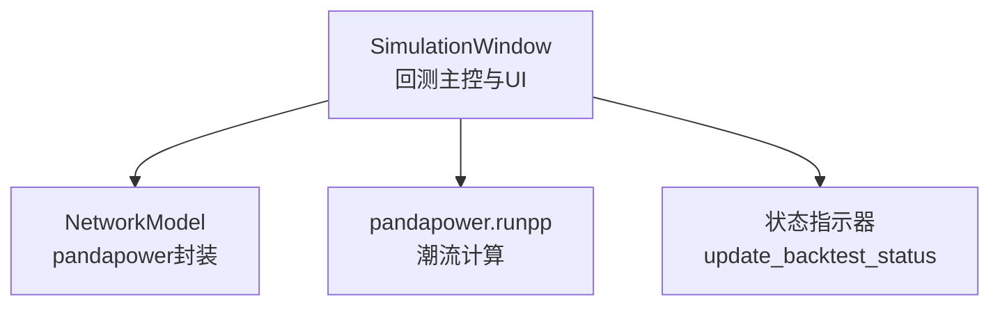
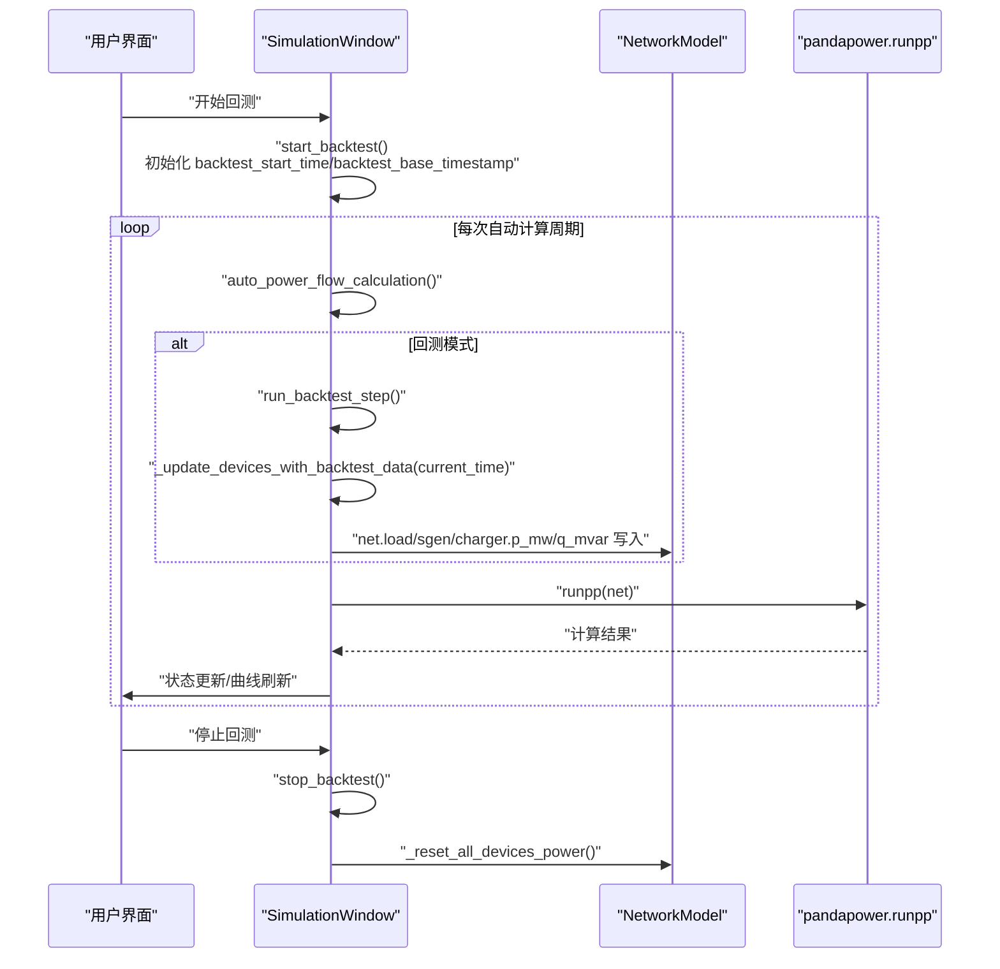
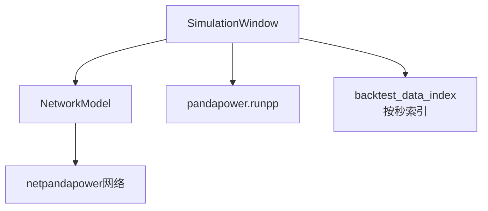

# 回测执行流程

<cite>
**本文引用的文件**
- [simulation_window.py](file://src/components/simulation_window.py)
- [network_model.py](file://src/models/network_model.py)
</cite>

## 目录
1. [简介](#简介)
2. [项目结构](#项目结构)
3. [核心组件](#核心组件)
4. [架构总览](#架构总览)
5. [详细组件分析](#详细组件分析)
6. [依赖关系分析](#依赖关系分析)
7. [性能考量](#性能考量)
8. [故障排查指南](#故障排查指南)
9. [结论](#结论)

## 简介
本文件系统性梳理 pp_tool 的回测执行流程，围绕以下目标展开：
- 解释 start_backtest 如何启动回测并初始化时间同步参数
- 说明 run_backtest_step 如何按时间步长推进仿真
- 阐述 _update_devices_with_backtest_data 如何从 backtest_data_index 中提取设备功率并写入 pandapower 网络模型
- 描述 backtest_current_step、backtest_start_time、backtest_base_timestamp 的作用与递增/初始化逻辑
- 展示与 pandapower 仿真引擎的集成方式
- 提供完整的回测生命周期示例：开始、暂停（通过停止）、停止、状态更新（update_backtest_status）

## 项目结构
回测相关的核心代码集中在仿真窗口组件中，网络模型负责与 pandapower 引擎交互。关键文件如下：
- 回测主控与 UI：src/components/simulation_window.py
- 网络模型与 pandapower 集成：src/models/network_model.py

图示来源
- [simulation_window.py](file://src/components/simulation_window.py#L269-L284)
- [network_model.py](file://src/models/network_model.py#L583-L596)

章节来源
- [simulation_window.py](file://src/components/simulation_window.py#L269-L284)
- [network_model.py](file://src/models/network_model.py#L583-L596)

## 核心组件
- 回测主控类：SimulationWindow
  - 负责导入回测数据、构建索引、启动/停止回测、按时间步推进、更新设备功率、调用潮流计算
- 网络模型：NetworkModel
  - 封装 pandapower 网络对象 net，提供运行潮流计算等接口

章节来源
- [simulation_window.py](file://src/components/simulation_window.py#L1036-L1113)
- [network_model.py](file://src/models/network_model.py#L583-L596)

## 架构总览
回测执行采用“自动计算驱动 + 回测步进”的模式：
- 自动计算定时器触发 auto_power_flow_calculation
- 在每次计算前，若处于回测模式，则先执行 run_backtest_step
- run_backtest_step 依据 backtest_start_time 和 backtest_base_timestamp 计算当前秒数，定位 backtest_data_index 中的数据点，更新设备功率
- 更新完成后，调用 pandapower 的 runpp 进行潮流计算

图示来源
- [simulation_window.py](file://src/components/simulation_window.py#L1036-L1113)
- [simulation_window.py](file://src/components/simulation_window.py#L2527-L2603)
- [network_model.py](file://src/models/network_model.py#L583-L596)

## 详细组件分析

### start_backtest：启动回测与时间同步初始化
- 功能要点
  - 校验是否存在回测数据
  - 设置 is_backtesting 标志
  - 初始化 backtest_current_step = 0
  - 记录 backtest_start_time = 当前时间
  - 计算 backtest_base_timestamp（基于 backtest_data_index 的最小时间戳），用于将“相对秒数”映射到“绝对秒级时间戳”
  - 更新 UI 状态指示器为“运行中”

- 时间同步机制
  - backtest_start_time：回测开始时刻的系统时间
  - backtest_current_step：回测步数计数器，每步递增
  - backtest_base_timestamp：回测数据的最小时间戳，用于将“相对秒数”转换为“数据时间戳”

章节来源
- [simulation_window.py](file://src/components/simulation_window.py#L1036-L1071)
- [simulation_window.py](file://src/components/simulation_window.py#L1050-L1067)

### run_backtest_step：按时间步长推进仿真
- 功能要点
  - 计算当前相对秒数 current_second = int(time.time() - backtest_start_time)
  - 计算 data_timestamp = backtest_base_timestamp + current_second
  - 若 data_timestamp 超过 backtest_max_timestamp，重置所有设备功率并停止回测
  - 调用 _update_devices_with_backtest_data(current_time) 更新设备功率
  - backtest_current_step += 1

- 边界处理
  - 若未构建 backtest_data_index 或数据为空，直接返回
  - 若 current_second 超过最大时间戳，触发停止逻辑

章节来源
- [simulation_window.py](file://src/components/simulation_window.py#L1073-L1113)

### _update_devices_with_backtest_data：从 backtest_data_index 提取功率并写入网络模型
- 功能要点
  - 将 current_time 转换为整数秒 current_second
  - 计算 data_timestamp（考虑 backtest_base_timestamp）
  - 遍历 backtest_data_index[device_type][device_id]，若 data_timestamp 存在则取出数据点
  - 调用 _apply_device_backtest_data(device_type, device_id, p_mw, q_mvar) 写入 pandapower 网络模型
  - 日志记录命中/未命中情况

- 设备类型支持
  - 负载（load）
  - 静态发电机（static_generator，即光伏）
  - 充电站（charger，映射为负载）

章节来源
- [simulation_window.py](file://src/components/simulation_window.py#L1114-L1176)
- [simulation_window.py](file://src/components/simulation_window.py#L1151-L1176)

### _apply_device_backtest_data：写入 pandapower 网络模型
- 功能要点
  - 从 NetworkModel 获取 net
  - 根据设备类型写入相应表的 p_mw/q_mvar 字段
  - 对应设备索引需存在于 net 对应表的索引中
  - 异常时记录错误日志

- 设备映射
  - load -> net.load
  - static_generator -> net.sgen
  - charger -> net.load（充电站作为可控负载）

章节来源
- [simulation_window.py](file://src/components/simulation_window.py#L1151-L1176)

### 与 pandapower 的集成：auto_power_flow_calculation
- 功能要点
  - 在回测期间，先执行 run_backtest_step，确保时序一致
  - 批量更新开关状态、Modbus 参数
  - 调用 pp.runpp(net) 进行潮流计算
  - 成功后更新功率曲线、设备树、实时信息等；失败时记录错误

- 时序保障
  - 回测步进在 runpp 之前执行，确保设备功率更新后再进行潮流计算

章节来源
- [simulation_window.py](file://src/components/simulation_window.py#L2527-L2603)
- [network_model.py](file://src/models/network_model.py#L583-L596)

### 停止与状态更新：stop_backtest 与 update_backtest_status
- stop_backtest
  - is_backtesting = False
  - 调用 update_backtest_status(False)
  - 重置所有设备功率（负载、静态发电机、储能）
  - 更新状态栏与弹窗提示

- update_backtest_status
  - 更新 UI 状态指示器颜色与文本

章节来源
- [simulation_window.py](file://src/components/simulation_window.py#L1177-L1190)
- [simulation_window.py](file://src/components/simulation_window.py#L269-L284)
- [simulation_window.py](file://src/components/simulation_window.py#L1188-L1217)

## 依赖关系分析
- SimulationWindow 依赖 NetworkModel 的 net 对象
- 回测流程依赖 pandapower 的 runpp 接口
- 回测数据索引 backtest_data_index 由导入流程构建，加速时间戳查询

图示来源
- [simulation_window.py](file://src/components/simulation_window.py#L1036-L1113)
- [simulation_window.py](file://src/components/simulation_window.py#L2527-L2603)
- [network_model.py](file://src/models/network_model.py#L583-L596)

## 性能考量
- backtest_data_index 采用“设备类型 -> 设备ID -> 秒级时间戳 -> 数据点”的三层字典，查询复杂度近似 O(1)，适合高频回测场景
- run_backtest_step 每个周期只做索引查找与少量字段写入，开销较小
- auto_power_flow_calculation 中回测步进在 runpp 前执行，避免了跨周期的功率漂移

[本节为通用性能讨论，无需列出具体文件来源]

## 故障排查指南
- 回测未开始
  - 检查是否已导入回测数据（backtest_data 非空）
  - 确认 start_backtest 已被调用，is_backtesting 为 True
- 回测提前停止
  - 检查 data_timestamp 是否超过 backtest_max_timestamp
  - 查看 run_backtest_step 的日志输出
- 设备功率未更新
  - 确认 backtest_data_index 中存在对应设备与时间戳
  - 检查 _apply_device_backtest_data 的设备类型与索引映射
- 潮流计算失败
  - 查看 auto_power_flow_calculation 的异常日志
  - 确认网络模型 net 正常、设备索引有效

章节来源
- [simulation_window.py](file://src/components/simulation_window.py#L1073-L1113)
- [simulation_window.py](file://src/components/simulation_window.py#L1151-L1176)
- [simulation_window.py](file://src/components/simulation_window.py#L2527-L2603)

## 结论
pp_tool 的回测执行通过“自动计算驱动 + 回测步进”的方式，实现了以历史功率数据为驱动的时序仿真。start_backtest 初始化时间同步参数，run_backtest_step 以秒为步长推进，_update_devices_with_backtest_data 与 _apply_device_backtest_data 将历史功率写入 pandapower 网络模型，最终由 auto_power_flow_calculation 调用 runpp 完成潮流计算。该设计具备清晰的生命周期与良好的时序一致性，便于扩展与维护。