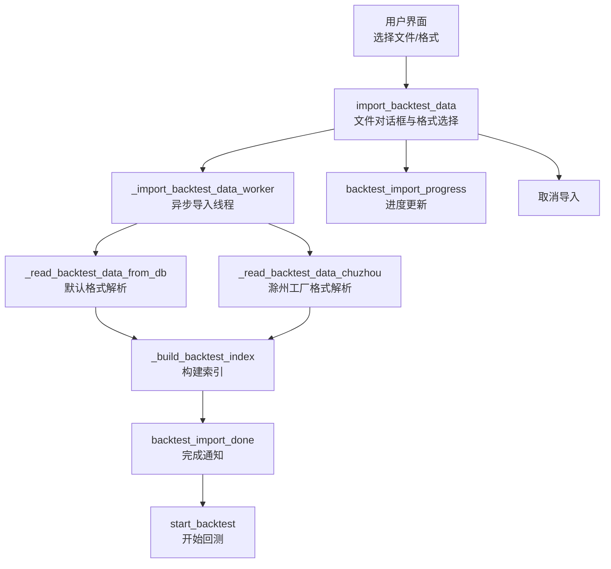
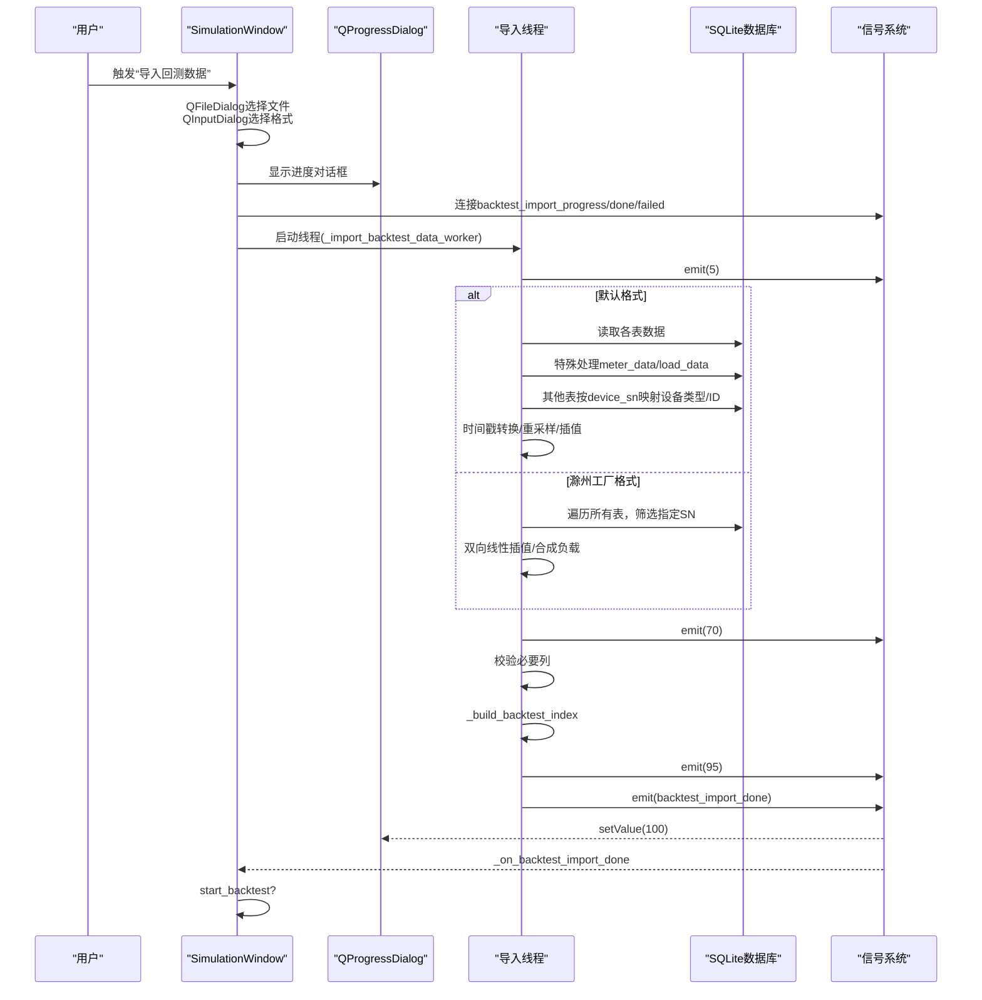
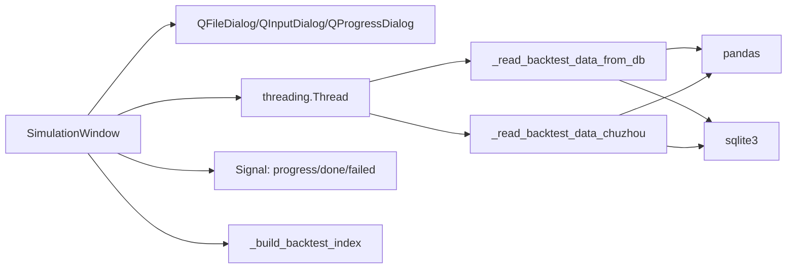

# 回测数据导入

<cite>
**本文引用的文件**
- [simulation_window.py](file://src/components/simulation_window.py)
</cite>

## 目录
1. [简介](#简介)
2. [项目结构](#项目结构)
3. [核心组件](#核心组件)
4. [架构总览](#架构总览)
5. [详细组件分析](#详细组件分析)
6. [依赖关系分析](#依赖关系分析)
7. [性能考量](#性能考量)
8. [故障排查指南](#故障排查指南)
9. [结论](#结论)

## 简介
本章节聚焦于pp_tool中“回测数据导入”机制，围绕SimulationWindow类的import_backtest_data方法展开，详细说明其通过文件对话框选择SQLite数据库文件、支持默认格式与滁州工厂特定格式导入的流程；深入解析_read_backtest_data_from_db与_read_backtest_data_chuzhou两个私有方法在解析不同数据源时的实现逻辑，包括时间戳处理、功率单位转换、设备SN匹配以及数据插值策略；并提供从实际数据库文件导入数据的代码示例路径，说明backtest_import_progress与backtest_import_done两个信号如何实现异步导入过程中的进度更新与完成通知，最后描述用户在UI上选择数据格式的交互流程及错误处理机制。

## 项目结构
回测数据导入功能位于仿真界面组件中，核心入口为SimulationWindow类的import_backtest_data方法，配套的异步工作线程、进度对话框、信号与错误处理均在同一文件内实现。

图示来源
- [simulation_window.py](file://src/components/simulation_window.py#L483-L521)
- [simulation_window.py](file://src/components/simulation_window.py#L935-L961)
- [simulation_window.py](file://src/components/simulation_window.py#L673-L864)
- [simulation_window.py](file://src/components/simulation_window.py#L522-L671)
- [simulation_window.py](file://src/components/simulation_window.py#L911-L933)
- [simulation_window.py](file://src/components/simulation_window.py#L962-L981)

章节来源
- [simulation_window.py](file://src/components/simulation_window.py#L483-L521)

## 核心组件
- 导入入口：import_backtest_data
  - 通过QFileDialog选择SQLite数据库文件（默认格式）或任意文件（滁州工厂格式）
  - 通过QInputDialog选择数据格式（默认格式/滁州工厂数据格式）
  - 校验文件扩展名（默认格式必须为.db）
  - 显示QProgressDialog并注册backtest_import_progress/backtest_import_done/backtest_import_failed信号
  - 启动后台线程执行导入

- 异步导入线程：_import_backtest_data_worker
  - 发出初始进度（5%）
  - 根据所选格式调用对应解析方法
  - 若用户取消则发出失败信号
  - 校验必要列（timestamp/device_type/device_id/p_mw）
  - 构建索引（_build_backtest_index）
  - 发出中间进度（70%/95%）
  - 发出完成信号携带DataFrame、索引与最大时间戳
  - 结束时发出100%进度

- 数据解析器：
  - _read_backtest_data_from_db：默认格式（SQLite数据库）
  - _read_backtest_data_chuzhou：滁州工厂特定格式（SQLite数据库）

- 索引构建：_build_backtest_index
  - 以(device_type, device_id)分组，将timestamp转为整秒作为键
  - 存储p_mw/q_mvar，记录max_ts

- 完成回调：_on_backtest_import_done
  - 关闭进度对话框
  - 写入backtest_data/backtest_data_index/backtest_max_timestamp
  - 统计并弹窗提示，询问是否立即开始回测

- 失败回调：_on_backtest_import_failed
  - 关闭进度对话框
  - 区分“已取消”与异常，给出相应提示

章节来源
- [simulation_window.py](file://src/components/simulation_window.py#L483-L521)
- [simulation_window.py](file://src/components/simulation_window.py#L935-L961)
- [simulation_window.py](file://src/components/simulation_window.py#L911-L933)
- [simulation_window.py](file://src/components/simulation_window.py#L962-L981)

## 架构总览
回测数据导入采用“UI触发 -> 异步线程 -> 解析器 -> 索引构建 -> 信号通知”的流水线式设计，既保证UI响应，又便于错误处理与进度反馈。

图示来源
- [simulation_window.py](file://src/components/simulation_window.py#L483-L521)
- [simulation_window.py](file://src/components/simulation_window.py#L935-L961)
- [simulation_window.py](file://src/components/simulation_window.py#L673-L864)
- [simulation_window.py](file://src/components/simulation_window.py#L522-L671)
- [simulation_window.py](file://src/components/simulation_window.py#L911-L933)
- [simulation_window.py](file://src/components/simulation_window.py#L962-L981)

## 详细组件分析

### import_backtest_data：UI交互与导入入口
- 文件对话框：仅允许.db文件（默认格式），但滁州工厂格式可接受任意文件
- 格式选择：默认格式/滁州工厂数据格式
- 进度对话框：显示“取消”按钮，连接取消回调
- 信号绑定：backtest_import_progress绑定到进度值；backtest_import_done与backtest_import_failed分别绑定到完成与失败回调
- 后台线程：启动_worker，daemon线程避免阻塞退出

章节来源
- [simulation_window.py](file://src/components/simulation_window.py#L483-L521)

### _import_backtest_data_worker：异步导入工作流
- 进度：5% -> 70% -> 95% -> 100%
- 格式分支：默认格式调用_read_backtest_data_from_db；滁州工厂格式调用_read_backtest_data_chuzhou
- 校验：确保DataFrame包含timestamp/device_type/device_id/p_mw
- 索引：_build_backtest_index(df)构建索引与max_ts
- 通知：backtest_import_done(payload)携带df/index/max_ts；backtest_import_failed(msg)

章节来源
- [simulation_window.py](file://src/components/simulation_window.py#L935-L961)

### _read_backtest_data_from_db：默认格式解析
- 数据库扫描：列出所有表，跳过cmd_data
- 表处理：
  - meter_data：按表名推断设备类型为meter，使用device_sn映射到network_items中的设备类型与ID，功率单位转换为MW/MVAr
  - load_data：按device_id直接写入
  - 其他表：按表名去除_data后推断设备类型，device_sn映射设备类型与ID，按设备类型选择activePower/reactivePower字段并转换单位
- 时间戳：尝试unit='s'转换为datetime，否则降级为其他格式，最终按timestamp排序
- 重采样与插值：
  - 以设备类型与ID分组，1秒重采样
  - 前向填充+数值列线性插值
  - 转换回秒级时间戳，最终按timestamp排序

章节来源
- [simulation_window.py](file://src/components/simulation_window.py#L673-L864)

### _read_backtest_data_chuzhou：滁州工厂格式解析
- 设备清单：明确gateway_meter_sn、pv_sns、storage_sn
- 数据采集：遍历数据库中所有表，跳过cmd_data；仅保留device_sn与timestamp、activePower字段
- 时间戳与插值：
  - 收集所有时间戳，生成从最小到最大时间戳的完整秒序列
  - 对每个设备的时间序列进行双向线性插值
- 功率合成：
  - 关口电表功率取负
  - 光伏功率累加
  - 储能功率保持正值
  - 负载功率 = 关口电表功率 - 光伏总功率 - 储能功率
- 设备映射：使用_find_device_type_and_id_by_sn(device_sn, 'pv')将SN映射到设备类型与ID
- 输出：生成包含timestamp/device_type/device_id/p_mw/q_mvar的DataFrame

章节来源
- [simulation_window.py](file://src/components/simulation_window.py#L522-L671)

### _build_backtest_index：索引构建与最大时间戳
- 输入：DataFrame
- 分组：按(device_type, device_id)分组
- 键值：timestamp转为整秒作为索引键
- 存储：p_mw/q_mvar，记录max_ts
- 返回：index与max_ts

章节来源
- [simulation_window.py](file://src/components/simulation_window.py#L911-L933)

### 信号与UI回调：进度与完成通知
- backtest_import_progress：绑定到QProgressDialog.setValue
- backtest_import_done：_on_backtest_import_done
  - 关闭进度对话框
  - 写入backtest_data/backtest_data_index/backtest_max_timestamp
  - 统计设备类型与数量，弹窗提示并询问是否立即开始回测
- backtest_import_failed：_on_backtest_import_failed
  - 关闭进度对话框
  - 区分“已取消”与异常，给出相应提示

章节来源
- [simulation_window.py](file://src/components/simulation_window.py#L962-L981)

### 设备SN匹配与查找：_find_device_type_and_id_by_sn
- 优先按表名推断设备类型（pv/storage/charger/meter/load）
- 在network_items中按properties.sn精确匹配
- 返回(component_type, component_index)，若未找到返回(None, None)

章节来源
- [simulation_window.py](file://src/components/simulation_window.py#L996-L1035)

### 从实际数据库导入数据的代码示例路径
- 默认格式（SQLite数据库）：参考路径
  - [simulation_window.py](file://src/components/simulation_window.py#L483-L521)
  - [simulation_window.py](file://src/components/simulation_window.py#L673-L864)
- 滁州工厂格式（SQLite数据库）：参考路径
  - [simulation_window.py](file://src/components/simulation_window.py#L483-L521)
  - [simulation_window.py](file://src/components/simulation_window.py#L522-L671)

## 依赖关系分析
- 组件耦合
  - import_backtest_data与UI组件（QFileDialog/QInputDialog/QProgressDialog）强耦合
  - _import_backtest_data_worker与解析器方法（_read_backtest_data_from_db/_read_backtest_data_chuzhou）弱耦合
  - 解析器依赖pandas/sqlite3
  - 索引构建依赖DataFrame分组与字典结构
- 外部依赖
  - pandas：读取SQL、重采样、插值、时间戳转换
  - sqlite3：连接数据库、查询表
  - PySide6：UI控件与信号系统

图示来源
- [simulation_window.py](file://src/components/simulation_window.py#L483-L521)
- [simulation_window.py](file://src/components/simulation_window.py#L673-L864)
- [simulation_window.py](file://src/components/simulation_window.py#L522-L671)
- [simulation_window.py](file://src/components/simulation_window.py#L911-L933)

## 性能考量
- 重采样与插值
  - 默认格式：按设备分组1秒重采样，前向填充+数值列线性插值，避免object类型警告
  - 滁州工厂格式：对每个设备先双向线性插值，再重采样到完整秒序列，确保时间对齐
- 时间戳处理
  - 默认格式优先unit='s'转换，失败则降级，最终按timestamp排序
  - 滁州工厂格式基于完整时间戳序列，避免时间碎片
- 索引优化
  - 构建字典索引，键为整秒时间戳，值为p_mw/q_mvar，查询O(1)
- 线程与信号
  - 使用daemon线程避免阻塞退出；信号驱动UI更新，降低主线程压力

[本节为一般性指导，无需具体文件分析]

## 故障排查指南
- 常见错误
  - 数据库无表：抛出异常并提示
  - 缺少必要列：校验失败，发出backtest_import_failed
  - 文件格式不符：默认格式必须为.db，否则提示
  - 设备SN未匹配：解析器会跳过未识别设备，可在日志中查看警告
  - 时间戳转换失败：默认格式降级处理，仍可排序
- 用户操作建议
  - 确认所选文件为.db（默认格式）或符合滁州工厂格式
  - 确保数据库包含所需表与字段
  - 导入过程中可通过“取消”按钮中断导入
- 日志定位
  - 解析器内部使用logger记录错误与警告，便于定位问题

章节来源
- [simulation_window.py](file://src/components/simulation_window.py#L673-L864)
- [simulation_window.py](file://src/components/simulation_window.py#L522-L671)
- [simulation_window.py](file://src/components/simulation_window.py#L935-L961)

## 结论
pp_tool的回测数据导入机制通过清晰的UI交互、可靠的异步工作流与稳健的解析策略，实现了对默认格式与滁州工厂格式的双轨支持。默认格式强调标准化表结构与单位转换，滁州工厂格式强调设备SN匹配与时间序列插值。借助信号系统与索引结构，导入过程具备良好的用户体验与性能表现，适合在实际工程中稳定使用。