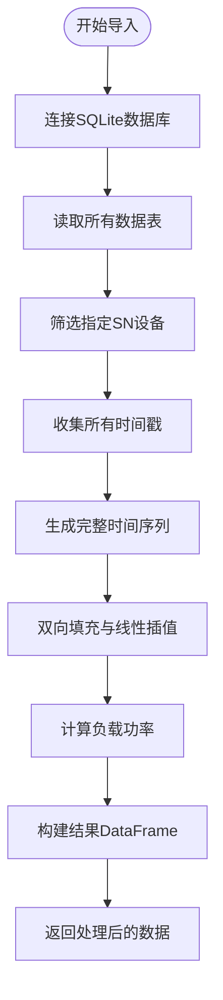
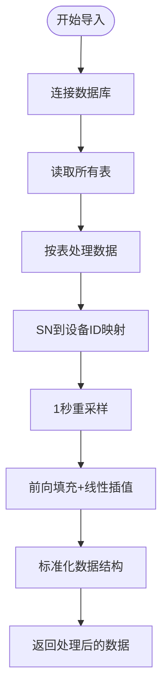

# 数据格式支持

<cite>
**本文档引用文件**  
- [simulation_window.py](file://src/components/simulation_window.py)
- [sqlite.py](file://src/components/sqlite.py)
</cite>

## 目录
1. [引言](#引言)
2. [滁州工厂数据格式处理](#滁州工厂数据格式处理)
3. [默认SQLite格式解析](#默认sqlite格式解析)
4. [数据结构对比](#数据结构对比)

## 引言
pp_tool支持多种回测数据格式，其中包含针对特定工厂的定制化处理逻辑。本文档重点分析滁州工厂数据格式的特殊处理机制，以及默认SQLite格式的通用解析策略。系统通过灵活的设备SN映射机制和功率符号转换规则，确保不同来源的数据能够正确导入并用于仿真分析。

## 滁州工厂数据格式处理

`_read_backtest_data_chuzhou`方法专门用于处理滁州工厂的回测数据格式。该方法从SQLite数据库的多个表中提取特定SN的设备数据，并根据物理意义进行功率符号转换。

在滁州工厂的数据处理中，定义了特定的设备SN：
- 关口电表SN为`THMEMET000JMQQY0VKZMM`，其功率值需取负
- 光伏阵列包含三个SN：`THMEMET000BVRT10O6FUL`、`THMEMET000WAQC3EDNSAL`、`THMEMET000CRUSBPMM65L`，正功率表示发电
- 储能系统SN为`THMEMET000AVVVUOEP7JL`，正功率表示放电

为确保时间序列的连续性，系统采用线性插值和双向填充策略。首先收集所有设备的时间戳，生成从最小到最大时间戳的完整秒序列。然后对每个设备的数据进行双向填充（`limit_direction='both'`），确保数据在时间轴上的连续性。

负载功率的推导基于能量守恒原理：负载功率 = -（关口电表功率 + 光伏总出力 + 储能功率）。通过关口功率、光伏出力和储能功率计算得出未知的负载功率，实现了对系统完整功率流的重建。

**图表来源**  
- [simulation_window.py](file://src/components/simulation_window.py#L522-L666)

**本节来源**  
- [simulation_window.py](file://src/components/simulation_window.py#L522-L666)

## 默认SQLite格式解析

默认SQLite格式采用通用解析策略，通过`_read_backtest_data_from_db`方法实现。该方法基于`device_sn`与内部设备ID的映射关系，具有良好的灵活性。

解析过程首先读取数据库中的所有表，然后根据表名确定设备类型。通过`_find_device_type_and_id_by_sn`方法，将设备SN映射到系统内部的设备类型和ID。这种映射机制使得不同项目中的设备能够正确对应到仿真模型中。

对于不同类型的设备数据，系统采用不同的处理方式：
- `meter_data`表：特殊处理，根据SN判断设备类型
- `load_data`表：直接读取负载数据
- 其他设备表：根据表名推断设备类型，如`pv_data`对应光伏设备

数据重采样采用1秒间隔，结合前向填充和线性插值，确保时间序列的完整性和连续性。最终生成标准化的DataFrame，包含`timestamp`、`device_type`、`device_id`、`p_mw`和`q_mvar`等字段。

**图表来源**  
- [simulation_window.py](file://src/components/simulation_window.py#L673-L859)

**本节来源**  
- [simulation_window.py](file://src/components/simulation_window.py#L673-L859)

## 数据结构对比

两种数据格式在结构和处理方式上存在显著差异：

**滁州工厂数据格式特点：**
- 固定设备SN，无需动态映射
- 特定功率符号约定（关口电表取负）
- 负载功率通过计算推导得出
- 采用双向填充确保数据连续性
- 针对特定工厂的定制化处理

**默认SQLite格式特点：**
- 通用设备SN映射机制
- 功率符号遵循标准约定
- 负载数据直接从`load_data`表读取
- 采用前向填充和线性插值
- 适用于多种项目的通用解析

在代码处理上，滁州格式通过硬编码的SN列表进行数据筛选，而默认格式通过动态映射实现设备识别。两种格式最终都转换为统一的内部数据结构，确保后续仿真分析的一致性。

**本节来源**  
- [simulation_window.py](file://src/components/simulation_window.py#L522-L859)
- [sqlite.py](file://src/components/sqlite.py#L5-L114)