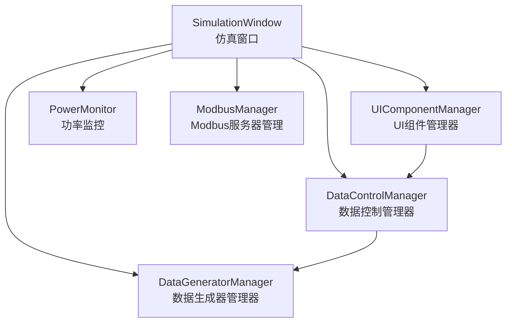
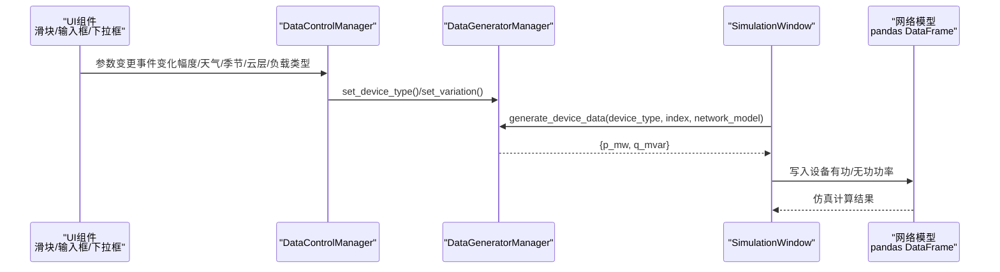
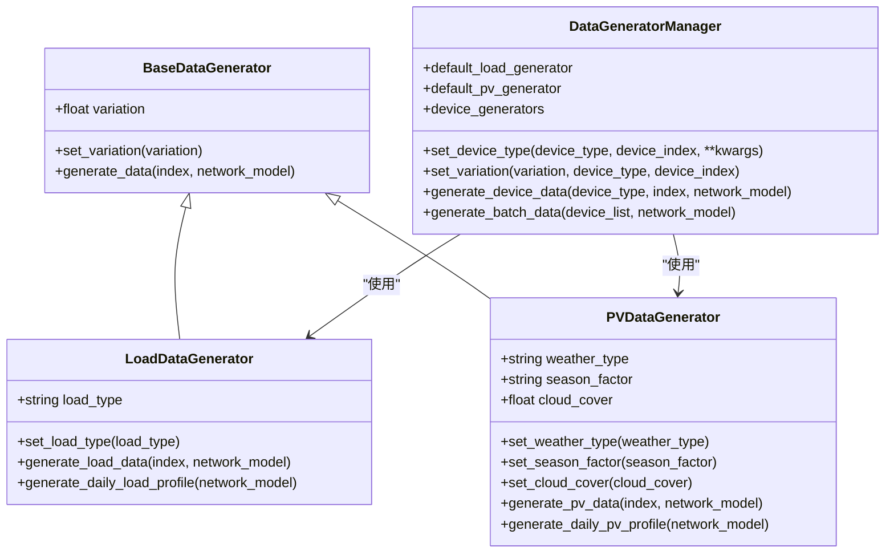
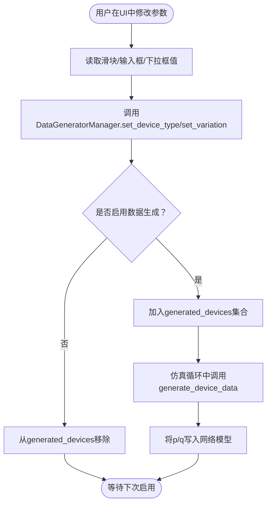
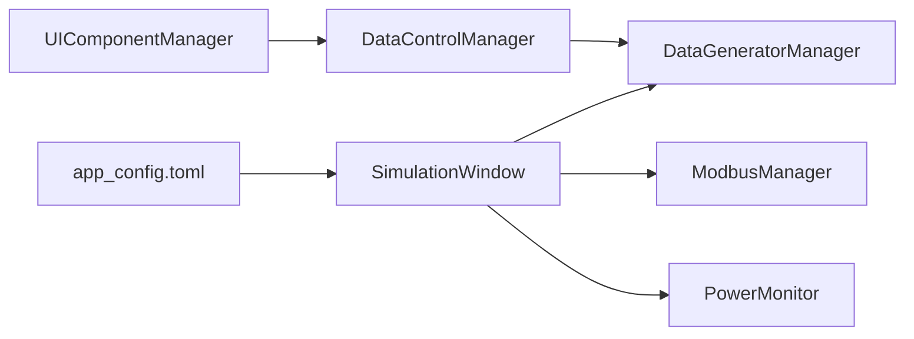

# 数据生成

<cite>
**本文引用的文件**
- [src/components/data_control.py](file://src/components/data_control.py)
- [src/components/data_generators.py](file://src/components/data_generators.py)
- [src/components/simulation_window.py](file://src/components/simulation_window.py)
- [src/components/ui_components.py](file://src/components/ui_components.py)
- [src/app_config.toml](file://src/app_config.toml)
</cite>

## 目录
1. [简介](#简介)
2. [项目结构](#项目结构)
3. [核心组件](#核心组件)
4. [架构总览](#架构总览)
5. [详细组件分析](#详细组件分析)
6. [依赖关系分析](#依赖关系分析)
7. [性能考量](#性能考量)
8. [故障排查指南](#故障排查指南)
9. [结论](#结论)
10. [附录](#附录)

## 简介
本文件面向pp_tool项目中的“数据生成功能”，聚焦于数据控制管理器（data_control.py）如何通过UI控制数据生成器，为光伏（static_generator/sgen）与负载（load）设备模拟随机功率输出。文档将系统阐述：
- 数据生成器的配置参数（变化幅度、季节、天气、云层覆盖、负载类型等）及其对功率输出的影响；
- 数据控制管理器如何在仿真界面中提供UI，驱动数据生成器；
- 如何通过代码为一个光伏设备配置数据生成器并启动随机功率输出（以路径引用代替具体代码）。

## 项目结构
围绕“数据生成”功能的关键文件与职责如下：
- data_generators.py：定义抽象基类与具体生成器（LoadDataGenerator、PVDataGenerator），统一管理默认与设备特定生成器，提供批量生成能力。
- data_control.py：在仿真窗口中提供UI控制入口，连接UI组件与数据生成器，维护“已启用数据生成”的设备集合，处理回测期间的保护逻辑。
- simulation_window.py：仿真窗口主控，持有DataGeneratorManager实例，初始化ModbusManager与PowerMonitor，承载UI组件管理器与数据控制管理器。
- ui_components.py：创建各设备面板（光伏、负载、储能、电表等），绑定滑块/输入框/下拉框与DataControlManager的回调，形成可视化配置入口。
- app_config.toml：应用配置（如功率单位），间接影响UI显示与数据呈现。

图表来源
- [src/components/simulation_window.py](file://src/components/simulation_window.py#L68-L114)
- [src/components/data_control.py](file://src/components/data_control.py#L1-L40)
- [src/components/data_generators.py](file://src/components/data_generators.py#L310-L360)
- [src/components/ui_components.py](file://src/components/ui_components.py#L300-L330)

章节来源
- [src/components/simulation_window.py](file://src/components/simulation_window.py#L68-L114)
- [src/components/data_control.py](file://src/components/data_control.py#L1-L40)
- [src/components/data_generators.py](file://src/components/data_generators.py#L310-L360)
- [src/components/ui_components.py](file://src/components/ui_components.py#L300-L330)

## 核心组件
- 数据生成器管理器（DataGeneratorManager）
  - 维护默认生成器与设备特定生成器映射；
  - 提供统一的set_device_type与set_variation接口，支持按设备类型/索引/全局设置参数；
  - 提供generate_device_data与generate_batch_data，按需生成单个或批量设备数据。
- 光伏数据生成器（PVDataGenerator）
  - 参数：weather_type（天气）、season_factor（季节）、cloud_cover（云层覆盖）、variation（变化幅度）；
  - 输出：p_mw（有功功率，单位MW）、q_mvar（无功功率，单位MVar）。
- 负载数据生成器（LoadDataGenerator）
  - 参数：load_type（负载类型：住宅/商业/工业）、variation（变化幅度）；
  - 输出：p_mw（有功功率，单位MW）、q_mvar（无功功率，单位MVar）。
- 数据控制管理器（DataControlManager）
  - 通过UI组件（滑块、输入框、下拉框）读取参数，调用DataGeneratorManager设置生成器参数；
  - 维护generated_devices集合，控制设备是否启用数据生成；
  - 在回测期间阻止启用数据生成功能，保障回测稳定性。

章节来源
- [src/components/data_generators.py](file://src/components/data_generators.py#L1-L160)
- [src/components/data_generators.py](file://src/components/data_generators.py#L163-L308)
- [src/components/data_generators.py](file://src/components/data_generators.py#L310-L488)
- [src/components/data_control.py](file://src/components/data_control.py#L770-L828)

## 架构总览
数据生成的端到端流程如下：
- 用户在UI中选择设备（如光伏/负载），通过滑块/输入框/下拉框设置参数；
- UI组件管理器将事件转发给DataControlManager；
- DataControlManager调用DataGeneratorManager设置生成器参数；
- SimulationWindow在仿真循环中调用DataGeneratorManager.generate_device_data，将生成的p/q写入网络模型对应设备；
- ModbusManager与PowerMonitor配合，实现设备通信与监控。

图表来源
- [src/components/ui_components.py](file://src/components/ui_components.py#L300-L330)
- [src/components/data_control.py](file://src/components/data_control.py#L1096-L1126)
- [src/components/data_generators.py](file://src/components/data_generators.py#L396-L424)
- [src/components/simulation_window.py](file://src/components/simulation_window.py#L68-L114)

## 详细组件分析

### 数据生成器管理器（DataGeneratorManager）
- 默认生成器与设备特定生成器
  - 默认生成器：default_load_generator、default_pv_generator；
  - 设备特定生成器：device_generators[device_type][device_index]，按需创建并复制默认参数。
- 参数设置
  - set_device_type：支持为默认生成器或特定设备设置weather_type、season_factor、cloud_cover、load_type等；
  - set_variation：支持全局、按类型、按设备设置变化幅度。
- 数据生成
  - generate_device_data：优先使用设备特定生成器，否则回退到默认生成器；
  - generate_batch_data：按设备类型分组批量生成，减少重复遍历。

图表来源
- [src/components/data_generators.py](file://src/components/data_generators.py#L1-L160)
- [src/components/data_generators.py](file://src/components/data_generators.py#L163-L308)
- [src/components/data_generators.py](file://src/components/data_generators.py#L310-L488)

章节来源
- [src/components/data_generators.py](file://src/components/data_generators.py#L1-L160)
- [src/components/data_generators.py](file://src/components/data_generators.py#L163-L308)
- [src/components/data_generators.py](file://src/components/data_generators.py#L310-L488)

### 数据控制管理器（DataControlManager）
- UI联动
  - 通过UI组件管理器创建的滑块/输入框/下拉框，绑定到DataControlManager的回调（如on_sgen_variation_changed、on_weather_changed、on_season_changed、on_cloud_cover_changed、on_load_variation_changed、on_load_type_changed）；
  - 回调中调用DataGeneratorManager.set_device_type/set_variation，即时更新生成器参数。
- 设备启用/禁用数据生成
  - 维护generated_devices集合，切换复选框时添加/移除设备键；
  - 回测期间禁止启用数据生成功能，防止干扰回测。
- 通信控制（与设备通信相关）
  - on_device_power_on/on_device_power_off：基于ModbusManager开启/关闭设备通信，更新通信状态指示器。

图表来源
- [src/components/ui_components.py](file://src/components/ui_components.py#L300-L330)
- [src/components/data_control.py](file://src/components/data_control.py#L770-L828)
- [src/components/data_generators.py](file://src/components/data_generators.py#L396-L424)

章节来源
- [src/components/data_control.py](file://src/components/data_control.py#L770-L828)
- [src/components/data_control.py](file://src/components/data_control.py#L1096-L1126)
- [src/components/ui_components.py](file://src/components/ui_components.py#L300-L330)

### 仿真窗口（SimulationWindow）
- 初始化
  - 创建DataGeneratorManager、ModbusManager、PowerMonitor、UIComponentManager；
  - 初始化各设备面板（光伏、负载、储能、电表、开关）。
- 数据生成集成
  - 在仿真循环中调用DataGeneratorManager.generate_device_data，将生成的p/q写入网络模型对应设备；
  - 通过generated_devices集合决定是否对某设备启用数据生成。
- 回测与记录
  - 提供回测导入/开始/停止与数据记录的菜单与状态指示。

章节来源
- [src/components/simulation_window.py](file://src/components/simulation_window.py#L68-L114)
- [src/components/simulation_window.py](file://src/components/simulation_window.py#L160-L231)

### UI组件管理器（UIComponentManager）
- 光伏面板
  - 变化幅度（%）、季节（春/夏/秋/冬）、天气（晴/多云/阴/雨）、云层覆盖度（0.0-1.0）；
  - 手动控制面板包含有功/无功功率滑块与输入框。
- 负载面板
  - 变化幅度（%）、负载类型（住宅/商业/工业）；
  - 手动控制面板包含有功/无功功率滑块与输入框。
- 电表/储能/充电桩/开关面板（与数据生成相关）

章节来源
- [src/components/ui_components.py](file://src/components/ui_components.py#L300-L330)
- [src/components/ui_components.py](file://src/components/ui_components.py#L394-L499)
- [src/components/ui_components.py](file://src/components/ui_components.py#L800-L841)

## 依赖关系分析
- SimulationWindow依赖DataGeneratorManager进行数据生成，依赖ModbusManager与PowerMonitor进行通信与监控；
- DataControlManager依赖DataGeneratorManager进行参数设置与数据生成；
- UIComponentManager为DataControlManager提供UI事件绑定；
- app_config.toml提供功率单位等配置，影响UI显示与数据呈现。

图表来源
- [src/components/simulation_window.py](file://src/components/simulation_window.py#L68-L114)
- [src/components/data_control.py](file://src/components/data_control.py#L1-L40)
- [src/components/ui_components.py](file://src/components/ui_components.py#L300-L330)
- [src/app_config.toml](file://src/app_config.toml#L1-L13)

章节来源
- [src/components/simulation_window.py](file://src/components/simulation_window.py#L68-L114)
- [src/components/data_control.py](file://src/components/data_control.py#L1-L40)
- [src/components/ui_components.py](file://src/components/ui_components.py#L300-L330)
- [src/app_config.toml](file://src/app_config.toml#L1-L13)

## 性能考量
- 批量生成：DataGeneratorManager提供generate_batch_data，按设备类型分组减少重复遍历，适合大规模设备场景；
- 随机数与边界：生成器使用numpy随机数与边界裁剪，避免负功率与越界；
- UI信号防抖：在更新滑块/输入框时使用blockSignals避免信号循环；
- 回测保护：回测期间禁止启用数据生成功能，避免仿真与回测冲突。

章节来源
- [src/components/data_generators.py](file://src/components/data_generators.py#L457-L488)
- [src/components/data_control.py](file://src/components/data_control.py#L216-L236)

## 故障排查指南
- 启用数据生成功能无效
  - 检查是否处于回测期间；回测期间会阻止启用数据生成功能；
  - 确认已选择正确设备类型与索引；
  - 查看generated_devices集合是否包含目标设备键。
- 设备通信失败
  - 确认设备IP已配置；缺少IP会导致通信开启失败；
  - 检查ModbusManager初始化与端口占用情况。
- 参数未生效
  - 确认UI组件事件已绑定到DataControlManager回调；
  - 检查DataGeneratorManager.set_device_type/set_variation调用链路；
  - 若为设备特定参数，确认设备索引与类型匹配。
- 功率显示异常
  - 检查app_config.toml中的功率单位配置；
  - 确认网络模型中设备p/q字段更新路径正确。

章节来源
- [src/components/data_control.py](file://src/components/data_control.py#L792-L800)
- [src/components/data_control.py](file://src/components/data_control.py#L807-L828)
- [src/components/data_control.py](file://src/components/data_control.py#L81-L104)
- [src/app_config.toml](file://src/app_config.toml#L11-L13)

## 结论
pp_tool的数据生成功能通过“UI组件管理器 + 数据控制管理器 + 数据生成器管理器”的分层设计，实现了对光伏与负载设备的灵活参数配置与随机功率输出。用户可通过UI直观设置变化幅度、季节、天气、云层覆盖与负载类型等参数，DataControlManager将这些参数传递给DataGeneratorManager，后者在仿真循环中生成p/q并写入网络模型，从而实现贴近真实场景的随机功率模拟。

## 附录

### 实际操作：为一个光伏设备配置数据生成器并启动随机功率输出（代码级示例路径）
- 步骤1：在UI中设置光伏参数
  - 变化幅度：参考路径 [src/components/ui_components.py](file://src/components/ui_components.py#L300-L303)
  - 季节：参考路径 [src/components/ui_components.py](file://src/components/ui_components.py#L305-L310)
  - 天气：参考路径 [src/components/ui_components.py](file://src/components/ui_components.py#L313-L319)
  - 云层覆盖度：参考路径 [src/components/ui_components.py](file://src/components/ui_components.py#L322-L329)
- 步骤2：在DataControlManager中应用参数
  - 变化幅度回调：参考路径 [src/components/ui_components.py](file://src/components/ui_components.py#L300-L303) -> [src/components/data_control.py](file://src/components/data_control.py#L1096-L1126)
  - 季节回调：参考路径 [src/components/ui_components.py](file://src/components/ui_components.py#L305-L310) -> [src/components/data_control.py](file://src/components/data_control.py#L1096-L1109)
  - 天气回调：参考路径 [src/components/ui_components.py](file://src/components/ui_components.py#L313-L319) -> [src/components/data_control.py](file://src/components/data_control.py#L1111-L1126)
  - 云层覆盖回调：参考路径 [src/components/ui_components.py](file://src/components/ui_components.py#L322-L329) -> [src/components/data_control.py](file://src/components/data_control.py#L1096-L1126)
- 步骤3：启用数据生成
  - 切换“启用设备数据生成”复选框：参考路径 [src/components/ui_components.py](file://src/components/ui_components.py#L331-L339) -> [src/components/data_control.py](file://src/components/data_control.py#L775-L828)
- 步骤4：仿真循环中生成数据
  - 调用generate_device_data：参考路径 [src/components/data_generators.py](file://src/components/data_generators.py#L396-L424)
  - 写入网络模型：参考路径 [src/components/simulation_window.py](file://src/components/simulation_window.py#L68-L114)

章节来源
- [src/components/ui_components.py](file://src/components/ui_components.py#L300-L330)
- [src/components/data_control.py](file://src/components/data_control.py#L775-L828)
- [src/components/data_control.py](file://src/components/data_control.py#L1096-L1126)
- [src/components/data_generators.py](file://src/components/data_generators.py#L396-L424)
- [src/components/simulation_window.py](file://src/components/simulation_window.py#L68-L114)