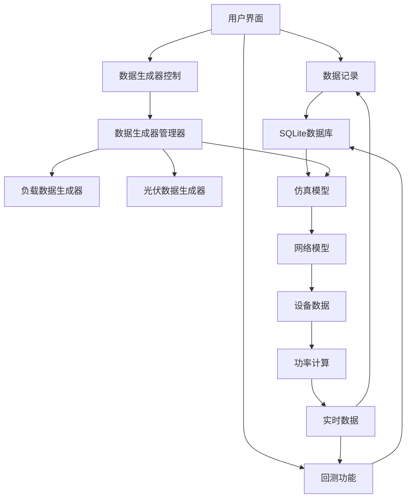

# 数据管理

<cite>
**Referenced Files in This Document**   
- [simulation_window.py](file://src/components/simulation_window.py)
- [data_control.py](file://src/components/data_control.py)
- [sqlite.py](file://src/components/sqlite.py)
- [data_generators.py](file://src/components/data_generators.py)
</cite>

## 目录
1. [数据记录功能](#数据记录功能)
2. [回测功能](#回测功能)
3. [数据生成器控制](#数据生成器控制)
4. [数据管理架构](#数据管理架构)

## 数据记录功能

仿真窗口（simulation_window.py）实现了将仿真过程中的功率、电压等数据实时写入SQLite数据库的功能。当用户通过菜单选择"记录仿真数据"时，系统会弹出文件选择对话框，让用户指定数据库保存位置。选定路径后，系统调用`init_database`函数初始化数据库，创建包括`meter_data`、`pv_data`、`storage_data`、`load_data`和`charger_data`在内的多个数据表。

数据记录采用独立线程运行，通过`_record_data_loop`方法实现每秒一次的定时数据保存。在`save_data_to_db`方法中，系统从网络模型中获取实时数据，包括电表的有功/无功功率、光伏设备的发电功率、储能设备的充放电功率以及负载设备的用电功率等。这些数据被打包后通过SQL插入语句写入对应的数据库表中，时间戳采用UNIX时间戳格式，确保了数据的时间序列特性。

例如，当需要将一次仿真中的所有负载功率数据写入数据库时，系统会遍历`net.res_load`中的所有负载设备，提取其有功和无功功率值，转换为适当的单位后，批量插入到`load_data`表中。整个过程在`save_data_to_db`方法中实现，确保了数据记录的完整性和一致性。

**Section sources**
- [simulation_window.py](file://src/components/simulation_window.py#L1219-L1406)

## 回测功能

回测功能允许用户从外部数据库导入历史数据，并按时间步长驱动仿真，以复现历史场景。用户通过"数据"菜单中的"导入回测数据"选项选择SQLite数据库文件。系统支持两种数据格式：默认的SQLite数据库格式和特定的滁州工厂数据格式。

导入过程采用多线程机制，避免界面冻结。在`_import_backtest_data_worker`方法中，系统根据选择的格式调用相应的数据读取函数。对于标准SQLite格式，`_read_backtest_data_from_db`方法会读取数据库中各个数据表的内容，提取设备序列号、时间戳和功率数据，并通过`_find_device_type_and_id_by_sn`方法将设备序列号映射到仿真模型中的设备类型和ID。

导入的数据会被重新采样为每秒一个数据点，并构建高效的索引结构`backtest_data_index`，该结构采用三层字典嵌套（设备类型→设备ID→时间戳），极大提高了数据查询效率。当用户启动回测时，系统进入回测模式，通过`run_backtest_step`方法按实际时间流逝同步更新设备功率。在每个时间步，系统根据当前经过的时间秒数，在索引中查找对应时刻的功率值，并通过`_apply_device_backtest_data`方法更新到网络模型中，从而精确复现历史功率变化过程。

**Section sources**
- [simulation_window.py](file://src/components/simulation_window.py#L483-L959)

## 数据生成器控制

数据控制管理器（data_control.py）提供了UI界面来控制数据生成器，为光伏和负载设备模拟随机功率输出。该功能通过`DataControlManager`类实现，与`DataGeneratorManager`协同工作。`DataGeneratorManager`管理着`LoadDataGenerator`和`PVDataGenerator`两个生成器实例，分别负责负载和光伏设备的数据生成。

对于负载设备，用户可以通过UI界面选择负载类型（住宅、商业或工业），系统会根据选择的类型应用不同的日负荷曲线模式。例如，住宅负载在早晚时段有明显的用电高峰，而商业负载则在白天保持较高水平。用户还可以设置变化幅度，系统会在基础曲线上叠加随机波动，模拟实际用电的不确定性。

对于光伏设备，用户可以通过UI界面设置天气状况（晴朗、多云、阴天或雨天）、季节因素和云层覆盖度等参数。`PVDataGenerator`根据这些参数调整发电功率曲线，例如雨天的发电效率会显著降低。系统还实现了设备级别的独立配置，允许不同光伏设备具有不同的天气和季节设置。

用户通过勾选"启用数据生成"复选框来激活特定设备的数据生成功能。当启用后，系统会将该设备加入`generated_devices`集合，并在自动计算循环中调用`_update_generated_data_batch`方法批量更新所有启用了数据生成的设备功率，从而实现对光伏和负载设备的随机功率输出模拟。

**Section sources**
- [data_control.py](file://src/components/data_control.py#L15-L840)
- [data_generators.py](file://src/components/data_generators.py#L1-L488)

## 数据管理架构

**Diagram sources**
- [simulation_window.py](file://src/components/simulation_window.py#L1-L2604)
- [data_control.py](file://src/components/data_control.py#L1-L1609)
- [data_generators.py](file://src/components/data_generators.py#L1-L488)
- [sqlite.py](file://src/components/sqlite.py#L1-L118)