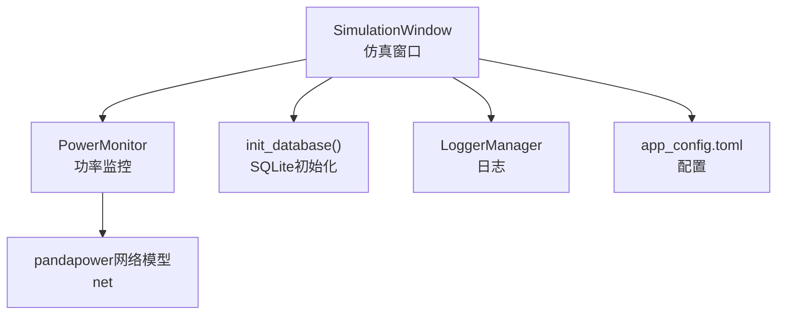
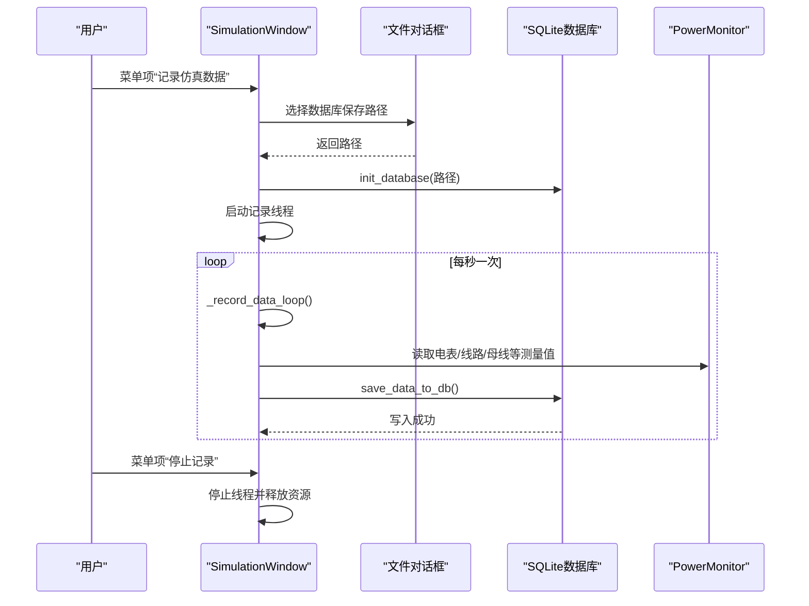
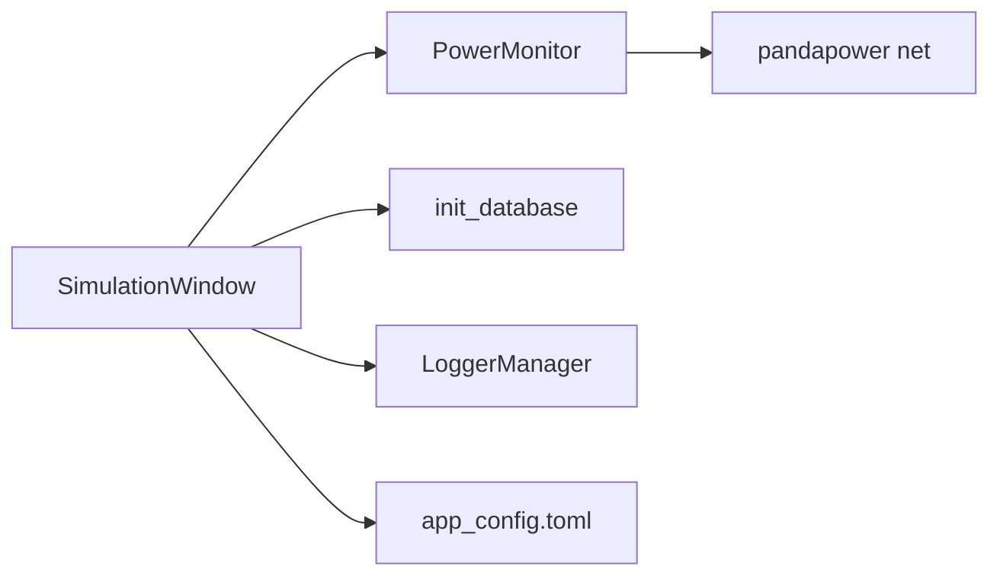

# 数据记录

<cite>
**本文引用的文件**
- [simulation_window.py](file://src/components/simulation_window.py)
- [sqlite.py](file://src/components/sqlite.py)
- [power_monitor.py](file://src/components/power_monitor.py)
- [logger.py](file://src/utils/logger.py)
- [app_config.toml](file://src/app_config.toml)
</cite>

## 目录
1. [简介](#简介)
2. [项目结构](#项目结构)
3. [核心组件](#核心组件)
4. [架构总览](#架构总览)
5. [详细组件分析](#详细组件分析)
6. [依赖关系分析](#依赖关系分析)
7. [性能考量](#性能考量)
8. [故障排查指南](#故障排查指南)
9. [结论](#结论)
10. [附录](#附录)

## 简介
本章节面向pp_tool的“数据记录”能力，聚焦仿真窗口（simulation_window.py）如何在仿真过程中将功率、电压等关键数据实时写入SQLite数据库。文档将详细说明：
- 数据记录的启动与停止机制
- 数据库文件的创建与管理
- 实时采集与入库流程
- 如何通过代码将一次仿真中的所有负载功率数据写入数据库（给出路径级示例）

## 项目结构
与数据记录直接相关的模块分布如下：
- 仿真窗口：负责启动/停止记录、调度记录循环、调用数据库写入
- 数据库初始化：负责创建所需表结构
- 功率监控：提供电表、线路、母线等测量值的查询接口
- 日志：统一记录运行状态与错误信息
- 应用配置：提供功率单位等配置项

**图表来源**
- [simulation_window.py](file://src/components/simulation_window.py#L1219-L1406)
- [sqlite.py](file://src/components/sqlite.py#L1-L118)
- [power_monitor.py](file://src/components/power_monitor.py#L472-L784)
- [logger.py](file://src/utils/logger.py#L1-L108)
- [app_config.toml](file://src/app_config.toml#L1-L13)

**章节来源**
- [simulation_window.py](file://src/components/simulation_window.py#L1219-L1406)
- [sqlite.py](file://src/components/sqlite.py#L1-L118)
- [power_monitor.py](file://src/components/power_monitor.py#L472-L784)
- [logger.py](file://src/utils/logger.py#L1-L108)
- [app_config.toml](file://src/app_config.toml#L1-L13)

## 核心组件
- 仿真窗口（SimulationWindow）
  - 负责UI菜单项“记录仿真数据/停止记录”的触发
  - 负责数据库初始化、记录线程生命周期管理、记录循环调度
  - 负责调用save_data_to_db进行实际入库
- 数据库初始化（init_database）
  - 创建meter_data、pv_data、storage_data、charger_data、load_data、cmd_data等表
- 功率监控（PowerMonitor）
  - 提供get_meter_measurement等测量接口，支撑电表数据采集
- 日志（LoggerManager）
  - 统一日志输出，便于定位问题
- 应用配置（app_config.toml）
  - 提供功率单位等配置项

**章节来源**
- [simulation_window.py](file://src/components/simulation_window.py#L1219-L1406)
- [sqlite.py](file://src/components/sqlite.py#L1-L118)
- [power_monitor.py](file://src/components/power_monitor.py#L472-L784)
- [logger.py](file://src/utils/logger.py#L1-L108)
- [app_config.toml](file://src/app_config.toml#L1-L13)

## 架构总览
仿真窗口在用户点击“记录仿真数据”后，弹出文件对话框选择数据库保存路径，随后初始化数据库并启动记录线程；线程每秒调用一次save_data_to_db，从网络模型与功率监控中采集各类设备的实时数据，写入SQLite数据库。

**图表来源**
- [simulation_window.py](file://src/components/simulation_window.py#L1219-L1406)
- [sqlite.py](file://src/components/sqlite.py#L1-L118)
- [power_monitor.py](file://src/components/power_monitor.py#L472-L784)

## 详细组件分析

### 仿真窗口：数据记录入口与调度
- 启动记录
  - 通过菜单项触发record_simulation_data
  - 弹出文件对话框选择数据库路径
  - 调用init_database创建表结构
  - 设置is_recording为True，启动守护线程recording_thread
  - 线程进入循环，每秒调用save_data_to_db
- 停止记录
  - 通过菜单项触发stop_record_data
  - 设置is_recording为False，等待线程自然结束
  - 更新状态显示与状态栏提示

关键实现路径（代码级示例路径，非代码内容）：
- [record_simulation_data](file://src/components/simulation_window.py#L1219-L1275)
- [_record_data_loop](file://src/components/simulation_window.py#L1276-L1296)
- [stop_record_data](file://src/components/simulation_window.py#L1256-L1275)

**章节来源**
- [simulation_window.py](file://src/components/simulation_window.py#L1219-L1296)

### 数据库初始化：表结构与文件管理
- init_database负责创建以下表：
  - meter_data：电表有功/无功/视在功率、功率因数、频率、电能等
  - pv_data：光伏有功/无功、功率因数、日/反向有功电能、额定功率等
  - storage_data：储能有功/无功、SOC、健康度、累计充放电等
  - charger_data：充电桩有功、出/入端电压/电流、SOC等
  - load_data：负载有功/无功
  - cmd_data：命令下发记录
- 默认数据库文件名为filtered.db，可通过用户选择覆盖

关键实现路径（代码级示例路径，非代码内容）：
- [init_database](file://src/components/sqlite.py#L1-L118)

**章节来源**
- [sqlite.py](file://src/components/sqlite.py#L1-L118)

### 功率监控：实时测量值采集
- PowerMonitor提供多种测量类型：
  - 有功功率、无功功率、电压、电流、有功/无功电量
- 电表测量通过get_meter_measurement，内部根据电表配置（元素类型、索引、侧别）从网络模型结果中查询
- 该接口被仿真窗口用于采集电表实时功率、视在功率、功率因数等

关键实现路径（代码级示例路径，非代码内容）：
- [get_meter_measurement](file://src/components/power_monitor.py#L472-L540)
- [查询有功/无功/电压/电流](file://src/components/power_monitor.py#L541-L761)

**章节来源**
- [power_monitor.py](file://src/components/power_monitor.py#L472-L761)

### 数据写入：save_data_to_db
- save_data_to_db按秒采集并写入以下数据：
  - 电表数据：meter_data（有功、无功、视在功率、功率因数、频率、电能、本地时间戳）
  - 光伏数据：pv_data（有功、无功、功率因数、日/反向有功电能、本地时间戳）
  - 储能数据：storage_data（有功、无功、SOC、本地时间戳）
  - 负载数据：load_data（有功、无功、本地时间戳）
  - 充电桩数据：charger_data（有功、本地时间戳）
- 时间戳采用UNIX秒级时间，同时记录local_timestamp

关键实现路径（代码级示例路径，非代码内容）：
- [save_data_to_db](file://src/components/simulation_window.py#L1297-L1406)

**章节来源**
- [simulation_window.py](file://src/components/simulation_window.py#L1297-L1406)

### 实际操作：如何将一次仿真中的所有负载功率数据写入数据库
- 步骤
  1) 在仿真窗口中打开“数据/记录数据”，选择数据库保存路径并确认
  2) 点击“记录仿真数据”，启动记录线程
  3) 在仿真运行期间，每秒将负载有功/无功功率写入load_data表
  4) 结束仿真后，点击“停止记录”，线程结束，数据库文件落盘
- 代码级示例路径
  - [record_simulation_data](file://src/components/simulation_window.py#L1219-L1275)
  - [save_data_to_db（负载写入）](file://src/components/simulation_window.py#L1376-L1396)
  - [stop_record_data](file://src/components/simulation_window.py#L1256-L1275)

**章节来源**
- [simulation_window.py](file://src/components/simulation_window.py#L1219-L1396)

## 依赖关系分析
- SimulationWindow依赖
  - sqlite.py：init_database创建表
  - power_monitor.py：get_meter_measurement获取电表测量值
  - logger.py：统一记录日志
  - app_config.toml：功率单位配置（影响显示/转换，不影响记录逻辑）
- 数据流向
  - 仿真窗口 -> 功率监控 -> 网络模型结果 -> SQLite数据库

**图表来源**
- [simulation_window.py](file://src/components/simulation_window.py#L1219-L1406)
- [sqlite.py](file://src/components/sqlite.py#L1-L118)
- [power_monitor.py](file://src/components/power_monitor.py#L472-L784)
- [logger.py](file://src/utils/logger.py#L1-L108)
- [app_config.toml](file://src/app_config.toml#L1-L13)

**章节来源**
- [simulation_window.py](file://src/components/simulation_window.py#L1219-L1406)
- [sqlite.py](file://src/components/sqlite.py#L1-L118)
- [power_monitor.py](file://src/components/power_monitor.py#L472-L784)
- [logger.py](file://src/utils/logger.py#L1-L108)
- [app_config.toml](file://src/app_config.toml#L1-L13)

## 性能考量
- 记录线程为守护线程，每秒写入一次，IO压力较小
- 采用轻量级SQLite，适合本地记录场景
- 采集逻辑尽量复用网络模型结果，避免重复计算
- 日志级别建议在生产环境适度降低，避免频繁写盘

[本节为通用指导，无需列出具体文件来源]

## 故障排查指南
- 数据库未创建或表缺失
  - 确认record_simulation_data已调用init_database
  - 查看日志中“数据库初始化完成”信息
  - 关键路径：[record_simulation_data](file://src/components/simulation_window.py#L1219-L1275)，[init_database](file://src/components/sqlite.py#L1-L118)
- 记录线程未停止
  - 确认stop_record_data已调用，is_recording置为False
  - 关键路径：[stop_record_data](file://src/components/simulation_window.py#L1256-L1275)
- 采集不到电表数据
  - 检查PowerMonitor.get_meter_measurement是否能解析电表配置
  - 关键路径：[get_meter_measurement](file://src/components/power_monitor.py#L472-L540)
- 写入异常
  - 查看日志中的错误信息，定位save_data_to_db异常
  - 关键路径：[save_data_to_db](file://src/components/simulation_window.py#L1297-L1406)
- 日志输出
  - 使用LoggerManager统一输出，便于定位问题
  - 关键路径：[logger.py](file://src/utils/logger.py#L1-L108)

**章节来源**
- [simulation_window.py](file://src/components/simulation_window.py#L1219-L1406)
- [sqlite.py](file://src/components/sqlite.py#L1-L118)
- [power_monitor.py](file://src/components/power_monitor.py#L472-L540)
- [logger.py](file://src/utils/logger.py#L1-L108)

## 结论
pp_tool的仿真窗口实现了完善的“数据记录”能力：通过菜单项启动/停止记录，每秒将电表、光伏、储能、负载、充电桩等设备的实时数据写入SQLite数据库。该机制具备清晰的生命周期管理、健壮的错误处理与统一的日志输出，能够满足日常仿真数据归档与回溯需求。

[本节为总结性内容，无需列出具体文件来源]

## 附录

### 表结构概览（来自init_database）
- meter_data：设备序列号、时间戳、有功/无功/视在功率、功率因数、频率、有功/反向有功电能、本地时间戳
- pv_data：设备序列号、时间戳、有功/无功、功率因数、日/反向有功电能、额定功率、温度等
- storage_data：设备序列号、时间戳、有功/无功、SOC、健康度、累计充放电、当日充放电、本地时间戳
- charger_data：设备序列号、时间戳、有功、出/入端电压/电流、SOC、本地时间戳
- load_data：设备ID、时间戳、有功/无功、本地时间戳
- cmd_data：时间戳、设备序列号、命令名、值、本地时间戳

**章节来源**
- [sqlite.py](file://src/components/sqlite.py#L1-L118)