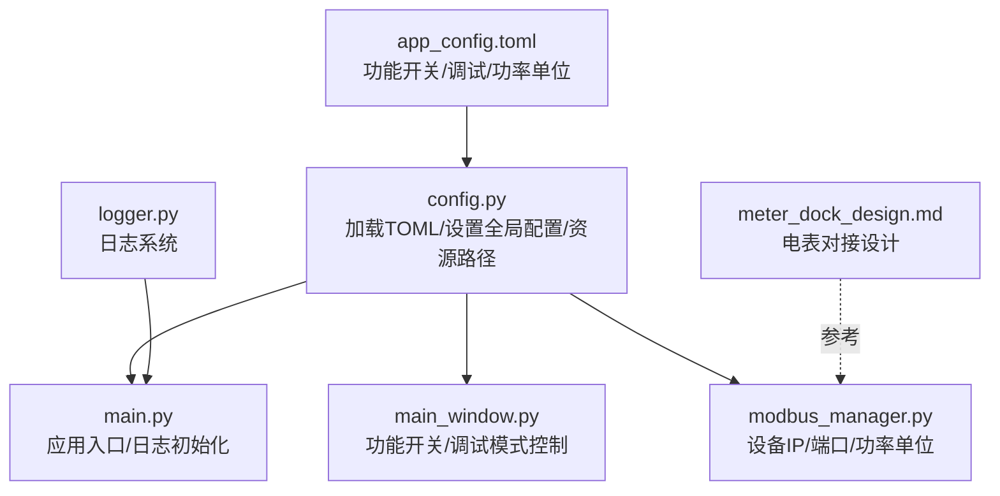
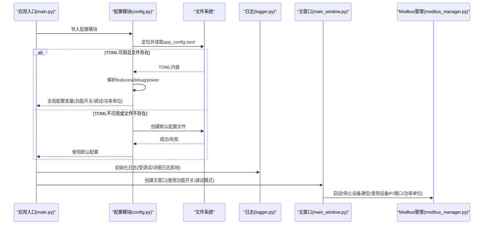
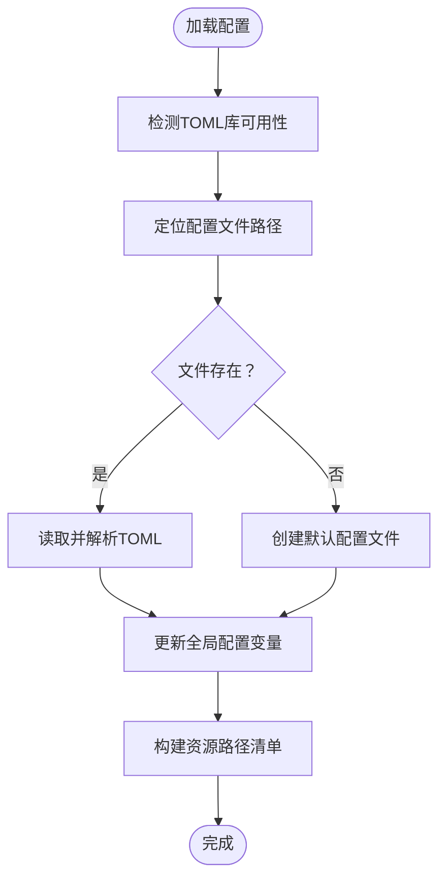
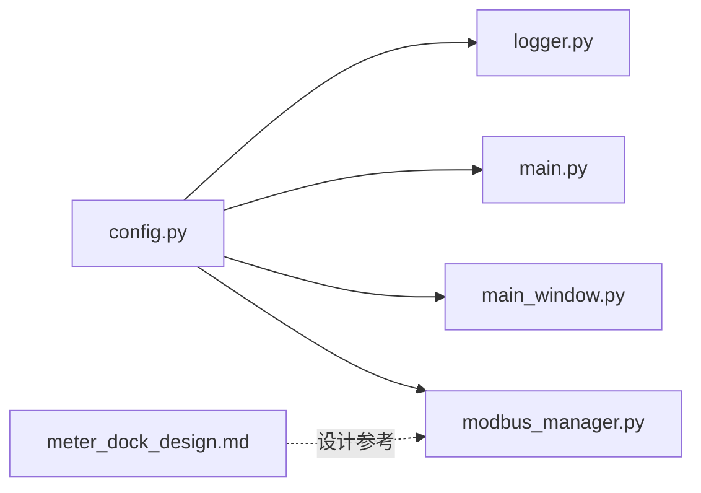

# 配置管理

<cite>
**本文引用的文件**
- [app_config.toml](file://src/app_config.toml)
- [config.py](file://src/config.py)
- [logger.py](file://src/utils/logger.py)
- [main.py](file://src/main.py)
- [main_window.py](file://src/components/main_window.py)
- [modbus_manager.py](file://src/components/modbus_manager.py)
- [meter_dock_design.md](file://doc/meter_dock_design.md)
</cite>

## 目录
1. [简介](#简介)
2. [项目结构](#项目结构)
3. [核心组件](#核心组件)
4. [架构总览](#架构总览)
5. [详细组件分析](#详细组件分析)
6. [依赖关系分析](#依赖关系分析)
7. [性能考量](#性能考量)
8. [故障排查指南](#故障排查指南)
9. [结论](#结论)
10. [附录](#附录)

## 简介
本文件面向应用的配置管理，重点解释 app_config.toml 的结构与可配置项，说明 config.py 如何加载与解析 TOML 配置，并提供运行时配置访问接口；同时给出通过修改配置文件自定义应用行为的方法（如资源路径、日志级别），并结合 doc/meter_dock_design.md 提供电表对接相关的设计参考。最后给出配置文件的完整示例与最佳实践，涵盖不同环境（开发/生产）的配置管理建议。

## 项目结构
配置相关的核心文件与职责如下：
- app_config.toml：应用的 TOML 配置文件，定义功能开关、调试模式、功率单位等。
- config.py：统一加载 TOML 配置、提供资源路径访问、条件编译辅助函数、打包兼容路径处理。
- logger.py：日志系统，受调试模式与详细日志配置影响。
- main.py：应用入口，初始化日志与主窗口。
- main_window.py：主窗口组件，使用功能开关与调试模式控制仿真与诊断行为。
- modbus_manager.py：Modbus 服务器管理，使用设备属性中的 IP/端口等信息，受配置影响。
- meter_dock_design.md：电表对接功能设计参考文档。

图表来源
- [app_config.toml](file://src/app_config.toml#L1-L13)
- [config.py](file://src/config.py#L46-L151)
- [logger.py](file://src/utils/logger.py#L1-L108)
- [main.py](file://src/main.py#L1-L72)
- [main_window.py](file://src/components/main_window.py#L1-L120)
- [modbus_manager.py](file://src/components/modbus_manager.py#L90-L120)
- [meter_dock_design.md](file://doc/meter_dock_design.md#L1-L286)

章节来源
- [app_config.toml](file://src/app_config.toml#L1-L13)
- [config.py](file://src/config.py#L46-L151)
- [logger.py](file://src/utils/logger.py#L1-L108)
- [main.py](file://src/main.py#L1-L72)
- [main_window.py](file://src/components/main_window.py#L1-L120)
- [modbus_manager.py](file://src/components/modbus_manager.py#L90-L120)
- [meter_dock_design.md](file://doc/meter_dock_design.md#L1-L286)

## 核心组件
- TOML 配置文件（app_config.toml）
  - features：功能开关组，包含 simulation、modbus、report、export。
  - debug：调试组，包含 mode、verbose_logging。
  - power：功率单位组，包含 unit。
- 配置加载与运行时访问（config.py）
  - 自动检测 Python 版本并选择合适的 toml 库。
  - 在打包与开发环境中定位配置文件路径。
  - 从 TOML 加载配置并更新全局配置变量。
  - 若 TOML 不可用或文件不存在，使用默认配置并尝试创建配置文件。
  - 提供资源路径访问接口（资源清单、获取绝对路径、assets 目录）。
  - 提供条件编译辅助函数（启用/禁用功能、条件导入、条件执行）。
- 日志系统（logger.py）
  - 根据运行环境选择日志文件路径，按日期轮转，支持详细日志配置。
- 主窗口（main_window.py）
  - 使用功能开关与调试模式控制仿真与诊断行为。
- Modbus 管理（modbus_manager.py）
  - 从设备属性读取 IP 与端口，使用功率单位进行数据转换。
- 电表对接设计（meter_dock_design.md）
  - 定义电表 DockWidget 的功能、界面与数据接口，支持通信状态与测量数据展示。

章节来源
- [app_config.toml](file://src/app_config.toml#L1-L13)
- [config.py](file://src/config.py#L46-L151)
- [logger.py](file://src/utils/logger.py#L1-L108)
- [main_window.py](file://src/components/main_window.py#L1-L120)
- [modbus_manager.py](file://src/components/modbus_manager.py#L90-L120)
- [meter_dock_design.md](file://doc/meter_dock_design.md#L1-L286)

## 架构总览
配置加载与使用的关键流程如下：

图表来源
- [main.py](file://src/main.py#L1-L72)
- [config.py](file://src/config.py#L46-L151)
- [logger.py](file://src/utils/logger.py#L1-L108)
- [main_window.py](file://src/components/main_window.py#L1-L120)
- [modbus_manager.py](file://src/components/modbus_manager.py#L90-L120)

## 详细组件分析

### TOML 配置文件（app_config.toml）
- 结构与字段
  - features：simulation、modbus、report、export（布尔值）
  - debug：mode、verbose_logging（布尔值）
  - power：unit（浮点数）
- 默认值与生效范围
  - features 与 debug 的默认值在 config.py 中定义，若 TOML 缺失则使用默认值。
  - power.unit 的默认值在 config.py 中定义，若 TOML 缺失则使用默认值。
- 配置文件位置
  - 开发环境：与 config.py 同目录。
  - 打包后环境：与可执行文件同目录。

章节来源
- [app_config.toml](file://src/app_config.toml#L1-L13)
- [config.py](file://src/config.py#L22-L45)
- [config.py](file://src/config.py#L63-L73)

### 配置加载与运行时访问（config.py）
- 加载流程
  - 检测 Python 版本，优先使用标准库 toml（3.11+），否则回退到第三方库。
  - 定位配置文件路径：开发环境与打包后环境分别处理。
  - 读取 TOML 并更新全局配置变量（features/debug/power）。
  - 若 TOML 不可用或文件不存在，使用默认配置并尝试创建配置文件。
- 运行时访问接口
  - 功能开关：FEATURE_SIMULATION、FEATURE_MODBUS、FEATURE_REPORT、FEATURE_EXPORT
  - 调试开关：DEBUG_MODE、VERBOSE_LOGGING
  - 功率单位：POWER_UNIT
  - 资源路径：RESOURCES（资源清单）、get_resource_path()、get_assets_directory()、WORKING_DIR
- 条件编译辅助
  - is_feature_enabled()：判断功能是否启用
  - conditional_compile()：装饰器，按条件执行函数
  - import_if_enabled()：按条件导入模块

图表来源
- [config.py](file://src/config.py#L46-L151)
- [config.py](file://src/config.py#L214-L279)

章节来源
- [config.py](file://src/config.py#L46-L151)
- [config.py](file://src/config.py#L153-L213)
- [config.py](file://src/config.py#L214-L279)

### 日志系统（logger.py）
- 日志文件位置
  - 打包后：与可执行文件同目录。
  - 开发环境：与主程序同目录。
- 日志轮转
  - 单文件最大 10MB，保留 100 个备份。
- 与配置的关系
  - VERBOSE_LOGGING 控制日志详细程度（由 config.py 提供）。
  - DEBUG_MODE 控制仿真诊断逻辑（由 main_window.py 使用）。

章节来源
- [logger.py](file://src/utils/logger.py#L1-L108)
- [config.py](file://src/config.py#L22-L45)
- [main_window.py](file://src/components/main_window.py#L1-L120)

### 主窗口（main_window.py）
- 功能开关与调试模式
  - FEATURE_SIMULATION 控制是否导入仿真库与创建网络模型。
  - DEBUG_MODE 控制是否执行诊断逻辑。
- 窗口尺寸
  - 最小尺寸在主窗口初始化时设置。

章节来源
- [main_window.py](file://src/components/main_window.py#L1-L120)

### Modbus 管理（modbus_manager.py）
- 设备 IP/端口
  - 从设备属性读取 ip/port，若 ip 为空则使用默认地址。
- 功率单位
  - 使用 POWER_UNIT 进行功率/能量等数据转换。
- 端口占用处理
  - 端口被占用时记录警告并返回失败。

章节来源
- [modbus_manager.py](file://src/components/modbus_manager.py#L90-L120)
- [modbus_manager.py](file://src/components/modbus_manager.py#L505-L608)
- [config.py](file://src/config.py#L41-L45)

### 电表对接设计参考（meter_dock_design.md）
- 功能概述
  - 实时显示电表测量数据、通信状态与设备配置信息。
- 接口参考
  - 电表数据模型（MeterItem）与测量类型（meas_type）。
  - UI 组件接口与数据控制接口（PowerMonitor、DataControlManager）。
- 与配置的关系
  - 通信状态与测量数据展示依赖设备属性（IP/端口/测量类型）。
  - 电表通信通过 Modbus 服务器管理模块启动/停止。

章节来源
- [meter_dock_design.md](file://doc/meter_dock_design.md#L1-L286)
- [modbus_manager.py](file://src/components/modbus_manager.py#L90-L120)

## 依赖关系分析
- 配置模块依赖
  - config.py 依赖 toml 库（标准库或第三方）、操作系统与打包环境信息。
  - config.py 为其他模块提供全局配置变量与资源路径接口。
- 运行时依赖
  - main.py 依赖 config.py 的资源路径与日志初始化。
  - main_window.py 依赖 config.py 的功能开关与调试模式。
  - modbus_manager.py 依赖 config.py 的 POWER_UNIT 与设备属性（IP/端口）。
- 设计参考依赖
  - meter_dock_design.md 为电表对接 UI 与数据接口提供设计依据。

图表来源
- [config.py](file://src/config.py#L46-L151)
- [logger.py](file://src/utils/logger.py#L1-L108)
- [main.py](file://src/main.py#L1-L72)
- [main_window.py](file://src/components/main_window.py#L1-L120)
- [modbus_manager.py](file://src/components/modbus_manager.py#L90-L120)
- [meter_dock_design.md](file://doc/meter_dock_design.md#L1-L286)

章节来源
- [config.py](file://src/config.py#L46-L151)
- [logger.py](file://src/utils/logger.py#L1-L108)
- [main.py](file://src/main.py#L1-L72)
- [main_window.py](file://src/components/main_window.py#L1-L120)
- [modbus_manager.py](file://src/components/modbus_manager.py#L90-L120)
- [meter_dock_design.md](file://doc/meter_dock_design.md#L1-L286)

## 性能考量
- 配置加载
  - TOML 解析仅在应用启动时执行一次，开销极低。
  - 若 TOML 不可用，使用默认配置并避免循环错误。
- 资源路径
  - 资源路径在首次使用前计算，后续直接拼接，避免重复 IO。
- 日志
  - 日志轮转避免单文件过大，提升磁盘空间利用效率。
- Modbus
  - 端口占用检测与优雅关闭，避免资源泄漏与阻塞。

[本节为一般性指导，不直接分析具体文件]

## 故障排查指南
- 配置文件无法加载
  - 现象：提示加载配置文件失败或创建配置文件失败。
  - 排查：确认 toml 库是否安装；检查配置文件路径权限；查看标准错误输出。
  - 参考路径：[config.py](file://src/config.py#L92-L151)
- 端口被占用
  - 现象：启动 Modbus 服务器失败，提示端口已被占用。
  - 排查：修改设备属性中的端口；确认端口未被其他进程占用。
  - 参考路径：[modbus_manager.py](file://src/components/modbus_manager.py#L596-L607)
- 日志未生成或路径异常
  - 现象：日志文件未生成或不在预期目录。
  - 排查：确认运行环境（开发/打包）；检查日志目录权限；查看日志初始化输出。
  - 参考路径：[logger.py](file://src/utils/logger.py#L36-L71)
- 功能未生效
  - 现象：仿真或调试功能未按预期启用。
  - 排查：检查 features 与 debug 配置；确认 config.py 是否成功加载 TOML。
  - 参考路径：[config.py](file://src/config.py#L92-L151)，[main_window.py](file://src/components/main_window.py#L1-L120)

章节来源
- [config.py](file://src/config.py#L92-L151)
- [modbus_manager.py](file://src/components/modbus_manager.py#L596-L607)
- [logger.py](file://src/utils/logger.py#L36-L71)
- [main_window.py](file://src/components/main_window.py#L1-L120)

## 结论
本配置体系以 TOML 为核心，通过 config.py 实现跨环境加载与运行时访问，配合 logger.py 与各业务模块（主窗口、Modbus 管理、电表对接设计）形成清晰的配置驱动架构。通过合理设置 features、debug、power 等配置项，可灵活控制应用行为与日志级别，满足开发与生产的差异化需求。

[本节为总结性内容，不直接分析具体文件]

## 附录

### 配置文件结构与可配置项
- features
  - simulation：布尔，启用/禁用仿真功能。
  - modbus：布尔，启用/禁用 Modbus 通信功能。
  - report：布尔，启用/禁用报告生成功能。
  - export：布尔，启用/禁用数据导出功能。
- debug
  - mode：布尔，启用/禁用调试模式（影响诊断逻辑）。
  - verbose_logging：布尔，启用/禁用详细日志。
- power
  - unit：浮点数，功率单位换算系数（如 MW/kW）。

章节来源
- [app_config.toml](file://src/app_config.toml#L1-L13)
- [config.py](file://src/config.py#L22-L45)

### 运行时配置访问接口
- 功能开关
  - FEATURE_SIMULATION、FEATURE_MODBUS、FEATURE_REPORT、FEATURE_EXPORT
- 调试开关
  - DEBUG_MODE、VERBOSE_LOGGING
- 功率单位
  - POWER_UNIT
- 资源路径
  - RESOURCES（资源清单）
  - get_resource_path(name)：获取资源绝对路径
  - get_assets_directory()：获取 assets 目录绝对路径
  - WORKING_DIR：当前工作目录

章节来源
- [config.py](file://src/config.py#L22-L45)
- [config.py](file://src/config.py#L238-L279)

### 自定义应用行为示例
- 更改资源文件路径
  - 通过 RESOURCES 或 get_resource_path() 访问资源；资源目录固定为 assets。
  - 参考路径：[config.py](file://src/config.py#L238-L279)
- 调整日志级别
  - 通过 VERBOSE_LOGGING 控制日志详细程度；日志文件按日期轮转。
  - 参考路径：[logger.py](file://src/utils/logger.py#L1-L108)，[config.py](file://src/config.py#L22-L45)
- 控制功能开关
  - 修改 features.simulation、features.modbus、features.report、features.export。
  - 参考路径：[app_config.toml](file://src/app_config.toml#L1-L13)，[config.py](file://src/config.py#L92-L151)
- 控制调试模式
  - 修改 debug.mode 与 debug.verbose_logging。
  - 参考路径：[app_config.toml](file://src/app_config.toml#L1-L13)，[config.py](file://src/config.py#L22-L45)，[main_window.py](file://src/components/main_window.py#L1-L120)

### 电表对接设计参考
- 电表设备数据面板、通信状态与测量数据展示。
- 电表数据模型与测量类型（meas_type）。
- UI 组件与数据控制接口。
- 参考路径：[meter_dock_design.md](file://doc/meter_dock_design.md#L1-L286)

章节来源
- [meter_dock_design.md](file://doc/meter_dock_design.md#L1-L286)

### 配置文件完整示例
- 示例结构
  - features.simulation = true
  - features.modbus = true
  - features.report = true
  - features.export = true
  - debug.mode = false
  - debug.verbose_logging = true
  - power.unit = 1000.0
- 说明
  - 以上字段与默认值均来自配置模块与 TOML 文件。
- 参考路径
  - [app_config.toml](file://src/app_config.toml#L1-L13)
  - [config.py](file://src/config.py#L22-L45)

章节来源
- [app_config.toml](file://src/app_config.toml#L1-L13)
- [config.py](file://src/config.py#L22-L45)

### 最佳实践
- 环境隔离
  - 开发环境：features.modbus 可设为 true，便于联调；debug.verbose_logging 设为 true，便于排错。
  - 生产环境：features.modbus 可按需启用；debug.verbose_logging 设为 false，降低日志开销。
- 端口管理
  - 为不同设备分配不冲突的端口；若端口被占用，优先调整设备端口或释放占用进程。
- 资源组织
  - 将图标等资源放置于 assets 目录，使用 config.py 提供的资源路径接口访问。
- 版本与备份
  - 修改配置后保留历史版本；在打包发布前校验配置文件路径与权限。

[本节为一般性指导，不直接分析具体文件]