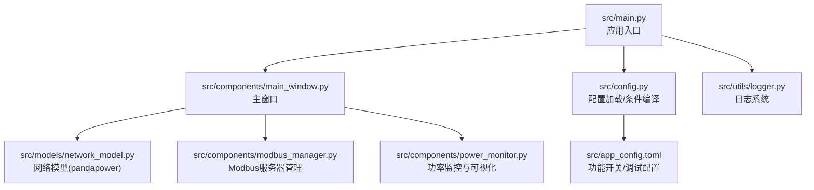
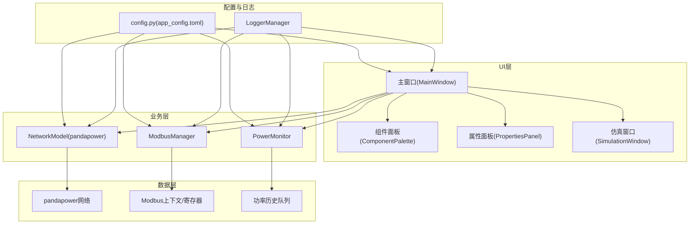
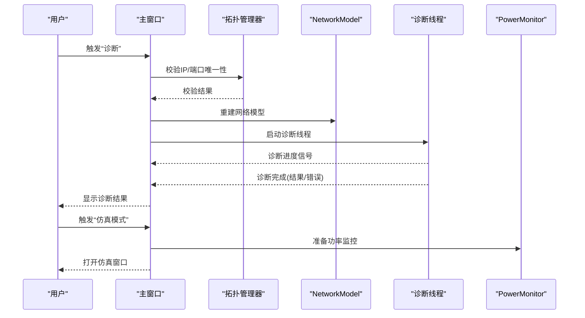
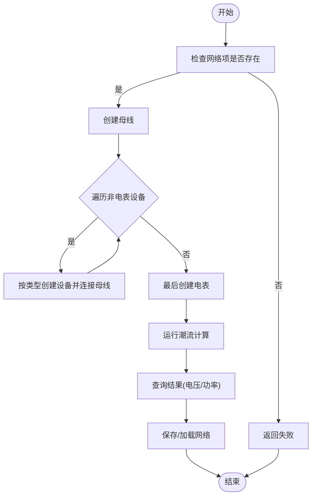
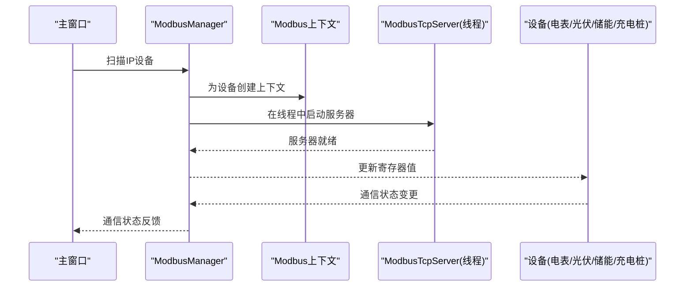
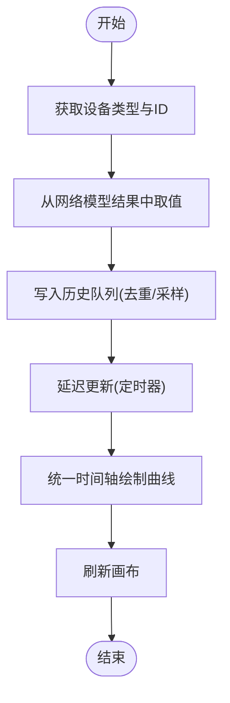
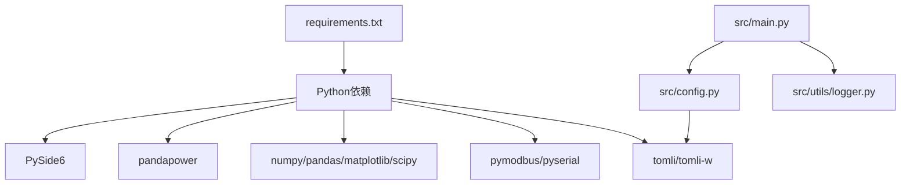

# 项目概述

<cite>
**本文引用的文件**
- [README.md](file://README.md)
- [src/main.py](file://src/main.py)
- [src/config.py](file://src/config.py)
- [src/app_config.toml](file://src/app_config.toml)
- [requirements.txt](file://requirements.txt)
- [src/components/main_window.py](file://src/components/main_window.py)
- [src/models/network_model.py](file://src/models/network_model.py)
- [src/components/modbus_manager.py](file://src/components/modbus_manager.py)
- [src/components/power_monitor.py](file://src/components/power_monitor.py)
- [src/utils/logger.py](file://src/utils/logger.py)
- [doc/meter_dock_design.md](file://doc/meter_dock_design.md)
- [topology.json](file://topology.json)
</cite>

## 目录
1. [简介](#简介)
2. [项目结构](#项目结构)
3. [核心组件](#核心组件)
4. [架构总览](#架构总览)
5. [详细组件分析](#详细组件分析)
6. [依赖关系分析](#依赖关系分析)
7. [性能考量](#性能考量)
8. [故障排查指南](#故障排查指南)
9. [结论](#结论)
10. [附录](#附录)

## 简介
pp_tool 是一款基于 PySide6 与 pandapower 的电网仿真工具，旨在通过直观的拖拽式界面快速构建电网拓扑，并基于 pandapower 进行潮流计算与仿真分析。项目提供拓扑构建、仿真运行、Modbus 通信支持、功率曲线监控与回放等功能，适用于电力系统研究、教学演示与工程实践。

- 设计目标：以“所见即所得”的方式构建电网拓扑，降低建模门槛；通过 pandapower 实现可靠的潮流计算与分析。
- 主要功能：
  - 拖拽式拓扑构建与保存/加载
  - 基于 pandapower 的网络诊断与潮流计算
  - Modbus 服务器模拟与通信状态管理
  - 功率曲线监控与可视化
  - 电表测量数据的采集与展示（参考设计文档）
- 价值定位：为教学与工程应用提供易用、可扩展的可视化仿真平台，支持从基础概念教学到复杂场景仿真的过渡。

**章节来源**
- [README.md](file://README.md#L1-L48)

## 项目结构
项目采用模块化组织，核心目录与职责如下：
- src/：源代码根目录
  - components/：UI 组件与业务逻辑（主窗口、画布、属性面板、仿真窗口、Modbus 管理器、功率监控器等）
  - models/：数据模型（网络模型封装 pandapower）
  - utils/：工具模块（日志、文件、配置等）
  - config.py：配置加载与条件编译
  - app_config.toml：功能开关与调试配置
  - main.py：应用入口
- doc/：设计文档与说明
- tests/：测试用例与客户端示例
- 其他：构建脚本、打包脚本、示例拓扑文件

**图表来源**
- [src/main.py](file://src/main.py#L1-L72)
- [src/components/main_window.py](file://src/components/main_window.py#L1-L120)
- [src/models/network_model.py](file://src/models/network_model.py#L1-L60)
- [src/components/modbus_manager.py](file://src/components/modbus_manager.py#L1-L60)
- [src/components/power_monitor.py](file://src/components/power_monitor.py#L1-L40)
- [src/config.py](file://src/config.py#L1-L60)
- [src/app_config.toml](file://src/app_config.toml#L1-L20)
- [src/utils/logger.py](file://src/utils/logger.py#L1-L40)

**章节来源**
- [README.md](file://README.md#L37-L48)

## 核心组件
- 主窗口与交互
  - 主窗口负责菜单、停靠面板（组件面板、属性面板）、缩放与视图控制、拓扑导入/导出、仿真模式入口与网络诊断流程。
- 网络模型
  - 封装 pandapower，提供母线、线路、变压器、负载、静态发电机、储能、外部电网、开关、电表等设备的创建与连接逻辑，并支持保存/加载 pandapower 网络。
- Modbus 管理器
  - 为光伏、电表、储能、充电桩等设备创建 Modbus TCP 服务器上下文，按设备类型映射寄存器，支持启动/停止服务与通信状态更新。
- 功率监控器
  - 从 pandapower 结果中提取设备功率、电压、电流、电量等数据，维护历史队列并绘制实时功率曲线，支持批量更新与时间轴统一。
- 配置与日志
  - 从 TOML 加载功能开关与调试配置，支持条件编译；日志系统按日期轮转，兼容打包环境。

**章节来源**
- [src/components/main_window.py](file://src/components/main_window.py#L120-L220)
- [src/models/network_model.py](file://src/models/network_model.py#L400-L580)
- [src/components/modbus_manager.py](file://src/components/modbus_manager.py#L120-L220)
- [src/components/power_monitor.py](file://src/components/power_monitor.py#L1-L80)
- [src/config.py](file://src/config.py#L90-L160)
- [src/utils/logger.py](file://src/utils/logger.py#L1-L80)

## 架构总览
pp_tool 的整体架构围绕“可视化拓扑 + 潮流计算 + 通信仿真”展开：
- UI 层：PySide6 构建主窗口与 DockWidget，提供拖拽、属性编辑、视图控制与菜单操作。
- 业务层：主窗口协调网络模型、Modbus 管理器与功率监控器，触发诊断与仿真流程。
- 数据层：pandapower 网络模型承载拓扑与计算结果；Modbus 上下文与寄存器映射承载设备通信数据；功率监控器维护历史与可视化。
- 配置与日志：统一从 TOML 加载配置，按需启用功能；日志系统保障运行可观测性。

**图表来源**
- [src/components/main_window.py](file://src/components/main_window.py#L120-L220)
- [src/models/network_model.py](file://src/models/network_model.py#L400-L580)
- [src/components/modbus_manager.py](file://src/components/modbus_manager.py#L120-L220)
- [src/components/power_monitor.py](file://src/components/power_monitor.py#L1-L80)
- [src/config.py](file://src/config.py#L90-L160)
- [src/utils/logger.py](file://src/utils/logger.py#L1-L80)

## 详细组件分析

### 主窗口与拓扑构建
- 职责
  - 创建菜单与工具栏（文件、编辑、视图、仿真、帮助）
  - 管理组件面板与属性面板的停靠与联动
  - 提供缩放、适配视图、断开连接、删除选中等操作
  - 触发网络诊断与进入仿真模式
  - 导入/导出拓扑（基于拓扑管理器）
- 关键流程
  - 诊断流程：校验 IP/端口唯一性 → 重建网络模型 → 启动诊断线程 → 显示诊断结果 → 标记网络有效性
  - 仿真模式：诊断通过后打开仿真窗口，进入运行态

**图表来源**
- [src/components/main_window.py](file://src/components/main_window.py#L320-L470)
- [src/models/network_model.py](file://src/models/network_model.py#L400-L580)

**章节来源**
- [src/components/main_window.py](file://src/components/main_window.py#L180-L340)
- [src/components/main_window.py](file://src/components/main_window.py#L340-L470)

### 网络模型与潮流计算
- 职责
  - 从 UI 组件创建母线、线路、变压器、负载、静态发电机、储能、外部电网、开关、电表等设备
  - 依据连接关系建立拓扑，保证设备创建顺序与依赖满足 pandapower 要求
  - 运行潮流计算，提供母线电压、线路/变压器/负载/发电机功率查询
  - 保存/加载 pandapower 网络 JSON
- 关键点
  - 按设备类型与属性调用 pandapower 创建 API
  - 严格处理母线优先、电表最后创建等约束
  - 提供运行结果查询接口，供监控与通信模块使用

**图表来源**
- [src/models/network_model.py](file://src/models/network_model.py#L400-L580)
- [src/models/network_model.py](file://src/models/network_model.py#L580-L710)

**章节来源**
- [src/models/network_model.py](file://src/models/network_model.py#L1-L120)
- [src/models/network_model.py](file://src/models/network_model.py#L400-L580)
- [src/models/network_model.py](file://src/models/network_model.py#L580-L710)

### Modbus 通信支持
- 职责
  - 扫描具有 IP/端口属性的设备，按类型创建 Modbus 上下文与寄存器映射
  - 在独立线程中启动 Modbus TCP 服务器，支持启动/停止
  - 更新电表/光伏/储能/充电桩等设备的寄存器值，驱动通信状态
- 关键点
  - 按设备类型定制寄存器映射（如光伏的额定功率、今日/累计发电量、当前功率；电表的有功/无功功率、电压、电量等）
  - 使用回调与日志包装的数据块记录读写操作，便于调试
  - 端口占用与异常处理，避免阻塞主线程

**图表来源**
- [src/components/modbus_manager.py](file://src/components/modbus_manager.py#L80-L120)
- [src/components/modbus_manager.py](file://src/components/modbus_manager.py#L500-L610)
- [src/components/modbus_manager.py](file://src/components/modbus_manager.py#L610-L720)

**章节来源**
- [src/components/modbus_manager.py](file://src/components/modbus_manager.py#L1-L120)
- [src/components/modbus_manager.py](file://src/components/modbus_manager.py#L500-L610)
- [src/components/modbus_manager.py](file://src/components/modbus_manager.py#L610-L720)

### 功率监控与可视化
- 职责
  - 从网络模型结果中提取设备功率、电压、电流、电量等数据
  - 维护历史队列，按统一时间轴绘制曲线
  - 提供延迟更新与批量刷新，避免频繁重绘
- 关键点
  - 统一时间基准与窗口，智能 Y 轴范围
  - 支持多设备叠加显示与颜色缓存
  - 与 UI 组件解耦，通过定时器触发刷新

**图表来源**
- [src/components/power_monitor.py](file://src/components/power_monitor.py#L160-L270)
- [src/components/power_monitor.py](file://src/components/power_monitor.py#L270-L350)

**章节来源**
- [src/components/power_monitor.py](file://src/components/power_monitor.py#L1-L120)
- [src/components/power_monitor.py](file://src/components/power_monitor.py#L160-L270)
- [src/components/power_monitor.py](file://src/components/power_monitor.py#L270-L350)

### 配置与日志
- 配置
  - 从 app_config.toml 加载功能开关（仿真、Modbus、报告、导出）、调试模式与功率单位
  - 提供条件编译装饰器与条件导入辅助函数，按配置动态启用/禁用功能
- 日志
  - 单例日志管理器，按日期轮转文件，兼容打包环境
  - 统一记录启动、异常与关键流程，便于问题定位

**章节来源**
- [src/config.py](file://src/config.py#L90-L160)
- [src/config.py](file://src/config.py#L160-L210)
- [src/utils/logger.py](file://src/utils/logger.py#L1-L80)

## 依赖关系分析
- 环境依赖
  - Python 3.10+、PySide6、pandapower、numpy、pandas、matplotlib、scipy、networkx、numba、lxml、geojson、deepdiff、tqdm、pymodbus、pyserial、tomli/tomli-w、pyinstaller
- 运行时与开发工具分离，确保仿真与通信能力的完整性
- 项目入口与配置加载
  - main.py 创建 QApplication 与 MainWindow，加载资源路径与日志
  - config.py 从 TOML 加载功能开关，支持条件编译与资源路径

**图表来源**
- [requirements.txt](file://requirements.txt#L1-L27)
- [src/main.py](file://src/main.py#L1-L40)
- [src/config.py](file://src/config.py#L90-L160)
- [src/utils/logger.py](file://src/utils/logger.py#L1-L80)

**章节来源**
- [requirements.txt](file://requirements.txt#L1-L27)
- [src/main.py](file://src/main.py#L1-L40)
- [src/config.py](file://src/config.py#L90-L160)

## 性能考量
- UI 响应
  - 诊断与 Modbus 服务器在独立线程运行，避免阻塞主线程
  - 功率曲线采用延迟更新与批量刷新，减少频繁重绘
- 数据访问
  - 功率监控缓存网络模型引用，减少重复访问
  - 历史队列限制长度，按需采样，控制内存占用
- 计算效率
  - 潮流计算在后台执行，结果查询按需进行
  - Modbus 寄存器写入采用分段与范围检查，避免越界

[本节为通用指导，不直接分析具体文件]

## 故障排查指南
- 启动失败
  - 检查 Python 版本与依赖安装是否满足 requirements.txt
  - 查看日志文件（按日期命名），定位异常堆栈
- 诊断失败
  - 确认拓扑中母线与连接关系完整
  - 校验设备 IP/端口唯一性
- Modbus 启动失败
  - 检查端口占用（常见错误码提示）
  - 确认设备属性（IP/端口/SN/额定容量/功率）配置正确
- 功率曲线无数据
  - 确认已完成潮流计算
  - 检查监控设备列表与当前设备勾选状态

**章节来源**
- [src/main.py](file://src/main.py#L40-L72)
- [src/utils/logger.py](file://src/utils/logger.py#L1-L80)
- [src/components/main_window.py](file://src/components/main_window.py#L340-L470)
- [src/components/modbus_manager.py](file://src/components/modbus_manager.py#L590-L650)

## 结论
pp_tool 通过“可视化拓扑 + 潮流计算 + 通信仿真”的一体化设计，为电力系统研究与教学提供了友好、可扩展的仿真平台。其模块化架构与条件编译机制便于按需启用功能，日志系统与诊断流程保障了运行稳定性。未来可在电表 DockWidget、数据记录与回放、报告生成等方面进一步完善，以满足更复杂的工程应用场景。

[本节为总结性内容，不直接分析具体文件]

## 附录

### 环境与使用
- 环境要求
  - Python 3.10+、PySide6 6.0+、pandapower 2.13+
- 安装与运行
  - 使用 conda 环境配置文件创建环境并激活
  - 启动命令：python src/main.py
- 示例拓扑
  - topology.json 等文件展示了设备类型、属性与连接关系的结构

**章节来源**
- [README.md](file://README.md#L12-L36)
- [topology.json](file://topology.json#L1-L60)

### 电表 DockWidget 设计参考
- 设计文档明确了电表设备面板的功能、界面布局与数据接口，强调与现有 UI 风格一致、通信状态监控与数据一致性。

**章节来源**
- [doc/meter_dock_design.md](file://doc/meter_dock_design.md#L1-L120)